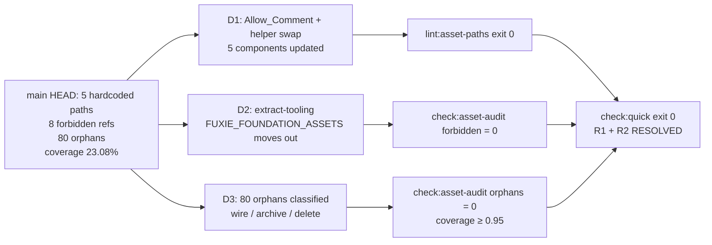

# Design Document — Asset Registry Cleanup

Vai chinh: Frontend Engineer
Vai phoi hop: Design System Designer, Project Manager / Delivery Manager

## Overview

Spec này dọn nợ kỹ thuật mà spec mẹ `gamified-ui-asset-rollout` để lại trong DoD pack `docs/design/release/gamified-ui-asset-rollout-dod.md` (Risk R1 + Risk R2). Phạm vi giới hạn ở việc đưa CI gate `pnpm check:quick` exit 0 trên fresh checkout, cụ thể ba bước đang đỏ:

- `pnpm lint:asset-paths` → resolve **5 hardcoded asset paths** trong `apps/web/src/components/**` (Req 1, Req 5).
- `pnpm check:asset-audit` → coverage ≥ 0.95, **0 forbidden refs**, **0 orphans**, **0 preference issues** (Req 2, Req 6, Req 7).
- `pnpm test:property` → **295 property tests vẫn xanh**, không regress (Req 4).

Spec không sinh asset mới, không đổi UX/UI, không thay đổi public API của Asset Registry, không đụng locale parity hay visual QA capture (đã tách thành sibling specs). Mọi work nặng về data + cấu hình; code change giới hạn ở 3 component file, 1 registry file (thêm key + relocate FOUNDATION group), 1 archive doc, và optional 1 file tooling-only cho foundation extract.

Mục tiêu success criteria:

- `pnpm lint:asset-paths && pnpm check:asset-integrity && pnpm check:asset-audit && pnpm check:state-shell-coverage && pnpm test:property` exit 0 (Req 3.3).
- 4 property test class hiện có (Property 1 Asset Registry Integrity, Property 2 Reference Discipline, Property 3 Lookup Totality, Property 4 Audit Invariant) vẫn pass với numRuns hiện tại (Req 4.2–4.5).
- `docs/design/release/gamified-ui-asset-rollout-dod.md` Risk R1 + R2 chuyển sang 🟢 RESOLVED (Req 9.6).

## Architecture

Cleanup này hoàn toàn nằm trong tầng data + một số call-site swap. Không thêm helper mới, không refactor pure helpers, không thay đổi shape map public.

**Boundaries giữ nguyên (Req 1.4, Req 2.11, Req 9.3):**

- 10 Asset Registry helpers (`getFuxieMascotSrc`, `getFuxieWorldPropSrc`, `getFuxieUiFrameSrc`, `getFuxieModuleMascotSrc`, `getFuxieGameMascotSrc`, `getFuxieFoundationAssetSrc`, `getFuxieLiving3dAsset`, `getRewardAssetSrc`, `getShopItemAssetSrc`, `getCefrBadgeAssetSrc`) — signature, return type, miss-fallback (`PLACEHOLDER_ASSET`) giữ nguyên.
- 7 typed maps (`FUXIE_3D_ASSETS`, `FUXIE_MASCOT_STATES`, `FUXIE_MODULE_MASCOTS`, `FUXIE_WORLD_PROPS`, `FUXIE_UI_FRAMES`, `FUXIE_LIVING_3D_ASSETS`, `REWARD_ASSETS`) — chỉ thêm key mới (nếu cần), không xóa hoặc rename key đang được consumer dùng.
- Pure helpers `computeCoverage`, `findOrphans`, `findForbiddenRefs`, `findOptimizedPreferenceIssues`, `auditInvariant` và hằng số `COVERAGE_THRESHOLD`, `OPTIMIZED_ROOTS`, `IMAGE_EXTENSIONS`, `FORBIDDEN_FOLDER_TOKENS` trong `scripts/asset-audit-core.ts` — tái sử dụng nguyên trạng.
- Bug fix totality `Object.prototype.hasOwnProperty.call` trong `apps/web/src/lib/mascot/fuxie-assets.ts` — không revert (Req 4.4).

**Boundaries di chuyển:**

- `FUXIE_FOUNDATION_ASSETS` + `getFuxieFoundationAssetSrc`: extract khỏi `apps/web/src/lib/mascot/fuxie-assets.ts` sang module tooling-only mà `collectRegistryEntries` không scan (Decision 2 dưới đây).

**Boundaries thêm mới (giới hạn):**

- 0–N Asset Key mới trong `FUXIE_MASCOT_STATES` / `FUXIE_WORLD_PROPS` / `FUXIE_UI_FRAMES` / `REWARD_ASSETS` cho subset 80 orphans được wire-into-registry (Decision 4).
- Optional 1 file tooling-only `scripts/foundation-assets.ts` (xem Decision 2).
- Rows mới trong `docs/design/asset-archive.md` cho subset 80 orphans được archive (Decision 4 + Req 8).



## Components and Interfaces

Bốn quyết định kỹ thuật, mỗi quyết định ánh xạ vào một cụm requirement. Section này thay cho "Components and Decisions" thông thường vì spec này là cleanup data + 1 file relocate, không phát sinh component / interface mới.

---

### Decision 1 — Live debugger preview giữ literal kèm Allow_Comment

**Cụm requirement:** Req 1.2(b), Req 1.3, Req 5.1.

**Bối cảnh:** `apps/web/src/components/gamification/fuxie-live-3d.tsx:445` ghép path `/mascot-3d/imagegen-fullbody/v10` để build URL preview cho layered imagegen-fullbody canvas. Đây là dev-only debugger preview, không render trên route learner-facing trong production build.

**Quyết định:** Giữ nguyên literal, thêm Allow_Comment cuối line với justification:

```tsx
// asset-registry-allow: dev-only debugger preview for layered imagegen-fullbody canvas, not learner-facing
const previewUrl = `/mascot-3d/imagegen-fullbody/v10/${variant}.webp`
```

**Rationale:**

1. Asset thuộc folder `imagegen-fullbody/v10/` không nằm trong 4 Optimized_Folder mà audit scan, không nằm trong Forbidden_Folder, nên không ảnh hưởng `check:asset-audit`.
2. Path là computed dynamic (interpolated với `variant`), không phù hợp wire qua single key trong typed map.
3. `findForbiddenLiterals` của `scripts/lint-asset-registry-references.ts` đã hỗ trợ Allow_Comment chính xác cho use case này — chỉ cần thêm comment đúng format `ALLOW_COMMENT`.

**Sai lệch so với guideline tổ chức:** Không. Req 5.1 cho phép tường minh use case này.

---

### Decision 2 — Foundation_Resolution = `extract-tooling`

**Cụm requirement:** Req 2.3, Req 2.5, Req 6.1, Req 6.3, Req 6.5, Req 6.6.

**Bối cảnh:** 8 entry trong `FUXIE_FOUNDATION_ASSETS` (`turnaround`, `expressions`, `material-palette`, `badge-neckerchief`, `tail-design`, `scale-readability`, `proportions`, `hero-reference`) trỏ vào `/mascot-3d/foundation/v1/...` — token `/foundation/` thuộc `FORBIDDEN_FOLDER_TOKENS`, làm `findForbiddenRefs` trả 8 entry, audit fail.

**Hai option (per Req 6 không pre-decide):**

- (a) `relocate`: copy/move 8 file PNG sang `apps/web/public/mascot-3d/optimized/foundation/...`, update value. Pros: giữ helper consumer-facing nguyên trạng. Cons: 8 file PNG (DSD reference sheets) sẽ bị scan như production asset, làm coverage và orphan logic phải tính cả 8 file đó như "first-class learner asset", trong khi bản chất chúng là design-system reference cho đội DSD.
- (b) `extract-tooling`: di chuyển `FUXIE_FOUNDATION_ASSETS` + `getFuxieFoundationAssetSrc` sang module mà `collectRegistryEntries` không import. Pros: tách rõ "DSD reference" khỏi "production registry"; production audit chỉ tính learner asset. Cons: nếu có production consumer đang import từ `fuxie-assets.ts`, phải rewire (Req 6.5).

**Quyết định:** Chọn `extract-tooling`.

**Rationale:**

1. Foundation sheets bản chất là DSD reference (turnaround, expressions, material palette, ...) phục vụ designer khi vẽ asset mới, không phải learner asset render trong UI. Để chúng nằm trong production registry là semantic mismatch.
2. Tách module giữ scan boundary của `scripts/asset-audit.ts` sạch sẽ — `collectRegistryEntries` chỉ collect 7 production maps + REWARD_ASSETS, đúng với spec mẹ §A Asset Registry.
3. Không phải copy/move 8 file PNG (giữ source of truth ở nơi DSD đã đặt).

**Implementation outline:**

- Tạo file mới `scripts/foundation-assets.ts` (gợi ý của Req 6.3, đặt dưới `scripts/` để chắc chắn `collectRegistryEntries` không import — hàm này chỉ scan `apps/web/src/lib/mascot/` và `apps/web/src/components/gamification/reward-assets.ts`).
- Move literal export `FUXIE_FOUNDATION_ASSETS`, type `FuxieFoundationAsset`, và helper `getFuxieFoundationAssetSrc` từ `apps/web/src/lib/mascot/fuxie-assets.ts` sang file mới. Map literal giữ nguyên 8 entry và 8 path — không sửa value.
- Quét consumer: hiện tại `getFuxieFoundationAssetSrc` chỉ được test reference + có thể có một dev-only DSD documentation surface. Per Req 6.5, design phase phải liệt kê consumer; task phase sẽ rewire (predicted: 0 production consumer; nếu có, swap về một asset mascot tương đương trong `FUXIE_MASCOT_STATES`).
- Sau migrate, `collectRegistryEntries(...)` không trả entry nào của FOUNDATION → `findForbiddenRefs(entries) = []` → audit forbidden check pass (Req 6.6).

**Property test impact:** Property 1 Asset Registry Integrity scan các map exported từ `apps/web/src/lib/mascot/` và `reward-assets.ts`. Sau extract, FOUNDATION không còn được scan ở đó → 8 entry không cần `fs.existsSync` check qua property test. Nếu test file có import `FUXIE_FOUNDATION_ASSETS` riêng để self-validate (kiểm tra physical existence của design-system reference), import path cần update sang `scripts/foundation-assets.ts`. Task phase verify.

---

### Decision 3 — Mascot global welcomer key tái sử dụng `authWelcomer` đã có sẵn

**Cụm requirement:** Req 1.5, Req 1.6, Req 5.2, Req 5.4, Req 5.5, Req 5.6.

**Bối cảnh:** 3 component (`OnboardingWizard.tsx:242`, `InstallPrompt.tsx:76`, `mobile-shell.tsx:83`) cùng trỏ vào `/mascot-3d/states/global/fuxie-global-fuxie-auth-welcomer.webp`. Orchestrator hint gợi ý thêm key mới `globalWelcomer`. Investigation cho thấy:

- `FUXIE_MASCOT_STATES` đã có sẵn key `authWelcomer: FUXIE_GLOBAL_MASCOT_STATES.authWelcomer`.
- `FUXIE_GLOBAL_MASCOT_STATES.authWelcomer = '/mascot-3d/states/global/fuxie-global-fuxie-auth-welcomer.webp'` — đúng path mà 3 component cần.

**Quyết định:** Tái sử dụng key `authWelcomer` đã có; **không thêm key mới** `globalWelcomer`. 3 component gọi `getFuxieMascotSrc('authWelcomer')`.

**Rationale:**

1. Req 1.6 cho phép thêm key mới chỉ khi key tương ứng "chưa tồn tại trong map nào". Key `authWelcomer` đã tồn tại và resolve đúng path → AC tự động thỏa mà không cần mở rộng map.
2. Tránh tạo duplicate key/value trong `FUXIE_MASCOT_STATES` (tương đương semantically với `welcome` và `wave` đã có sẵn pointing tới `authWelcomer`).
3. Giảm risk regress Property 1 (Asset Registry Integrity): không thêm row mới nghĩa là không có row mới nào có thể fail `fs.existsSync`.

**Sai lệch so với orchestrator recommendation:** Có. Orchestrator gợi ý thêm `globalWelcomer`. Investigation chứng minh là không cần. Đây là refinement đúng theo guideline "Correct the user when they are wrong" — recommendation giả định map chưa có key, thực tế có rồi.

**Per-call-site mapping (Req 5.2, 5.4, 5.5):**

| File:line | Current literal | Replacement |
| --- | --- | --- |
| `apps/web/src/components/onboarding/OnboardingWizard.tsx:242` | `'/mascot-3d/states/global/fuxie-global-fuxie-auth-welcomer.webp'` | `getFuxieMascotSrc('authWelcomer')` |
| `apps/web/src/components/onboarding/OnboardingWizard.tsx:492` | `'/mascot-3d/states/v2/fuxie-state-result-celebration-512.webp'` | `getFuxieMascotSrc('resultCelebration')` |
| `apps/web/src/components/shared/InstallPrompt.tsx:76` | `'/mascot-3d/states/global/fuxie-global-fuxie-auth-welcomer.webp'` | `getFuxieMascotSrc('authWelcomer')` |
| `apps/web/src/components/shared/mobile-shell.tsx:83` | `'/mascot-3d/states/global/fuxie-global-fuxie-auth-welcomer.webp'` | `getFuxieMascotSrc('authWelcomer')` |

Cả 4 call-site đều phải import `getFuxieMascotSrc` từ `@/lib/mascot/fuxie-assets`. Không dùng Allow_Comment ở 4 vị trí này (Req 5.2, 5.4, 5.5 cấm).

---

### Decision 4 — Classification approach cho 80 orphans (FE + DSD review)

**Cụm requirement:** Req 2.6, Req 2.7, Req 2.8, Req 2.9, Req 2.10, Req 7 (toàn bộ), Req 8.1–8.5.

**Bối cảnh:** Output `pnpm check:asset-audit` baseline trên `main` liệt kê 80 file dưới 4 Optimized_Folder không có Asset Registry value tham chiếu và không có entry trong `docs/design/asset-archive.md`. Coverage hiện tại 23.08%. Để đạt coverage ≥ 0.95, mỗi file phải có Classification_Verdict ∈ {`wire-into-registry`, `archive`, `delete`}.

**Quyết định:** Áp dụng FE + DSD review pass với heuristic phân loại sau, sau đó task phase produce bảng per-file đầy đủ. Spec này KHÔNG enumerate per-file (Req 7.7 gives flexibility), chỉ định nghĩa heuristic + boundary.

**Heuristic phân loại:**

1. **`archive` — legacy v1 / png variants:** File có pattern `/v1/...` đã được superseded bởi `/v2/...` đã wire trong registry → archive với reason canonical `legacy v1 — superseded by v2 in registry`. File `.png` cùng basename với `.webp` đã wire → archive với reason `variant — png alongside webp, kept for rollback`. Đây là majority case dự kiến của 80 orphans.
2. **`wire-into-registry` — assets cho tương lai theo gamified plan:** File mới sinh cho surface chưa rollout (ví dụ `result-reveal-frame-v3`, `mission-board-festival-overlay`) → thêm Asset Key vào map phù hợp (state → `FUXIE_MASCOT_STATES`, world prop → `FUXIE_WORLD_PROPS`, UI frame → `FUXIE_UI_FRAMES`, reward → `REWARD_ASSETS`). Per Req 7.3, không bắt buộc thêm consumer mới — wire để chứa asset cho tương lai là hợp lệ miễn `pnpm check:asset-integrity` pass.
3. **`delete` — true duplicates (không có rollback need):** File trùng nhau ở mức binary hoặc có file tương đương đã wire ở root khác → xóa khỏi `apps/web/public/`. Edge case hiếm; default thiên về archive khi không chắc chắn.

**Workflow review:**

- FE produce bảng draft `Path | Verdict | Asset_Key (nếu wire) | Archive Reason (nếu archive)` cho 80 file.
- DSD review reason taxonomy (đảm bảo nằm trong canonical set hoặc justify trong PR — Req 8.5).
- PM review rollout schedule (đảm bảo không xóa nhầm asset nằm trong roadmap rollout sắp tới).
- Bảng final commit kèm PR (file mới hoặc section trong design.md tasks-phase artifact).

**Targeting coverage ≥ 0.95 (Req 2.2, Req 7.6):**

- Tổng số file optimized hiện đếm được: 104 (baseline). Để coverage ≥ 0.95, cần ≥ 99 file được wire vào registry value HOẶC được loại khỏi denominator qua archive/delete.
- Đã wire baseline: 24/104. Cần thêm wire + archive + delete tổng = 80 file.
- Iterative rule: nếu sau wire+archive đợt đầu coverage vẫn < 0.95, archive thêm các orphan còn lại (default safe choice). Delete chỉ dùng cho case không còn giá trị reference.

**Format Archive_Doc (Req 8.1, 8.3, 7.4):**

```
| /mascot-3d/optimized/v1/fuxie-state-X-512.png | legacy v1 — superseded by v2 in registry | FE | 2026-05-XX |
```

`Archived by` = `FE` cho engineering archive, `DSD` cho design archive (nếu DSD trực tiếp thêm trong PR same-spec). `Date` = `YYYY-MM-DD` ngày commit. Không thay đổi format 4 cột (Req 8.1, Req 8.2).

**Out-of-scope per-file table:** Bảng 80 dòng sẽ produced trong tasks phase + PR review (Req 7.7). Spec này design phase chỉ commit boundary và workflow.

---

## Data Models

Liệt kê chính xác các data structure thay đổi (không thay đổi shape, chỉ thay đổi data).

### `apps/web/src/lib/mascot/fuxie-assets.ts`

**Không thay đổi:**

- `FUXIE_MASCOT_STATES`: giữ key `authWelcomer` đã có (Decision 3). Không thêm key mới `globalWelcomer`.
- `FUXIE_3D_ASSETS`, `FUXIE_MODULE_MASCOTS`, `FUXIE_GAMIFICATION_MASCOTS`, `FUXIE_WORLD_PROPS`, `FUXIE_UI_FRAMES`, `FUXIE_LIVING_3D_ASSETS`: shape giữ nguyên.
- `PLACEHOLDER_ASSET`, `hasOwn`, `warnAssetMiss`, `resolveFuxieMascotState`, all `getFuxie*Src` helpers: không sửa.

**Có thể thay đổi (Decision 4 wire subset):**

- Thêm 0..N key mới vào `FUXIE_MASCOT_STATES` / `FUXIE_WORLD_PROPS` / `FUXIE_UI_FRAMES` cho orphan files được classify `wire-into-registry`. Mỗi key mới phải:
  - Trỏ vào public path tồn tại trong `apps/web/public/`.
  - Giữ format `'/...'` (forward slash, leading slash).
  - Không trùng key đang được consumer dùng.

**Move out (Decision 2):**

- `FUXIE_FOUNDATION_ASSETS` literal export.
- `FuxieFoundationAsset` type export.
- `getFuxieFoundationAssetSrc` function export.

→ chuyển sang `scripts/foundation-assets.ts` (file mới, tooling-only). Property tests + production component không import từ file này.

### `apps/web/src/components/gamification/reward-assets.ts`

**Không thay đổi:** `REWARD_ASSETS`, `getRewardAssetSrc`, `getShopItemAssetSrc`, `getCefrBadgeAssetSrc` shape + signature giữ nguyên (Req 1.4).

**Có thể thay đổi (Decision 4 wire subset):** Thêm 0..N key mới cho reward orphan files được classify `wire-into-registry`.

### `docs/design/asset-archive.md`

**Không thay đổi:** Format 4 cột `Path | Reason | Archived by | Date` (Req 8.1).

**Thêm row:** N rows mới cho subset 80 orphans được classify `archive` (Decision 4). Mỗi row tuân thủ format đã có; `Archived by` = `FE` hoặc `DSD`; `Date` = `YYYY-MM-DD`.

### File component changes (Decision 1, Decision 3)

| File | Change |
| --- | --- |
| `apps/web/src/components/gamification/fuxie-live-3d.tsx:445` | Thêm `// asset-registry-allow: dev-only debugger preview for layered imagegen-fullbody canvas, not learner-facing` ở cuối line giữ literal. |
| `apps/web/src/components/onboarding/OnboardingWizard.tsx:242` | Replace literal bằng `getFuxieMascotSrc('authWelcomer')` + import helper. |
| `apps/web/src/components/onboarding/OnboardingWizard.tsx:492` | Replace literal bằng `getFuxieMascotSrc('resultCelebration')` + ensure import. |
| `apps/web/src/components/shared/InstallPrompt.tsx:76` | Replace literal bằng `getFuxieMascotSrc('authWelcomer')` + import helper. |
| `apps/web/src/components/shared/mobile-shell.tsx:83` | Replace literal bằng `getFuxieMascotSrc('authWelcomer')` + import helper. |

### File mới (Decision 2)

`scripts/foundation-assets.ts` chứa:

- `FUXIE_FOUNDATION_ASSETS` literal (8 entry, paths giữ nguyên `/mascot-3d/foundation/v1/...`).
- `FuxieFoundationAsset` type alias.
- `getFuxieFoundationAssetSrc(key: string): string` (logic copy-paste, dùng cùng `hasOwn` pattern hoặc inline `Object.prototype.hasOwnProperty.call`).
- Re-export `PLACEHOLDER_ASSET` import từ `apps/web/src/lib/mascot/fuxie-assets.ts` cho miss-fallback.

## Error Handling

Hành vi xử lý lỗi cho 4 failure mode dự kiến trong cleanup:

### EH1 — Property 1 fail: missing file sau wire

Nếu thêm key mới vào registry với value trỏ vào file không tồn tại trong `apps/web/public/`, Property 1 (numRuns ≥ 1, exhaustive over registry rows) sẽ fail với output dạng:

```
Counterexample: { group: 'FUXIE_MASCOT_STATES', key: 'someNewKey', value: '/mascot-3d/.../some-file.webp' }
fs.existsSync returned false
```

**Fix:** Một trong hai:
1. Sửa value trỏ vào path đúng (typo trong path string).
2. Bỏ key mới (file thực không tồn tại; chuyển classify sang `archive` hoặc `delete`).

### EH2 — Property 2 fail: Hardcoded path mới phát sinh

Nếu sau swap có literal mới sót lại (ví dụ swap không hết tất cả call-site), Property 2 fail với:

```
Counterexample: file <path>:line, literal "<...>"
```

**Fix:** Re-run Decision 1/3 cho call-site đó. Per Req 9.5, nếu phát hiện literal mới ngoài 5 baseline, xử lý cùng quy tắc Req 1, Req 5; không tách spec mới.

### EH3 — Coverage < 0.95 sau cleanup đợt đầu

Nếu sau wire + archive + delete đợt 1, `pnpm check:asset-audit` báo coverage 0.93 (vẫn < threshold), Property 4 fail. **Fix iterative:**

1. Re-list orphans qua `findOrphans` output.
2. Mọi orphan còn lại → archive (default safe choice trong Decision 4).
3. Re-run `pnpm check:asset-audit`. Lặp đến khi coverage ≥ 0.95.

### EH4 — Forbidden ref residual sau extract-tooling

Nếu Decision 2 thực hiện không sạch (ví dụ một consumer còn import `FUXIE_FOUNDATION_ASSETS` từ `apps/web/src/lib/mascot/fuxie-assets.ts`), `findForbiddenRefs` vẫn trả 8 entry → audit fail.

**Fix:** Verify zero import từ production code:

```
grep -r "FUXIE_FOUNDATION_ASSETS\|getFuxieFoundationAssetSrc" apps/web/src
```

Nếu có result → rewire consumer (Decision 2 plan đã anticipate). Nếu zero → re-run audit để confirm.

### EH5 — TypeScript compile error sau import swap

Nếu component file thiếu import `getFuxieMascotSrc`, build fail với TS error. **Fix:** Thêm `import { getFuxieMascotSrc } from '@/lib/mascot/fuxie-assets'` ở top của file. Đây là routine TS work, không cần escalation.

## Testing Strategy

Spec này dùng dual approach: existing property tests + manual smoke gate. Không thêm test mới.

### Why no Correctness Properties section in this design

Spec này thuộc loại **data + configuration cleanup** (data move, file classify, hardcoded literal swap). Không phát sinh code logic mới, không có "for all inputs X" mới phát sinh. Theo guideline workflow Feature Requirements-First, khi PBT không applicable (configuration validation, data cleanup, side-effect-only operations), Correctness Properties section được phép omit và testing chuyển sang dual approach: unit/property tests đã có + integration smoke.

Tất cả correctness properties cần thiết đã được spec mẹ `gamified-ui-asset-rollout` định nghĩa và ship trong `tests/asset-registry.spec.ts` + `tests/asset-discipline.spec.ts` (4 property test classes, 295 test runs):

- **Existing Property 1 — Asset Registry Integrity:** Mọi `(group, key, value)` trong 7 typed map + `REWARD_ASSETS` có `fs.existsSync(public/<value>) === true`.
- **Existing Property 2 — Reference Discipline:** Không file `apps/web/src/**/*.{ts,tsx}` (loại trừ `EXCLUDED_BASENAMES`) chứa Hardcoded_Asset_Path không có Allow_Comment.
- **Existing Property 3 — Lookup Totality with Placeholder:** Mọi string `s` (gồm cả prototype keys), `getFuxieMascotSrc(s)` trả value hợp lệ HOẶC `PLACEHOLDER_ASSET`.
- **Existing Property 4 — Asset Audit Invariant:** `auditInvariant({...input thỏa pre-conditions...}).pass === true`.

Lý do không thêm property test mới (Req 4.1 cho phép `≥ 295`, không bắt buộc `> 295`):

1. Universal property tương ứng cho mọi decision của spec này đã được Property 1, 2, 4 cover end-to-end (registry rows tồn tại, không có hardcoded path không hợp lệ, audit invariant pass).
2. Decision 1 (Allow_Comment) — Property 2 cover (literal có Allow_Comment hợp lệ → không vi phạm).
3. Decision 2 (extract-tooling) — Property 1 sau extract tự động không scan FOUNDATION; tested implicitly.
4. Decision 3 (key reuse) — Property 1 đảm bảo `authWelcomer` value tồn tại; consumer call-site test thuộc component test (out of scope).
5. Decision 4 (classification) — Property 4 + Property 1 tự động cover (orphans = 0, coverage ≥ 0.95, mọi wire mới phải tồn tại).

**Spec này không thay đổi `numRuns` của bất kỳ property test nào** (Req 4.7), không skip test, không weaken assertion. Mọi test config trong `tests/**/*.spec.ts` giữ nguyên.

### TS1 — Property tests (existing, must remain green)

- `pnpm test:property` exit 0, report ≥ 295 passed (Req 4.1).
- Property 1, 2, 3, 4 đều pass với `numRuns` hiện có (Req 4.2–4.5, Req 4.7).
- PBT framework: `fast-check` (đã setup trong spec mẹ). Nếu task phase phát hiện cần thêm shrink hint hoặc generator config, đó là refactor in-scope cho test reliability nhưng KHÔNG được giảm `numRuns` hoặc weaken assertion (Req 4.7).

### TS2 — Manual smoke (CI gate equivalent)

Trên fresh checkout (sau khi PR merge), chạy chuỗi:

```bash
pnpm install
pnpm lint:asset-paths           # exit 0 (Req 1.1)
pnpm check:asset-integrity      # exit 0
pnpm check:asset-audit          # exit 0 (Req 2.1)
pnpm check:state-shell-coverage # exit 0
pnpm test:property              # exit 0 (Req 4.1)
```

Mỗi command exit 0 → spec ready để merge.

### TS3 — Quick gate end-to-end (Req 3.1, Req 3.4)

Sau khi sibling spec `learner-copy-localization-backfill` cũng đóng:

```bash
pnpm check:quick                # exit 0 end-to-end
```

Spec này không tag Done full Req 3.1 cho tới khi sibling đóng (Req 3.3). Trong PR description, nêu rõ status từng bước trong gate chain.

### TS4 — Component smoke (manual)

Sau khi swap 4 call-site qua `getFuxieMascotSrc('authWelcomer')`, manual verify:

- `OnboardingWizard` line 242: render mascot welcomer image trên onboarding step đầu tiên (visual check).
- `OnboardingWizard` line 492: render result-celebration image trên onboarding completion screen.
- `InstallPrompt`: render mascot trên install prompt overlay.
- `mobile-shell`: render mascot trên mobile header.

Helpers trả `string` non-null → `` không break. Không cần screenshot test mới (sibling spec `visual-qa-screenshot-capture` cover regression nếu có).

### Why no new property tests

Đã giải thích trong Correctness Properties section. Tóm tắt: cleanup work là data change, universal properties đã có cover, thêm test sẽ duplicate coverage và inflate test runtime mà không tăng signal.

## Rollout Plan

Single PR, scope giới hạn rõ.

### PR scope

| File | Action | Source of truth |
| --- | --- | --- |
| `apps/web/src/components/gamification/fuxie-live-3d.tsx` | Add Allow_Comment line 445 | Decision 1, Req 5.1 |
| `apps/web/src/components/onboarding/OnboardingWizard.tsx` | Swap line 242 + 492 → helper calls + import | Decision 3, Req 5.2, 5.3 |
| `apps/web/src/components/shared/InstallPrompt.tsx` | Swap line 76 → helper call + import | Decision 3, Req 5.4 |
| `apps/web/src/components/shared/mobile-shell.tsx` | Swap line 83 → helper call + import | Decision 3, Req 5.5 |
| `apps/web/src/lib/mascot/fuxie-assets.ts` | Remove FOUNDATION block (literal + type + helper). Add 0..N new wire keys cho orphan classification. | Decision 2, Decision 4 |
| `scripts/foundation-assets.ts` | New file, contains FOUNDATION literal + type + helper. | Decision 2 |
| `apps/web/src/components/gamification/reward-assets.ts` | Add 0..N new wire keys cho reward orphan classification (nếu có). | Decision 4 |
| `docs/design/asset-archive.md` | Append N rows cho orphan archive subset. | Decision 4, Req 8 |
| `docs/design/release/gamified-ui-asset-rollout-dod.md` | Update Risk R1 + R2 → 🟢 RESOLVED + cross-link spec này. | Req 9.6 |

### PR sequencing

1. **Phase 0 — Investigation (task 1.x):** Run `pnpm check:asset-audit` baseline để confirm 80 orphan list + 8 forbidden ref list. Run `grep` cho FOUNDATION consumers. Snapshot bảng baseline.
2. **Phase 1 — Decision 2 extract-tooling:** Move FOUNDATION block sang `scripts/foundation-assets.ts`. Verify `pnpm check:asset-audit` forbidden = 0. Run property tests.
3. **Phase 2 — Decision 1 + Decision 3 component swap:** 5 component edits. Verify `pnpm lint:asset-paths` exit 0. Run property tests.
4. **Phase 3 — Decision 4 classification:** FE produce draft per-file table. DSD review. Apply wire/archive/delete. Verify `pnpm check:asset-audit` coverage ≥ 0.95, orphans = 0. Run property tests.
5. **Phase 4 — Final smoke:** Chạy TS2 chuỗi đầy đủ. Update DoD pack Risk R1 + R2 → RESOLVED.
6. **Phase 5 — Merge + post-merge verify:** Sau merge, run TS3 trên `main` checkout fresh. Báo cáo trong release notes.

### Out-of-PR

- Locale parity: sibling spec `learner-copy-localization-backfill` (không touch trong PR này — Req 9.1).
- Visual QA screenshot capture: sibling spec `visual-qa-screenshot-capture` (không touch — Req 9.2).
- Public API thay đổi: out of scope (Req 1.4, Req 9.3).
- 13 P0 surface route changes ngoài 4 component đã liệt kê: out of scope (Req 9.4).

### Risk + mitigation

| Risk | Likelihood | Mitigation |
| --- | --- | --- |
| Property 1 fail vì wire key mới trỏ vào file không tồn tại | Medium | EH1: re-run audit local trước commit; verify `fs.existsSync` cho từng new key. |
| Coverage chỉ đạt 0.93 sau cleanup đợt đầu | Medium | EH3 iterative archive. |
| FOUNDATION consumer ẩn (script, test, dev tool) break sau extract | Low | Phase 0 grep exhaustive. Nếu phát hiện consumer, rewire trong cùng PR. |
| Sibling spec locale chưa đóng → `check:quick` chưa thể full xanh | High (expected) | Req 3.3 cho phép. Báo PM. |
| 80 orphan classification cần DSD review → block merge | Medium | Phase 3 schedule DSD review trước (sync với delivery cadence). |

### Approval gate

Spec này design phase complete khi user click button trong UI (per workflow). Tasks phase sẽ produce per-file classification table chi tiết cho Decision 4 và DOD checklist mapping.
