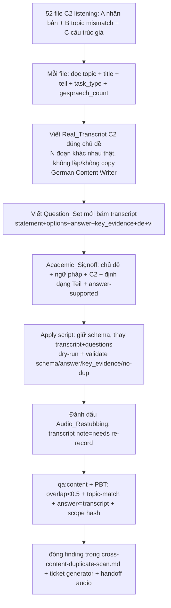

# Design Document

Vai chinh: German Content Writer
Vai phoi hop: German Academic Lead, German Curriculum Designer, Content QA / Linguistic Reviewer, Speech / Audio Engineer

## Overview

Sinh lại nội dung nghe thật cho **toàn bộ 52 file C2 listening** (`L-C2-GOETHE-001…018`, Teil 1/2/3). Ba lớp lỗi cần xử lý đồng thời cho mỗi file:

- **A. Transcript nhân bản** (22 cặp overlap 1.0, block 011–018 = copy 001–008) → viết transcript khác hẳn.
- **B. Topic mismatch** (29 file) → transcript phải đúng `topic`/`title` khai báo.
- **C. Cấu trúc "N Sendungen" giả** (52/52 file lặp vòng) → tạo N đoạn khác nhau thật hoặc chỉnh số đoạn cho khớp.

Khác spec reading (`content-c2-placeholder-regeneration`, 8 file, chỉ `article.text`+`questions`): ở đây là **listening** (transcript nhiều dòng theo speaker + `audio_file` + cấu trúc Teil Goethe C2) và **lan 100% corpus**. Vì transcript đổi, **MP3 cũ lệch** → phải đánh dấu Audio_Restubbing để Speech/Audio Engineer render lại (ngoài phạm vi nội dung nhưng truy vết bắt buộc).

Nguyên tắc:

- **Một đơn vị review = một lesson hoặc một Teil-file** (52 file gom theo lesson 001…018), mỗi đơn vị qua Academic_Signoff + gate.
- **Giữ schema, thay nội dung**: chỉ `transcript` + `questions[]` (+ `metadata.gespraech_count` nếu chỉnh số đoạn) thay; mọi khoá cấu trúc, `scoring`, `learningOutcomes` giữ; `cefrAudit` cập nhật trạng thái.
- **Đoạn/hội thoại khác nhau thật**: không lặp vòng nội bộ, không copy chéo ID.
- **Không lan ngoài 52 file**; listening level khác + skill khác bất biến.
- **Generator gốc** + **audio render** xử lý ở stream/ticket riêng.

## Architecture



## Components and Interfaces

### Component 1: `content/c2/listening/L-C2-GOETHE-*.json` (52 target)

Giữ nguyên khung; thay nội dung:

```jsonc
{
  "id": "L-C2-GOETHE-013-T1",       // giữ
  "level": "C2", "teil": 1,          // giữ
  "teil_name": "Radiosendungen",     // giữ
  "task_type": "ja_nein",            // giữ
  "topic": "Reformpädagogik in der Praxis",   // giữ (transcript phải khớp cái này)
  "audio_file": "/audio/.../013-T1.mp3",       // giữ path; MP3 cần re-record (Audio_Restubbing)
  "metadata": { "gespraech_count": 5, ... },   // chỉnh nếu số đoạn thật khác
  "questions": [ /* MỚI, bám transcript */ ],
  "scoring": { ... },                // giữ
  "transcript": {
    "type": "...", "status": "needs_audio_rerecord",   // đánh dấu Audio_Restubbing
    "note": "Regenerated by content-c2-listening-regeneration; MP3 pending re-record.",
    "lines": [ /* Real_Transcript: N đoạn KHÁC NHAU thật về Reformpädagogik */ ]
  },
  "cefrAudit": { "verdict": "pending_reaudit", ... },   // cập nhật (verdict cũ sai)
  "learningOutcomes": [ ... ]        // giữ (đã khớp topic)
}
```

### Component 2: Scanner + cổng (phạm vi + cổng đóng)

- Tái dùng/ mở rộng `scripts/scan-content-placeholders.ts` + script scan listening (như `tmp-scan-c2-listening` đã chạy) để đo:
  - cặp overlap transcript (chuẩn hoá, bỏ nhãn narrator) — cổng: tất cả < 0.5.
  - topic-keyword ⊂ transcript — cổng: mọi file match.
  - dupRatio nội bộ giữa dialogue paragraphs — cổng: < 0.2.
- Đưa scan listening thành script chính thức (không để ở `tmp-*`).

### Component 3: Apply script (dry-run + validate schema)

Gợi ý `scripts/apply-c2-listening-regen.ts` (tương tự `apply-c2-article-regen.ts`):

- Nhận nội dung mới đã Academic_Signoff (JSON: id → { transcript.lines[], questions[], gespraech_count? }).
- `--dry-run` in diff tóm tắt (số dòng transcript cũ→mới, số đoạn, số câu).
- Validate trước khi ghi: mỗi câu `answer` hợp lệ theo `task_type`, `key_evidence` ⊂ transcript mới (chuẩn hoá), transcript mới không trùng ≥0.5 với bất kỳ file khác trong corpus, dupRatio nội bộ < 0.2, keyword topic ⊂ transcript.
- Giữ schema (deep-merge, chỉ thay transcript.lines + questions + status/note + gespraech_count + cefrAudit.verdict); ghi UTF-8 **không BOM**.

### Component 4: Reference (không sửa)

| Nguồn | Vai trò |
| --- | --- |
| `.kiro/specs/content-c2-placeholder-regeneration/` | Mẫu spec + apply-script + cổng (reading) |
| `docs/content-quality/cefr-audit-checklist.md` | C2 listening: level fit + câu hỏi bám transcript |
| `scripts/scan-content-placeholders.ts` | Scanner READ-ONLY tái dùng |
| `scripts/content-qa.ts`, `tests/content-audit/*` | Gate giữ xanh |

## Design Decisions

### Decision 1: Viết lại CẢ transcript lẫn câu hỏi (không giữ answer cũ)

Transcript trùng/lệch chủ đề → câu hỏi cũ test sai. Phải sinh transcript thật rồi tạo câu hỏi mới bám transcript.

**Validates: Req 1, Req 2, Req 4.1**

### Decision 2: Đoạn/hội thoại phải khác nhau thật (chống cả A và C)

Không tái dùng đoạn giữa các "Sendung" (chống cấu trúc giả) và không copy giữa các ID (chống nhân bản). Cổng đo: dupRatio nội bộ < 0.2 + overlap chéo < 0.5.

**Validates: Req 1.1, Req 3.1, Req 3.2**

### Decision 3: Tách audio ra Audio_Restubbing (không render MP3 trong spec nội dung)

Render TTS/lồng tiếng C2 là pipeline riêng (Speech/Audio Engineer). Spec này đánh dấu transcript `status` cần re-record + handoff, không tự thay MP3. Justification: tránh ship audio lệch transcript mà không vượt phạm vi nội dung.

**Validates: Req 5.3, Req 6.6**

### Decision 4: Validate đáp án verify-được + topic-match trước khi ghi

Script assert `key_evidence` ⊂ transcript mới + keyword topic ⊂ transcript + answer hợp `task_type`.

**Validates: Req 2.1, Req 4.2, Req 3.4**

### Decision 5: Giữ schema, cập nhật `cefrAudit` sai

`verdict: aligned` cũ là sai (audit không đọc transcript) → đổi `pending_reaudit` tới khi Academic_Signoff thật trên transcript mới.

**Validates: Req 5.2, Req 5.5**

## Data Models

### Phạm vi

```
52 file C2 listening = L-C2-GOETHE-{001..018}-{T1,T2,T3} (018 chỉ T1 trong dải lỗi)
A. nhân bản: 22 cặp (011..018 copy 001..008)
B. topic mismatch: 29 file
C. cấu trúc giả: 52/52 (dupRatio 0.56..0.75)
giữ: schema, scoring, learningOutcomes
thay: transcript.lines + questions[] (+ gespraech_count, status/note, cefrAudit.verdict)
ngoài phạm vi (bất biến): listening A1..C1, skill khác; render MP3 (stream audio)
```

### Invariants sau spec

- Mọi cặp file: overlap transcript chuẩn hoá < 0.5 (Req 1.1).
- Mọi file: keyword `topic` ⊂ transcript (Req 2.1).
- Mọi file: dupRatio nội bộ dialogue < 0.2 (Req 3.2).
- Mọi câu: `answer` hợp `task_type`, `key_evidence` ⊂ transcript (Req 4.2).
- `qa:content` exit 0; PBT xanh (Req 5.4).
- Listening level khác + skill khác byte-identical (Req 5.1).

## Correctness Properties

*A property is a characteristic or behavior that should hold true across all valid executions of a system.*

Property 1: No Duplicated Transcript

_For any_ cặp file (i, j) trong 52 file C2 listening, overlap transcript chuẩn hoá (bỏ nhãn narrator) SHALL < 0.5.

**Validates: Requirements 1.1, 1.2**

Property 2: Transcript Matches Declared Topic

_For any_ file, ít nhất một keyword nội dung của `topic`/`title` SHALL xuất hiện trong transcript của chính file.

**Validates: Requirements 2.1, 2.2**

Property 3: No Fake Looping Segments

_For any_ file, dupRatio nội bộ giữa các đoạn dialogue (đoạn lặp / tổng đoạn) SHALL < 0.2.

**Validates: Requirements 3.1, 3.2**

Property 4: Answer Verifiable In Transcript

_For any_ câu hỏi mới, `answer` SHALL hợp lệ theo `task_type` và `key_evidence` SHALL là đoạn trích (substring chuẩn hoá) của transcript mới.

**Validates: Requirements 4.1, 4.2**

Property 5: Scope Containment

_For any_ file ngoài 52 file C2 listening, nội dung SHALL byte-identical; trong phạm vi, chỉ `transcript`/`questions[]` (+ metadata số đoạn, status, cefrAudit.verdict) thay (schema giữ).

**Validates: Requirements 5.1, 5.2**

## Error Handling

| Tình huống | Phát hiện | Xử lý |
| --- | --- | --- |
| Transcript mới vẫn trùng file khác | scan overlap + Property 1 | viết lại tới khi < 0.5 |
| Transcript off-topic | topic-keyword scan + Academic_Signoff + Property 2 | viết lại đúng chủ đề |
| Đoạn vẫn lặp vòng | dupRatio + Property 3 | viết N đoạn khác nhau hoặc chỉnh số đoạn |
| Đáp án không trong transcript | validate substring + Property 4 | sửa câu hoặc transcript |
| Quên đánh dấu audio | check status/note | set needs re-record + handoff |
| Đụng file ngoài phạm vi | Property 5 + hash diff | revert |
| qa:content/PBT regress | gate mỗi đơn vị | fix trước merge |
| Sai schema khi ghi | validate trước ghi | abort, sửa |

## Testing Strategy

### PBT applicability

- **Property 1 (No Dup):** ma trận overlap 52×52 < 0.5. Tự động.
- **Property 2 (Topic Match):** keyword topic ⊂ transcript mỗi file. Tự động.
- **Property 3 (No Fake Segments):** dupRatio nội bộ < 0.2. Tự động.
- **Property 4 (Answer Verifiable):** answer hợp task_type + key_evidence ⊂ transcript. Tự động.
- **Property 5 (Scope):** hash file ngoài phạm vi byte-identical.

Thêm `tests/content-audit/c2-listening.spec.ts` cho Property 1–5.

### Test plan

| Test | Tool | Pass criteria | Validates |
| --- | --- | --- | --- |
| No duplicated transcript | scan/PBT | mọi cặp overlap < 0.5 | Property 1, Req 1.1 |
| Topic match | scan/PBT | keyword topic ⊂ transcript | Property 2, Req 2.1 |
| No fake segments | scan/PBT | dupRatio nội bộ < 0.2 | Property 3, Req 3.2 |
| Answer verifiable | PBT | answer hợp task_type + key_evidence ⊂ transcript | Property 4, Req 4.2 |
| Scope | hash diff | ngoài 52 file byte-identical | Property 5, Req 5.1 |
| Content gate | `pnpm qa:content` | exit 0 | Req 5.4 |
| Academic signoff | German Academic Lead | chủ đề + ngữ pháp + C2 + định dạng Teil đạt | Req 6.1 |
| Audio handoff | check | mọi file đổi transcript có status needs re-record + ticket audio | Req 5.3, 6.6 |

### Manual verification

```bash
node_modules\.bin\tsx.cmd scripts\content-qa.ts
node node_modules\vitest\vitest.mjs run --config vitest.property.config.ts tests/content-audit
node scripts\scan-content-placeholders.ts
```

## Rollout Plan

### Ownership matrix

| Stream | Owner | Deliverable |
| --- | --- | --- |
| Viết Real_Transcript + Question_Set | German Content Writer | 52 transcript thật + câu hỏi |
| Academic sign-off | German Academic Lead | Duyệt chủ đề + ngữ pháp + C2 + định dạng Teil |
| Khung sư phạm câu hỏi (theo Teil Goethe C2) | German Curriculum Designer | Phân bố loại câu hợp từng Teil |
| Apply script + cổng + PBT | Content QA / Linguistic Reviewer | dry-run, validate, qa:content + PBT |
| Re-record MP3 (Audio_Restubbing) | Speech / Audio Engineer | TTS/lồng tiếng transcript mới |
| Ticket generator gốc | AI / LLM Engineer + CTO | Fix pipeline không sinh transcript trùng/lệch |

### Sequencing

1. Foundation: apply script + scan listening chính thức + PBT Property 1–5 + cổng.
2. Theo lesson (001 → … → 018), mỗi lesson gồm T1/T2/T3: viết transcript + câu hỏi → Academic_Signoff → apply (dry-run→ghi) → đánh dấu Audio_Restubbing → qa:content + PBT → merge.
3. Sau toàn bộ: overlap < 0.5 mọi cặp, topic-match 100%, dupRatio < 0.2; đóng finding trong `cross-content-duplicate-scan.md`.
4. Mở ticket generator gốc + handoff danh sách 52 file cho Speech/Audio Engineer.

### Rollback

Revert theo từng lesson/đơn vị (mỗi đơn vị một commit). Chỉ 52 file phạm vi đổi; revert đưa về transcript cũ — không ảnh hưởng listening level khác hay skill khác.
