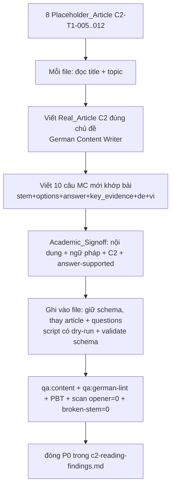

# Design Document

Vai chinh: German Content Writer
Vai phoi hop: German Academic Lead, German Curriculum Designer, Content QA / Linguistic Reviewer

## Overview

Thay nội dung placeholder của **8 bài đọc C2** (C2-T1-005…012) bằng bài đọc C2 thật đúng tiêu đề/chủ đề + bộ 10 câu hỏi mới khớp bài. Khác các spec sửa-tại-chỗ trước (genus, stem): ở đây **bài đọc sai về bản chất** → phải viết lại cả `article.text` LẪN toàn bộ `questions[]` (answer cũ vô giá trị vì gắn với filler).

Nguyên tắc:

- **Một file = một đơn vị review độc lập** (8 file), mỗi file qua Academic_Signoff + gate.
- **Giữ schema, thay nội dung**: chỉ `article.title`/`article.text` + nội dung `questions[]` thay; mọi khoá cấu trúc, `scoring`, `qa`, `cefrAudit`, `learningOutcomes` giữ.
- **Noi mẫu C2 thật** (C2-T1-001..004) về độ sâu, độ dài, register.
- **Không lan ngoài 8 file**; C2-T1-001..004 + skill khác bất biến.
- **Generator gốc** xử lý ở ticket riêng (ngăn tái sinh placeholder).

## Architecture



## Components and Interfaces

### Component 1: `content/c2/reading/C2-T1-005..012.json` (target)

Giữ nguyên khung; thay nội dung:

```jsonc
{
  "id": "C2-T1-008",            // giữ
  "level": "C2", "teil": 1,      // giữ
  "article": {
    "title": "Rawls' Theorie der Gerechtigkeit",   // giữ/tinh chỉnh
    "source": "Kommentar",
    "text": "<Real_Article: nội dung THẬT về Rawls — Urzustand, Schleier des Nichtwissens, Differenzprinzip… register C2>"
  },
  "questions": [ /* 10 câu MỚI khớp Real_Article */ ],
  "scoring": { ... },            // giữ
  "qa": { ... }, "cefrAudit": { ... }, "learningOutcomes": [ ... ]  // giữ
}
```

### Component 2: Worklist + scan (phạm vi + cổng)

- `c2-placeholder-worklist.csv` — 8 file + title + topic + word_count + num_questions.
- Cổng đóng: scan opener-generic `/Der vorliegende (Kommentar|Text|Artikel) widmet sich dem Thema/` = 0 trong 8 file; và marker Broken_Stem (`cefr-stem-markers.ts`) = 0.

### Component 3: Apply script (có dry-run + validate schema)

Gợi ý `scripts/apply-c2-article-regen.ts`:

- Nhận bản nội dung mới đã Academic_Signoff (JSON: file → { title?, text, questions[] }).
- `--dry-run` in diff tóm tắt (độ dài article cũ→mới, số câu).
- Validate trước khi ghi: đúng 10 câu, mỗi câu có `answer` ∈ options, `key_evidence` là substring của `article.text` mới (đáp án verify được), `stem` không dính Broken_Stem marker.
- Giữ schema (deep-merge vào object cũ, chỉ thay article.title/text + questions); ghi UTF-8 không BOM.

### Component 4: Reference (không sửa)

| Nguồn | Vai trò |
| --- | --- |
| `content/c2/reading/C2-T1-001..004.json` | Mẫu nội dung + cấu trúc C2 thật |
| `docs/content-quality/cefr-audit-checklist.md` | C2 reading: level fit + answer-supported |
| `scripts/lib/cefr-stem-markers.ts` | Cổng kiểm stem mới không hỏng |
| `scripts/content-qa.ts`, `tests/content-audit/*` | Gate giữ xanh |

## Design Decisions

### Decision 1: Viết lại CẢ bài đọc lẫn câu hỏi (không giữ answer cũ)

Bài đọc filler sai → câu hỏi cũ test sai. Phải sinh bài thật rồi tạo câu hỏi mới khớp. Justification: khác genus/stem (sửa field), đây là lỗi nội dung gốc, không vá được tại chỗ.

**Validates: Req 1.1, Req 2.1**

### Decision 2: Một file = một đơn vị review + Academic_Signoff

Mỗi bài C2 là một chủ đề học thuật riêng (Rawls, CRISPR, Adorno…) cần chuyên môn. Justification: kiểm soát chất lượng, tránh lại sinh filler.

**Validates: Req 4.1, Req 4.2**

### Decision 3: Validate đáp án verify-được trước khi ghi

Script assert `key_evidence` là substring của `article.text` mới + `answer` ∈ options. Justification: đảm bảo answer-integrity của nội dung MỚI ngay khi tạo.

**Validates: Req 2.2, Req 3.2**

### Decision 4: Giữ schema, chỉ thay nội dung; cổng scan opener + broken-stem = 0

Justification: không phá gate/structural; đo khách quan đã hết placeholder + stem hỏng.

**Validates: Req 1.4, Req 2.5, Req 3.2**

## Data Models

### Phạm vi

```
8 file C2 placeholder = C2-T1-005..012 · ~10 câu/file = 80 câu
giữ: schema, scoring, qa, cefrAudit, learningOutcomes
thay: article.title?/article.text + toàn bộ questions[]
ngoài phạm vi (bất biến): C2-T1-001..004, B2/C1/A-level, skill khác
```

### Invariants sau spec

- 0 file worklist còn opener-generic filler (Req 1.4).
- 0 câu mới dính Broken_Stem marker (Req 2.5).
- Mỗi câu: `answer` ∈ options, `key_evidence` ⊂ `article.text` (Req 2.2).
- `qa:content` exit 0; PBT xanh (Req 3.3, 3.4).
- C2-T1-001..004 + skill khác byte-identical (Req 3.1).

## Correctness Properties

*A property is a characteristic or behavior that should hold true across all valid executions of a system.*

Property 1: No Placeholder Remains

_For any_ file trong worklist, `article.text` sau spec SHALL KHÔNG khớp khuôn opener-generic và SHALL nói đúng `topic`/`title` của file.

**Validates: Requirements 1.1, 1.2, 1.4**

Property 2: Answer Verifiable In New Article

_For any_ câu hỏi mới, `answer` SHALL ∈ `options` và `key_evidence` SHALL là đoạn trích (substring chuẩn hoá) của `article.text` mới.

**Validates: Requirements 2.1, 2.2**

Property 3: Scope Containment

_For any_ file ngoài 8 file worklist, nội dung SHALL byte-identical; trong file phạm vi, chỉ `article.title`/`article.text` + `questions[]` thay (schema giữ).

**Validates: Requirements 3.1, 3.2**

## Error Handling

| Tình huống | Phát hiện | Xử lý |
| --- | --- | --- |
| Bài mới vẫn off-topic/filler | scan opener + Academic_Signoff + Property 1 | viết lại tới khi đúng chủ đề |
| Câu hỏi mới đáp án không trong bài | validate substring + Property 2 | sửa câu hoặc bài |
| Stem mới hỏng | marker cefr-stem + Property | viết lại stem |
| Đụng file ngoài phạm vi | Property 3 + diff | revert |
| qa:content/PBT regress | gate mỗi file | fix trước merge |
| Sai schema khi ghi | validate trước ghi | abort, sửa |

## Testing Strategy

### PBT applicability

- **Property 1 (No Placeholder):** scan opener-generic = 0 trên 8 file. Tự động.
- **Property 2 (Answer Verifiable):** với mỗi câu mới, assert answer∈options + key_evidence⊂article.text. Tự động, bảo vệ answer-integrity nội dung mới.
- **Property 3 (Scope):** hash file ngoài phạm vi byte-identical.

Thêm `tests/content-audit/c2-placeholder.spec.ts` cho Property 1 + 2 trên 8 file.

### Test plan

| Test | Tool | Pass criteria | Validates |
| --- | --- | --- | --- |
| No placeholder | scan/PBT | 0 opener-generic trong 8 file | Property 1, Req 1.4 |
| Answer verifiable | PBT | answer∈options + key_evidence⊂text | Property 2, Req 2.2 |
| No broken stem | marker | 0 câu mới dính marker | Req 2.5 |
| Scope | hash diff | ngoài 8 file byte-identical | Property 3, Req 3.1 |
| Content gate | `pnpm qa:content` | exit 0 | Req 3.3 |
| German lint | `pnpm qa:german-lint` | 0 lỗi mới | Req 3.5 |
| Academic signoff | German Academic Lead | nội dung + ngữ pháp + C2 đạt | Req 4.1 |

### Manual verification

```bash
node_modules\.bin\tsx.cmd scripts\content-qa.ts
node node_modules\vitest\vitest.mjs run --config vitest.property.config.ts tests/content-audit
node_modules\.bin\tsx.cmd scripts\content-german-lint.ts --skill reading --level c2 --json
```

## Rollout Plan

### Ownership matrix

| Stream | Owner | Deliverable |
| --- | --- | --- |
| Viết Real_Article + Question_Set | German Content Writer | 8 bài C2 thật + 80 câu |
| Academic sign-off | German Academic Lead | Duyệt nội dung + ngữ pháp + C2 |
| Khung sư phạm câu hỏi (recognition→inference→critical) | German Curriculum Designer | Phân bố loại câu hợp C2 |
| Apply script + gate | Content QA / Linguistic Reviewer | dry-run, validate schema, qa:content + PBT |
| Ticket generator gốc | AI / LLM Engineer + CTO | Fix pipeline không nhét filler |

### Sequencing

1. Theo từng file (C2-T1-005 → … → 012). Mỗi file: viết bài + câu hỏi → Academic_Signoff → apply (dry-run→ghi) → qa:content + qa:german-lint + PBT → merge.
2. Sau 8 file: scan opener = 0, broken-stem = 0; đóng P0 trong `c2-reading-findings.md`.
3. Mở ticket generator gốc.

### Rollback

Revert theo từng file (mỗi file một commit). Vì chỉ 8 file phạm vi đổi, revert đưa về placeholder cũ — không ảnh hưởng bài thật hay skill khác.
