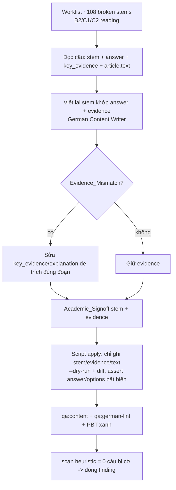

# Design Document

Vai chinh: German Content Writer
Vai phoi hop: German Academic Lead, Content QA / Linguistic Reviewer, AI / LLM Engineer

## Overview

Sửa lỗi generator hệ thống ở `stem` reading B2/C1/C2 (Teil "Kommentar verstehen"): pipeline đã ghép một khung câu hỏi generic ("Welche epistemologische Position vertritt der Autor bezüglich …", "Inwiefern widersprechen sich die Ausführungen zu … mit der Gesamtthese?") với một mảnh sub-prompt thô → `stem` sai ngữ pháp + lệch ý đáp án. ~108 câu bị cờ (A1/A2/B1 sạch).

Nguyên tắc:

- **Chỉ chạm `stem`** (và `key_evidence`/`explanation.de` khi dẫn sai, `article.text` khi có lỗi từ Đức). Đáp án + options bất khả xâm phạm — red-team đã xác nhận đáp án đúng, nên câu hỏi phải được viết lại để KHỚP đáp án đó.
- **de-trước, người-duyệt-sau**: viết lại stem tiếng Đức → Academic_Signoff → mới chốt.
- **Batch theo level** (b2 → c1 → c2), mỗi batch qua gate.
- **Read-only ngoài phạm vi**: không đụng generator gốc, A1/A2/B1, các skill khác.

## Architecture



## Components and Interfaces

### Component 1: `content/{b2,c1,c2}/reading/*.json` (target)

Chỉ các trường sau của câu trong Worklist thay đổi:

```jsonc
// Trước (broken)
"stem": "Welche epistemologische Position vertritt der Autor bezüglich fordert Hart bezüglich Recht und Moral?",
"answer": "c",
"options": { "a": "...", "b": "...", "c": "Eine strikte begriffliche Trennung.", "d": "..." }

// Sau (clean) — khớp answer c, đúng ngữ pháp
"stem": "Was fordert Hart hinsichtlich des Verhältnisses von Recht und Moral?",
"answer": "c",            // BẤT BIẾN
"options": { ... }         // BẤT BIẾN
```

Bất biến: `answer`, `options`, `correctIndex`, scoring, metadata (Req 3.1).

### Component 2: Worklist + scan (nguồn phạm vi + cổng kiểm)

- `docs/content-quality/audit-2026-06/review-board/cefr-stem-worklist.csv` — file + item_id + level + type + stem của câu bị cờ.
- Heuristic detector (đã dùng để dựng worklist): các marker ghép-template. Dùng lại như cổng "0 câu còn bị cờ" sau khi sửa (Req 1.5). Nên đóng gói thành verifier nhỏ trong `tests/content-audit/` hoặc một script `--check`.

### Component 3: Apply script (có dry-run)

Gợi ý `scripts/regenerate-cefr-stems.ts`:

- Đọc bản vá stem do người viết + Academic_Signoff (vd JSON/CSV: file, item_id, new_stem, [new_key_evidence], [new_de], [text_fix]).
- `--dry-run` in diff trước khi áp; `--level` batch từng level.
- Chỉ ghi `stem`/`key_evidence`/`explanation.de`/`article.text` của đúng câu/file trong phạm vi; assert `answer`/`options` trước-sau bất biến (abort nếu lệch).
- Giữ UTF-8 sạch, không BOM, value-invariant ngoài các trường cho phép.

### Component 4: Reference (không sửa)

| Nguồn | Vai trò |
| --- | --- |
| `scripts/content-qa.ts` | Gate structural, giữ xanh (Req 3.4) |
| `scripts/content-german-lint.ts` (`qa:german-lint`) | Kiểm ngữ pháp Đức stem mới (khi có LanguageTool) |
| `tests/content-audit/*` | PBT, giữ xanh (Req 3.5) |
| `c2-reading-findings.md` | Mô tả lỗi + quy mô + 2 finding phụ |

## Design Decisions

### Decision 1: Viết lại stem để KHỚP đáp án có sẵn (không đổi đáp án)

Red-team đã xác nhận `answer` đúng với text; lỗi nằm ở câu hỏi. Vì vậy sửa = viết câu hỏi mới sao cho đáp án hiện tại là đáp án đúng. Justification: bảo toàn answer-key đã verify, chỉ sửa phần hỏng (stem).

**Validates: Req 1.3, Req 3.1**

### Decision 2: Chỉ chạm stem/evidence/text-fix; script assert answer/options bất biến

Mọi thay đổi qua script có dry-run + assert. Justification: ~108 câu, cần an toàn answer-integrity; tránh tay-sửa lệch.

**Validates: Req 3.1, Req 4.3**

### Decision 3: Academic_Signoff bắt buộc cho stem C-level

Stem học thuật C1/C2 cần độ chính xác ngôn ngữ + nội dung cao. Justification: tránh thay một lỗi bằng lỗi khác; người rành tiếng Đức chốt.

**Validates: Req 1.2, Req 1.4, Req 4.1**

### Decision 4: Heuristic scan làm cổng đóng (0 câu còn cờ)

Dùng lại detector đã lập worklist để xác nhận sạch sau sửa. Justification: đo lường khách quan tiến độ; chặn tag Done sớm.

**Validates: Req 1.5, Req 4.4**

## Data Models

### Phạm vi (đo tại review)

```
broken stems (heuristic) ~ 108 câu, tập trung:
  b2 = 11 · c1 = 12 · c2 = 70  (a1/a2/b1 = 0)
finding phụ: Evidence_Mismatch (vd C2-T1-001 Q3), từ Đức sai (vd C2-T1-002 "intellectual")
```

### Invariants sau spec

- 0 câu Worklist còn dấu hiệu Broken_Stem (Req 1.5).
- `answer`/`options` mọi câu bất biến (Req 3.1).
- `qa:content` exit 0; `tests/content-audit/*` xanh (Req 3.4, 3.5).
- A1/A2/B1 + skill khác byte-identical (Req 3.3).

## Correctness Properties

*A property is a characteristic or behavior that should hold true across all valid executions of a system.*

Property 1: No Broken Stem Remains

_For any_ câu reading trong Worklist, `stem` sau spec SHALL KHÔNG khớp bất kỳ marker Broken_Stem nào và SHALL non-empty.

**Validates: Requirements 1.1, 1.2, 1.5**

Property 2: Answer Integrity Preserved

_For any_ câu reading, `answer`/`options`/`correctIndex` sau spec SHALL bằng đúng giá trị trước spec.

**Validates: Requirements 3.1**

Property 3: Scope Containment

_For any_ file ngoài `content/{b2,c1,c2}/reading/*.json` thuộc phạm vi, nội dung SHALL byte-identical; trong file phạm vi, chỉ `stem`/`key_evidence`/`explanation.de`/`article.text` của câu được duyệt thay đổi.

**Validates: Requirements 3.2, 3.3**

## Error Handling

| Tình huống | Phát hiện | Xử lý |
| --- | --- | --- |
| Script đổi nhầm answer/options | assert trước-sau + Property 2 | abort batch, revert, sửa script |
| Stem mới vẫn dính marker | scan heuristic + Property 1 | viết lại tới khi sạch |
| Stem mới sai ngữ pháp | Academic_Signoff + qa:german-lint | block batch tới khi đạt |
| Stem mới không khớp đáp án | Academic_Signoff (đối chiếu answer+evidence) | viết lại |
| Đụng file ngoài phạm vi | Property 3 + diff | revert |
| qa:content/PBT regress | gate mỗi batch | fix trước merge |

## Testing Strategy

### PBT applicability

- **Property 1 (No Broken Stem):** verifier scan marker = 0 trên Worklist. Tự động, cao giá trị.
- **Property 2 (Answer Integrity):** snapshot answer/options trước-sau toàn reading. Bảo vệ rủi ro lớn nhất.
- **Property 3 (Scope Containment):** hash file ngoài phạm vi + non-target field.

Thêm `tests/content-audit/cefr-stem.spec.ts` cho Property 1 + 2.

### Test plan

| Test | Tool | Pass criteria | Validates |
| --- | --- | --- | --- |
| No broken stem | verifier/PBT | 0 câu Worklist còn marker | Property 1, Req 1.5 |
| Answer integrity | PBT snapshot | answer/options bất biến | Property 2, Req 3.1 |
| Scope containment | hash diff | ngoài phạm vi byte-identical | Property 3, Req 3.2/3.3 |
| Content gate | `pnpm qa:content` | exit 0 | Req 3.4 |
| German lint | `pnpm qa:german-lint` | 0 lỗi mới trên stem sửa | Req 1.2 |
| Academic signoff | German Academic Lead | đạt ngữ pháp + ý + level | Req 4.1 |

### Manual verification

```bash
node_modules\.bin\tsx.cmd scripts\content-qa.ts                # exit 0
node node_modules\vitest\vitest.mjs run --config vitest.property.config.ts tests/content-audit
node_modules\.bin\tsx.cmd scripts\content-german-lint.ts --skill reading --level c2 --json
```

## Rollout Plan

### Ownership matrix

| Stream | Owner | Deliverable |
| --- | --- | --- |
| Viết lại stem (de) + sửa evidence/text | German Content Writer | Clean_Stem + bản vá |
| Academic sign-off | German Academic Lead | Duyệt ngữ pháp + ý + level |
| Apply script + gate | Content QA / Linguistic Reviewer | dry-run, diff, qa:content + qa:german-lint + PBT |
| Điều tra generator gốc (riêng) | AI / LLM Engineer + CTO | Fix pipeline để không tái phát |

### Sequencing

1. b2 (11) → 2. c1 (12) → 3. c2 (70). Mỗi batch: viết lại stem → Academic_Signoff → apply (dry-run→áp) → qa:content + qa:german-lint + PBT → merge.
2. Sau cả 3 batch: scan heuristic = 0; đóng finding `c2-reading-findings.md`; cập nhật worklist.
3. Mở ticket riêng cho AI/CTO sửa generator gốc (ngăn tái phát ở nội dung sinh mới).

### Rollback

Revert theo batch level (mỗi level một commit). Chỉ stem/evidence/text đổi, answer bất biến → revert an toàn.
