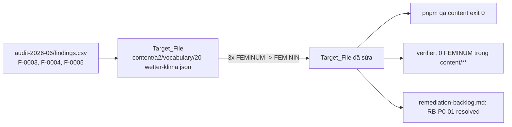

# Design Document

Vai chinh: Content QA / Linguistic Reviewer
Vai phoi hop: German Academic Lead

## Overview

Spec `content-genus-enum-fix` là remediation đầu tiên từ backlog audit `RB-P0-01`. Sửa đúng **3 giá trị enum sai** `"article": "FEMINUM"` → `"article": "FEMININ"` trong một file duy nhất `content/a2/vocabulary/20-wetter-klima.json`. Đây là sửa typo enum thuần — cả 3 danh từ (`Temperatur`, `Wolke`, `Jahreszeit`) vốn đã là giống cái (`die …`), nên Genus thực không đổi; chỉ giá trị string bị viết sai (`FEMINUM` thay vì `FEMININ`) được sửa.

Blast radius tối thiểu: 1 file, 3 chuỗi. Không đổi schema, không đổi code, không đổi nghĩa/ví dụ/dịch.

## Architecture

Thay thế chuỗi tại chỗ, an toàn JSON:



Nguyên tắc:

- **Edit tại chỗ, không reformat.** Chỉ đổi 3 giá trị string; giữ nguyên thứ tự key, indent, mọi field khác (Req 2.1, 2.2).
- **Enum-correct.** `FEMININ` thuộc `GENDERS` chuẩn; `FEMINUM` thì không (Req 1).
- **Verify kép.** Gate `qa:content` + verifier grep `FEMINUM` toàn `content/**` (Req 3.1, 3.5).

## Components and Interfaces

### Component 1: `content/a2/vocabulary/20-wetter-klima.json` (Target_File)

Ba entry trong mảng `words[]` được sửa:

| Word | Line (baseline) | Trước | Sau | Genus thực | Validates |
| --- | --- | --- | --- | --- | --- |
| `Temperatur` | 261 | `"article": "FEMINUM"` | `"article": "FEMININ"` | die Temperatur (FEMININ) | Req 1.1, 2.3 |
| `Wolke` | 289 | `"article": "FEMINUM"` | `"article": "FEMININ"` | die Wolke (FEMININ) | Req 1.2, 2.3 |
| `Jahreszeit` | 404 | `"article": "FEMINUM"` | `"article": "FEMININ"` | die Jahreszeit (FEMININ) | Req 1.3, 2.3 |

Mỗi entry có `plural` dạng `"die …n"` xác nhận giống cái — German Academic Lead sign-off.

### Component 2: Verifier (read-only check sau sửa)

Hai lệnh xác minh, không sửa gì:

```bash
# 1. Content gate giữ xanh
pnpm qa:content        # = tsx scripts/content-qa.ts (môi trường không pnpm: dùng node_modules/.bin/tsx)

# 2. Không còn FEMINUM trong toàn content
# (verifier grep — kỳ vọng 0 match)
```

### Design Decisions

#### Decision 1: Sửa string tại chỗ thay vì script batch

Chỉ 3 occurrence trong 1 file → sửa trực tiếp bằng string-replace từng entry (có context `word` để định danh), không cần script. Giảm rủi ro đụng nhầm file khác.

**Validates: Req 2.1, 2.4**

#### Decision 2: Giữ `FEMINUM` ra khỏi toàn content tree

Verifier quét `content/**` (không chỉ Target_File) để chắc chắn không còn occurrence nào sót — phòng trường hợp có occurrence mới lọt vào giữa kỳ.

**Validates: Req 1.5, 3.5**

## Data Models

### Genus enum (chuẩn, không đổi)

```
GENDERS = ['MASKULIN', 'FEMININ', 'NEUTRUM']   // packages/shared/src/types/index.ts
```

`FEMINUM` ∉ GENDERS → giá trị sai. `FEMININ` ∈ GENDERS → giá trị đúng.

### Invariants sau sửa

- `Target_File` parse được như JSON hợp lệ (Req 3.2).
- 0 occurrence `FEMINUM` trong `content/**` (Req 1.5).
- 3 entry có `article = "FEMININ"`; mọi field khác byte-identical (Req 2.1).
- `qa:content` exit 0 (Req 3.1).

## Correctness Properties

*A property is a characteristic or behavior that should hold true across all valid executions of a system.*

Property 1: Enum Validity — mọi article trong content thuộc Genus_Enum

_For any_ entry vocabulary có `wordType = "NOMEN"` và có trường `article` trong `content/**`, giá trị `article` SHALL thuộc `{MASKULIN, FEMININ, NEUTRUM}`. Cụ thể sau spec, 0 occurrence `FEMINUM` tồn tại.

**Validates: Requirements 1.4, 1.5, 3.5**

Property 2: Preservation — chỉ 3 giá trị article đổi, mọi thứ khác giữ nguyên

_For any_ field trong `Target_File` khác `article` của 3 Affected_Word, giá trị SHALL byte-identical trước và sau sửa; cấu trúc JSON và thứ tự entry SHALL không đổi.

**Validates: Requirements 2.1, 2.2, 3.2**

## Error Handling

| Tình huống | Phát hiện | Xử lý |
| --- | --- | --- |
| Sửa nhầm sang giá trị khác (vd FEMININE) | Verifier grep + qa:content | Sửa lại đúng `FEMININ` (∈ enum) |
| Đụng field ngoài article | PR diff review | Revert phần thừa; giữ đúng 3 string đổi (Req 2.5) |
| JSON hỏng sau sửa | `qa:content` parse fail / verifier | Sửa cú pháp; chạy lại gate (Req 3.2) |
| Còn FEMINUM sót nơi khác | Verifier quét `content/**` | Sửa nốt occurrence sót trước khi tag Done (Req 1.5) |
| File khác bị đổi trong PR | PR diff review | Block merge tới khi loại bỏ (Req 2.4, 2.5) |

## Testing Strategy

### PBT applicability assessment

Thay đổi là **3 giá trị dữ liệu** trong 1 file — EXAMPLE/SMOKE, không phải logic mới có universal property. Tuy nhiên Property 1 (enum validity toàn content) là invariant universal đáng một verifier check (grep `FEMINUM` = 0 trên `content/**`); Property 2 (preservation) kiểm bằng diff review + qa:content. Không thêm PBT mới ở `tests/` vì gate `qa:content` + verifier đã đủ.

### Test plan

| Test | Tool | Scope | Pass criteria | Validates |
| --- | --- | --- | --- | --- |
| Content gate | `pnpm qa:content` (tsx) | content/** | exit 0, 0 lỗi (không regress) | Req 3.1, 3.2 |
| FEMINUM verifier | grep `FEMINUM` | content/** | 0 match | Req 1.4, 1.5, 3.5 |
| FEMININ presence | grep cho 3 entry | Target_File | 3 entry có `article: "FEMININ"` | Req 1.1, 1.2, 1.3 |
| Diff review | PR diff | PR | đúng 1 file, đúng 3 string đổi | Req 2.1, 2.4, 2.5 |
| Genus sign-off | German Academic Lead | 3 từ | xác nhận cả 3 là FEMININ thực | Req 2.3 |

### Manual verification commands

```bash
# môi trường không có pnpm: dùng node_modules/.bin/tsx
node_modules/.bin/tsx scripts/content-qa.ts          # exit 0
# verifier (PowerShell): 0 match kỳ vọng
# Select-String -Path content\**\*.json -Pattern 'FEMINUM'
```

## Rollout Plan

### Ownership matrix

| Stream | Owner | Deliverable |
| --- | --- | --- |
| Genus_Fix (3 string) | Content QA / Linguistic Reviewer | Sửa 3 `article` trong Target_File |
| Genus sign-off | German Academic Lead | Xác nhận 3 từ là FEMININ thực |
| Đóng finding | Content QA | Cập nhật `RB-P0-01` resolved trong backlog |

### Sequencing

1. Content QA sửa 3 occurrence `FEMINUM → FEMININ` trong Target_File.
2. Chạy `qa:content` + verifier grep → xác nhận xanh + 0 FEMINUM.
3. German Academic Lead sign-off Genus (die Temperatur / die Wolke / die Jahreszeit).
4. Cập nhật `RB-P0-01` resolved trong `remediation-backlog.md` kèm ref.
5. Reviewer verify PR = 1 file, merge.

### Rollback

Revert PR: 3 string trở lại `FEMINUM`; không hệ quả lan ra file khác (blast radius = 1 file).
