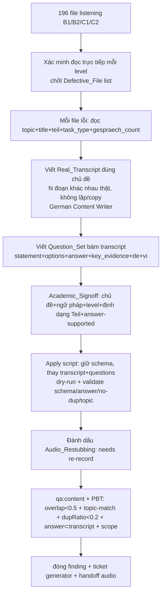

# Design Document

Vai chinh: German Content Writer
Vai phoi hop: German Academic Lead, German Curriculum Designer, Content QA / Linguistic Reviewer, Speech / Audio Engineer

## Overview

Gom việc regenerate listening cho **cả 4 level B1/B2/C1/C2** (196 file) vì cùng một bug generator hệ thống. Thay spec cũ `content-c2-listening-regeneration` (chỉ C2). Ba lớp lỗi (mức độ tuỳ level):

- **A. Transcript nhân bản** (mẫu N↔N+10): B1 (`011≡001`), B2 (`011≡001`, `012≡002`), C2 (`011..018≡001..008`); C1 chỉ partial.
- **B. Topic mismatch**: B1 14, B2 11, C1 7, C2 29.
- **C. Cấu trúc "N Sendungen" giả**: rõ ở C2 (52/52); B1/B2/C1 cần xác minh.

Khác spec reading (`content-c2-placeholder-regeneration`): listening có transcript nhiều dòng theo speaker + `audio_file` + cấu trúc Teil Goethe đặc thù từng level. Vì transcript đổi, **MP3 cũ lệch** → đánh dấu Audio_Restubbing.

Nguyên tắc:

- **Mỗi đơn vị review = một lesson hoặc một Teil-file**, gom theo level; mỗi đơn vị qua Academic_Signoff + gate.
- **Xác minh đọc trực tiếp trước** khi chốt danh sách Defective_File mỗi level (không chỉ tin số đo overlap).
- **Giữ schema, thay nội dung**: chỉ `transcript` + `questions[]` (+ metadata số đoạn, `cefrAudit.verdict`) thay.
- **Đoạn/hội thoại khác nhau thật**: không lặp vòng nội bộ, không copy chéo ID.
- **Không lan ngoài file lỗi**; listening A1/A2 + skill khác bất biến.
- **Generator gốc** + **audio render** ở stream/ticket riêng.

## Architecture



## Components and Interfaces

### Component 1: `content/{b1,b2,c1,c2}/listening/L-*-GOETHE-*.json` (target)

Giữ khung; thay `transcript.lines` + `questions[]` (+ `metadata` số đoạn, `transcript.status/note`, `cefrAudit.verdict`). Giống mẫu C2 đã mô tả ở spec tiền nhiệm.

### Component 2: Scanner + cổng (đa level)

- Chính thức hoá scan listening (từ các script tạm đã chạy): ma trận overlap **trong từng level**, topic-keyword ⊂ transcript, dupRatio nội bộ. READ-ONLY.
- Cổng đóng mỗi level: mọi cặp overlap < 0.5, topic-match 100%, dupRatio < 0.2.

### Component 3: Apply script (dry-run + validate schema)

`scripts/apply-listening-regen.ts` (tổng quát hoá từ `apply-c2-article-regen.ts`): nhận id → {transcript.lines[], questions[], gespraech_count?}; `--dry-run`; validate `answer` hợp `task_type`, `key_evidence` ⊂ transcript mới, overlap chéo < 0.5 trong level, dupRatio < 0.2, keyword topic ⊂ transcript; giữ schema; set status re-record + `cefrAudit.verdict`; ghi UTF-8 no BOM.

### Component 4: Reference (không sửa)

| Nguồn | Vai trò |
| --- | --- |
| `.kiro/specs/content-c2-placeholder-regeneration/` | Mẫu spec + apply-script + cổng (reading) |
| `docs/content-quality/cefr-audit-checklist.md` | Listening: level fit + câu hỏi bám transcript |
| `scripts/scan-content-placeholders.ts` | Scanner READ-ONLY tái dùng |
| `scripts/content-qa.ts`, `tests/content-audit/*` | Gate giữ xanh |

## Design Decisions

### Decision 1: Gom 4 level vào một spec (thay spec C2-only)

Cùng một bug generator → một apply-script + một bộ cổng/PBT + một quy trình review dùng chung, chỉ khác dữ liệu mỗi level. Giảm trùng lặp công cụ.

**Validates: Req 1, Req 2, Req 3**

### Decision 2: Xác minh đọc trực tiếp trước khi chốt phạm vi mỗi level

Số đo overlap là xấp xỉ; C1 chỉ partial → có thể đủ khác biệt hợp lệ. Đọc trực tiếp tránh sửa nhầm/bỏ sót.

**Validates: Req 7.1, Req 7.2, Req 7.3**

### Decision 3: Viết lại CẢ transcript lẫn câu hỏi (không giữ answer cũ)

**Validates: Req 1, Req 2, Req 4.1**

### Decision 4: Đoạn/hội thoại khác nhau thật (chống A và C); validate topic + answer trước khi ghi

**Validates: Req 1.1, Req 3.1, Req 3.2, Req 2.1, Req 4.2**

### Decision 5: Tách audio ra Audio_Restubbing; cập nhật `cefrAudit` sai

**Validates: Req 5.3, Req 5.5, Req 6.6**

## Data Models

### Phạm vi

```
196 file listening: B1(44) + B2(48) + C1(52) + C2(52)
Defective_File (chốt sau xác minh đọc), ước tính ban đầu:
  B1: 8 overlap + 14 topic-mismatch
  B2: 16 overlap + 11 topic-mismatch
  C1: 16 partial-overlap + 7 topic-mismatch
  C2: 44 overlap + 29 topic-mismatch + 52 internal-loop
giữ: schema, scoring, learningOutcomes
thay: transcript.lines + questions[] (+ metadata số đoạn, status, cefrAudit.verdict)
ngoài phạm vi (bất biến): listening A1/A2, skill khác; render MP3 (stream audio)
```

### Invariants sau spec

- Trong mỗi level, mọi cặp file: overlap transcript chuẩn hoá < 0.5 (Req 1.1).
- Mọi file lỗi: keyword `topic` ⊂ transcript (Req 2.1).
- Mọi file lỗi: dupRatio nội bộ dialogue < 0.2 (Req 3.2).
- Mọi câu mới: `answer` hợp `task_type`, `key_evidence` ⊂ transcript (Req 4.2).
- `qa:content` exit 0; PBT xanh (Req 5.4).
- Listening A1/A2 + skill khác byte-identical (Req 5.1).

## Correctness Properties

*A property is a characteristic or behavior that should hold true across all valid executions of a system.*

Property 1: No Duplicated Transcript Within Level

_For any_ cặp file (i, j) cùng level listening, overlap transcript chuẩn hoá (bỏ nhãn narrator) SHALL < 0.5.

**Validates: Requirements 1.1, 1.2, 1.3**

Property 2: Transcript Matches Declared Topic

_For any_ file lỗi, ít nhất một keyword nội dung của `topic`/`title` SHALL xuất hiện trong transcript của chính file.

**Validates: Requirements 2.1, 2.2**

Property 3: No Fake Looping Segments

_For any_ file lỗi, dupRatio nội bộ giữa các đoạn dialogue SHALL < 0.2.

**Validates: Requirements 3.1, 3.2**

Property 4: Answer Verifiable In Transcript

_For any_ câu hỏi mới, `answer` SHALL hợp lệ theo `task_type` và `key_evidence` SHALL là đoạn trích (substring chuẩn hoá) của transcript mới.

**Validates: Requirements 4.1, 4.2**

Property 5: Scope Containment

_For any_ file ngoài danh sách Defective_File, nội dung SHALL byte-identical; trong phạm vi, chỉ `transcript`/`questions[]` (+ metadata số đoạn, status, cefrAudit.verdict) thay.

**Validates: Requirements 5.1, 5.2**

## Error Handling

| Tình huống | Phát hiện | Xử lý |
| --- | --- | --- |
| Transcript mới vẫn trùng file khác | scan overlap + Property 1 | viết lại tới khi < 0.5 |
| Transcript off-topic | topic-keyword scan + Academic_Signoff + Property 2 | viết lại đúng chủ đề |
| Đoạn vẫn lặp vòng | dupRatio + Property 3 | viết N đoạn khác nhau hoặc chỉnh số đoạn |
| Đáp án không trong transcript | validate substring + Property 4 | sửa câu hoặc transcript |
| Sửa nhầm file C1 hợp lệ | xác minh đọc (Req 7) | loại khỏi danh sách |
| Quên đánh dấu audio | check status/note | set needs re-record + handoff |
| Đụng file ngoài phạm vi | Property 5 + hash diff | revert |
| qa:content/PBT regress | gate mỗi đơn vị | fix trước merge |

## Testing Strategy

### PBT applicability

- **Property 1:** ma trận overlap trong từng level < 0.5. Tự động.
- **Property 2:** keyword topic ⊂ transcript mỗi file lỗi. Tự động.
- **Property 3:** dupRatio nội bộ < 0.2. Tự động.
- **Property 4:** answer hợp task_type + key_evidence ⊂ transcript. Tự động.
- **Property 5:** hash file ngoài phạm vi byte-identical.

Thêm `tests/content-audit/listening-regen.spec.ts` cho Property 1–5 (tham số hoá theo level).

### Test plan

| Test | Tool | Pass criteria | Validates |
| --- | --- | --- | --- |
| No dup within level | scan/PBT | mọi cặp overlap < 0.5 | Property 1, Req 1.1 |
| Topic match | scan/PBT | keyword topic ⊂ transcript | Property 2, Req 2.1 |
| No fake segments | scan/PBT | dupRatio nội bộ < 0.2 | Property 3, Req 3.2 |
| Answer verifiable | PBT | answer hợp task_type + key_evidence ⊂ transcript | Property 4, Req 4.2 |
| Scope | hash diff | ngoài danh sách byte-identical | Property 5, Req 5.1 |
| Content gate | `pnpm qa:content` | exit 0 | Req 5.4 |
| Academic signoff | German Academic Lead | chủ đề + ngữ pháp + level + Teil đạt | Req 6.1 |
| Audio handoff | check | file đổi transcript có status re-record + ticket audio | Req 5.3, 6.6 |

### Manual verification

```bash
node_modules\.bin\tsx.cmd scripts\content-qa.ts
node node_modules\vitest\vitest.mjs run --config vitest.property.config.ts tests/content-audit
node scripts\scan-content-placeholders.ts
```

## Rollout Plan

### Ownership matrix

| Stream | Owner | Deliverable |
| --- | --- | --- |
| Xác minh đọc + chốt Defective_File | Content QA + German Academic Lead | Danh sách lỗi mỗi level |
| Viết Real_Transcript + Question_Set | German Content Writer | Transcript thật + câu hỏi |
| Academic sign-off | German Academic Lead | Duyệt chủ đề + ngữ pháp + level + Teil |
| Khung sư phạm câu hỏi theo Teil | German Curriculum Designer | Phân bố loại câu hợp từng Teil |
| Apply script + cổng + PBT | Content QA / Linguistic Reviewer | dry-run, validate, qa:content + PBT |
| Re-record MP3 (Audio_Restubbing) | Speech / Audio Engineer | TTS/lồng tiếng transcript mới |
| Ticket generator gốc | AI / LLM Engineer + CTO | Fix pipeline không sinh transcript trùng/lệch |

### Sequencing

1. Foundation: scan listening đa-level chính thức + apply script + PBT Property 1–5 + cổng.
2. Theo thứ tự ưu tiên P0 trước: **B2 → B1 → C2 → C1** (B1/B2 gọn, sửa nhanh, đóng P0 sớm; C2 nặng nhất; C1 partial cuối). Mỗi level: xác minh đọc → chốt danh sách → viết transcript + câu hỏi từng đơn vị → Academic_Signoff → apply → Audio_Restubbing → qa:content + PBT → merge.
3. Sau toàn bộ: overlap < 0.5 mọi cặp mỗi level, topic-match 100%, dupRatio < 0.2; đóng finding.
4. Mở ticket generator gốc + handoff danh sách file cho Speech/Audio Engineer.

### Rollback

Revert theo từng đơn vị (mỗi đơn vị một commit). Chỉ file lỗi đổi; revert đưa về transcript cũ — không ảnh hưởng A1/A2 hay skill khác.
