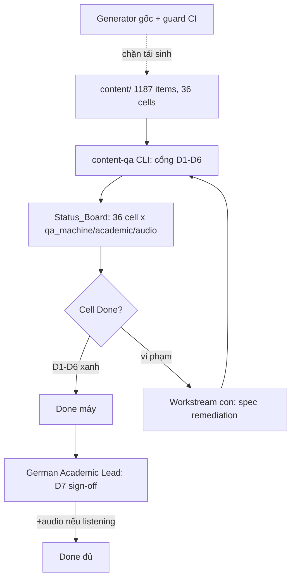

# Design Document

Vai chinh: Project Manager / Delivery Manager
Vai phoi hop: Content QA / Linguistic Reviewer, German Academic Lead, AI / LLM Engineer, CTO / Tech Lead, Speech / Audio Engineer

## Overview

Chương trình quản lý chất lượng + remediation cho toàn bộ 1.187 item (36 cell module×level). Spec này KHÔNG viết nội dung học thuật; nó cung cấp **khung điều phối**: cổng QA thống nhất (D1–D6), bảng trạng thái 36 cell sinh từ scanner, quy trình Academic_Signoff (D7), lộ trình 5 đợt, và hợp nhất spec con.

Nguyên tắc:
- **Tái dùng, không định nghĩa lại**: cổng máy gọi lại marker/helper đã có.
- **Máy bắt D1–D6, người bắt D7**: tách rõ phần tự động hoá được và phần bắt buộc con người.
- **READ-ONLY tới khi sign-off**: nội dung AI ở dạng nháp ngoài `content/`.
- **Một nguồn sự thật**: Status_Board sinh từ scanner, không nhập tay.

## Architecture



## Components and Interfaces

### Component 1: Cổng QA thống nhất (`scripts/content-qa.ts` mở rộng)

Một CLI gom các kiểm deterministic, mỗi kiểm là một sub-gate tái dùng SSOT:

| Sub-gate | Logic | Nguồn tái dùng |
| --- | --- | --- |
| D1 opener | regex GENERIC_OPENER + GENERIC_OPENER_T2 = 0 | `apply-c2-article-regen`, `apply-c2-teil2-regen` |
| D2 duplicate | overlapScore trong cell < 0.5 | `lib/listening-scan.overlapScore` |
| D3 topic-match | keyword(topic/title) ⊂ nội dung | `lib/listening-scan.transcriptMatchesTopic` (tổng quát hoá) |
| D4 fake-segment | dupRatio nội bộ < 0.2 (listening) | `lib/listening-scan.internalDupRatio` |
| D5 broken-stem | BROKEN_STEM_MARKERS = 0 | `lib/cefr-stem-markers` |
| D6 answer-integrity | key_evidence ⊂ nội dung + answer hợp lệ | `apply-*` validators |

- Trích "nội dung học" theo module: reading `article.text`/`section_cloze.text`, listening transcript dialogue, writing Musterlösung (loại prompt/khung), vocabulary định nghĩa/ví dụ.
- Output: JSON theo cell → {d1..d6: pass/fail + danh sách file}.

### Component 2: Status_Board generator (`scripts/content-status-board.ts`)

- Đọc kết quả cổng máy → sinh bảng 36 cell (MD + JSON) trong `docs/content-quality/audit-2026-06/status-board.*`.
- Cột: `qa_machine` (D1–D6 tổng hợp), `academic_signoff` (đọc từ manifest sign-off), `audio` (listening), `status`.
- `academic_signoff` + `audio` đọc từ file manifest do người cập nhật (`docs/content-quality/audit-2026-06/signoff-manifest.json`) — máy không tự quyết D7.

### Component 3: Signoff manifest (người cập nhật)

```jsonc
{
  "reading/C2": { "signoff": "pending", "by": null, "date": null, "note": "12 nháp T2 chờ duyệt" },
  "listening/B2": { "signoff": "pending", "by": null, "date": null }
  // ... 36 cell
}
```

### Component 4: CI hook

- PR đụng `content/**` → chạy cổng máy (D1–D6) → fail nếu có vi phạm mới (so baseline).
- Tái dùng `tests/content-audit/*` + `vitest.property.config.ts`.

### Component 5: Reference (không sửa logic, chỉ gọi)

`apply-c2-article-regen.ts`, `apply-c2-teil2-regen.ts`, `apply-listening-regen.ts`, `lib/cefr-stem-markers.ts`, `lib/listening-scan.ts`, các spec con.

## Design Decisions

### Decision 1: Tách D1–D6 (máy) khỏi D7 (người)
Máy chỉ chặn lỗi đo được; chất lượng học thuật cần German Academic Lead. Status_Board phản ánh cả hai nhưng không để máy "tự phê duyệt" D7.
**Validates: Req 2, Req 3.4**

### Decision 2: Status_Board sinh từ scanner, D7/audio từ manifest người
Tránh số liệu thủ công sai lệch; D7 là quyết định người nên tách ra manifest.
**Validates: Req 1.2, Req 3.1**

### Decision 3: Chương trình điều phối, không viết nội dung
Viết nội dung ở spec con + cần sign-off; chương trình chỉ quản cổng + board + lộ trình. Tránh phình spec.
**Validates: Req 5.2, out-of-scope**

### Decision 4: Đợt 0 thuần kỹ thuật chạy trước
Hạ tầng + fix generator không cần chuyên gia Đức → khởi động ngay, chặn tái sinh trước khi đổ công D7.
**Validates: Req 4.2, Req 4.3**

## Data Models

```
36 cell = {module ∈ [reading,listening,writing,speaking,vocabulary,grammar]} × {level ∈ [a1..c2]}
Cell state = { qa_machine: {d1..d6}, academic_signoff: pending|signed, audio: n/a|pending|done, status }
Done (máy)  = ∀ d∈{d1..d6}: pass
Done (đủ)   = Done(máy) ∧ academic_signoff=signed ∧ (audio≠pending)
```

### Invariants
- Status_Board luôn liệt kê đúng 36 cell, tổng item = 1187.
- D1–D6 tính bằng SSOT, không logic trùng lặp.
- `content/` READ-ONLY khi chưa sign-off (Req 6.1).

## Correctness Properties

Property 1: Board Completeness — _For any_ lần sinh Status_Board, board SHALL chứa đúng 36 cell và tổng item khớp inventory (1187).
**Validates: Requirements 1.1, 1.2**

Property 2: Gate Reuses SSOT — _For any_ sub-gate D1/D5/D6, kết quả SHALL khớp marker/validator gốc (`cefr-stem-markers`, `apply-*`) trên cùng input (không lệch do định nghĩa lại).
**Validates: Requirements 2.2**

Property 3: No Machine Auto-Signoff — _For any_ cell, `status = Done (đủ)` SHALL kéo theo `academic_signoff = signed` trong manifest (máy không tự đặt Done đủ).
**Validates: Requirements 3.1, 3.3**

Property 4: Read-Only Until Signoff — _For any_ thay đổi `content/` chưa có sign-off, thay đổi đó SHALL không xuất hiện trong nhánh release (chỉ nháp ngoài `content/`).
**Validates: Requirements 6.1, 6.2**

## Error Handling

| Tình huống | Phát hiện | Xử lý |
| --- | --- | --- |
| Cell thiếu trong board | Property 1 | regenerate board |
| Sub-gate lệch marker gốc | Property 2 test | sửa gọi SSOT |
| Máy tự đặt Done đủ | Property 3 | board chỉ đọc manifest cho D7 |
| Content đổi khi chưa sign-off | Property 4 + CI | chặn merge |
| Artifact tự sinh bị stage | rule repo | report owner, không commit |

## Testing Strategy

### PBT applicability
- Property 1: assert board = 36 cell + tổng 1187.
- Property 2: so sánh sub-gate vs marker/validator gốc trên fixture.
- Property 3: với mọi cell, status=Done-đủ ⇒ manifest signed.
- Property 4: hash `content/` không đổi trong nhánh khi chưa sign-off.

`tests/content-audit/program-quality.spec.ts` cho Property 1–4.

### Test plan
| Test | Tool | Pass | Validates |
| --- | --- | --- | --- |
| Board completeness | PBT | 36 cell, 1187 | P1, Req1 |
| Gate SSOT parity | PBT | khớp marker gốc | P2, Req2 |
| No auto-signoff | PBT | Done đủ ⇒ signed | P3, Req3 |
| Read-only | hash/CI | content bất biến tới sign-off | P4, Req6 |
| qa:content | CLI | exit 0 | Req2 |

## Rollout Plan

### 5 đợt (theo master plan)
0. Hạ tầng: cổng QA hợp nhất + Status_Board + fix generator gốc + CI. (kỹ thuật)
1. Đóng P0: reading C2-T2, listening C2/B2/B1 (cần D7).
2. Xác minh: listening C1 partial, writing A1, đọc mẫu cell "sạch máy".
3. Audit D7 toàn diện + audio re-record (vocabulary 369 + còn lại).
4. Chốt 36 cell Done đủ + cổng CI thường trực + phòng ngừa.

### Ownership
PM điều phối; Content QA hạ tầng/cổng; German Academic Lead D7 (nút thắt); AI/CTO generator+CI; Speech/Audio re-record.

### Rollback
Cổng/board READ-ONLY (không sửa content). Spec con revert theo đơn vị. Chương trình không gây rủi ro content trực tiếp.
