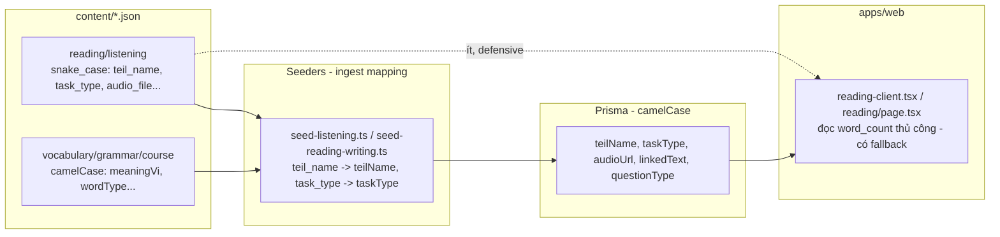

# Design Document

Vai chinh: CTO / Tech Lead
Vai phoi hop: Backend Engineer, Frontend Engineer

## Overview

Tài liệu quyết định cho `RB-P2-01` (schema field-naming drift). **Không execute** — phân tích blast-radius, đánh giá phương án, đưa khuyến nghị để công ty chốt. Nếu duyệt migrate, execution ở spec riêng.

Phát hiện cốt lõi (điều tra repo thật): **Prisma DB đã camelCase**; snake_case chỉ sống trong raw content JSON; seeders đã map snake→camel tại ingest; runtime UI gần như không đọc trực tiếp Snake_Field. → Drift là "thẩm mỹ ở tầng content JSON", không phải lỗi runtime. P2, không khẩn.

## Architecture

Luồng dữ liệu hiện tại:

**Điểm mấu chốt:** mũi tên snake→DB đã được seeder chuẩn hoá. Drift không lan tới DB hay phần lớn runtime.

## Components and Interfaces

Các thành phần chạm tới Snake_Field (nếu migrate). Đây là interface inventory, không phải code mới:

- **Content JSON (data):** reading/listening files chứa Snake_Field; vocabulary/grammar/course đã camelCase.
- **Seeders (ingest):** `seed-listening.ts`, `seed-reading-writing.ts`, `seed-listening-questions.ts`, `seed-dev-data.ts`, `seed-grammar.ts` — map Snake_Field → camelCase DB column.
- **Runtime UI:** `reading-client.tsx`, `app/(learn)/reading/page.tsx` — đọc `word_count` (có fallback).
- **Tooling/QA:** `content-qa.ts`, `generate-content-quality-assets.ts`, `generate-reading-content.ts`, `export-*.ts`, `rebuild_listening_questions.ts`.

Nếu Option C (shim): interface mới `normalizeContentRecord(raw): NormalizedRecord` đặt ở `packages/shared` hoặc `scripts/`, đọc cả hai spelling, trả camelCase.

## Data Models

### Snake_Field → Camel_Equivalent mapping

| Snake_Field | Camel_Equivalent | DB column (đã có) |
| --- | --- | --- |
| `teil_name` | `teilName` | `teilName` |
| `task_type` | `taskType` | `taskType` |
| `target_grammar` | `targetGrammar` | (metadataJson) |
| `target_vocabulary` | `targetVocabulary` | (metadataJson) |
| `word_count` | `wordCount` | (metadataJson) |
| `audio_file` | `audioFile` | `audioUrl` (đã map) |
| `topic_id` | `topicId` | (slug derive) |
| `linked_text` | `linkedText` | `linkedText` |
| `total_points` | `totalPoints` | (scoringJson) |
| `pass_threshold` | `passThreshold` | (scoringJson) |

`teil` giữ nguyên (từ đơn). Speaking field drift (`textDe`/`german`) là một mục con riêng cần Academic Lead xác nhận tên canonical trước khi unify.

### Migration Options data flow

Xem § Migration Options. Tóm tắt invariant đích: content key nhất quán (Option B) HOẶC code đọc nhất quán qua shim (Option C); value learner-facing bất biến ở cả hai.

## Blast-Radius Analysis (đo tại baseline)

### Snake_Field × occurrence × consumer

| Field | Occurrence (content) | Seed-time consumer | Runtime consumer | Tooling | Đổi an toàn? |
| --- | --- | --- | --- | --- | --- |
| `teil` | 2120 | seeders | — | QA | (từ đơn, không có camel variant) |
| `teil_name` | 534 | seed-listening, seed-reading-writing, seed-dev-data | — | generate-content-quality-assets (đọc cả 2) | Trung bình |
| `task_type` | 268 | seed-listening, seed-dev-data, rebuild_listening_questions | — | export scripts | Trung bình |
| `target_grammar` | 246 | — | — | generate-reading-content | **An toàn (0 runtime)** |
| `target_vocabulary` | 246 | — | — | — | **An toàn (0 runtime)** |
| `word_count` | 236 | — | reading-client.tsx, reading/page.tsx (fallback cả 2) | — | **An toàn (fallback)** |
| `audio_file` | 268 | seed-listening-questions, seed-dev-data | — | content-qa (require check) | Trung bình |
| `topic_id` | 266 | seed-grammar | — | diagramConfig (chỉ comment) | **An toàn** |
| `linked_text` | 50 | seed-reading-writing, seed-dev-data | — | — | An toàn |
| `total_points` | 534 | — | — | — | **An toàn (0 consumer)** |
| `pass_threshold` | 534 | — | — | — | **An toàn (0 consumer)** |

Tổng ~5,600 occurrence. Phần lớn field **0 runtime consumer** → đổi chủ yếu là content JSON + seeder mapping.

### Consumer chi tiết (file:vai trò)

- **Seed-time (map snake→camel, đổi cùng lúc với content):** `seed-listening.ts` (teil_name, task_type), `seed-reading-writing.ts` (teil_name, topic_id, linked_text), `seed-listening-questions.ts` (teil_name, task_type, audio_file), `seed-dev-data.ts` (toàn bộ), `seed-grammar.ts` (topic_id).
- **Runtime (UI):** `reading-client.tsx` + `reading/page.tsx` — chỉ `word_count`, đã có fallback `word_count_text_a..d`. Đổi sang `wordCount` cần thêm fallback hoặc đổi đồng thời.
- **Tooling/QA:** `content-qa.ts` (audio_file require check), `generate-content-quality-assets.ts` (đọc cả `teil_name` lẫn `teilName`), `generate-reading-content.ts` (target_grammar, word_count), `export-*.ts`, `rebuild_listening_questions.ts`.

## Migration Options

### Option A — Status quo / Defer (khuyến nghị mặc định)

- **Mô tả:** Giữ drift, ghi nhận là known accepted issue. Seeder tiếp tục map snake→camel.
- **Effort:** 0. **Rủi ro:** 0.
- **Khi nào chọn:** nếu ưu tiên công ty là feature/learner value; drift không gây lỗi runtime hay học tập.

### Option B — Unify content sang camelCase

- **Mô tả:** Codemod rename 11 Snake_Field → Camel_Equivalent trong toàn content JSON; cập nhật seeders (bỏ mapping), tooling, UI fallback.
- **Effort:** **L** (~5,600 thay đổi content + 10 seeder/script + UI + test).
- **Rủi ro:** regression seeder/UI/QA; diff khổng lồ khó review; consumer ẩn.
- **Mitigation:** codemod có dry-run + assert (chỉ đổi tên field, giữ value); batch theo skill; chạy qa:content + test:property + seed smoke mỗi batch.
- **Khi nào chọn:** nếu công ty muốn schema sạch dài hạn và chấp nhận đầu tư đợt refactor.

### Option C — Compatibility shim (read-normalize)

- **Mô tả:** Một helper `normalizeContentRecord()` chấp nhận cả snake và camel, dùng ở ranh giới đọc content (seeder + tooling + UI). Content JSON KHÔNG đổi.
- **Effort:** **M.** **Rủi ro:** thấp (không đụng content), nhưng drift vẫn tồn tại trên đĩa.
- **Khi nào chọn:** nếu muốn code đọc nhất quán mà không gánh rủi ro đổi 5,600 occurrence.

## Recommendation

**Khuyến nghị: Option A (Defer) ngay bây giờ; nếu công ty muốn dọn nợ, chọn Option C trước Option B.**

Lý do (CTO assessment):

1. Drift là P2, **0 ảnh hưởng runtime/học tập** — DB đã camelCase, seeder đã chuẩn hoá.
2. Option B (đổi 5,600 occurrence) có tỷ lệ rủi ro/lợi ích kém: diff khổng lồ, lợi ích chủ yếu thẩm mỹ.
3. Nếu nhất quán code là mục tiêu, Option C (shim) đạt 80% lợi ích với 20% rủi ro — code đọc một spelling, content giữ nguyên.
4. Chỉ chọn Option B khi có một đợt refactor schema lớn hơn (ví dụ versioned content schema) để chia sẻ chi phí test.

## Correctness Properties

*A property is a characteristic or behavior that should hold true across all valid executions of a system.*

Spec này là tài liệu quyết định (không execute), nên các property dưới là **deferred** — định nghĩa sẵn để spec execution tương lai (Option B/C) dùng. Chúng KHÔNG được test trong spec này.

Property 1: No Snake_Field Remains (Option B) — sau codemod

_For any_ file trong `content/`, sau khi Option B execute, file SHALL KHÔNG còn chứa bất kỳ Snake_Field nào (verifier grep = 0). Áp dụng chỉ khi Option B được duyệt.

**Validates: Requirements 4.1, 4.3**

Property 2: Value Invariance (Option B) — chỉ key đổi

_For any_ Content_Item, sau Option B, mọi value learner-facing và đáp án SHALL bất biến; chỉ tên field (key) đổi từ snake sang camel.

**Validates: Requirements 4.2**

Property 3: Spelling-Agnostic Normalize (Option C) — shim idempotent

_For any_ record đọc qua `normalizeContentRecord`, kết quả với input snake_case SHALL bằng kết quả với input camelCase tương đương (spelling-agnostic + idempotent). Áp dụng chỉ khi Option C được duyệt.

**Validates: Requirements 4.1, 4.4**

## Error Handling

Không áp dụng (no execution). Bảng dưới là rủi ro dự kiến NẾU migrate:

| Tình huống (nếu execute) | Phát hiện | Mitigation |
| --- | --- | --- |
| Codemod bỏ sót consumer ẩn | typecheck + seed smoke + test:property | Grep toàn repo trước; assert post-migration |
| Seeder vỡ sau bỏ mapping | `prisma db seed` smoke | Đổi seeder + content cùng commit |
| UI mất `word_count` | reading render smoke | Giữ fallback hoặc đổi đồng thời |
| Diff quá lớn khó review | PR review | Batch theo skill/level, codemod tự động + assert |

## Testing Strategy

### PBT applicability assessment

Spec này KHÔNG execute nên không thêm test. Đã định nghĩa sẵn Property B1/B2/C1 cho spec execution tương lai. Khi đó:

- Option B: verifier grep (B1) + answer-snapshot PBT (B2) — tái dùng pattern của `reading-explanation-regeneration` (regenerate script assert immutable).
- Option C: contract test cho `normalizeContentRecord` (C1) — property-based trên cặp snake/camel sinh ngẫu nhiên.

### Decision checklist cho công ty

| Câu hỏi | Nếu "có" → |
| --- | --- |
| Schema nhất quán có nằm trong OKR quý này? | cân nhắc Option C |
| Có đợt refactor content schema lớn sắp tới? | gộp vào Option B |
| Ưu tiên là feature/learner value? | Option A (defer) |

## Rollout Plan

Spec tài liệu — không rollout. Nếu migrate được duyệt:

1. Mở spec `content-schema-camel-migration` (Option B) hoặc `content-read-normalize-shim` (Option C) với tasks + codemod/helper.
2. Owner: CTO/Tech Lead + Backend Engineer + Frontend Engineer.
3. Gate: qa:content + test:property + seed smoke + UI render smoke.
4. Cập nhật `RB-P2-01` → resolved (hoặc won't-fix nếu Option A) kèm link spec quyết định này.
