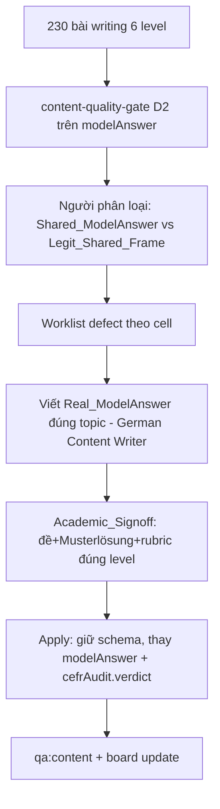

# Design Document

Vai chinh: German Content Writer
Vai phoi hop: German Academic Lead, German Curriculum Designer, Content QA / Linguistic Reviewer

## Overview

Audit + remediate module writing 6 level (230 bài). Defect đã xác nhận: writing/A1 Teil-1 dùng chung `modelAnswer`. Workstream con của `content-program-quality`, dùng chung cổng máy (D2 duplicate) + Status_Board + signoff-manifest. Phân biệt **Shared_ModelAnswer (defect)** vs **Legit_Shared_Frame (đề/khung dùng chung hợp lệ)** — máy gợi ý, người chốt.

Nguyên tắc: giữ schema, chỉ thay `modelAnswer` (+ field nội dung học); một cell = một đơn vị review; Academic_Signoff bắt buộc; READ-ONLY tới sign-off.

## Architecture



## Components and Interfaces

### Component 1: `content/{a1..c2}/writing/*.json` (target)
Giữ khung; thay `modelAnswer` (+ field nội dung học). Giữ `id`, `teil`, `instruction`, `formFields` (nhãn khung hợp lệ), `rubric`, `cefrAudit`, `learningOutcomes`.

### Component 2: Cổng D2 cho writing
Tái dùng `cellDuplicatePairs` (`content-quality-gate.ts`) trên field `modelAnswer` thay vì toàn item — để không nhầm Legit_Shared_Frame. Bổ sung trích riêng `modelAnswer` cho writing.

### Component 3: Apply script
`scripts/apply-writing-regen.ts` (mẫu theo apply-*): nhận id → {modelAnswer, ...}; `--dry-run`; validate độ dài min/max words, modelAnswer KHÔNG trùng bài khác cùng level (overlap < 0.5), topic-relevant; giữ schema; ghi no BOM.

### Component 4: Reference (không sửa)
`content-program-quality` (cổng + board), `cefr-audit-checklist.md`, `content-qa.ts`, `tests/content-audit/*`.

## Design Decisions

### Decision 1: So D2 trên `modelAnswer`, không trên toàn item
Đề bài/khung dùng chung hợp lệ → chỉ so Musterlösung để tránh false-positive.
**Validates: Req 1.1, Req 2.1, out-of-scope**

### Decision 2: Người phân loại Shared vs Legit
Máy gợi ý cặp trùng; người quyết defect (A1 form data giả dùng chung = defect).
**Validates: Req 1.3**

### Decision 3: Giữ schema, chỉ thay modelAnswer + cập nhật cefrAudit
**Validates: Req 3.2, Req 3.4**

## Data Models

```
230 bài writing = {a1:35,a2:35,b1:50,b2:40,c1:35,c2:35}
defect đã xác nhận: writing/A1 Teil-1 modelAnswer dùng chung (~10 bài)
giữ: schema, instruction, formFields, rubric, learningOutcomes
thay: modelAnswer (+ nội dung học) + cefrAudit.verdict
```

### Invariants
- Trong mỗi level, không cặp `modelAnswer` overlap ≥ 0.5 (trừ Legit_Shared_Frame xác nhận).
- modelAnswer mỗi bài phù hợp topic + đạt min/max words.
- qa:content exit 0; schema giữ.

## Correctness Properties

Property 1: No Shared ModelAnswer — _For any_ cặp bài writing cùng level, overlap `modelAnswer` chuẩn hoá SHALL < 0.5 (trừ Legit_Shared_Frame được đánh dấu).
**Validates: Requirements 1.1, 1.2**

Property 2: Scope Containment — _For any_ bài ngoài worklist, nội dung SHALL byte-identical; trong worklist chỉ `modelAnswer` (+cefrAudit.verdict) thay.
**Validates: Requirements 3.2**

Property 3: Length Fit — _For any_ Real_ModelAnswer, độ dài SHALL trong [minWords, maxWords] khai báo.
**Validates: Requirements 3.1**

## Error Handling

| Tình huống | Phát hiện | Xử lý |
| --- | --- | --- |
| modelAnswer vẫn trùng | Property 1 + scan | viết lại |
| Nhầm Legit_Shared_Frame là defect | người xác minh | loại khỏi worklist |
| modelAnswer sai độ dài | Property 3 | sửa |
| Đụng bài ngoài worklist | Property 2 + hash | revert |
| qa:content regress | gate | fix trước merge |

## Testing Strategy

### PBT
- Property 1: overlap modelAnswer < 0.5 mỗi level.
- Property 2: hash bài ngoài worklist byte-identical.
- Property 3: độ dài modelAnswer trong [min,max].

`tests/content-audit/writing-audit.spec.ts` cho Property 1–3.

### Test plan
| Test | Tool | Pass | Validates |
| --- | --- | --- | --- |
| No shared modelAnswer | scan/PBT | overlap < 0.5 | P1, Req1 |
| Scope | hash | ngoài worklist bất biến | P2, Req3 |
| Length fit | PBT | trong [min,max] | P3, Req3 |
| Content gate | qa:content | exit 0 | Req3 |
| Academic signoff | German Academic Lead | đề+Musterlösung đạt | Req4 |

### Manual
```bash
node_modules\.bin\tsx.cmd scripts\content-qa.ts
node_modules\.bin\tsx.cmd scripts\content-status-board.ts
```

## Rollout Plan

### Sequencing
1. Cổng D2 trên modelAnswer + apply-writing-regen + PBT.
2. Quét 230 bài → người phân loại → worklist.
3. Sửa theo cell (A1 trước): viết Real_ModelAnswer → Academic_Signoff → apply → qa:content → board update.
4. Cập nhật Status_Board + signoff-manifest.

### Ownership
German Content Writer viết; German Academic Lead sign-off; Content QA cổng+apply; PM theo dõi board.

### Rollback
Revert theo cell; chỉ field modelAnswer đổi → an toàn.
