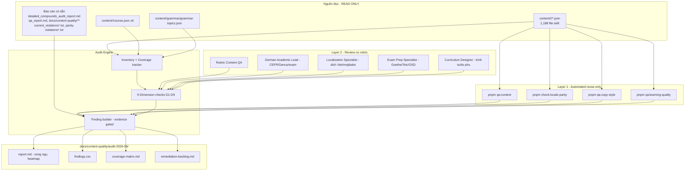

# Design Document

Vai chinh: Content QA / Linguistic Reviewer
Vai phoi hop: German Academic Lead, German Curriculum Designer, Vietnamese-German Localization Specialist, Exam Prep Specialist

## Overview

Spec `fuxie-content-quality-audit` là một đợt **kiểm duyệt CHỈ-AUDIT (read-only)** trên toàn bộ mảng nội dung học của Fuxie: 1,194 file JSON dưới `content/` (1,188 file skill + 6 `course.json`), trên 6 level CEFR × 6 kỹ năng, cộng `grammar-topics.json` mỗi level. Đợt này KHÔNG sửa nội dung — output là một bộ deliverable có cấu trúc (report + findings CSV + coverage matrix + remediation backlog) đặt dưới `docs/content-quality/audit-2026-06/`, làm input cho các spec remediation về sau.

Thiết kế xoay quanh ba nguyên tắc:

1. **Reuse-first (Layer 1 trước Layer 2).** Chạy nguyên trạng các gate QA đã có (`pnpm qa:content`, `pnpm check:locale-parity`, `pnpm qa:copy-style`, `pnpm qa:learning-quality`) và nhúng output, đối chiếu các báo cáo có sẵn, TRƯỚC khi review thủ công. Không phát minh gate mới, không sửa script.
2. **Evidence-gated findings.** Mỗi Finding phải có `file_path` + `item_id` + trích dẫn verbatim. Finding thiếu evidence không được publish.
3. **Read-only invariant.** Quy trình chỉ đọc `content/`; chỉ ghi vào `docs/content-quality/audit-2026-06/` và `tmp/`. Sau đợt audit, hash mọi file `content/` không đổi.

Đợt audit chia 9 chiều D1–D9 (chính tả/ngữ pháp Đức, CEFR fit, sư phạm, dịch Việt, song ngữ/đầy đủ trường, schema/toàn vẹn dữ liệu, audio/script, hợp lệ đề thi, độ phủ/cân bằng). Mỗi chiều có chiến lược quét riêng: High_Risk_Zone (đáp án, exam item, compound noun) quét 100%; các chiều review-sâu khác dùng Sampling_Method phân tầng theo `level × skill` có ghi rõ phương pháp.

## Architecture

Pipeline audit là một luồng đọc một chiều: `content/` + báo cáo có sẵn → engine audit (script tự động + review thủ công có rubric) → bộ deliverable. Không có nhánh nào ghi ngược vào `content/`.



Nguyên tắc kiến trúc:

- **Một chiều ghi.** Mọi mũi tên ghi đều trỏ vào `Out` (Audit_Output_Dir) hoặc `tmp/`. Không mũi tên nào trỏ ngược vào `Sources_ReadOnly`.
- **Layer 1 chạy trước Layer 2.** Output script là evidence cấp 0; review thủ công bổ sung evidence cấp 1, không lặp lại lớp lỗi đã được tự động phủ đầy đủ (Req 10.5).
- **Coverage tracker là sổ cái.** `INV` đếm 1,194 Content_Item và theo dõi ô nào quét 100% vs sampled, cấp dữ liệu cho `coverage-matrix.md` và heatmap.

## Components and Interfaces

### Component 1: Inventory & Coverage Tracker

Quét read-only toàn bộ `content/` để lập danh mục Content_Item và đếm theo `level × skill`. Baseline đo được tại thời điểm mở spec:

| Level | grammar | listening | reading | speaking | vocabulary | writing | course.json |
| --- | --- | --- | --- | --- | --- | --- | --- |
| a1 | 1 | 32 | 31 | 10 | 21 | 35 | 1 |
| a2 | 1 | 40 | 40 | 8 | 26 | 35 | 1 |
| b1 | 1 | 44 | 50 | 6 | 42 | 50 | 1 |
| b2 | 1 | 48 | 50 | 10 | 60 | 40 | 1 |
| c1 | 1 | 52 | 48 | 8 | 75 | 35 | 1 |
| c2 | 1 | 52 | 48 | 6 | 145 | 35 | 1 |

Tổng file: 1,188 skill + 6 course.json = **1,194** (khớp `(Get-ChildItem -Recurse content -Filter *.json).Count = 1194`).

Lưu ý: số Content_Item logic > số file vì file đa-item (vocabulary `words[]`, listening/reading `questions[]`) tách thành nhiều Content_Item. Tracker đếm cả hai cấp: file-level (cho coverage 100% file) và item-level (cho density lỗi).

Interface (read-only):

```
inventory(contentRoot) -> {
  files: Array<{ level, skill, file_path, itemCount }>,
  totalFiles: 1194,
  matrix: Record<level, Record<skill, { files, items }>>
}
```

### Component 2: Layer 1 Automated Runner

Chạy 4 script QA nguyên trạng, capture stdout/stderr + exit code, lưu vào `docs/content-quality/audit-2026-06/layer1/`. Không sửa script (Req 10.3).

| Script | Lệnh | Phủ chiều | Output capture |
| --- | --- | --- | --- |
| Content QA | `pnpm qa:content` | D6 (schema/integrity), một phần D1/D3 | `layer1/qa-content.log` |
| Locale parity | `pnpm check:locale-parity` | D5 (UI messages parity) | `layer1/locale-parity.log` |
| Copy style | `pnpm qa:copy-style` | D4 (mojibake, style) | `layer1/copy-style.log` |
| Learning quality | `pnpm qa:learning-quality` | D2/D3 (learning quality assets) | `layer1/learning-quality.log` |

Đối chiếu báo cáo có sẵn (không chạy lại, chỉ đọc): `detailed_compounds_audit_report.md` (D1 compound nouns), `qa_report.md` (D6), `current_violations*.txt` + `parity-violations*.txt` (D4/D5), `docs/content-quality/**` (CEFR/bilingual rubric).

### Component 3: Dimension Checks D1–D9

Mỗi chiều là một bộ kiểm độc lập đọc Content_Item + output Layer 1. Bảng dưới ánh xạ chiều → chiến lược quét → role sign-off:

| Dim | Tên | Chiến lược quét | High_Risk_Zone 100% | Role sign-off |
| --- | --- | --- | --- | --- |
| D1 | Chính tả & ngữ pháp Đức | Sampling + 100% đáp án/giải thích | Có (đáp án, giải thích DE) | German Academic Lead |
| D2 | CEFR fit | Sampling phân tầng | Không (mẫu) | German Academic Lead |
| D3 | Sư phạm (đáp án/distractor/giải thích) | 100% đáp án + sampling phần còn lại | Có (đáp án) | Curriculum Designer + Academic Lead |
| D4 | Dịch tiếng Việt | 100% mojibake (auto) + sampling chất lượng | Một phần (mojibake auto) | Localization Specialist |
| D5 | Song ngữ & đầy đủ trường | 100% required-field check | Có (required fields) | Content QA |
| D6 | Schema & toàn vẹn dữ liệu | 100% structural | Có (enum, index, id, refs) | Content QA |
| D7 | Audio/script | 100% audio_file existence + sampling transcript | Có (audio_file tồn tại) | Academic Lead |
| D8 | Hợp lệ đề thi | 100% exam-style item | Có (exam item) | Exam Prep Specialist |
| D9 | Độ phủ & cân bằng | Tổng hợp toàn universe | Có (toàn bộ inventory) | Curriculum Designer |

Interface mỗi check (thuần đọc):

```
checkDimension(item, layer1Output, refs) -> Finding[]
// Finding[] rỗng nếu item sạch ở chiều đó
```

### Component 4: Finding Builder (evidence-gated)

Nhận finding thô từ các dimension check, validate evidence gate, gán `finding_id` tuần tự, và từ chối finding thiếu evidence (Req 11.2).

Finding shape:

```json
{
  "finding_id": "F-0001",
  "level": "a1",
  "skill": "vocabulary",
  "file_path": "content/a1/vocabulary/01-person.json",
  "item_id": "words[3].Adresse",
  "dimension": "D1",
  "severity": "P0",
  "evidence": "article=\"MASKULIN\" cho danh tu \"Adresse\" (dung: FEMININ - die Adresse)",
  "recommended_fix": "Doi article: MASKULIN -> FEMININ (KHONG ap dung trong dot nay)"
}
```

Evidence gate (reject nếu vi phạm):

- `file_path` không rỗng và tồn tại trong inventory.
- `item_id` xác định (hoặc `-` cho finding cấp file).
- `evidence` chứa trích dẫn verbatim từ nội dung thật hoặc dòng output script.
- `severity ∈ {P0, P1, P2}` theo `docs/intake/risk-register.md`.
- `dimension ∈ {D1..D9}`.

### Component 5: Deliverable Writer

Ghi 4 deliverable vào Audit_Output_Dir. Đây là các mũi tên ghi duy nhất ngoài `tmp/`.

| File | Nội dung | Validates |
| --- | --- | --- |
| `report.md` | Tóm tắt điều hành song ngữ (VI chính) + heatmap mật độ lỗi `level × skill` + next step | Req 11.3, 11.4, 13.6 |
| `findings.csv` | Một dòng/Finding, header đúng thứ tự trường, UTF-8, CSV hợp lệ | Req 11.3, 11.5 |
| `coverage-matrix.md` | Ma trận `level × skill` số item + số lỗi, đánh dấu ô sampled | Req 9, 11.3, 13.4 |
| `remediation-backlog.md` | Nhóm Finding theo candidate fix-spec, ưu tiên severity | Req 11.6, 13.4 |

## Data Models

### Content schema (đọc, không sửa) — ghi nhận drift

Spec ghi nhận (không sửa) sự không đồng nhất schema giữa các skill. Đây là dữ kiện audit cho D6.6.

**Vocabulary (camelCase):**

```json
{
  "theme": { "slug", "name", "nameVi", "nameEn", "sortOrder", "imageUrl" },
  "words": [
    { "word", "article": "MASKULIN|FEMININ|NEUTRUM", "plural",
      "wordType": "NOMEN|VERB|...", "meaningVi", "meaningEn", "meaningDe",
      "exampleSentence1", "exampleTranslation1", "exampleSentence2", "exampleTranslation2", "imageUrl" }
  ]
}
```

**Reading (snake_case):**

```json
{
  "id", "level", "teil", "teil_name", "topic", "topic_id",
  "metadata": { "word_count_text_a", "target_grammar": [], "target_vocabulary": [], "version" },
  "texts": [ { "id", "type", "content" } ],
  "images": [ { "id", "filename", "alt_text" } ],
  "questions": [ { "id", "type", "answer" } ]
}
```

**Listening (snake_case):**

```json
{
  "id", "level", "teil", "teil_name", "task_type", "topic",
  "audio_file": "/audio/listening/...mp3",
  "metadata": { "source_script", "version", "gespraech_count" },
  "questions": [
    { "id", "gespraech", "type": "mc_abc|richtig_falsch|...",
      "question", "options": { "a","b","c" }, "answer", "points",
      "explanation": { "de", "vi", "key_evidence", "key_vocabulary": [] } }
  ]
}
```

**Speaking (field drift, ghi nhận cho D5.5):** A1 dùng `textDe`/`textVi`/`pronunciationNotes`; A2+ dùng `german`/`vietnamese`/`pronunciationTips` (xem `CHANGELOG.md`).

### Finding model

Xem Component 4. Tập trường khớp Req 11.1: `finding_id, level, skill, file_path, item_id, dimension, severity, evidence, recommended_fix`.

### Severity model (theo `docs/intake/risk-register.md`)

| Severity | Định nghĩa | Ví dụ chiều |
| --- | --- | --- |
| P0 | Hại người học / sai đáp án / sai tiếng Đức | D1 Genus sai, D3 đáp án sai, D7 transcript lệch đổi đáp án |
| P1 | Lệch CEFR / dịch sai / thiếu field bắt buộc | D2 vượt level, D4 dịch sai nghĩa, D5 thiếu field, D6 enum sai/orphan |
| P2 | Polish, không chặn baseline | D3 distractor yếu, D4 dịch gượng, D6 schema drift, D9 mất cân đối |

### Coverage matrix model

```
matrix[level][skill] = {
  files: number,          // số file trong ô
  itemsAudited: number,   // số Content_Item đã audit
  findings: number,       // tổng finding trong ô (cho heatmap)
  mode: "full" | "sampled",
  sampleRatio?: number    // nếu mode = sampled
}
```

## Correctness Properties

*A property is a characteristic or behavior that should hold true across all valid executions of a system — essentially, a formal statement about what the system should do.*

Đợt audit này chủ yếu là quá trình review tạo deliverable tài liệu, nhưng có một số bất biến (invariant) máy-kiểm-được trên pipeline và output. Các property dưới là universal và đáng property-based test ở mức tooling kiểm tra deliverable; các tiêu chí review nội dung còn lại là EXAMPLE/SMOKE (xem Testing Strategy → PBT applicability).

Property 1: Read-Only Invariant — `content/` không đổi sau audit

_For any_ file `f` dưới `content/`, hash nội dung của `f` sau khi đợt audit chạy SHALL bằng hash trước khi audit bắt đầu. Tập file dưới `content/` (đường dẫn) cũng SHALL không đổi (không thêm/xóa/di chuyển). Mọi file được tạo bởi spec SHALL nằm dưới `docs/content-quality/audit-2026-06/` hoặc `tmp/`.

**Validates: Requirements 12.1, 12.2, 12.3, 12.4**

Property 2: Coverage Completeness — mọi Content_Item được kế toán

_For any_ trong 1,194 file của Audit_Universe, file đó SHALL xuất hiện đúng một lần trong `coverage-matrix.md` dưới ô `level × skill` đúng của nó, và tổng số file qua mọi ô SHALL bằng 1,194. Mọi ô dùng Sampling_Method SHALL được đánh dấu `sampled` kèm `sampleRatio`.

**Validates: Requirements 9.1, 9.4, 9.5, 13.1, 13.4**

Property 3: Finding Evidence Gate — mọi finding published đều đầy đủ

_For any_ Finding xuất hiện trong `findings.csv`, Finding đó SHALL có `file_path` khác rỗng trỏ tới file tồn tại trong inventory, `item_id` xác định (hoặc `-`), `evidence` khác rỗng chứa trích dẫn cụ thể, `severity ∈ {P0,P1,P2}`, `dimension ∈ {D1..D9}`, và `recommended_fix` khác rỗng. Không Finding nào thiếu bất kỳ trường nào trong tập bắt buộc.

**Validates: Requirements 11.1, 11.2, 13.2**

Property 4: Severity Consistency — severity hợp lệ và nhất quán mọi deliverable

_For any_ `finding_id` xuất hiện ở nhiều deliverable (`findings.csv`, `remediation-backlog.md`, heatmap trong `report.md`), giá trị `severity` của nó SHALL giống nhau qua mọi deliverable và SHALL thuộc tập `{P0,P1,P2}` đúng định nghĩa `docs/intake/risk-register.md`.

**Validates: Requirements 11.6, 11.7, 13.4**

## Error Handling

| Tình huống lỗi | Phát hiện | Xử lý |
| --- | --- | --- |
| Script Layer 1 fail (exit non-zero) | Exit code khi chạy `pnpm qa:*` | Ghi output fail nguyên trạng làm evidence; KHÔNG sửa script (Req 10.3); tiếp tục Layer 2 |
| File JSON parse lỗi | JSON.parse throw khi inventory | Ghi Finding D6 `severity=P1` (file không parse được) với evidence là lỗi parser; không dừng toàn bộ run |
| `audio_file` không tồn tại | `fs.existsSync` read-only stat | Ghi Finding D6.5/D7.2 `severity=P1`; không tạo file thay thế |
| Borderline CEFR / Genus không chắc | Auditor đánh dấu uncertain | Đánh dấu cần Academic Lead sign-off; gán severity thận trọng (nghi sai đáp án → P0) |
| Mojibake trong output CSV | CSV writer encoding check | Ghi UTF-8 BOM-less, escape đúng; verify không mojibake trước publish (Req 11.5) |
| Vô tình ghi vào `content/` | Pre/post hash so sánh (Property 1) | Coi là vi phạm scope; revert file ngay; fail đợt audit (Req 12.3) |
| Finding thiếu evidence | Evidence gate ở Finding Builder | Reject finding, không publish; yêu cầu auditor bổ sung evidence (Req 11.2) |
| Trùng `finding_id` | Builder gán tuần tự + check uniqueness | Re-sequence; đảm bảo id duy nhất |

## Testing Strategy

### PBT applicability assessment

Đợt audit chủ yếu là review nội dung sinh tài liệu, nhưng **tooling kiểm tra deliverable** có invariant universal đáng PBT:

- **Property 1 (Read-only):** PROPERTY — hash content/ trước-sau, universal trên mọi file. Cao giá trị, dễ test.
- **Property 2 (Coverage completeness):** PROPERTY — tổng file = 1,194, mọi file đúng một ô. Universal.
- **Property 3 (Evidence gate):** PROPERTY — mọi dòng `findings.csv` đủ trường. Universal trên tập finding.
- **Property 4 (Severity consistency):** PROPERTY — cross-deliverable nhất quán. Universal trên tập finding.

Các tiêu chí review nội dung (D1–D9 trên item cụ thể) là **EXAMPLE** (một item, một lỗi cụ thể) hoặc **SMOKE** (chạy script một lần) — không universal, không cost-effective ở PBT. Quyết định: PBT chỉ áp cho 4 property pipeline/deliverable ở trên; review nội dung dùng rubric + spot-check.

### Test plan

| Test type | Tool | Scope | Pass criteria | Validates |
| --- | --- | --- | --- | --- |
| Read-only invariant (PBT) | vitest + fast-check (hash diff) | Toàn bộ `content/` trước-sau run | Hash set bằng nhau; không file thêm/xóa | Property 1, Req 12 |
| Coverage completeness (PBT) | vitest + fast-check | `coverage-matrix.md` vs inventory | Σ files = 1194; mọi file đúng một ô | Property 2, Req 9, 13.1 |
| Evidence gate (PBT) | vitest + fast-check | Mọi dòng `findings.csv` | Mọi finding đủ 9 trường, evidence khác rỗng | Property 3, Req 11.2 |
| Severity consistency (PBT) | vitest + fast-check | Cross-deliverable | severity nhất quán + ∈ {P0,P1,P2} | Property 4, Req 11.7 |
| Layer 1 smoke | shell | `pnpm qa:content`, `check:locale-parity`, `qa:copy-style`, `qa:learning-quality` | Chạy được, output captured (pass/fail đều ghi nhận) | Req 10.1, 10.3, 13.3 |
| CSV validity | csv parser | `findings.csv` | Parse được, UTF-8, không mojibake, header đúng | Req 11.5 |
| Dimension spot-check | Rubric review | Mẫu mỗi `skill × level` + 100% High_Risk_Zone | Mỗi finding có evidence verbatim; sign-off role đúng | Req 1–9 |
| Exam validity review | Exam Prep rubric | 100% exam-style item | Cấu trúc Teil/rubric đối chiếu spec thi | Req 8 |

### Layer 1 commands (chạy từ workspace root, read-only)

```bash
pnpm qa:content
pnpm check:locale-parity
pnpm qa:copy-style
pnpm qa:learning-quality
```

Output mỗi lệnh lưu vào `docs/content-quality/audit-2026-06/layer1/`. Nếu lệnh fail, output fail vẫn được nhúng làm evidence (không sửa script).

### Why limited new property tests

Bốn property mới đều ở layer **tooling kiểm deliverable**, không phải logic nội dung. Theo Test Type Classification: các check nội dung D1–D9 trên item cụ thể là EXAMPLE/SMOKE (review thủ công + script một lần), trong khi 4 invariant pipeline (read-only, coverage, evidence gate, severity consistency) là universal và máy-kiểm-được — nên chỉ 4 cái này được encode thành PBT. Không thêm property cho từng chiều nội dung vì sẽ là example check, không cost-effective.

## Rollout Plan

### Ownership matrix

| Stream | Owner (vai) | Deliverable |
| --- | --- | --- |
| Pipeline + Layer 1 run + deliverable writer | Content QA / Linguistic Reviewer (chính) | Inventory, chạy 4 script, build findings.csv, report.md, coverage-matrix.md, remediation-backlog.md |
| CEFR / Genus / exam-language sign-off | German Academic Lead | Sign-off D1 borderline, D2 level fit, D7 pronunciation |
| Trình tự module / độ phủ | German Curriculum Designer | D3 sequencing, D9 coverage gaps |
| Dịch Việt / mojibake / thuật ngữ | Vietnamese-German Localization Specialist | D4 findings, đối chiếu bilingual-style-guide |
| Định dạng Goethe/Telc/ÖSD | Exam Prep Specialist | D8 exam validity sign-off |

### Sequencing

1. Content QA lập inventory + chạy Layer 1, lưu output thô vào `audit-2026-06/layer1/`.
2. Mỗi role chạy Layer 2 review trên chiều của mình (mẫu + 100% High_Risk_Zone), nộp findings thô có evidence.
3. Content QA hợp nhất, qua evidence gate, gán `finding_id`, build 4 deliverable.
4. Chạy 4 PBT tooling test (read-only, coverage, evidence gate, severity consistency) để verify deliverable + xác nhận `content/` không đổi.
5. `report.md` kết thúc bằng đề xuất bước kế tiếp: chọn nhóm P0 đầu tiên trong `remediation-backlog.md` làm spec remediation đầu tiên.

### Read-only safeguard

- Trước khi bắt đầu: snapshot hash mọi file `content/` (ví dụ `Get-FileHash`).
- Sau khi kết thúc: so hash; bất kỳ khác biệt nào là vi phạm scope → revert + fail audit (Req 12.3, Property 1).
- File ghi hợp lệ duy nhất: dưới `docs/content-quality/audit-2026-06/` và `tmp/`.

### Rollback

Đợt audit read-only không cần rollback nội dung. Nếu cần hủy đợt audit, chỉ việc xóa thư mục `docs/content-quality/audit-2026-06/`; `content/` không bị động chạm nên không có hệ quả lan ra.
