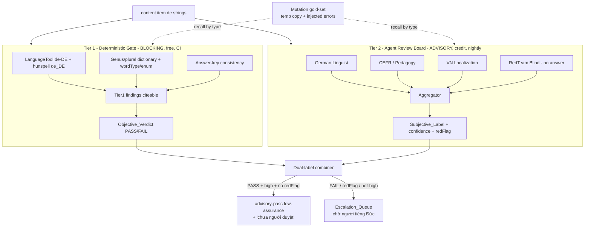

# Design Document

Vai chinh: AI / LLM Engineer
Vai phoi hop: German Academic Lead, Content QA / Linguistic Reviewer, QA Automation Engineer, DevOps / Cloud Engineer

## Overview

`fuxie-content-review-board` là **cổng QA nội dung 2 tầng**, vừa là **gate thường trực** cho nội dung học tiếng Đức mới/sửa, vừa **chạy 1 lượt** để de-risk 1.282 reading explanation AI-sinh (PR #21).

Nguyên lý cốt lõi (xuất phát từ 2 quyết định owner): khi **chưa có người rành tiếng Đức**, hệ thống chỉ được phép **tự gán nhãn khách quan** (deterministic, có thẩm quyền) và **gán nhãn chủ quan ở mức advisory** (AI gợi ý, kèm câu "chưa người duyệt"). Mọi thứ không chắc chắn → **escalate** cho người, không tự "approved".

Hai tầng tách bạch hoàn toàn:

| Tầng | Bản chất | Blocking? | Chi phí | Thẩm quyền |
| --- | --- | --- | --- | --- |
| **Tier 1** Deterministic German Gate | LanguageTool + hunspell + dictionary + enum + answer-key | **CÓ** (chặn PR) | Miễn phí, local | **Có thẩm quyền** (objective) |
| **Tier 2** Agent Review Board | 4 reviewer agent + red-team + aggregator | KHÔNG (advisory) | Tốn credit | **Tư vấn** (subjective, chờ người) |

Bổ trợ: **Mutation gold-set calibration** đo recall để biết tầng dò nào đáng tin; **nhãn trung thực** đảm bảo không ai nhầm advisory là chứng nhận.

## Architecture



Luồng gate thường trực (PR): content thay đổi → **Tier 1** chạy trong `check-quick` → có `error` thì **chặn**. Tier 2 chạy nightly/on-demand, không chặn PR, đẩy escalation queue cho người.

Luồng one-shot: 1.282 reading explanation → Tier 1 (objective) + Tier 2 (advisory) → CSV per-item + escalation queue tại `review-board/`, READ-ONLY content.

## Components and Interfaces

### Component 1: Tier-1 German Lint — `scripts/content-german-lint.ts` (npm `qa:german-lint`)

Deterministic, local, blocking. Reuse-first: gọi enum nguồn chung, KHÔNG lặp `content-qa.ts`.

```ts
interface Tier1Finding {
  file: string            // content/<level>/<skill>/<name>.json
  jsonPath: string        // vd questions[3].explanation.de
  rule: string            // languagetool:DE_AGREEMENT | hunspell:unknown | genus:mismatch | enum:wordType | answerkey:mismatch
  severity: 'error' | 'warning'
  message: string
  offset?: { start: number; end: number; excerpt: string }   // citeable
  suggestion?: string
}

interface Tier1Result {
  scope: { files: number; deStrings: number }
  findings: Tier1Finding[]
  objectiveVerdict: 'PASS' | 'FAIL'        // FAIL nếu có severity=error
  infraError?: string                       // LanguageTool unavailable -> KHÔNG PASS giả
}

// CLI: --diff (diff-scoped) | --skill reading | --level a1 | --json | --report-path
```

Kiểm:
- **LanguageTool de-DE** (server local/Docker, `http://localhost:8081/v2/check`) + **hunspell de_DE** trên mọi Content_String_De.
- **Genus/plural dictionary**: validate quán từ der/die/das + số nhiều theo từ điển noun (nguồn: từ điển đóng gói; fallback cảnh báo nếu từ ngoài từ điển).
- **wordType/enum**: tái dùng enum chung (`@fuxie/shared` `WORD_TYPES`, article enum) — gọi, không sao chép.
- **Answer-key consistency**: `correctIndex`/`answer` trỏ option hợp lệ; `key_evidence` xuất hiện trong text nguồn; `explanation` không khẳng định đáp án khác.

Nguyên tắc hạ tầng (DevOps): nếu LanguageTool không chạy → `infraError`, exit code phân biệt (vd 2), KHÔNG báo PASS (Req 1.9).

### Component 2: Tier-2 Board — mở rộng `ai-eval-harness`

Tái dùng `scripts/ai-eval-harness.ts` + `apps/ai-service/src/lib/eval-harness.ts` + `scripts/ai-eval-provider-runner.ts`. Thêm một "surface" review-board với 4 reviewer.

```ts
type ReviewerId = 'german_linguist' | 'cefr_pedagogy' | 'vn_localization' | 'redteam_blind'

interface ReviewerOutput {
  reviewer: ReviewerId
  dimension: 'German' | 'pedagogy' | 'CEFR' | 'VN' | 'answer'
  verdict: 'ok' | 'concern' | 'fail'
  severity: 'P0' | 'P1' | 'P2' | 'none'
  rationale: string
  evidence: string                 // dẫn field/đoạn cụ thể
}

interface RedTeamOutput {
  reviewer: 'redteam_blind'
  predictedAnswer: string
  confidence: 'high' | 'medium' | 'low'
  rationale: string
}

interface AggregateResult {
  itemId: string
  consensus: 'ok' | 'concern' | 'fail'
  confidence: 'high' | 'medium' | 'low'   // hàm của đồng thuận + reviewer confidence
  perDimension: ReviewerOutput[]
  redFlag: boolean                          // predictedAnswer != stored answer
  estimatedCostUsd: number
}
```

- **4 reviewer context độc lập, model khác model sinh nội dung** (Req 2.2): mỗi reviewer là một case/prompt riêng, không chia sẻ state; cấu hình model qua provider-runner.
- **Rubric** dẫn từ `.agents/personnel/` + `cefr-audit-checklist.md` + `bilingual-style-guide.md` (Req 2.5) → đóng gói thành prompt template versioned.
- **Structured output** schema cố định + JSON-schema validate (Req 2.4) — đúng phong cách harness eval hiện có.
- **On-demand/nightly + batch/level** (Req 2.7, 7.3): CLI `--level`, `--batch-size`, `--dry-run` (đếm cost trước khi gọi provider).

### Component 3: Red-team blind payload builder

```ts
// chỉ chọn field an toàn -> đảm bảo KHÔNG rò đáp án (Req 3.1, 3.5)
function buildRedTeamPayload(q: ReadingQuestion): { stem: string; options?: string[] } {
  return { stem: q.statement ?? q.stem ?? q.situation, options: q.options }
  // KHÔNG copy answer/correctIndex/explanation/key_evidence
}
```

Test bắt buộc: assert payload red-team không chứa khoá `answer|correctIndex|solution|explanation|key_evidence` (Req 3.5).

### Component 4: Aggregator + Dual-label combiner

```ts
function combineLabels(t1: Tier1Result, agg: AggregateResult): ItemLabel {
  const objective = t1.objectiveVerdict                  // PASS|FAIL (authoritative)
  const subjective = {
    kind: 'AI-ADVISORY' as const,
    confidence: agg.confidence,
    notReviewedNote: 'Chưa được người rành tiếng Đức duyệt.',  // BẮT BUỘC (Req 5.2)
  }
  const advisoryPass =
    objective === 'PASS' && agg.confidence === 'high' && !agg.redFlag   // (Req 5.4)
  const status = advisoryPass ? 'advisory-pass (low-assurance)' : 'escalate'
  return { objective, subjective, redFlag: agg.redFlag, status }
}
```

KHÔNG có nhánh nào sinh ra chữ "approved" (Req 5.3). `advisory-pass (low-assurance)` vẫn mang `notReviewedNote`.

### Component 5: Mutation gold-set calibration — `scripts/content-review-board-calibrate.ts`

```ts
type MutationType = 'genus' | 'umlaut_drop' | 'wrong_answer' | 'level_violation' | 'bad_translation'

interface MutationCase { itemId: string; type: MutationType; original: unknown; mutated: unknown }
interface RecallReport {
  byType: Record<MutationType, { injected: number; caught: number; recall: number; caughtBy: 'tier1' | 'tier2' | 'both' }>
  note: string   // ghi rõ loại nào recall thấp -> chưa đáng tin
}
```

- Copy N item ra **thư mục tạm** (`tmp/review-board-calibration/`), cấy lỗi, chạy board lên bản cấy (Req 4.1–4.3).
- Tính recall theo loại + phân định Tier-1 (deterministic) vs Tier-2 (advisory) bắt (Req 4.6).
- Xoá bản tạm; assert `content/` byte-identical (Req 4.5).

### Component 6: One-shot runner — `scripts/content-review-board-run.ts`

- Chạy Tier-1 + Tier-2 trên 1.282 reading explanation; READ-ONLY content (Req 6.4).
- Sinh `review-board/per-item.csv`, `review-board/escalation-queue.csv`, `review-board/recall-report.md`, `review-board/README.md` (Req 6.1–6.3).
- Tái dùng `item_id`/traceability của `explanation-review/` (Req 6.5).

### Component 7: CI wiring — `.github/workflows/ci.yml`

Thêm bước Tier-1 vào job `check-quick` (block-on-error), sau `check:locale-parity`:

```yaml
      - name: Run German language gate (Tier-1, blocking)
        run: pnpm qa:german-lint --diff
```

Tier-2 KHÔNG vào gate PR (nightly/on-demand riêng) để tránh tốn credit + tránh non-determinism trong gate (Req 2.7, 7.5).

### Component 8: Reference (không sửa)

| Nguồn | Vai trò |
| --- | --- |
| `scripts/content-qa.ts` | Gate structural sẵn có — gọi/tham chiếu, KHÔNG lặp (Req 1.8, 7.2) |
| `scripts/ai-eval-harness.ts`, `apps/ai-service/src/lib/eval-harness.ts` | Harness nền Tier-2 (Req 2.6, 7.1) |
| `.agents/personnel/*` | Nguồn rubric reviewer (Req 2.5) |
| `docs/content-quality/cefr-audit-checklist.md`, `bilingual-style-guide.md` | Chuẩn pedagogy + dịch |
| `docs/content-quality/audit-2026-06/explanation-review/` | Traceability + sample tái dùng (Req 6.5) |

## Design Decisions

### Decision 1: Tách cứng Tier-1 (blocking, deterministic) vs Tier-2 (advisory, provider)

Chỉ Tier-1 được chặn PR vì nó deterministic + citeable + miễn phí. Tier-2 là LLM → non-deterministic + tốn credit → chỉ advisory/nightly. Justification: tránh gate PR bấp bênh/đắt; giữ thẩm quyền chặn ở lớp khách quan.

**Validates: Req 1.5, 1.7, 2.7, 5.1, 7.5**

### Decision 2: Red-team mù đáp án như tín hiệu objective-hoá

Red-team tự giải không thấy đáp án → lệch đáp án là tín hiệu mạnh, gần khách quan, không phụ thuộc "review chủ quan". Justification: phát hiện "dạy sai đáp án" (P0) mà không cần người tiếng Đức; bù cho việc Tier-2 còn lại là chủ quan.

**Validates: Req 3.1, 3.3, 3.4**

### Decision 3: Không bao giờ hợp nhất nhãn thành "approved"

Hai nhãn luôn tách: Objective (có thẩm quyền) + Subjective (advisory + "chưa người duyệt"). Justification: ràng buộc owner #2 — chưa có người duyệt thì không được tự chứng nhận chất lượng chủ quan.

**Validates: Req 5.1, 5.2, 5.3, 5.4**

### Decision 4: Mutation gold-set để định lượng độ tin, không tự khen

Đo recall trên lỗi cấy → biết tầng dò nào yếu, ghi thẳng "chưa đáng tin". Justification: không có người duyệt thì cần bằng chứng định lượng thay cho niềm tin; minh bạch điểm yếu.

**Validates: Req 4.3, 4.4, 4.6**

### Decision 5: Reuse-first, READ-ONLY content, cost-aware

Mở rộng harness eval + gọi enum/gate sẵn có; mutation chỉ trên bản tạm; provider chạy theo batch + đếm cost. Justification: bền vững vận hành, an toàn content, kiểm soát credit (vai DevOps + AI cost control).

**Validates: Req 2.6, 4.1, 4.5, 6.4, 7.1, 7.2, 7.3, 7.6**

## Data Models

### Phân loại nhãn cuối mỗi item

```
ItemLabel = {
  objective:  PASS | FAIL                      // Tier-1, authoritative
  subjective: { kind: AI-ADVISORY, confidence: high|medium|low, notReviewedNote }
  redFlag:    boolean                          // red-team lệch đáp án
  status:     'advisory-pass (low-assurance)' | 'escalate'
}
```

Quy tắc status:
- `advisory-pass (low-assurance)` ⟺ objective=PASS ∧ confidence=high ∧ redFlag=false.
- ngược lại ⟹ `escalate` (vào Escalation_Queue).

### One-shot scope

```
reading explanation (answer-bearing) = 1.282 (a1=150, a2=200, b1=250, b2=250, c1=168, c2=264)
deliverable dir = docs/content-quality/audit-2026-06/review-board/
  per-item.csv, escalation-queue.csv, recall-report.md, README.md
```

### Invariants

- `content/` byte-identical trước/sau one-shot + calibration (Req 4.5, 6.4).
- Không output nào chứa chuỗi "approved" cho chất lượng chủ quan (Req 5.3).
- Mọi Subjective_Label chứa `notReviewedNote` (Req 5.2).
- Payload red-team không chứa field đáp án/explanation (Req 3.5).

## Correctness Properties

*A property is a characteristic or behavior that should hold true across all valid executions of a system.*

Property 1: Blocking On Objective Error — lỗi khách quan luôn chặn

_For any_ tập file đầu vào, NẾU Tier1Result.findings chứa ≥ 1 phần tử `severity=error`, THÌ `objectiveVerdict = FAIL` và process exit code ≠ 0.

**Validates: Requirements 1.5, 7.5**

Property 2: Red-team Answer Isolation — đáp án không rò sang red-team

_For any_ reading question, payload dựng cho RedTeam_Blind SHALL KHÔNG chứa khoá `answer`, `correctIndex`, `solution`, `explanation`, hay `key_evidence`.

**Validates: Requirements 3.1, 3.5**

Property 3: No Conflated Approval — không có nhãn "approved" gộp

_For any_ ItemLabel/batch output, SHALL tồn tại hai trường tách biệt `objective` và `subjective`; `subjective` SHALL chứa `notReviewedNote`; và toàn bộ output SHALL KHÔNG chứa token "approved" cho chất lượng chủ quan.

**Validates: Requirements 5.1, 5.2, 5.3**

Property 4: Escalation Completeness — mọi rủi ro đều escalate

_For any_ item có `objective=FAIL` ∨ `redFlag=true` ∨ `confidence != high`, item đó SHALL có `status='escalate'` và xuất hiện trong Escalation_Queue.

**Validates: Requirements 5.5, 6.2**

Property 5: Content Read-Only — content bất biến

_For any_ lần chạy calibration hoặc one-shot, mọi file dưới `content/` SHALL byte-identical trước/sau; mutation chỉ tồn tại trong thư mục tạm và bị xoá sau đo.

**Validates: Requirements 4.1, 4.5, 6.4**

## Error Handling

| Tình huống | Phát hiện | Xử lý |
| --- | --- | --- |
| LanguageTool server không chạy | health-check trước scan | `infraError`, exit code riêng (≠ PASS giả) (Req 1.9) |
| Từ ngoài từ điển Genus/plural | dictionary miss | `severity=warning` (không chặn), liệt kê để bổ sung từ điển |
| Provider rate-limit/credit hết | provider-runner status | dừng batch, ghi cost đã dùng, resume theo level (Req 7.3) |
| Red-team rò đáp án | Property 2 test | fail test, sửa payload builder (Req 3.5) |
| Output lỡ in "approved" | Property 3 test + grep | fail test, sửa combiner (Req 5.3) |
| Calibration ghi nhầm content thật | Property 5 hash check | abort, revert, mutation chỉ bản tạm (Req 4.5) |
| Tier-2 non-deterministic làm gate flaky | Tier-2 ngoài gate PR | chỉ nightly/on-demand (Req 2.7, 7.5) |
| Recall một loại lỗi thấp | recall-report | ghi "chưa đáng tin" loại đó, ưu tiên escalate (Req 4.4) |

## Testing Strategy

### PBT applicability assessment

5 property đều universal, kiểm tự động được trong `tests/content-audit/` (chạy cùng `test:property`):

- **Property 1 (Blocking):** universal trên Tier1Result — fast-check sinh tập findings, assert verdict/exit. Cao giá trị (an toàn gate).
- **Property 2 (Red-team isolation):** universal trên mọi question — assert payload không chứa key đáp án. Bảo vệ rủi ro lớn nhất của red-team.
- **Property 3 (No conflated approval):** universal trên output — assert cấu trúc 2 nhãn + không token "approved".
- **Property 4 (Escalation completeness):** universal — sinh ItemLabel ngẫu nhiên, assert điều kiện escalate.
- **Property 5 (Content read-only):** hash content trước/sau run.

### Test plan

| Test | Tool | Scope | Pass criteria | Validates |
| --- | --- | --- | --- | --- |
| Blocking on error | PBT | Tier1Result | error ⇒ FAIL + exit≠0 | Property 1, Req 1.5 |
| Red-team isolation | PBT | mọi question | payload không có key đáp án | Property 2, Req 3.5 |
| No conflated approval | PBT + grep | output/CSV | 2 nhãn + no "approved" | Property 3, Req 5.3 |
| Escalation completeness | PBT | ItemLabel | rủi ro ⇒ escalate | Property 4, Req 5.5 |
| Content read-only | hash diff | content/** | byte-identical | Property 5, Req 4.5, 6.4 |
| Tier-1 catches injected | calibration | mutation gold-set | recall theo loại (báo cáo) | Req 4.3, 4.4 |
| Tier-1 local run | `qa:german-lint` | content thay đổi | chạy không cần credit | Req 1.1, 7.6 |
| Tier-2 structured output | schema validate | reviewer output | đúng JSON-schema | Req 2.4 |
| Cost accounting | dry-run | Tier-2 batch | in cost ước tính trước gọi | Req 7.3, 7.6 |

### Manual verification commands

```bash
# Tier-1 (local, free, blocking)
pnpm qa:german-lint --skill reading --json
# Calibration recall
node_modules/.bin/tsx scripts/content-review-board-calibrate.ts --n 40
# One-shot dry-run cost trước khi gọi provider
node_modules/.bin/tsx scripts/content-review-board-run.ts --level a1 --dry-run
# PBT
node_modules/.bin/vitest run --config vitest.property.config.ts tests/content-audit
# content bất biến
git status --short -- content/    # rỗng
```

## Rollout Plan

### Ownership matrix

| Stream | Owner | Deliverable |
| --- | --- | --- |
| Tier-1 lint + dictionary + CI wiring | QA Automation Engineer + DevOps | `content-german-lint.ts`, `qa:german-lint`, ci.yml |
| Tier-2 reviewer prompts + harness mở rộng | AI / LLM Engineer | 4 reviewer + aggregator + cost note |
| Rubric reviewer (chuyên môn) | German Academic Lead + Localization | rubric dẫn từ personnel + checklist |
| Calibration + recall | AI / LLM Engineer | mutation script + recall-report |
| One-shot 1.282 + escalation queue | AI / LLM Engineer + Content QA | review-board/ deliverable |

### Sequencing

1. Tier-1 (local, blocking) + PBT + CI wiring → có cổng khách quan chạy ngay, miễn phí.
2. Calibration gold-set → đo recall, biết Tier-1 mạnh/yếu ở đâu trước khi tin.
3. Tier-2 board (4 reviewer + red-team + aggregator) + dual-label + cost note.
4. One-shot 1.282 → CSV + escalation queue → owner de-risk PR #21 ở mức advisory; mở hàng đợi cho người tiếng Đức.

### Rollback

- Tier-1 CI step có thể tắt bằng cách gỡ bước `qa:german-lint` (không ảnh hưởng job khác).
- Tier-2/one-shot chỉ sinh deliverable docs + đọc content → rollback = xoá thư mục `review-board/`; content không bị động tới.
