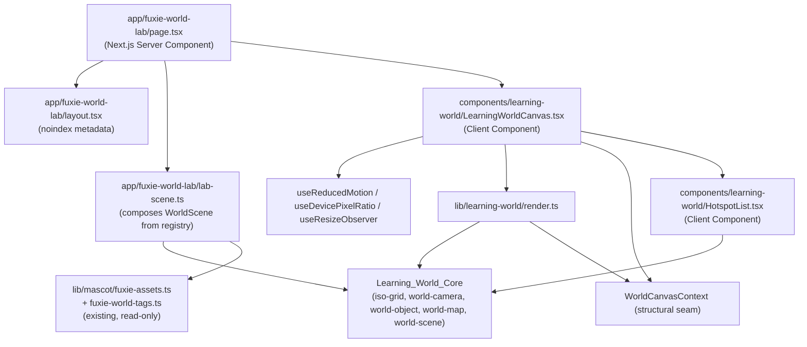
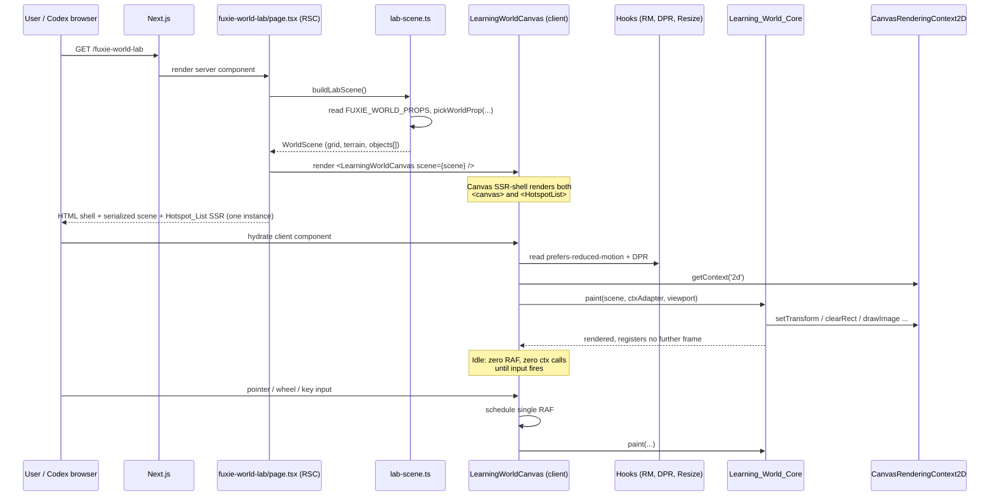

# Design Document — Fuxie Learning World Lab V0

> **Operating model**
> - Vai chinh: CTO / Tech Lead
> - Vai phoi hop: Frontend Engineer, QA Automation Engineer
>
> Source of truth: `requirements.md` in this folder (Requirements 1–16). Each subsection in this design references the numbered requirement(s) it implements.

---

## Overview

V0 of the Fuxie Learning World Lab is an internal proof slice. It introduces a small framework-agnostic isometric engine adapted from the MIT-licensed Mykonos voxel project, wraps it in a single thin React canvas component, and renders one static Fuxie-themed scene at the new internal route `/fuxie-world-lab`. The goal is engineering risk reduction, not learner value: prove that grid math, camera transforms, and the object/occupancy model are correct, accessible, idle-cheap, and crisp on desktop and mobile, while leaving every production learner surface and every byte of learner state untouched.

The slice is structured as four cleanly separable layers so that V0 can be deleted in a single revert if Codex visual QA chooses not to extend the engine into production:

1. `learning-world` core (pure TypeScript) — `iso-grid`, `world-camera`, `world-object`, `world-map`, `world-scene`, plus the `WorldCanvasContext` seam (Requirement 3).
2. React wrapper — `LearningWorldCanvas` component that mounts a `<canvas>`, adapts a real `CanvasRenderingContext2D` to the structural seam, drives idle-cheap rendering, and renders the semantic Hotspot_List fallback (Requirements 4, 5, 8, 9).
3. Lab route — `apps/web/src/app/fuxie-world-lab/page.tsx` that composes the demo scene from the existing `Fuxie_Asset_Registry` (Requirement 1) and is reachable only by direct URL (Requirements 1.7, 7, 16).
4. Verification artifacts — Vitest unit / property tests in `apps/web/src/lib/learning-world/__tests__/`, an attribution comment per adapted file, and `THIRD_PARTY_NOTICES.md` (Requirements 6, 10–14).

The repo already exposes both `pnpm test:property` (root-level Vitest, with `fast-check`) and `pnpm --filter @fuxie/web test` (workspace-level Vitest). Both are wired into `pnpm test:core` and `pnpm check:quick`. No new CI job, no new `scripts/` entry, and no new `package.json` script are introduced (Requirements 3.3, 6.5, 7.1).

### Strict additivity contract

The only files V0 may add or touch are:

- `apps/web/src/lib/learning-world/**` (new directory)
- `apps/web/src/components/learning-world/**` (new directory)
- `apps/web/src/app/fuxie-world-lab/**` (new directory)
- `apps/web/src/lib/learning-world/__tests__/**` (new directory)
- `apps/web/THIRD_PARTY_NOTICES.md` (new file, or appended-to if pre-existing)
- `.kiro/specs/fuxie-learning-world-lab-v0/**` (the spec itself)

Any other file edit fails review. This is enforced by code review plus a deny-list unit test in `__tests__/forbidden-imports.test.ts` (Requirements 2, 3.3, 7.1, 16.1).

---

## Architecture

### Module layout

```
apps/web/
├── src/
│   ├── lib/
│   │   └── learning-world/                 # Learning_World_Core (pure TS)
│   │       ├── iso-grid.ts
│   │       ├── world-camera.ts
│   │       ├── world-object.ts
│   │       ├── world-map.ts
│   │       ├── world-scene.ts
│   │       ├── world-canvas-context.ts     # WorldCanvasContext seam
│   │       ├── errors.ts                   # typed error classes
│   │       ├── render.ts                   # paint(scene, ctx, viewport)
│   │       ├── index.ts                    # barrel re-export
│   │       └── __tests__/
│   │           ├── iso-grid.test.ts
│   │           ├── world-camera.test.ts
│   │           ├── world-map.test.ts
│   │           ├── world-object.test.ts
│   │           ├── render.test.ts
│   │           ├── forbidden-imports.test.ts
│   │           └── learner-state-deny-list.test.ts
│   ├── components/
│   │   └── learning-world/
│   │       ├── LearningWorldCanvas.tsx
│   │       ├── HotspotList.tsx
│   │       ├── useReducedMotion.ts
│   │       ├── useDevicePixelRatio.ts
│   │       ├── useResizeObserver.ts
│   │       └── canvas-render-tap.ts        # test hook for counted ctx calls
│   └── app/
│       └── fuxie-world-lab/
│           ├── page.tsx
│           ├── layout.tsx                  # noindex/nofollow metadata
│           └── lab-scene.ts                # composes the demo WorldScene
└── THIRD_PARTY_NOTICES.md                  # MIT attribution
```

The directory boundary is the enforcement mechanism. Production Dashboard / Course / Skill Player code paths live entirely outside these directories and are never edited (Requirement 2).

#### Core file taxonomy: minimum required modules vs. supporting core files

Requirement 3.1 mandates that the Learning_World_Core include **at minimum** five public modules: `iso-grid.ts`, `world-camera.ts`, `world-object.ts`, `world-map.ts`, and `world-scene.ts`. The design factors the implementation into two groups inside the same directory boundary `apps/web/src/lib/learning-world/`:

- **Minimum required core modules** (Requirement 3.1, mandatory):
    - `iso-grid.ts`
    - `world-camera.ts`
    - `world-object.ts`
    - `world-map.ts`
    - `world-scene.ts`

- **Supporting core files** (internal factoring of the same package boundary):
    - `world-canvas-context.ts` — declares the `WorldCanvasContext` structural seam plus the `WorldImageSource` and `isWorldCanvasContext` helpers consumed by the React wrapper and by `render.ts`.
    - `errors.ts` — typed `LearningWorldError` class and `LearningWorldErrorCode` union shared by every required module.
    - `render.ts` — pure `paint(ctx, inputs)` orchestration that consumes the five required modules.
    - `index.ts` — barrel re-export of the public surface.

This factoring does not violate Requirement 3.1 (as updated): supporting files are internal implementation of the same package boundary; they add no public API outside the five required modules and are re-exported, when needed, through `index.ts`. Supporting files MUST obey every constraint that applies to the core:

- No imports from forbidden UI-framework packages (Requirement 3.2).
- No top-level reference to `window`, `document`, `HTMLCanvasElement`, `HTMLElement`, `navigator`, `localStorage`, `sessionStorage`, or `requestAnimationFrame` (Requirement 3.4).
- No DOM-only types (`CanvasRenderingContext2D`, `HTMLCanvasElement`, `HTMLElement`, `Window`, `Document`, `Navigator`, `ImageBitmap`) appearing in the public exported surface (Requirement 3.6, 3.9).
- All failure paths throw `LearningWorldError` (Requirement 3.7).

The forbidden-imports test in `__tests__/forbidden-imports.test.ts` enforces these constraints across both groups uniformly: it scans every `.ts`/`.tsx` file under `apps/web/src/lib/learning-world/` without distinguishing required from supporting files (Requirement 3.3).

### Layer dependency graph



Hard rules captured in this graph:

- The Learning_World_Core box has **no inbound arrow** from React, Next, or DOM. Its only outward dependency is `WorldCanvasContext`, which is a structural interface declared inside the core itself (Requirements 3.2, 3.4, 3.5, 3.6, 3.9).
- The React layer is the only place where the real `CanvasRenderingContext2D` is acquired. It is passed structurally into core render functions; the core never names that DOM type (Requirements 3.5, 3.6).
- `lib/mascot/fuxie-assets.ts` and `lib/mascot/fuxie-world-tags.ts` are read-only sources for asset paths. The lab does not modify them (Requirement 1.3, 2).

### Runtime sequence



### Why these boundaries

- **Pure core** keeps math testable with `fast-check` (Requirements 10, 11, 12) and lets the same code run in Node, in a worker, or in a future non-React host without rewriting (Requirement 3).
- **Structural canvas seam** (`WorldCanvasContext`) is the only way to satisfy "core must not name `CanvasRenderingContext2D`" while still letting the React layer pass the real context for free at the call site, because TypeScript structural typing accepts it (Requirements 3.5, 3.6).
- **Server-rendered Hotspot_List** means scene destinations stay reachable even when `getContext('2d')` returns `null` (e.g. very old browsers, headless screenshot fallback) (Requirements 4.7, 9.6, 15.4).
- **No idle RAF loop** means the lab consumes near-zero CPU when not interacted with, which is what makes the renderer credible as a building block for production surfaces (Requirement 8).

---

## Components and Interfaces

### Learning_World_Core

#### `lib/learning-world/errors.ts`

```ts
/* MIT License, see THIRD_PARTY_NOTICES (only headers in adapted files;
   this file is pure original code). */

export class LearningWorldError extends Error {
    constructor(
        public readonly code: LearningWorldErrorCode,
        message: string,
    ) {
        super(message)
        this.name = 'LearningWorldError'
    }
}

export type LearningWorldErrorCode =
    | 'INVALID_GRID_CONFIG'      // tile size out of [1, 1024] or non-integer
    | 'INVALID_GRID_INPUT'       // NaN/Infinity/non-numeric arg to iso-grid
    | 'INVALID_CAMERA_CONFIG'    // bad zoom bounds at construction
    | 'INVALID_CAMERA_INPUT'     // bad input to setZoom / setPan / transforms
    | 'INVALID_CONTEXT'          // null/undefined/non-conformant WorldCanvasContext
    | 'INVALID_OBJECT'           // bad WorldObject fields
    | 'OUT_OF_BOUNDS'            // coordinate outside grid
    | 'OCCUPANCY_COLLISION'      // add would overlap another object
    | 'OBJECT_NOT_REGISTERED'    // remove() called on unknown object
```

All public functions in the core throw `LearningWorldError` for failure paths (Requirements 3.7, 10.5, 10.6, 11.4, 11.8, 12.3, 12.6, 12.8). No `throw new Error('...')` strings; every throw is typed.

#### `lib/learning-world/world-canvas-context.ts`

```ts
/**
 * Adapted in spirit from Mykonos `Camera` / canvas usage.
 * MIT License, see THIRD_PARTY_NOTICES.
 *
 * Structural seam between the framework-agnostic core and any DOM host.
 * Method set is EXACTLY the eight methods listed below. Adding a method here
 * is a public-API change and must be intentional.
 */
export interface WorldCanvasContext {
    clearRect(x: number, y: number, w: number, h: number): void
    fillRect(x: number, y: number, w: number, h: number): void
    drawImage(
        image: WorldImageSource,
        dx: number,
        dy: number,
        dw?: number,
        dh?: number,
    ): void
    save(): void
    restore(): void
    translate(x: number, y: number): void
    scale(sx: number, sy: number): void
    setTransform(a: number, b: number, c: number, d: number, e: number, f: number): void
}

/**
 * Bag of pixels the core can paint. The host (React layer) loads images and
 * passes them in. The core never imports HTMLImageElement / ImageBitmap.
 */
export interface WorldImageSource {
    readonly width: number
    readonly height: number
    /** Implementation detail; opaque to the core. */
    readonly __brand?: never
}

export function isWorldCanvasContext(value: unknown): value is WorldCanvasContext {
    if (value === null || typeof value !== 'object') return false
    const c = value as Record<string, unknown>
    return [
        'clearRect',
        'fillRect',
        'drawImage',
        'save',
        'restore',
        'translate',
        'scale',
        'setTransform',
    ].every((m) => typeof c[m] === 'function')
}
```

The structural type lets the React layer pass a real `CanvasRenderingContext2D` directly; TypeScript accepts it because the eight required methods all exist on the DOM type with matching signatures (Requirements 3.5, 3.6, 3.7).

#### `lib/learning-world/iso-grid.ts`

```ts
/**
 * Adapted from Mykonos `IsoGrid` (lib/iso/iso-grid.js, BSD-style isometric
 * projection math). MIT License, see THIRD_PARTY_NOTICES.
 */

export interface IsoGridConfig {
    /** Integer in [1, 1024]. Width of one cell in unscaled screen px. */
    readonly tileWidth: number
    /** Integer in [1, 1024]. Height of one cell in unscaled screen px. */
    readonly tileHeight: number
    /** Integer >= 1. Grid is `cols` cells wide. */
    readonly cols: number
    /** Integer >= 1. Grid is `rows` cells deep. */
    readonly rows: number
}

export interface ScreenPoint { readonly x: number; readonly y: number }
export interface CellPoint   { readonly gx: number; readonly gy: number }

export class IsoGrid {
    constructor(config: IsoGridConfig)

    readonly tileWidth: number
    readonly tileHeight: number
    readonly cols: number
    readonly rows: number

    /** Cell -> unscaled screen point. */
    cellToScreen(gx: number, gy: number): ScreenPoint

    /** Unscaled screen point -> cell (rounded to integer). */
    screenToCell(sx: number, sy: number): CellPoint

    /** True iff (gx, gy) are integers in [0, cols) x [0, rows). */
    inBounds(gx: number, gy: number): boolean
}
```

Construction throws `LearningWorldError('INVALID_GRID_CONFIG', ...)` for non-integer or out-of-range tile sizes, and for `cols`/`rows < 1` (Requirement 10.6). `cellToScreen` and `screenToCell` throw `LearningWorldError('INVALID_GRID_INPUT', ...)` on `NaN`, `±Infinity`, or non-numeric arguments (Requirement 10.5). They are pure: same config + same inputs always yields the same outputs (Requirement 10.4).

#### `lib/learning-world/world-camera.ts`

```ts
/**
 * Adapted from Mykonos `Camera` (lib/camera/camera.js).
 * MIT License, see THIRD_PARTY_NOTICES.
 */

export interface CameraConfig {
    readonly minZoom: number   // > 0, finite
    readonly maxZoom: number   // >= minZoom, finite
    readonly initialZoom?: number
    readonly initialPanX?: number
    readonly initialPanY?: number
}

export interface WorldPoint  { readonly wx: number; readonly wy: number }
export interface ScreenPoint { readonly x: number;  readonly y: number  }

export class WorldCamera {
    constructor(config: CameraConfig)

    readonly minZoom: number
    readonly maxZoom: number

    getZoom(): number
    getPan(): { readonly x: number; readonly y: number }

    /** Clamps to [minZoom, maxZoom]. Invalid input leaves state unchanged. */
    setZoom(z: number): void

    setPan(x: number, y: number): void

    /** Pure: never mutates internal state. */
    screenToWorld(sx: number, sy: number): WorldPoint
    worldToScreen(wx: number, wy: number): ScreenPoint
}
```

Construction throws `LearningWorldError('INVALID_CAMERA_CONFIG', ...)` when `minZoom <= 0`, `maxZoom < minZoom`, or any bound is non-finite (Requirement 11.4). `setZoom` is total: it clamps numeric input into bounds (Requirements 11.5, 11.6, 11.7) and silently leaves state unchanged for `NaN` / `±Infinity` / `null` / `undefined` / non-numeric, while emitting a typed error signal via an injected `onError?: (e: LearningWorldError) => void` callback (Requirement 11.8). The pure transforms accept finite numerics in `[-1e6, 1e6]` and round-trip within `1e-6` (Requirements 11.1, 11.2).

#### `lib/learning-world/world-object.ts`

```ts
/**
 * Adapted from Mykonos `PlacedObject`.
 * MIT License, see THIRD_PARTY_NOTICES.
 */

export interface Footprint {
    /** Integer in [1, 64]. Width in cells along +gx. */
    readonly w: number
    /** Integer in [1, 64]. Depth in cells along +gy. */
    readonly d: number
}

export interface WorldObject {
    /** Stable identifier used by ariaLabel fallbacks and add/remove. */
    readonly id: string
    /** Integer cell origin within the active grid. */
    readonly gx: number
    readonly gy: number
    readonly footprint: Footprint
    /** Asset key looked up against the host's image registry. 1..128 chars. */
    readonly assetKey: string
    /** Optional, for accessibility. 1..200 chars when present. */
    readonly ariaLabel?: string
    /** Optional anchor target for Hotspot_List items. */
    readonly href?: string
    /** Optional opaque per-object data; never used by the core. */
    readonly meta?: Readonly<Record<string, unknown>>
}

/**
 * Candidate input for `createWorldObject`. Same shape as `WorldObject` but
 * fields are not yet guaranteed valid. The factory normalizes and validates
 * before producing a `WorldObject`.
 */
export interface WorldObjectInput {
    readonly id: string
    readonly gx: number
    readonly gy: number
    readonly footprint: Footprint
    readonly assetKey: string
    readonly ariaLabel?: string
    readonly href?: string
    readonly meta?: Readonly<Record<string, unknown>>
}

/**
 * Validates and normalizes a candidate input into a `WorldObject`.
 *
 * Accepts iff:
 *   - `id` is a non-empty string,
 *   - `gx` and `gy` are integers,
 *   - `footprint.w` and `footprint.d` are integers in [1, 64],
 *   - `assetKey` is a string of length 1..128,
 *   - `ariaLabel`, when present, is a string of length 1..200,
 *   - `(gx, gy)` and the footprint corner `(gx + w - 1, gy + d - 1)` are
 *     in `grid` bounds (i.e. `grid.inBounds(gx, gy)` and
 *     `grid.inBounds(gx + w - 1, gy + d - 1)`).
 *
 * Throws:
 *   - `LearningWorldError('INVALID_OBJECT', ...)` for any field-shape failure.
 *   - `LearningWorldError('OUT_OF_BOUNDS', ...)` when `(gx, gy)` or the footprint
 *     corner is outside grid bounds.
 *
 * On rejection, throws synchronously and produces no partial output.
 */
export function createWorldObject(
    input: WorldObjectInput,
    grid: IsoGrid,
): WorldObject

/**
 * Deterministic back-to-front sort key. Larger means painted later (front).
 * sortKey(a) < sortKey(b) iff a is geometrically behind b.
 */
export function sortKey(o: WorldObject): number

export function isInteractive(o: WorldObject): boolean
```

`sortKey` returns `(o.gx + o.footprint.w - 1) + (o.gy + o.footprint.d - 1)` — the maximum back-corner depth — so multi-cell objects sort by their front-most cell. Ties only occur when two objects share the same back-to-front depth (Requirement 12.10). `isInteractive` is `o.href !== undefined || o.ariaLabel !== undefined`; the Hotspot_List is built from interactive objects only (Requirement 4.1).

`createWorldObject(input, grid)` is the documented entry point for constructing a valid `WorldObject`. `WorldMap.add(object)` assumes its argument has been produced by `createWorldObject` against the same grid; callers that bypass `createWorldObject` are responsible for upholding the same field invariants. `lab-scene.ts` constructs every required and optional object via `createWorldObject` so that field-shape and grid-bounds errors surface at scene-build time rather than at paint time.

#### `lib/learning-world/world-map.ts`

```ts
/**
 * Adapted from Mykonos `TileMap`.
 * MIT License, see THIRD_PARTY_NOTICES.
 */

export interface WorldMapConfig {
    readonly grid: IsoGrid
}

export class WorldMap {
    constructor(config: WorldMapConfig)

    /** Monotonic, starts at 0, increments by exactly 1 on each successful mutation. */
    getVersion(): number

    /** Returns the WorldObject occupying (gx, gy), or null. Throws on bad input. */
    objectAt(gx: number, gy: number): WorldObject | null

    /**
     * True iff every cell of `object`'s footprint at (gx, gy) is unoccupied
     * or occupied by `object` itself.
     */
    isFreeFor(object: WorldObject, gx: number, gy: number): boolean

    /** Adds `object`. Throws OCCUPANCY_COLLISION or OUT_OF_BOUNDS on failure. */
    add(object: WorldObject): void

    /** Removes `object`. Throws OBJECT_NOT_REGISTERED if not registered. */
    remove(object: WorldObject): void

    /** Snapshot of all registered objects in stable insertion order. */
    objects(): readonly WorldObject[]
}
```

Internal occupancy is a `Map<string, WorldObject>` keyed by `${gx},${gy}` (cells), plus a `Set<WorldObject>` for membership. `objectAt` is O(1). `add` validates footprint bounds and `isFreeFor` before mutating; on rejection, neither the cell map, the membership set, nor the version counter changes (Requirements 12.5, 12.6, 12.9). `remove` only clears cells whose value `===` the removed object (reference equality), which is why `add` always inserts the same `WorldObject` reference into every footprint cell (Requirements 12.7, 12.8).

`add(object)` does not re-validate `WorldObject` field shapes (1..128-character `assetKey`, integer footprint in `[1, 64]`, etc.); the contract is that `object` was produced by `createWorldObject(input, grid)` against the same grid the `WorldMap` was constructed with. `add` does still validate that the object's footprint fits inside the map's grid (re-using `IsoGrid.inBounds`), so a stale or mismatched object is rejected with `OUT_OF_BOUNDS` rather than silently corrupting the cell map. The public `add` signature is unchanged from the V0 design above; this is a documentation-only sharpening of the existing contract.

#### `lib/learning-world/world-scene.ts`

```ts
/**
 * Original Fuxie code (no Mykonos lift).
 */

export interface TerrainEntry {
    /** Cell origin. Footprint defaults to 1x1 when omitted. */
    readonly gx: number
    readonly gy: number
    readonly footprint?: Footprint
    readonly assetKey: string
}

export interface WorldScene {
    /** Grid metadata used to build IsoGrid. */
    readonly grid: IsoGridConfig

    /** Optional camera config; LearningWorldCanvas falls back to its default. */
    readonly camera?: CameraConfig

    /** Background tiles painted before objects, in declaration order. */
    readonly terrain: readonly TerrainEntry[]

    /** Foreground objects, sorted at paint time by sortKey(). */
    readonly objects: readonly WorldObject[]

    /** Accessible name for the host's <canvas> element. 1..200 chars. */
    readonly canvasAriaLabel: string

    /** ID for aria-labelledby fallback. */
    readonly canvasAriaLabelledBy?: string
}
```

`WorldScene` and every type it transitively references is plain TypeScript: zero React, Next, or DOM identifiers (Requirements 3.8, 3.9). The shape is friendly to JSON serialization for SSR scene hand-off.

#### `lib/learning-world/render.ts`

```ts
export interface Viewport {
    readonly cssWidth: number
    readonly cssHeight: number
    readonly devicePixelRatio: number   // already clamped to min(dpr, 3)
}

export interface RenderInputs {
    readonly scene: WorldScene
    readonly grid: IsoGrid
    readonly camera: WorldCamera
    readonly map: WorldMap
    readonly images: ReadonlyMap<string, WorldImageSource>
    readonly viewport: Viewport
}

export function paint(ctx: WorldCanvasContext, inputs: RenderInputs): void
```

`paint` validates `ctx` via `isWorldCanvasContext` and throws `LearningWorldError('INVALID_CONTEXT', ...)` if the structural check fails; on rejection, it does not call any method on `ctx` and does not mutate any input (Requirement 3.7). It performs:

1. `setTransform` to map CSS pixels to backing-store pixels using `viewport.devicePixelRatio` (Requirement 9.1).
2. `clearRect` for the entire viewport.
3. **(V0)** Paint a background using core primitives only: `fillRect` over the viewport for a solid base color, optionally followed by isometric diamond-grid outlines drawn with `setTransform` / `translate` / `scale` and a sequence of `fillRect` calls already provided by `WorldCanvasContext`. V0 does **not** invoke `drawImage` for terrain because the static lab scene ships zero terrain entries (`scene.terrain.length === 0`) and the registry exposes no `villageGrass` key. Future slices MAY enable terrain by adding entries to `scene.terrain`; in that case `paint` would iterate `scene.terrain` and call `drawImage` per cell using the asset registry (Requirement 1.4).
4. Paints `map.objects()` sorted ascending by `sortKey` via `drawImage` per object (Requirement 12.10).

This keeps the public `WorldCanvasContext` method set unchanged at the eight methods declared above (Requirement 3.5); no new method is required for V0 background painting.

### React layer

#### `components/learning-world/LearningWorldCanvas.tsx`

```tsx
'use client'

export interface LearningWorldCanvasProps {
    scene: WorldScene
    /** Optional preloaded image map; falls back to internal loader. */
    images?: ReadonlyMap<string, WorldImageSource>
    /** Test hook; receives every observable 2D context call. */
    onContextCall?: (call: ContextCallTrace) => void
    className?: string
}
```

Mount sequence:

1. `LearningWorldCanvas` is the **sole owner** of the `<HotspotList>`. The component renders both the `<canvas aria-label={scene.canvasAriaLabel}>` element and exactly one `<HotspotList scene={scene}>` child as its server-renderable shell (Requirements 4.1, 4.2, 4.7). The lab page MUST NOT render an additional `<HotspotList>`. The DOM SHALL contain exactly one `<HotspotList>` instance per scene mount, satisfying the "one Hotspot_List item per interactive World_Object" rule in Requirement 4.1.
2. `LearningWorldCanvas` is structured as a server-renderable outer wrapper (the `<canvas>` shell + `<HotspotList>`, both safe to server-render) and a client-only inner controller (canvas mounting, paint, RAF, hooks). Next.js renders the outer shell on the server so screen readers and headless screenshot tools see the Hotspot_List items immediately; the client controller hydrates and takes over canvas paint after.
3. On hydration:
   - Read `prefers-reduced-motion` via `useReducedMotion` (default `'reduce'` on read failure — Requirement 5.6).
   - Read `min(window.devicePixelRatio, 3.0)` via `useDevicePixelRatio` (Requirement 9.1).
   - Acquire the 2D context. If `null`, do not attempt to render and surface the Hotspot_List fallback within 2 seconds (Requirements 4.7, 9.6).
   - If `onContextCall` is provided, wrap the real context with `wrapContextWithTrace(ctx, onContextCall)` (`canvas-render-tap.ts`, Requirement 8.5).
   - Build `IsoGrid`, `WorldCamera`, `WorldMap`, hydrate `WorldMap` from `scene.objects`, then call `paint`. This is the first frame.
4. After first paint, **no further frame is scheduled** until either (a) input fires or (b) the resize debounce ticks (Requirement 8). The static V0 scene has no runtime mutations after the first paint, so the version counter does not contribute additional triggers in V0; see "Fix: WorldMap subscription model" below.

Idle-frame discipline:

```ts
const requestPaint = () => {
    if (rafIdRef.current !== null) return // coalesce within one frame
    rafIdRef.current = requestAnimationFrame(() => {
        rafIdRef.current = null
        paint(ctx, inputs)
    })
}
```

Triggers that call `requestPaint`:

- Pointer down / move (during drag) / up (Requirement 16.4 — single-pointer pan only).
- Wheel or button-driven zoom step (Requirement 16.4 — discrete zoom only).
- Keyboard activation of a Hotspot_List item updating selection state.
- Resize observer 100ms-debounced size change (Requirement 9.4).

There is no `setInterval`. There is no unconditional RAF loop. There is **no `useSyncExternalStore` subscription to `WorldMap.getVersion()` in V0**: the V0 lab scene is static, so once the first paint completes the map has no runtime mutations, and every paint trigger originates from input events or resize debounce. `WorldMap.getVersion()` is retained on the public API as a cache-invalidation / test-observable key, not as a subscription source for the renderer. When the component is idle (no input within the last 100ms and no resize debounce pending since last paint), the renderer issues zero observable 2D context calls (Requirements 8.1, 8.4). Requirement 8.3 is a coalescing contract, not an automatic-subscription contract: when a V0-controlled mutation increments the `WorldMap` version counter and the same code path also invokes `requestPaint()` within the same animation frame, the renderer collapses all such invocations into exactly one paint on the next animation frame. Future component logic that mutates the `WorldMap` (e.g. a later slice's selection state) MUST therefore call `requestPaint()` from the same code path that performs the mutation; the static V0 scene exercises this contract through tests that call `WorldMap.add()` / `WorldMap.remove()` followed by `requestPaint()` directly (see Property 15 below).

#### `components/learning-world/canvas-render-tap.ts`

A small wrapper that returns a structurally compatible `WorldCanvasContext` but records every method invocation into a buffer. Used by:

- The smoke test (when component testing is available) to assert `0` observable calls in idle frames (Requirement 8.5).
- Local developer debugging via the optional `onContextCall` prop.

#### `components/learning-world/HotspotList.tsx`

```tsx
export interface HotspotListProps {
    scene: WorldScene
    canvasUnavailable?: boolean
}
```

Renders an `<ul>` with one `<li><a href={o.href}>` (or `<li><button>` if `href` is absent) per interactive `WorldObject` in `scene.objects`, in declaration order (Requirement 4.6). Accessible name resolution (Requirements 4.3, 4.4):

```
ariaLabel ?? scene-defined id ?? assetKey  // never falls back to empty string
```

When `canvasUnavailable` is true, the list is still rendered and a non-blocking status (`role="status"`) appears above it announcing "Canvas unavailable; destinations remain reachable" (Requirements 4.7, 9.6). Activation:

- `<a>` items navigate via the standard browser anchor behavior (Requirement 4.5, 7.4).
- `<button>` items update an in-memory selected-id state held in `LearningWorldCanvas`; selection changes trigger one repaint to update the focus ring (Requirements 7.4, 16.5).
- Both are activatable with Enter and Space (Requirement 4.5; `<a>` uses native, `<button>` uses native).

#### Hooks

- `useReducedMotion()` — subscribes to `matchMedia('(prefers-reduced-motion: reduce)')`. Initial read defaults to `'reduce'` if `matchMedia` is unavailable or throws (Requirement 5.6). Live updates flow through React state and are picked up on the next paint (Requirement 5.3).
- `useDevicePixelRatio()` — returns `min(window.devicePixelRatio || 1, 3)`. Subscribes to `window.matchMedia('(resolution: ...)')` change events to pick up monitor migrations.
- `useResizeObserver(ref)` — observes the canvas container and emits a 100ms-debounced size object. The next RAF after the debounce ticks updates both CSS and backing-store dimensions and repaints exactly once (Requirement 9.4).

### Lab route

#### `app/fuxie-world-lab/layout.tsx`

```tsx
export const metadata = {
    title: 'Fuxie Learning World Lab',
    robots: { index: false, follow: false },
}
```

Sets `<meta name="robots" content="noindex,nofollow">` via Next.js metadata. If a Next.js version-specific issue prevents the meta from emitting, V0 sign-off is not blocked (Requirement 1.9).

#### `app/fuxie-world-lab/page.tsx`

Server component. It:

1. Calls `buildLabScene()` to get a `WorldScene`.
2. Renders **only** `<LearningWorldCanvas scene={scene} />`. The `LearningWorldCanvas` component is the sole owner of the `<HotspotList>`; the page MUST NOT render `<HotspotList>` directly. This guarantees exactly one `<HotspotList>` instance in the DOM and satisfies the "one item per interactive World_Object" rule (Requirement 4.1).
3. Emits an inline `<noscript>` block describing the route purpose and listing scene destinations.

#### `app/fuxie-world-lab/lab-scene.ts`

Composes the demo scene from `Fuxie_Asset_Registry`:

```ts
import {
    getFuxieWorldPropSrc,
    FUXIE_WORLD_PROPS,
} from '@/lib/mascot/fuxie-assets'
import { pickWorldProp } from '@/lib/mascot/fuxie-world-tags'
import type { WorldScene, WorldObject } from '@/lib/learning-world'
```

Required object slots (Requirement 1.3, 1.6, 1.8):

| Slot                    | Source key (via `pickWorldProp`)         | Required | gx,gy     | footprint |
|-------------------------|------------------------------------------|----------|-----------|-----------|
| Village square          | `pickWorldProp(['village','plaza'])`     | yes      | (3, 3)    | (2, 2)    |
| Course signpost / path  | `pickWorldProp(['signpost','path'])`     | yes      | (1, 4)    | (1, 1)    |
| Library                 | `pickWorldProp(['library'])`             | yes      | (5, 1)    | (2, 2)    |
| Radio booth             | `pickWorldProp(['radio','studio'])`      | yes      | (1, 6)    | (2, 2)    |
| Post office             | `pickWorldProp(['desk','workshop'])`     | yes      | (5, 5)    | (2, 2)    |
| Market / shop           | `pickWorldProp(['market','shop'])`       | yes      | (4, 7)    | (2, 1)    |
| Review garden           | `pickWorldProp(['garden','review'])`     | optional | (7, 4)    | (1, 2)    |

The optional review garden is included when `'reviewGarden' in FUXIE_WORLD_PROPS` (Requirement 1.6). No other optional named objects are added (Requirement 1.8).

**V0 background strategy (no terrain asset).** `lab-scene.ts` produces `scene.terrain: []`. Background visuals (a solid base color and optional isometric diamond-grid outlines) are drawn by `render.ts` using core primitives on the eight-method `WorldCanvasContext` seam (`fillRect`, `setTransform`, `translate`, `scale`). No new method is added to the seam (Requirement 3.5). The Fuxie_Asset_Registry is **not** queried for any terrain key in V0; the registry exposes no `villageGrass` (or other named terrain) key, so the lab does not depend on one. The 6 required object slots and the optional review garden remain sourced from the registry per Requirement 1.3.

Asset-load failure handling (Requirement 1.5): the React layer's image loader treats each asset key as independently failable. On any per-asset `onerror`, the failed key is added to a `failedAssetKeys` set; affected `WorldObject`s (the 6 required slots plus the optional review garden) are skipped during paint while the other objects render normally. A non-blocking inline `<div role="status">` near the canvas names every failed asset by key. Scene mount is never aborted. Because V0 has zero terrain entries, terrain failure is not a possible failure mode in V0.

The grid is `cols=10, rows=10`, `tileWidth=64, tileHeight=32`. The camera bounds are `minZoom=0.5`, `maxZoom=2.0`, `initialZoom=1.0`, with pan defaulting to center the village square in the viewport.

### Production-surface protection

Enforcement is layered:

- **File-boundary discipline.** PR review checks the diff: any non-test file touched outside the listed additive directories rejects the slice (Requirements 2.1, 2.5).
- **Additive-only rule for shared primitives.** V0 must not modify any shared UI primitive consumed by Production_Surfaces. The plan is to consume nothing from `packages/ui` or shared component libraries; the lab uses only its own components and the read-only asset-registry helpers (Requirements 2.3, 2.5).
- **Forbidden-import unit test.** `__tests__/forbidden-imports.test.ts` parses every `.ts`/`.tsx` file under `apps/web/src/lib/learning-world/` and asserts no `import` line begins with `react`, `react-dom`, `next`, `next/`, `@fuxie/ui`, or any other UI-framework package (Requirements 3.2, 3.3). It runs via the existing `pnpm --filter @fuxie/web test`. No new CI job, no new `scripts/` entry, no new `package.json` script.
- **Existing test parity.** `pnpm test:core` and `pnpm check:quick` are run on the V0 branch and on the base branch; the slice fails if any previously-passing test fails (Requirements 2.4, 14).

### Read-only learner-state guarantee

- **Static deny-list test.** `__tests__/learner-state-deny-list.test.ts` parses every `.ts`/`.tsx` file under `apps/web/src/lib/learning-world/`, `apps/web/src/components/learning-world/`, and `apps/web/src/app/fuxie-world-lab/` and asserts no `import` line targets any module under: `@/lib/learner`, `@/lib/srs`, `@/lib/progress`, `@/lib/analytics`, `@/lib/xp`, `@/lib/streak`, `@/lib/fucoin`, `@/lib/persistence`, `@/lib/storage` (write helpers), `@/server/`, `@/api/`, `@fuxie/srs-engine`, `@fuxie/database`. The deny-list lives next to the test as a typed constant so it is easy to extend. The test is runnable via the existing test command (Requirements 7.1, 16.5).
- **Runtime invariants.** The Lab_Route emits no `POST` / `PUT` / `PATCH` / `DELETE` requests, no `localStorage` / `sessionStorage` / cookie / IndexedDB writes during the entire session (Requirements 7.2, 7.3, 7.4, 16.5). These are observable in DevTools by Codex during browser-use QA, which is the documented acceptance method (Requirement 7.5).
- **Developer-visible warning.** A dev-only `fetch` shim warns when a mutating HTTP request is observed during the lab session. Lifecycle and scope:
    - **Where it lives.** The shim is installed inside a `useEffect` in `LearningWorldCanvas` (or a dedicated client component child of the lab route). It is **not** a global side-effect import and is **not** registered at module top level. This keeps the shim local to the `/fuxie-world-lab` route surface; it does not affect any other route.
    - **Mount.** On `useEffect` mount, the shim captures `originalFetch = window.fetch`. If `process.env.NODE_ENV !== 'production'`, it assigns `window.fetch = wrappedFetch`. In production builds the shim is a no-op and `originalFetch` is never replaced.
    - **Behavior.** `wrappedFetch(input, init)` inspects `init?.method?.toUpperCase()`. If the method is in `{ 'POST', 'PUT', 'PATCH', 'DELETE' }`, it emits a single `console.warn` with the offending URL and method, then delegates to `originalFetch.apply(this, arguments)`. The shim does not block, retry, or modify the request.
    - **Cleanup.** The `useEffect` cleanup function on unmount restores `window.fetch = originalFetch`. When the user navigates away from `/fuxie-world-lab`, the shim is uninstalled and other routes see the unmodified `window.fetch`.
    - **Out of scope for the shim.** The shim does **not** patch `localStorage`, `sessionStorage`, `document.cookie`, or any IndexedDB API. Storage-write deny is enforced statically by `learner-state-deny-list.test.ts` (Requirement 7.1) and observationally by Codex browser-use QA via the DevTools Application panel (Requirements 7.3, 7.5).
    - **Not a replacement for enforcement.** The shim is a developer-time warning aid only. It is not the source of truth for Requirement 7; the static deny-list test plus the Codex browser-use QA observation are. Production builds rely entirely on the static checks plus QA observation; the shim never runs in production.

### Mykonos MIT attribution plan

- **Per-file header comments.** Every Learning_World_Core file that ports Mykonos code carries a comment in its first 10 lines naming the upstream Mykonos module and stating `MIT License, see THIRD_PARTY_NOTICES`. Files that contain no adapted code (e.g. `world-scene.ts`, `errors.ts`) carry no Mykonos header (Requirement 6.2).
- **`apps/web/THIRD_PARTY_NOTICES.md`.** New file (or appended-to if the repo already has one). Contents:
    - Section "Mykonos Voxel Engine — MIT License" with the verbatim Mykonos copyright line and the full MIT license text.
    - Subsection listing each adapted Fuxie file path and the upstream Mykonos module it was adapted from (Requirement 6.1).
- **Manual review checklist.** The V0 PR description includes a checklist with one row per adapted file and a checkbox for "header comment present" and "THIRD_PARTY_NOTICES entry present". Reviewers tick both before approving (Requirement 6.5).
- **No CI job, no script, no package.json wiring.** License compliance enforcement is by review checklist only (Requirement 6.5).
- **No Mykonos visual / asset content.** Zero PNG, audio, video, font, or stylesheet from Mykonos lands in the repo. The Greek-island theme, place names, and character names are not used (Requirements 6.3, 6.4).

---

## Data Models

### Public exported types (Learning_World_Core)

```ts
// from index.ts barrel
export type {
    IsoGridConfig, ScreenPoint, CellPoint,
    CameraConfig, WorldPoint,
    Footprint, WorldObject, WorldObjectInput,
    TerrainEntry, WorldScene,
    Viewport, RenderInputs,
    WorldCanvasContext, WorldImageSource,
    LearningWorldErrorCode,
} from './...'

export {
    IsoGrid,
    WorldCamera,
    WorldMap,
    createWorldObject, sortKey, isInteractive,
    paint,
    isWorldCanvasContext,
    LearningWorldError,
} from './...'
```

Audit: every exported identifier is plain TypeScript; none reference React, Next, or DOM-only types (`CanvasRenderingContext2D`, `HTMLCanvasElement`, `HTMLElement`, `Window`, `Document`, `Navigator`, `ImageBitmap`). `WorldImageSource` deliberately exposes only `width` and `height` so the core never names `HTMLImageElement` (Requirements 3.6, 3.9).

### Internal data structures

- **`IsoGrid`** holds `tileWidth`, `tileHeight`, `cols`, `rows` as readonly numbers plus precomputed half-tile constants for the projection.
- **`WorldCamera`** holds `zoom: number`, `panX: number`, `panY: number`, plus immutable `minZoom`, `maxZoom`. State mutators (`setZoom`, `setPan`) are the only way to change them.
- **`WorldMap`** holds:
    - `grid: IsoGrid`
    - `cells: Map<string, WorldObject>` keyed by `${gx},${gy}`
    - `members: Set<WorldObject>`
    - `insertionOrder: WorldObject[]`
    - `version: number`

### Scene serialization

`WorldScene` is JSON-safe by construction: numbers, strings, arrays, and plain objects only. The lab page builds the scene server-side and passes it to the client component as a prop, which Next.js serializes into the RSC payload (Requirement 1.2). No special hydration is required.

### Lab demo scene (concrete)

```ts
const scene: WorldScene = {
    grid: { tileWidth: 64, tileHeight: 32, cols: 10, rows: 10 },
    camera: { minZoom: 0.5, maxZoom: 2.0, initialZoom: 1.0 },
    canvasAriaLabel: 'Fuxie Learning World preview scene',
    // V0 ships with no terrain entries; the background is painted by render.ts
    // using core primitives (fillRect + setTransform) on the WorldCanvasContext seam.
    // This avoids depending on a "villageGrass" or other terrain asset key that
    // does not exist in the Fuxie_Asset_Registry. See Components → render.ts and
    // Components → lab-scene.ts for the background-paint strategy.
    terrain: [],
    objects: [
        { id: 'villageSquare',  gx: 3, gy: 3, footprint: { w: 2, d: 2 }, assetKey: 'villageSquare',  ariaLabel: 'Village square',  href: '/fuxie-world-lab#village-square' },
        { id: 'courseSignpost', gx: 1, gy: 4, footprint: { w: 1, d: 1 }, assetKey: 'courseSignpost', ariaLabel: 'Course signpost', href: '/fuxie-world-lab#course' },
        { id: 'library',        gx: 5, gy: 1, footprint: { w: 2, d: 2 }, assetKey: 'library',        ariaLabel: 'Library',         href: '/fuxie-world-lab#library' },
        { id: 'radioBooth',     gx: 1, gy: 6, footprint: { w: 2, d: 2 }, assetKey: 'radioBooth',     ariaLabel: 'Radio booth',     href: '/fuxie-world-lab#radio' },
        { id: 'postOffice',     gx: 5, gy: 5, footprint: { w: 2, d: 2 }, assetKey: 'postOffice',     ariaLabel: 'Post office',     href: '/fuxie-world-lab#post-office' },
        { id: 'marketStall',    gx: 4, gy: 7, footprint: { w: 2, d: 1 }, assetKey: 'marketStall',    ariaLabel: 'Market',          href: '/fuxie-world-lab#market' },
        // optional, present iff registry exposes the key:
        // { id: 'reviewGarden', gx: 7, gy: 4, footprint: { w: 1, d: 2 }, assetKey: 'reviewGarden', ariaLabel: 'Review garden', href: '/fuxie-world-lab#review' },
    ],
}
```

`assetKey` values match real keys in `FUXIE_WORLD_PROPS`; `getFuxieWorldPropSrc` resolves each to a `/mascot-3d/...` path inside `apps/web/public/`. If a key resolves to `PLACEHOLDER_ASSET`, the scene still mounts (Requirement 1.5). The asset-load failure handling (`failedAssetKeys` skip) applies to the 6 required object slots plus the optional review garden; it does not interact with terrain because V0 ships zero terrain entries.


---

## Correctness Properties

*A property is a characteristic or behavior that should hold true across all valid executions of a system — essentially, a formal statement about what the system should do. Properties serve as the bridge between human-readable specifications and machine-verifiable correctness guarantees.*

PBT applies to V0 because the Learning_World_Core is a set of pure, in-memory modules with universal mathematical properties (round-trips, invariants, occupancy correctness, monotonic counters), and because the React layer's idle-frame discipline can be exercised with stubbed timers in `vitest`. PBT does **not** apply to Next.js routing, asset loading, the Mykonos attribution checklist, or browser-only acceptance criteria; those are covered by example tests, source-code static scans, or Codex browser-use QA per the Testing Strategy section below.

Each property below names the requirements it validates. All property tests use `fast-check` (already a devDependency at the repo root, see `package.json`) with a minimum of 100 iterations per property and run via the existing `pnpm --filter @fuxie/web test` command.

### Property 1: Iso_Grid round-trip and validation

*For any* `IsoGridConfig` with integer `tileWidth, tileHeight ∈ [1, 1024]` and integer `cols, rows ≥ 1`, and *for any* integer cell coordinate `(gx, gy)` with `0 ≤ gx < cols` and `0 ≤ gy < rows`:

- `cellToScreen(gx, gy)` returns `{x, y}` with finite numeric components, **and**
- `screenToCell(cellToScreen(gx, gy))` deep-equals `{gx, gy}`, **and**
- `cellToScreen` and `screenToCell` invoked with `NaN`, `+Infinity`, `-Infinity`, or any non-numeric argument throw `LearningWorldError('INVALID_GRID_INPUT', ...)`, **and**
- constructing `IsoGrid` with `tileWidth` or `tileHeight` outside `[1, 1024]` or non-integer throws `LearningWorldError('INVALID_GRID_CONFIG', ...)`.

The property is exercised with `fc.examples` covering the four corners, the center, and at least 16 interior cells of an 8x8 grid in addition to randomized inputs.

**Validates: Requirements 10.1, 10.2, 10.3, 10.4, 10.5, 10.6, 10.7**

### Property 2: World_Camera transform invertibility

*For any* `CameraConfig` with finite `minZoom > 0` and `maxZoom ≥ minZoom`, *for any* zoom in `[minZoom, maxZoom]` and pan in `[-1e6, 1e6]`, and *for any* finite screen point `(sx, sy) ∈ [-1e6, 1e6]^2`:

`|worldToScreen(screenToWorld(sx, sy)).x - sx| ≤ 1e-6` **and** `|worldToScreen(screenToWorld(sx, sy)).y - sy| ≤ 1e-6`, **and** the camera's `getZoom()` and `getPan()` outputs are byte-equal before and after both calls.

**Validates: Requirements 11.1, 11.2**

### Property 3: World_Camera setZoom is clamp-then-identity

*For any* finite numeric `z`, after `setZoom(z)` the camera's `getZoom()` equals `clamp(z, minZoom, maxZoom)` exactly (where `clamp(v, lo, hi) = min(max(v, lo), hi)`).

**Validates: Requirements 11.3, 11.5, 11.6, 11.7**

### Property 4: World_Camera rejects invalid construction

*For any* `CameraConfig` where `minZoom ≤ 0`, `maxZoom < minZoom`, or any of `minZoom`, `maxZoom`, `initialZoom`, `initialPanX`, `initialPanY` is `NaN` or `±Infinity`, constructing `WorldCamera` throws `LearningWorldError('INVALID_CAMERA_CONFIG', ...)`.

**Validates: Requirements 11.4**

### Property 5: World_Camera invalid setZoom leaves state unchanged

*For any* invalid input `z ∈ {NaN, +Infinity, -Infinity, null, undefined, "1", true, {}, []}`, after `setZoom(z)`:

- `getZoom()` equals the value returned immediately before the call, **and**
- `getPan()` equals the value returned immediately before the call, **and**
- the configured `onError` callback (if provided) was invoked once with a `LearningWorldError('INVALID_CAMERA_INPUT', ...)`.

**Validates: Requirements 11.8**

### Property 6: World_Map model-based occupancy

*For any* `IsoGrid` with `cols, rows ∈ [4, 16]` and *for any* finite sequence of `add(obj)` / `remove(obj)` operations where each `obj` has integer `gx, gy` in grid bounds, integer footprint with `w, d ∈ [1, 4]`, and 1..128-character `assetKey`:

at every step, the `WorldMap` agrees with a brute-force 2D-array occupancy `model: Array<Array<WorldObject | null>>` such that:

- `map.objectAt(gx, gy) === model[gx][gy]` for every in-bounds `(gx, gy)`, **and**
- `map.isFreeFor(o, gx, gy)` matches a brute-force scan of every cell of `o`'s footprint at `(gx, gy)` for `model[c] === null || model[c] === o`, **and**
- after each successful `add` / `remove`, `map.getVersion()` equals the running successful-operation count.

**Validates: Requirements 12.2, 12.4, 12.5, 12.7, 12.9**

### Property 7: World_Map failure atomicity

*For any* `WorldMap` state `S` and *for any* operation that the map should reject — `add(obj)` whose footprint is out-of-bounds, `add(obj)` whose footprint collides with an already-occupied cell not owned by `obj`, `remove(obj)` for an `obj` not in `members` — after the call:

- `map.getVersion()` equals the version recorded immediately before the call, **and**
- a deep snapshot of `cells` and `members` taken before the call deep-equals a snapshot taken after the call, **and**
- a `LearningWorldError` of code `OCCUPANCY_COLLISION`, `OUT_OF_BOUNDS`, or `OBJECT_NOT_REGISTERED` is thrown.

**Validates: Requirements 12.6, 12.8**

### Property 8: World_Map rejects invalid `objectAt` input

*For any* invalid input `(gx, gy)` where at least one component is `NaN`, `±Infinity`, non-integer, or outside `[0, cols) × [0, rows)`, `map.objectAt(gx, gy)` throws either `LearningWorldError('OUT_OF_BOUNDS', ...)` or `LearningWorldError('INVALID_GRID_INPUT', ...)` and does not mutate the map state.

**Validates: Requirements 12.3**

### Property 9: `createWorldObject` field validation and grid-bounds rejection

*For any* candidate `WorldObjectInput` and any `IsoGrid`, `createWorldObject(input, grid)` accepts iff:

- `input.id` is a non-empty string, **and**
- `input.gx` and `input.gy` are integers, **and**
- `input.assetKey` is a string of length `∈ [1, 128]`, **and**
- `input.ariaLabel` is either absent or a string of length `∈ [1, 200]`, **and**
- `input.footprint.w` and `input.footprint.d` are integers in `[1, 64]`, **and**
- `(input.gx, input.gy)` and the footprint corner `(input.gx + input.footprint.w - 1, input.gy + input.footprint.d - 1)` are both within `grid` bounds (i.e. `grid.inBounds(...)` returns `true` for both).

For any candidate violating one or more **field-shape** constraints, `createWorldObject` throws `LearningWorldError('INVALID_OBJECT', ...)`. For any candidate whose field shapes are valid but whose `(gx, gy)` or footprint corner falls outside the grid bounds, `createWorldObject` throws `LearningWorldError('OUT_OF_BOUNDS', ...)`. The function produces no partial output on rejection.

**Validates: Requirements 12.1**

### Property 10: World_Object sortKey orders back-to-front

*For any* pair of `WorldObject`s `a` and `b` with non-overlapping footprints such that `(a.gx + a.footprint.w - 1) + (a.gy + a.footprint.d - 1)` is strictly less than `(b.gx + b.footprint.w - 1) + (b.gy + b.footprint.d - 1)`, `sortKey(a) < sortKey(b)`.

**Validates: Requirements 12.10**

### Property 11: paint() rejects non-conformant WorldCanvasContext

*For any* object `probe` constructed by taking a fully-conformant context mock and deleting exactly one of the eight required methods (`clearRect`, `fillRect`, `drawImage`, `save`, `restore`, `translate`, `scale`, `setTransform`), and *for any* additional case where `probe` is `null` or `undefined`:

- `paint(probe, inputs)` throws `LearningWorldError('INVALID_CONTEXT', ...)`, **and**
- the probe records zero method invocations across all 8 methods (instrumented via `Proxy`), **and**
- the input `WorldMap`'s `getVersion()` is unchanged before and after the call.

**Validates: Requirements 3.7**

### Property 12: Reduced-motion read defaults to `'reduce'`

*For any* stub of the underlying media-query reader that throws an exception, returns `undefined`, returns `null`, returns `{ matches: 'not-a-boolean' }`, or returns any value where `.matches` is not strictly `false`, the pure helper `resolveReducedMotionPreference(reader)` returns `'reduce'`. The helper returns `'no-preference'` only when the reader returns `{ matches: false }`.

**Validates: Requirements 5.6**

### Property 13: Idle frames produce zero observable context calls

*For any* `WorldScene` with 1..16 objects, after one initial paint and *for any* `N ∈ [0, 100]`, advancing `N` synthetic animation frames with no input event and no `WorldMap` mutation produces zero additional method invocations on the tap-wrapped `WorldCanvasContext`.

**Validates: Requirements 8.1, 8.4, 8.5**

### Property 14: Input-burst coalescing

*For any* sequence of `K ∈ [1, 50]` input events (`pointerdown` / `pointermove` / `pointerup` / `wheel` / `keydown`) dispatched within one synthetic animation frame, the renderer emits at most one paint call on that frame.

**Validates: Requirements 8.2**

### Property 15: Manual `requestPaint` coalescing across `WorldMap` mutations

*For any* sequence of `K ∈ [1, 20]` successful `WorldMap.add()` / `WorldMap.remove()` operations performed within one synthetic animation frame, where each mutation is followed by a manual call to `requestPaint()` from the test harness (simulating the contract that V0 component handlers and any future caller MUST invoke `requestPaint()` after mutating the map), the renderer emits exactly one paint call on the next animation frame and zero further paint calls until the next trigger.

This property validates the V0 contract that satisfies Requirement 8.3 in the absence of a `useSyncExternalStore` subscription: when a V0-controlled mutation (a `WorldMap.add()` / `WorldMap.remove()` call) is paired on the same code path with a manual `requestPaint()` invocation within the same animation frame, the renderer coalesces N such version-increment-plus-`requestPaint()` invocations into exactly one paint on the next animation frame, regardless of whether the underlying map's `getVersion()` advanced by 1 or by `K`. `WorldMap.getVersion()` is retained on the public API as a cache-invalidation / test-observable key but is not subscribed to in V0.

**Validates: Requirements 8.3**

### Property 16: Backing-store sizing

*For any* `cssWidth ∈ [1, 4096]`, `cssHeight ∈ [1, 4096]`, and `dpr ∈ [0, 10]` (including `NaN` and `undefined`):

`computeBackingStoreSize(cssWidth, cssHeight, dpr)` returns
`{ width: max(1, floor(cssWidth × min(toFiniteOrOne(dpr), 3))), height: max(1, floor(cssHeight × min(toFiniteOrOne(dpr), 3))) }`,
where `toFiniteOrOne(x) = Number.isFinite(x) && x > 0 ? x : 1`.

**Validates: Requirements 9.1**

### Property 17: Resize debounce coalesces to one re-render

*For any* burst of `N ∈ [1, 50]` resize events dispatched within any 100ms window followed by 100ms of silence, exactly one re-render call is observed after the debounce tick.

**Validates: Requirements 9.4**

### Property 18: Hotspot list pure-helper invariants

*For any* `WorldScene`, the pure helper `buildHotspotItems(scene)` returns an array `H` such that:

- `H.length === scene.objects.filter(isInteractive).length`, **and**
- the order of `H` matches the order of interactive objects in `scene.objects`, **and**
- *for every* `h ∈ H`, `h.accessibleName` is a non-empty string equal to `o.ariaLabel ?? o.id ?? o.assetKey`, **and**
- *for every* `h ∈ H`, `h.href === o.href` (preserving `undefined` when absent).

**Validates: Requirements 4.1, 4.3, 4.4, 4.6**

---

## Error Handling

### Typed errors in the core

All Learning_World_Core failure paths throw `LearningWorldError` with one of the codes enumerated in `errors.ts`. Callers can pattern-match on `e.code` without parsing strings. The codes are intentionally narrow and stable across the V0 slice's lifetime.

| Code | Source | Trigger |
|------|--------|---------|
| `INVALID_GRID_CONFIG`     | `IsoGrid` constructor          | Out-of-range / non-integer tile size, `cols`/`rows < 1` |
| `INVALID_GRID_INPUT`      | `IsoGrid.cellToScreen/screenToCell`, `WorldMap.objectAt` | `NaN`, `±Infinity`, non-numeric argument |
| `INVALID_CAMERA_CONFIG`   | `WorldCamera` constructor      | Non-finite or inverted bounds |
| `INVALID_CAMERA_INPUT`    | `WorldCamera.setZoom/setPan/transforms` | Non-finite or non-numeric argument |
| `INVALID_CONTEXT`         | `paint()`                       | Null / undefined / non-conformant `WorldCanvasContext` |
| `INVALID_OBJECT`          | `createWorldObject()`           | Field-shape validation failure (id empty, non-integer `gx`/`gy`, footprint out of `[1, 64]`, `assetKey` not 1..128 chars, `ariaLabel` not 1..200 chars when present) |
| `OUT_OF_BOUNDS`           | `createWorldObject()`, `WorldMap.add`, `WorldMap.objectAt` | `createWorldObject`: `(gx, gy)` or footprint corner `(gx + w - 1, gy + d - 1)` outside grid bounds. `WorldMap.add`: footprint extends beyond grid bounds at insert time. `WorldMap.objectAt`: query coordinate outside grid. |
| `OCCUPANCY_COLLISION`     | `WorldMap.add`                  | Footprint overlaps another object |
| `OBJECT_NOT_REGISTERED`   | `WorldMap.remove`               | Removing an object not in `members` |

For `setZoom`, throwing on bad input would crash the React layer mid-event-handler; instead, the camera **silently leaves state unchanged and signals via an injected `onError` callback** with a typed error (Requirement 11.8). The React layer wires `onError` to `console.error` in development and to a no-op in production.

### React-layer failure paths

- **`getContext('2d')` returns `null`.** The component sets `canvasUnavailable=true`, the Hotspot_List displays a `role="status"` line, and no further rendering is attempted (Requirements 4.7, 9.6).
- **`paint` throws.** Wrapped in a try/catch on every paint trigger. The error is logged to the console; the canvas keeps the last successful frame; the Hotspot_List remains operational (Requirement 9.6).
- **Asset image load failure.** Each image source is loaded independently. Failures populate a `failedAssetKeys` set; affected `WorldObject`s are skipped during paint. A non-blocking `<div role="status">` near the canvas names the failed keys (Requirement 1.5).
- **`matchMedia` unavailable / throws.** `useReducedMotion` returns `'reduce'` (Requirement 5.6); `useDevicePixelRatio` returns `1`.
- **Resize observer unavailable.** The component falls back to a `window.addEventListener('resize', ...)` debouncer with the same 100ms budget (Requirement 9.4).

### What we deliberately do not catch

- **Bad scenes from `lab-scene.ts`.** `buildLabScene` is internal and validated by tests. A bug there should fail loudly during development; we do not silence it.
- **Forbidden writes.** A learner-state write attempted by lab code is a bug, not a runtime condition; the deny-list test catches it at test time, and the dev-mode `fetch` shim warns at runtime.

---

## Testing Strategy

### Test infrastructure (existing, reused)

| Tool | Where it lives | What V0 uses it for |
|------|----------------|---------------------|
| Vitest workspace runner | `apps/web/vitest.config.ts`, command `pnpm --filter @fuxie/web test` (also part of `pnpm test:core`) | Core unit + property tests, deny-list tests, lab-scene composition tests |
| Vitest property runner  | `vitest.property.config.ts`, command `pnpm test:property` (already in `pnpm check:quick`) | Optional location for cross-cutting property tests (none planned for V0; all PBT lives next to its module under `__tests__/`) |
| `fast-check` | devDependency at repo root | All property tests |
| Playwright | `tests/integration/playwright.config.ts`, command `pnpm test:integration` | Not used by V0 (Codex browser-use QA replaces this for the lab) |

V0 adds **no** new commands, **no** new CI jobs, **no** new entries in `scripts/`, and **no** new entries in any `package.json`. Every required test runs via the existing `pnpm --filter @fuxie/web test` and is therefore picked up automatically by `pnpm test:core` and `pnpm check`.

### Property-based testing plan

Test files and the property they validate:

| Test file (under `apps/web/src/lib/learning-world/__tests__/`) | Property | Iterations |
|--|--|--|
| `iso-grid.test.ts`         | Property 1 + explicit examples for 4 corners, center, 16 interior cells | ≥100 |
| `world-camera.test.ts`     | Properties 2, 3, 4, 5 | ≥100 each |
| `world-map.test.ts`        | Properties 6, 7, 8 | ≥100 each |
| `world-object.test.ts`     | Properties 9, 10 (Property 9 targets the `createWorldObject(input, grid)` factory API) | ≥100 each |
| `render.test.ts`           | Property 11 | ≥100 |
| `idle-renderer.test.ts`    | Properties 13, 14, 15 (using `vi.useFakeTimers()` and a `Proxy`-wrapped tap context) | ≥100 each |

Property tests in `components/learning-world/__tests__/` (no separate dir; tests colocated with components):

| Test file | Property | Iterations |
|--|--|--|
| `useReducedMotion.test.ts`         | Property 12 | ≥100 |
| `useDevicePixelRatio.test.ts`      | Property 16 | ≥100 |
| `useResizeObserver.test.ts`        | Property 17 | ≥100 |
| `HotspotList.test.ts`              | Property 18 (against the pure `buildHotspotItems` helper, no DOM) | ≥100 |

Each property test uses this comment header so it traces back to the design:

```ts
// Feature: fuxie-learning-world-lab-v0, Property 6: World_Map model-based occupancy
// Validates: Requirements 12.2, 12.4, 12.5, 12.7, 12.9
```

### Example / unit tests

| Test file | Coverage |
|--|--|
| `__tests__/forbidden-imports.test.ts`         | Requirements 3.2, 3.3, 3.4, 3.6, 3.9 — parses every `.ts`/`.tsx` under `apps/web/src/lib/learning-world/` and asserts no import begins with `react`, `react-dom`, `next`, `next/`, `@fuxie/ui`; no source contains the literal tokens `CanvasRenderingContext2D`, `HTMLCanvasElement`, `HTMLElement`, `Window`, `Document`, `Navigator`, `setInterval`; and no source contains an unconditional `requestAnimationFrame(` outside an event-handler closure (matched by syntactic context, not just text). |
| `__tests__/learner-state-deny-list.test.ts`   | Requirement 7.1 — parses every `.ts`/`.tsx` under `apps/web/src/lib/learning-world/`, `apps/web/src/components/learning-world/`, and `apps/web/src/app/fuxie-world-lab/`; asserts no import targets the deny-list (see "Read-only learner-state guarantee"). |
| `__tests__/lab-scene.test.ts`                 | Requirements 1.3, 1.6, 1.8 — `buildLabScene()` includes the 6 required slots; includes review garden iff registry exposes the key; never includes any other optional named object; every `assetKey` resolves via `getFuxieWorldPropSrc`. |
| `__tests__/lab-route-isolation.test.ts`       | Requirement 1.7 — scans every existing nav, footer, sitemap, and `<Link>` source under `apps/web/src/components/` and `apps/web/src/app/` for the substring `/fuxie-world-lab`; asserts zero matches. |
| `__tests__/world-canvas-context.test.ts`      | Requirements 3.5, 3.7 — `isWorldCanvasContext` returns `true` for a 8-method mock and `false` for each missing-method variant. |
| `components/.../HotspotList.example.test.ts`  | Requirements 4.4, 4.5, 4.7 — accessible name fallback for empty `ariaLabel`; `<a>` items expose `href`; canvas-unavailable renders the `role="status"` indicator. |

### What is NOT covered by automated tests in V0

- Requirement 13 (component smoke test) — the repository currently does **not** have `@testing-library/react` or any equivalent (verified by grep on `package.json` files). Per Requirement 13.4, V0 documents this skip here and ships the Learning_World_Core unit + property tests required by Requirements 10–12 instead. Codex browser-use QA covers the equivalent visual mount check (Requirement 15). Adding `@testing-library/react` is explicitly out of scope for V0; if a later slice adopts it, Properties 12 and 18 already validate the same logic at the helper level so the smoke test is a thin layer on top.
- Requirements 1.1, 1.2 (initial response timing), 9.2, 9.3 (viewport layout), 15 (handoff readiness), 7.2, 7.3 (no mutating network or storage writes during 60s session) — these are runtime browser observations performed by Codex browser-use QA, not by Vitest.
- Requirement 6 (MIT attribution) — manual review checklist; explicitly **not** automated per Requirement 6.5.
- Requirement 14 (existing tests stay green) — verified by running `pnpm test:core` and `pnpm check:quick` on the V0 branch and on the base branch and comparing the pass/fail counts; this is a runner-level observation, not a unit test.

### Codex browser-use QA handoff (Requirement 15)

Local commands documented for Codex (Requirement 15.3):

1. `pnpm install` (one-time / on dependency change).
2. `pnpm --filter @fuxie/web dev` — starts Next.js on `http://localhost:3005`.
3. Navigate to `http://localhost:3005/fuxie-world-lab`.
4. Ready-state indicator: the `<canvas>` has `data-fuxie-lab-ready="true"` set on the first successful paint, and the Hotspot_List `<ul>` exists with the expected number of `<li>` children. Codex polls the `data-fuxie-lab-ready` attribute as the readiness signal before capturing screenshots.

QA observations Codex captures (one pass per viewport, no dedicated CI artifact retention introduced):

- Viewport 390x844: full-page screenshot; assert no horizontal scroll on `body`; assert no console errors during 10s post-load.
- Viewport 1280x800 and 1920x1080: full-page screenshots; assert all 6 required objects visually present; assert no console errors.
- DevTools Network panel for 60s after mount: assert zero `POST` / `PUT` / `PATCH` / `DELETE` requests originate from the lab origin.
- DevTools Application panel for 60s after mount: assert no new keys in `localStorage`, `sessionStorage`, cookies, or IndexedDB attributable to the lab origin.

If Codex observes any of the above failing, the V0 slice ships the deterministic failure mode (Hotspot_List + visible status) per Requirement 15.4 — never a blank page.

### Existing test parity (Requirement 14)

Procedure:

1. Check out base branch; record `pnpm test:core` and `pnpm check:quick` pass counts and total wall time.
2. Check out V0 branch; rerun the same commands.
3. Assert: no test that passed on base fails on V0, V0 pass count equals base pass count plus the V0-introduced tests, and total time stays under 15 minutes.

If parity fails, the slice is incomplete (Requirements 14.1, 14.2, 14.3, 14.4).

---

## Performance and Rendering Correctness

### Idle invariant

After the first paint, the React component installs:

- A pointer-event listener on the canvas wrapper that calls `requestPaint` only when an actual input event fires.
- A `useResizeObserver` debounced subscription that calls `requestPaint` only after a 100ms quiet period.
- A `prefers-reduced-motion` media-query change listener that calls `requestPaint` once per change (so focus-ring / selection updates reflect the new preference; Requirement 5.3).

There is **no `useSyncExternalStore` subscription to `WorldMap.getVersion()` in V0** because the static lab scene has no runtime mutations after the first paint. Requirement 8.3 is a coalescing contract, not an automatic-subscription contract: when a V0-controlled mutation increments the `WorldMap` version counter and the same code path also invokes `requestPaint()` within the same animation frame, the renderer collapses all such version-increment-plus-`requestPaint()` invocations into exactly one paint on the next animation frame. Any future caller that mutates the `WorldMap` is therefore responsible for invoking `requestPaint()` from the same code path. There is no other source of `requestAnimationFrame`. There is no `setInterval`. The `requestPaint` function uses a single `rafIdRef` to coalesce overlapping triggers within one frame; if `rafIdRef.current` is non-null when a new trigger arrives, it returns immediately (Requirement 8.2). When the component is unmounted, `cancelAnimationFrame(rafIdRef.current)` is called and listeners are removed.

This is what Property 13 (idle no-redraw), Property 14 (input-burst coalescing), and Property 15 (manual `requestPaint` coalescing across `WorldMap` mutations) verify.

### Frame budget on input

Single-pointer drag for pan and discrete wheel/button increments for zoom are the only input modalities (Requirement 16.4). On each input event:

1. Update camera state via `setPan` / `setZoom`.
2. Call `requestPaint`.
3. The next animation frame paints once.

There is no momentum, no inertia, no pinch-zoom, no two-finger rotate (Requirement 16.3).

### Backing-store sizing and resize behavior

- On hydration: read `min(window.devicePixelRatio || 1, 3)` (Requirement 9.1).
- On every resize event: schedule a 100ms-debounced size update (Requirement 9.4). When the debounce fires:
    1. Update the canvas's `style.width` and `style.height` to the new container CSS size.
    2. Update the canvas's `width` and `height` (backing store) to `floor(cssWidth × dpr)` and `floor(cssHeight × dpr)` respectively, with a minimum of 1.
    3. Call `requestPaint` exactly once.
- The canvas is laid out inside a parent block container that uses `aspect-ratio` and `max-width` so that the canvas's CSS width never exceeds the parent (Requirement 9.5). At 390x844 the page is a single column with no horizontal scroll (Requirement 9.2). At ≥1280px the canvas occupies a content column that is wide enough for all 6 required objects without clipping (Requirement 9.3).

### Image loading

Images are loaded once per session via a small loader that:

- Returns a `Map<string, WorldImageSource>` once all required images either resolve or fail.
- Treats failures as recoverable: emits a `failedAssetKeys` set and continues. Scene mount is never aborted (Requirement 1.5).
- Does **not** preload, atlas, cache to disk, or pre-render at multiple DPRs (Requirement 16.2).

### Audio

Zero. The lab does not import any audio API (`AudioContext`, `HTMLAudioElement`, `web-audio-api`, etc.). The forbidden-imports test enforces this for the lab directories (Requirements 5.5, 16.7).

---

## Risk Register and Rollback

| Risk | Likelihood | Impact | Mitigation | Rollback |
|------|-----------|--------|------------|----------|
| Lab code drifts into a production import | Low | High (violates Requirement 2) | `learner-state-deny-list.test.ts` + `lab-route-isolation.test.ts` flag any production reference at test time. | Revert the offending PR. |
| Dev `fetch` shim leaks into other routes or persists after navigation | Low | Low | Shim is installed inside a `useEffect` of `LearningWorldCanvas` and uninstalled on cleanup; gated by `process.env.NODE_ENV !== 'production'` so production builds never replace `window.fetch`. See "Read-only learner-state guarantee → Developer-visible warning" for the lifecycle contract. | Manually restore `window.fetch` from a fresh page reload; revert if regressed. |
| MIT attribution missed for an adapted file | Low-medium | Medium (license risk) | Per-file header comment + `THIRD_PARTY_NOTICES.md` entry + manual PR checklist row per adapted file (Requirement 6). | Patch the missing header / notices entry; no code changes needed. |
| Idle renderer regresses (e.g. someone adds an unconditional RAF loop for animation) | Low | Medium (CPU / battery) | Property 13 fails immediately on regression; static scan in `forbidden-imports.test.ts` catches `setInterval` and unconditional RAF use. | Revert the offending change. |
| Asset registry rename breaks `lab-scene.ts` | Low | Low | `lab-scene.test.ts` asserts every required asset key resolves via `getFuxieWorldPropSrc`. | Update the slot's `pickWorldProp` tags or the literal key. |
| `getContext('2d')` returns `null` (very old browser, headless screenshot) | Low | Low | Hotspot_List fallback (Requirements 4.7, 9.6) gives Codex a deterministic visible page. | None needed; this is the designed failure mode. |
| Codex visual QA rejects the engine | Medium | None for production (V0 is internal-only) | V0 is strictly additive and idle-cheap; rejection has zero runtime impact on production. | See "Slice deletion" below. |

### Slice deletion (single-revert plan)

If V0 is rolled back, the operation is:

1. Delete `apps/web/src/lib/learning-world/`.
2. Delete `apps/web/src/components/learning-world/`.
3. Delete `apps/web/src/app/fuxie-world-lab/`.
4. Remove the Mykonos section from `apps/web/THIRD_PARTY_NOTICES.md` (or delete the file if V0 was the only entry).

No production import will dangle, because no production module imports from any of those paths (enforced by `lab-route-isolation.test.ts`). No `package.json`, no `scripts/`, no CI config will change, because V0 never modified them. The four directories above plus the notices entry are the entirety of V0.

---

## Out of Scope for V0

Captured here so the design phase locks the slice's surface area (Requirement 16):

- **Multi-scene navigation.** V0 renders exactly one static scene. No scene loader, no scene switcher, no router parameter for scene id (Requirement 16.6).
- **Production-surface integration.** No Dashboard, Course, or Skill Player code path imports anything from `learning-world/`, `learning-world/` components, or `fuxie-world-lab/` (Requirements 2, 16.1).
- **Audio / sound.** No `AudioContext`, no `HTMLAudioElement`, no music, no SFX (Requirements 5.5, 16.7).
- **Learner-state writes.** No `POST` / `PUT` / `PATCH` / `DELETE`, no `localStorage` / `sessionStorage` / cookie / IndexedDB writes (Requirements 7, 16.5).
- **Visual-regression CI infrastructure.** No new Playwright project for the lab, no new artifact retention. Codex browser-use QA captures screenshots manually (Requirement 14 non-blocker note).
- **Asset cache / preloader / shadow canvas.** Beyond `min(dpr, 3)` backing-store scaling, no rendering optimizations (Requirement 16.2).
- **Advanced gestures.** No pinch-zoom, no momentum pan, no two-finger rotate, no inertia (Requirement 16.3).
- **Scene authoring.** No placement system, no admin UI, no runtime object editing (Requirement 16.6).
- **Mykonos visual theme.** No Greek-island prop, no Mykonos place name, no Mykonos character name. Engine code only (Requirements 6.3, 6.4).

---

## Requirements Traceability Summary

For quick orientation, this table maps each numbered requirement to the section(s) of this design that implement or verify it.

| Requirement | Section(s) |
|-------------|------------|
| 1 (lab route + scene composition) | Architecture → Lab route, Components → `lab-scene.ts`, Components → `HotspotList`, Data Models → Lab demo scene, Testing Strategy (lab-scene + lab-route-isolation tests) |
| 2 (no production-surface modification) | Architecture → Strict additivity contract, Components → Production-surface protection, Risk Register, Testing Strategy (lab-route-isolation, learner-state-deny-list, existing-test parity) |
| 3 (framework-agnostic core) | Architecture → Layer dependency graph, Architecture → Core file taxonomy (minimum required vs. supporting core files), Components → Learning_World_Core, Components → `WorldCanvasContext`, Data Models → Public exported types, Property 11, Testing Strategy (forbidden-imports, world-canvas-context tests) |
| 4 (semantic accessibility fallback) | Components → React layer → `HotspotList`, Property 18, Error Handling (canvas unavailable), Testing Strategy (HotspotList example tests) |
| 5 (reduced-motion respect) | Components → `useReducedMotion`, Property 12, Performance → Idle invariant, Testing Strategy (useReducedMotion test) |
| 6 (MIT attribution) | Components → Mykonos MIT attribution plan, Risk Register |
| 7 (read-only learner state) | Components → Read-only learner-state guarantee, Testing Strategy (learner-state-deny-list test), Codex browser-use QA |
| 8 (idle no-redraw) | Performance → Idle invariant, Properties 13, 14, 15, Testing Strategy (idle-renderer test) |
| 9 (crisp + non-overflowing on desktop and mobile) | Performance → Backing-store sizing and resize, Property 16, Property 17, Testing Strategy + Codex browser-use QA |
| 10 (iso grid math) | Components → `IsoGrid`, Property 1, Testing Strategy (iso-grid.test.ts) |
| 11 (camera transforms + zoom bounds) | Components → `WorldCamera`, Properties 2, 3, 4, 5, Testing Strategy (world-camera.test.ts) |
| 12 (occupancy + sortKey) | Components → `WorldObject`, `WorldMap`, Properties 6, 7, 8, 9, 10, Testing Strategy (world-map.test.ts, world-object.test.ts) |
| 13 (component smoke test) | Testing Strategy → "What is NOT covered" (Req 13.4 escape hatch documented) |
| 14 (existing tests stay green) | Testing Strategy → Existing test parity |
| 15 (Codex handoff) | Testing Strategy → Codex browser-use QA handoff, Components → React layer → `LearningWorldCanvas` ready signal, Error Handling (canvas unavailable) |
| 16 (out of scope) | Out of Scope for V0 section, Performance → Image loading + Audio, Components → Read-only learner-state guarantee |
