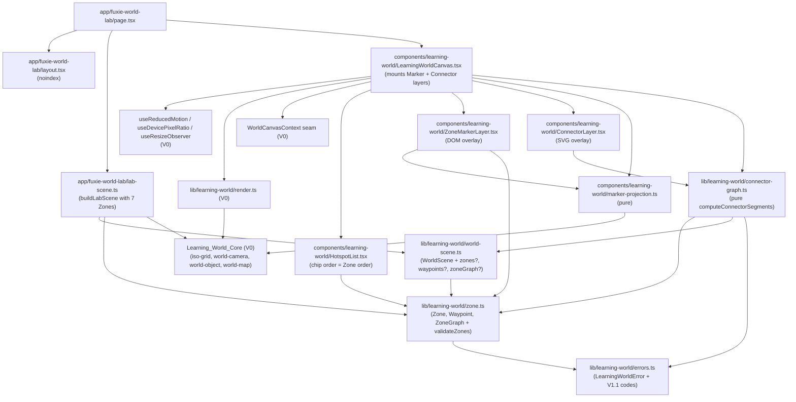
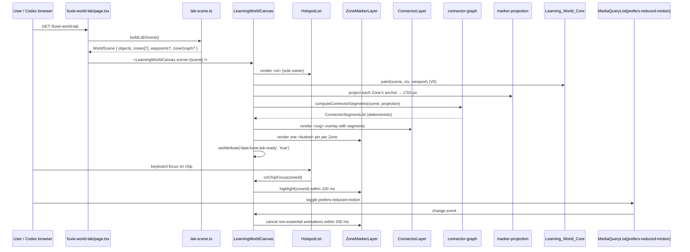
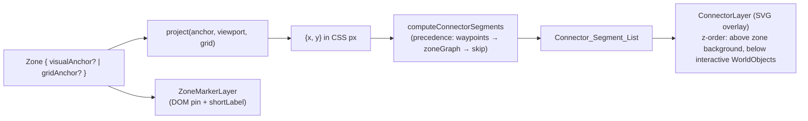

# Design Document — Fuxie Learning World Lab V1.1 ("Zone Clarity")

> **Operating model**
> - Vai chinh: CTO / Tech Lead
> - Vai phoi hop: Frontend Engineer, Product Designer, QA Automation Engineer
>
> Source of truth: `requirements.md` in this folder (Requirements 1–9 plus Scope, Non-Goals, Design Direction, Go/No-Go). Each subsection in this design references the numbered requirement(s) it implements using the inline `(Requirement N.M)` style established by the V0 design.
>
> Predecessor: V0 design at `.kiro/specs/fuxie-learning-world-lab-v0/design.md` is the structural template. V1.1 is an extension, not a rewrite. V0's idle-frame discipline, the Learning_World_Canvas-as-sole-owner-of-Hotspot_List rule, the dev-only fetch shim, the Mykonos MIT attribution plan, and the framework-agnostic core all remain intact.

---

## Overview

V1.1 is an internal-only polish slice that turns `/fuxie-world-lab` from "pretty engine demo" into a clear **learning map**. V0 proved the engine; V1 polish-1 raised the lab to a "real internal prototype" feel at ~70-72% Visual_Wow with 276 passing tests; V1.1 promotes the seven learning destinations to first-class scene metadata so a Codex reviewer can identify them at a glance within 3 seconds (Reviewer_3s_Test).

The slice introduces:

1. A new framework-agnostic data type — `Zone` — plus optional `Waypoint` and `ZoneGraph` extensions on `WorldScene`, all in pure TypeScript under `apps/web/src/lib/learning-world/` (Requirement 1, Requirement 6).
2. A pure connector geometry function `computeConnectorSegments(scene, projection)` whose output is a deterministic `Connector_Segment_List` independent of `WorldScene.objects` order. The legacy `objects[0]`-as-hub assumption is removed (Requirement 2).
3. A small DOM-overlay `ZoneMarkerLayer` and a `ConnectorLayer` mounted by `LearningWorldCanvas`, plus chip-order, accessible-name, and chip-to-marker highlight wiring in `HotspotList` (Requirements 3, 4).
4. Responsive composition rules and a single-cluster fallback for 1280x800 (Requirement 5).
5. New tests covering Zone validation, Hotspot_List order, path-graph permutation regression, graceful degradation, chip contrast, and an extended deny-list scan (Requirement 8).
6. A documented browser QA handoff producing three viewport screenshots and a `summary.json` under `tmp/browser-qa/fuxie-world-lab-v1-zone-clarity/` (Requirement 9).

V1.1 is strictly additive on top of V0 and V1 polish-1. No production Dashboard / Course / Skill Player route or component is touched, no learner state is written, no audio is introduced, no scene authoring or admin builder is exposed, and the Mykonos theme is not reintroduced (Scope, Requirement 7.5).

---

## Architecture

### Strict additivity contract

V1.1 may only add or modify files under:

- `apps/web/src/lib/learning-world/**` (extend types and renderer logic; add new modules)
- `apps/web/src/components/learning-world/**` (extend `LearningWorldCanvas`, `HotspotList`; add `ZoneMarkerLayer`, `ConnectorLayer`, `marker-projection`)
- `apps/web/src/app/fuxie-world-lab/**` (extend `lab-scene.ts`; `page.tsx` and `layout.tsx` behavior unchanged)
- Co-located `__tests__/**` directories under the three paths above
- Browser QA artifacts under `tmp/browser-qa/fuxie-world-lab-v1-zone-clarity/**`

V1.1 does NOT:

- modify Production_Surface routes (`apps/web/src/app/dashboard/`, `apps/web/src/app/course/`, any Skill Player route),
- add a `package.json` script,
- add a CI job,
- add a runtime or dev dependency,
- link `/fuxie-world-lab` from production navigation, footer, sitemap, or any in-app link.

(Scope; Requirement 6.5; Requirement 6.7; Requirement 8.1; Requirement 8.10.)

### Module layout diff (vs V0)

```
apps/web/src/lib/learning-world/
  zone.ts                                          (new)   Zone, Waypoint, ZoneGraph types + validateZones(scene)
  connector-graph.ts                               (new)   pure computeConnectorSegments(scene, projection)
  world-scene.ts                                   (mod)   adds optional zones, waypoints, zoneGraph
  errors.ts                                        (mod)   adds INVALID_ZONE, INVALID_WAYPOINT, DUPLICATE_OBJECT_ID, UNKNOWN_OBJECT_ID
  index.ts                                         (mod)   appends Zone, Waypoint, ZoneGraph, ConnectorSegmentList exports
  __tests__/
    zone.test.ts                                   (new)   Zone metadata validation (Req 8.5)
    connector-graph.test.ts                        (new)   permutation regression (Req 2.9, Req 8.7) + graceful degradation (Req 8.8)
    zone-clarity-static-scan.test.ts               (new)   V1.1 Scanned_File_Set scan (Req 6.2–6.7)
    learner-state-deny-list.test.ts                (mod)   extends V0 deny-list with V1.1 categories (Req 8.10)
    lab-scene-zones.test.ts                        (new)   buildLabScene() Zones determinism (Req 1.5–1.7)

apps/web/src/components/learning-world/
  ZoneMarkerLayer.tsx                              (new)   DOM-overlay marker layer
  ConnectorLayer.tsx                               (new)   DOM <svg> overlay paint of Connector_Segment_List
  marker-projection.ts                             (new)   pure projection of visualAnchor / gridAnchor to viewport CSS px
  HotspotList.tsx                                  (mod)   chip ordering by Zone.order, accessible name ladder, focus/hover ↔ marker highlight
  LearningWorldCanvas.tsx                          (mod)   mounts Marker + Connector layers; owns highlight state; sets data-fuxie-lab-ready
  __tests__/
    ZoneMarkerLayer.test.tsx                       (new)   visibility, edge-clip hide (Req 5.8), RM steady state (Req 3.8, 3.9)
    ConnectorLayer.test.tsx                        (new)   renders Connector_Segment_List exactly
    HotspotList.zone-order.test.ts                 (new)   chip order (Req 4.1–4.5, Req 8.6)
    HotspotList.contrast.test.ts                   (new)   chip contrast WCAG ≥ 4.5:1 (Req 4.6, Req 8.9)
    LearningWorldCanvas.responsive.test.tsx        (new)   mobile / desktop / wide visibility (Req 5.1–5.6)
    marker-projection.test.ts                      (new)   projection determinism

apps/web/src/app/fuxie-world-lab/
  lab-scene.ts                                     (mod)   exports buildLabScene() with seven Zones; deterministic, idempotent, frozen
  page.tsx                                         (unchanged)  still single LearningWorldCanvas owner of HotspotList
  layout.tsx                                       (unchanged)  noindex/nofollow metadata

tmp/browser-qa/fuxie-world-lab-v1-zone-clarity/
  summary.json
  mobile-390x844.png
  desktop-1280x800.png
  desktop-1920x1080.png
```

`(unchanged)` means V1.1 introduces no diff on that file. `(mod)` means V1.1 extends the file additively while preserving all V0 / V1 polish-1 behavior. Files marked `(new)` did not exist before V1.1.

### Layer dependency graph

Extends the V0 graph with `Zone`, `connector-graph`, `marker-projection`, `ZoneMarkerLayer`, and `ConnectorLayer` nodes. The Learning_World_Core box still has **no inbound arrow** from React, Next, or DOM (Requirement 6.1, 6.3, 6.4).



Hard rules captured:

- `zone.ts`, `connector-graph.ts`, and the `world-scene.ts` extension live inside `apps/web/src/lib/learning-world/` and import nothing from `react`, `react-dom`, `next`, `next/*`, `@fuxie/ui`, or any DOM type token (Requirement 6.1, 6.3, 6.4). The V1.1 static-scan test enforces this on the Scanned_File_Set.
- `marker-projection.ts` is a pure helper inside the React layer, not the core. It MAY name DOM types because it operates on viewport CSS pixels; it is not in the Scanned_File_Set (Requirement 6.2).
- `ConnectorLayer` consumes only the precomputed `Connector_Segment_List`; it never reads `WorldScene.objects` or `WorldScene.zones`. This guarantees the permutation regression in Requirement 2.9.

### Runtime sequence

Extends the V0 sequence with Zone marker mount, connector compute, and reduced-motion reaction within 200 ms (Requirement 3.9).



### Zone Graph data flow



The connector layer is painted **above** the zone background and **below** the interactive `WorldObject` entries (Requirement 2.7). Markers sit above interactive `WorldObject` entries because they are map annotations; edge-clip hiding (Requirement 5.8) prevents them from drawing partially off-canvas.

---

## Components and Interfaces

### Learning_World_Core extensions (framework-agnostic)

#### `lib/learning-world/zone.ts` (new)

Plain TypeScript only. No React, Next, DOM types, runtime classes, decorators, or top-level executable initializers (Requirement 6.1).

```ts
import type { LearningWorldErrorCode } from './errors'

export interface VisualAnchor {
    /** Finite IEEE-754. Each component in [-10000, 10000]. (Requirement 1.3) */
    readonly x: number
    readonly y: number
}

export interface GridAnchor {
    /** Safe-integer in [0, 1023]. (Requirement 1.3) */
    readonly gx: number
    readonly gy: number
}

export interface Zone {
    /** Trimmed string, length 1..64 after trim. (Requirement 1.2) */
    readonly id: string
    /** Trimmed string, length 1..64 after trim; references exactly one WorldObject.id. (Requirement 1.2) */
    readonly objectId: string
    /** Trimmed string, length 1..80 after trim. (Requirement 1.2) */
    readonly title: string
    /** Trimmed string, length 1..24 after trim. (Requirement 1.2, Requirement 3.5) */
    readonly shortLabel: string
    /** Trimmed string, length 1..80 after trim. (Requirement 1.2) */
    readonly learningIntent: string
    /** At least one of visualAnchor or gridAnchor SHALL be present. (Requirement 1.3) */
    readonly visualAnchor?: VisualAnchor
    readonly gridAnchor?: GridAnchor
    /** Optional internal route. Trimmed, length 1..200. (Requirement 1.4) */
    readonly href?: string
    /** Optional ordering integer in [0, 999]. (Requirement 1.4) */
    readonly order?: number
}

export interface Waypoint {
    /** Trimmed string, length 1..64 after trim. (Requirement 2.2) */
    readonly id: string
    /** Finite IEEE-754. (Requirement 2.2) */
    readonly x: number
    readonly y: number
}

export interface ZoneGraphEdge {
    readonly fromZoneId: string
    readonly toZoneId: string
}

export interface ZoneGraph {
    /** Each endpoint references a Zone id present in the same scene. (Requirement 2.3) */
    readonly edges: ReadonlyArray<ZoneGraphEdge>
}

export type ZoneValidationError = {
    readonly code: Extract<
        LearningWorldErrorCode,
        | 'INVALID_ZONE'
        | 'INVALID_WAYPOINT'
        | 'DUPLICATE_OBJECT_ID'
        | 'UNKNOWN_OBJECT_ID'
    >
    readonly message: string
    readonly zoneId?: string
    readonly objectId?: string
}

/**
 * Validates a scene's zones, waypoints, and zoneGraph. Pure function.
 *
 * Throws the FIRST detected typed LearningWorldError on:
 *   - duplicate Zone.objectId across zones (Requirement 1.8)
 *   - Zone.objectId not matching any WorldObject.id in the same scene (Requirement 1.9)
 *   - malformed anchor (out-of-range, non-finite, both anchors absent) (Requirement 1.10)
 *   - invalid Waypoint id, non-finite x/y, duplicate Waypoint ids (Requirement 2.2, 2.6)
 *   - zoneGraph edges referencing absent ids OR self-loops (Requirement 2.3, 2.8 — note: 2.8
 *     skips invalid edges at render time; validateZones reports them but does not throw on
 *     graph-level edge mismatches when a render-time skip is the documented behavior).
 *
 * On success, returns a frozen, normalized result. validateZones is idempotent:
 * validateZones(validateZones(scene).scene) deep-equals validateZones(scene).scene.
 */
export function validateZones(
    scene: ReadonlySceneForZoneCheck,
): { readonly scene: ReadonlySceneForZoneCheck; readonly errors: ReadonlyArray<ZoneValidationError> }

interface ReadonlySceneForZoneCheck {
    readonly objects: ReadonlyArray<{ readonly id: string }>
    readonly zones?: ReadonlyArray<Zone>
    readonly waypoints?: ReadonlyArray<Waypoint>
    readonly zoneGraph?: ZoneGraph
}
```

`validateZones` is invoked by `lab-scene.ts`'s `buildLabScene()` so structural failures surface at scene-build time, not at paint time. `LearningWorldCanvas` does not mount when `validateZones` reports a hard error (Requirements 1.8, 1.9, 1.10).

#### `lib/learning-world/connector-graph.ts` (new)

```ts
import type { Waypoint, Zone, ZoneGraph } from './zone'

export interface ConnectorSegment {
    readonly fromX: number   // CSS px relative to canvas viewport
    readonly fromY: number
    readonly toX: number
    readonly toY: number
}

export type ConnectorSegmentList = ReadonlyArray<ConnectorSegment>

export interface ConnectorProjection {
    /** Projects a Zone's anchor to viewport CSS px (visualAnchor first, else gridAnchor). */
    projectZone(zone: Zone): { readonly x: number; readonly y: number } | null
    /** Projects a Waypoint's (x, y) to viewport CSS px. Identity is also a valid projection. */
    projectWaypoint(wp: Waypoint): { readonly x: number; readonly y: number }
}

export interface ConnectorSceneInput {
    readonly zones?: ReadonlyArray<Zone>
    readonly waypoints?: ReadonlyArray<Waypoint>
    readonly zoneGraph?: ZoneGraph
}

/**
 * Pure function. Computes the renderer's connector geometry for a given scene
 * using the precedence ladder in Requirement 2.4:
 *   1. waypoints with >= 2 valid entries -> draw N-1 segments in array order
 *      (Requirement 2.7); zoneGraph is ignored.
 *   2. else zoneGraph with >= 1 valid edge -> derive each edge's geometry from
 *      the source Zone's projected anchor to the target Zone's projected anchor.
 *   3. else -> return [] (renderer skips the connector layer; no throw, no error log).
 *
 * Determinism guarantee (Requirement 2.9):
 *   Output is a function of (scene.zones, scene.waypoints, scene.zoneGraph) only;
 *   it is INDEPENDENT of WorldScene.objects array order. Permuting WorldScene.objects
 *   (including moving non-zone objects in or out of index 0) yields a deeply-equal
 *   ConnectorSegmentList.
 */
export function computeConnectorSegments(
    scene: ConnectorSceneInput,
    projection: ConnectorProjection,
): ConnectorSegmentList
```

Degenerate-case behavior (Requirements 2.5, 2.6, 2.8):

- `waypoints` and `zoneGraph` both omitted → return `[]`. No throw. No `console.error` (Requirement 2.5).
- `waypoints` present with fewer than two valid entries, OR any non-finite `x`/`y`, OR duplicate `id` values → skip the waypoint branch and fall through to `zoneGraph` per the precedence ladder. No throw (Requirement 2.6).
- `zoneGraph` edge referencing a Zone id absent from `scene.zones`, or a self-loop (`fromZoneId === toZoneId`) → that edge is skipped; remaining valid edges still render. No throw (Requirement 2.8).
- Source or target Zone whose `projectZone` returns `null` (no anchor projectable) → the edge is skipped silently.

The legacy `objects[0]`-as-hub assumption is removed entirely. The connector renderer never reads `scene.objects` (Requirement 2.1).

#### `lib/learning-world/world-scene.ts` (modified)

Append three optional fields. No required-field changes. No public-shape change for V0 callers; existing scenes continue to validate.

```ts
export interface WorldScene {
    // existing V0 fields:
    readonly grid: IsoGridConfig
    readonly camera?: CameraConfig
    readonly terrain: ReadonlyArray<TerrainEntry>
    readonly objects: ReadonlyArray<WorldObject>
    readonly canvasAriaLabel: string
    readonly canvasAriaLabelledBy?: string

    // V1.1 additions:
    readonly zones?: ReadonlyArray<Zone>                // (Requirement 1.1)
    readonly waypoints?: ReadonlyArray<Waypoint>        // (Requirement 2.2)
    readonly zoneGraph?: ZoneGraph                      // (Requirement 2.3)
}
```

`zones` omitted and `zones === []` are treated equivalently as "no zones" (Requirement 1.1, 1.11). When `zones` is omitted or empty, the canvas renders zero Markers and zero connectors but still mounts the scene and renders `WorldObject` entries (Requirement 1.11).

#### `lib/learning-world/errors.ts` (modified)

Extends the V0 `LearningWorldErrorCode` union with V1.1 codes. The codes remain framework-agnostic.

```ts
export type LearningWorldErrorCode =
    // V0:
    | 'INVALID_GRID_CONFIG' | 'INVALID_GRID_INPUT'
    | 'INVALID_CAMERA_CONFIG' | 'INVALID_CAMERA_INPUT'
    | 'INVALID_CONTEXT'
    | 'INVALID_OBJECT'
    | 'OUT_OF_BOUNDS'
    | 'OCCUPANCY_COLLISION'
    | 'OBJECT_NOT_REGISTERED'
    // V1.1 additions:
    | 'INVALID_ZONE'           // Zone field-shape failure (Requirement 1.2, 1.3, 1.4)
    | 'INVALID_WAYPOINT'       // Waypoint field-shape failure (Requirement 2.2)
    | 'DUPLICATE_OBJECT_ID'    // Two Zones reference the same WorldObject.id (Requirement 1.8)
    | 'UNKNOWN_OBJECT_ID'      // Zone.objectId does not match any WorldObject.id (Requirement 1.9)
```

#### `lib/learning-world/index.ts` (modified)

Append exports. Audit: every appended identifier is plain TypeScript and references no React, Next, or DOM-only types (Requirement 6.1, 6.3, 6.4).

```ts
export type {
    Zone, Waypoint, ZoneGraph, ZoneGraphEdge,
    VisualAnchor, GridAnchor,
    ZoneValidationError,
    ConnectorSegment, ConnectorSegmentList,
    ConnectorProjection, ConnectorSceneInput,
} from './...'

export { validateZones } from './zone'
export { computeConnectorSegments } from './connector-graph'
```

### React layer extensions

#### `components/learning-world/marker-projection.ts` (new)

Pure helper. Lives in the React layer (not in the core) because it operates on viewport CSS pixels, but contains no JSX and no React hook.

```ts
import type { GridAnchor, VisualAnchor, Zone, Waypoint } from '@/lib/learning-world'

export interface ProjectionContext {
    readonly viewportCssWidth: number
    readonly viewportCssHeight: number
    readonly tileWidth: number
    readonly tileHeight: number
    readonly cameraPanX: number
    readonly cameraPanY: number
    readonly cameraZoom: number
}

/** Projects visualAnchor first; falls back to gridAnchor; returns null if neither projects. */
export function projectZoneAnchor(zone: Zone, ctx: ProjectionContext): { x: number; y: number } | null

export function projectWaypoint(wp: Waypoint, ctx: ProjectionContext): { x: number; y: number }

/** Returns true if the projected point lies in the viewport [0..width] x [0..height]. */
export function isInsideViewport(p: { x: number; y: number }, ctx: ProjectionContext): boolean
```

`marker-projection` is the only place V1.1 mixes Zone data with viewport CSS pixels. `connector-graph.ts` accepts a `ConnectorProjection` interface so the core never names DOM dimensions.

#### `components/learning-world/ZoneMarkerLayer.tsx` (new)

DOM-overlay implementation. Chosen over canvas-rendered markers so each Marker is a real DOM element with `getBoundingClientRect()`, native focus, and CSS-driven contrast — which makes Requirements 3.6 (4.5:1 contrast), 3.10 (chip-to-marker highlight), and 5.8 (edge-clip hide via `display: none`) trivially testable.

```tsx
'use client'

export interface ZoneMarkerLayerProps {
    readonly scene: WorldScene
    readonly projection: ProjectionContext
    readonly highlightedZoneId: string | null      // owned by LearningWorldCanvas
    readonly reducedMotion: 'reduce' | 'no-preference'
    /** Test-only API for canvas-rendered fallback parity (Requirement 3.2). */
    readonly onMarkerLayout?: (
        layout: ReadonlyArray<{ zoneId: string; rect: { x: number; y: number; width: number; height: number } }>,
    ) => void
}
```

Per-Marker rendering rules:

- One `<button type="button" data-zone-id={zone.id}>` per Zone, styled as a small pin with a label chip (Requirement 3.1).
- Visible label uses `zone.shortLabel`, never exceeding 24 characters (Requirement 3.5; enforced upstream by `validateZones`).
- The marker's text color and background are chosen so `getComputedStyle().color` against the effective background sampled at the marker's geometric center yields a contrast ratio of at least 4.5:1 per WCAG 2.1 SC 1.4.3 relative-luminance (Requirement 3.6).
- Markers SHALL NOT obscure more than 15% of any required `WorldObject` `coreArtworkBounds` (Requirement 3.7). Default offset is computed by `marker-projection` to anchor the pin tip on the projected anchor and lift the label chip above the artwork.
- When `reducedMotion === 'reduce'`, every marker root carries `style={{ animationName: 'none', transitionProperty: 'none' }}` for non-essential properties: no idle pulse, no hover bobbing, no entrance tween (Requirement 3.8).
- The hook `useReducedMotion` (V0) reacts to `MediaQueryList` `change` events; on toggle the Marker root receives the new `reducedMotion` prop within 200 ms and any in-flight non-essential animation is cancelled, without remounting the canvas (Requirement 3.9).
- Highlight when `highlightedZoneId === zone.id`: increased outline width and a background tint, applied within 100 ms of the chip event that drove the highlight (Requirement 3.10). The same visual treatment is applied for keyboard `:focus-visible`, mouse `:hover`, and `pointerenter` (Requirement 3.10).
- Edge-clip hide: when the projected marker bounding box would intersect the canvas viewport edge, the Marker is rendered with `display: none` instead of clipped (Requirement 5.8).

Test-only API for canvas-rendered fallback (Requirement 3.2): if a future slice swaps the implementation to canvas-rendered shapes, that implementation MUST expose, via a test seam, `ReadonlyArray<{ zoneId: string; bbox: { x, y, width, height } }>` in CSS pixels. `onMarkerLayout` is the V1.1 forward-compatible test hook.

#### `components/learning-world/ConnectorLayer.tsx` (new)

DOM `<svg>` overlay implementation. Chosen over canvas-side paint because the connector is just `N-1` straight lines for `N` waypoints (Requirement 2.7) and the `<svg>` element gives us per-segment hit-testing for free if a future slice needs it. Crucially, `ConnectorLayer` consumes only `ConnectorSegmentList` — never the full scene — which guarantees the permutation regression in Requirement 2.9.

```tsx
'use client'

export interface ConnectorLayerProps {
    readonly segments: ConnectorSegmentList
    readonly viewportCssWidth: number
    readonly viewportCssHeight: number
}
```

Render: a single `<svg width={viewportCssWidth} height={viewportCssHeight}>` containing one `<line>` per `ConnectorSegment`, drawn on a layer above the zone background and below interactive `WorldObject` entries (Requirement 2.7). When `segments.length === 0`, `ConnectorLayer` returns `null`; the canvas still mounts (Requirement 2.5).

#### `components/learning-world/HotspotList.tsx` (modified)

Extends V0's `HotspotList` to be Zone-aware while preserving all V0 behavior for non-Zone scenes.

Chip ordering (Requirement 4.2):

```ts
function compareZonesForChips(a: Zone, b: Zone, indexA: number, indexB: number): number {
    const ao = Number.isFinite(a.order) ? (a.order as number) : Number.POSITIVE_INFINITY
    const bo = Number.isFinite(b.order) ? (b.order as number) : Number.POSITIVE_INFINITY
    if (ao !== bo) return ao - bo
    return indexA - indexB
}
```

Accessible-name ladder (Requirement 4.3): `Zone.title` if non-empty after trim and length 1..200, else `Zone.shortLabel`, else `Zone.id`. If all three are empty after trim or exceed 200 characters, the Zone yields no chip (Requirement 4.4).

Activation (Requirement 4.9):

- Path A — anchor element: when `Zone.href` is present and the chip is rendered as `<a href={zone.href}>`, activation occurs on Enter via native browser behavior. The chip SHALL NOT bind a custom Space-key handler. Space behaves per browser default (typically scroll).
- Path B — button element: when `Zone.href` is absent, the chip is rendered as `<button type="button">`. Activation occurs on Enter or Space; the Space-key handler calls `event.preventDefault()` and triggers the navigation/selection intent exactly once per key press (no double-trigger across `keydown` and `keyup`).

Internal-route navigation (Requirement 4.10) uses Next.js same-document SPA routing; no `target="_blank"`.

Read-only guarantee (Requirement 4.11): activation handlers issue zero HTTP `POST`/`PUT`/`PATCH`/`DELETE`, write nothing to `localStorage`/`sessionStorage`/cookies/IndexedDB, and emit no analytics. Enforced by the extended deny-list scan and by Requirement 9.10 at QA time.

Chip-to-marker highlight wiring (Requirement 3.10, 4.7):

- `HotspotList` emits `onChipFocus(zoneId)`, `onChipBlur(zoneId)`, `onChipHover(zoneId)`, `onChipPointerLeave(zoneId)` to its parent.
- `LearningWorldCanvas` owns `highlightedZoneId` state; on focus or hover it sets the id within 100 ms; on blur the highlight clears within 100 ms unless still hovered.
- Per Requirement 3.11 / 4.7, if the highlight wiring cannot be implemented within V1.1, this is recorded as a known gap in the Codex QA report and does not block sign-off (see Open questions / Known gaps).

Chip contrast (Requirement 4.6, Requirement 8.9): the chip surface inherited from V1 polish-1 stays unchanged. The new test `HotspotList.contrast.test.ts` asserts `getComputedStyle().color` against `getComputedStyle().backgroundColor` yields `(L1 + 0.05) / (L2 + 0.05) >= 4.5` using the WCAG 2.1 sRGB-to-linear transform. The focus indicator (`:focus-visible`) carries a contrast ratio of at least 3:1 versus the surrounding background.

#### `components/learning-world/LearningWorldCanvas.tsx` (modified)

V1.1 changes are strictly additive to the V0 component:

- Stays the **sole owner** of `<HotspotList>`. The lab page still renders only `<LearningWorldCanvas scene={scene} />`. Exactly one `<HotspotList>` instance per scene mount (V0 invariant preserved).
- Mounts `<ZoneMarkerLayer>` and `<ConnectorLayer>` after first paint. Both layers absorb the new responsibilities; the V0 canvas paint pipeline is untouched.
- Owns `highlightedZoneId: string | null` state and the chip→marker glue (Requirement 3.10, 4.7).
- Sets `data-fuxie-lab-ready="true"` on the `<canvas>` after first paint. This is the ready-state selector polled by Codex (Requirement 9.3, 9.4). The attribute exists on the V0 canvas already; V1.1 preserves it and additionally requires the Marker layer to have completed first layout before the attribute is set, so Codex screenshots capture the full Zone Clarity composition.
- Preserves V0's idle-frame discipline: single coalesced RAF, no `setInterval`, no unconditional RAF loop, no `useSyncExternalStore` subscription on `WorldMap.getVersion()`. Marker hover/focus highlights are driven by React state only and trigger at most one repaint per state change (Requirement 5.7).
- Preserves V0's resize budget: exactly one reflow per resize event, on the next `requestAnimationFrame` (Requirement 5.7).
- Preserves V0's dev-only `fetch` shim. Reuse, do not redesign:
    - Mounted **inside a `useEffect`** in `LearningWorldCanvas`, gated by `process.env.NODE_ENV !== 'production'`.
    - On mount, captures `originalFetch = window.fetch`; on cleanup, restores `window.fetch = originalFetch`.
    - `console.warn`s on `POST`/`PUT`/`PATCH`/`DELETE` then delegates without blocking.
    - Does not patch storage APIs (storage-write deny is enforced statically by the extended deny-list scan and observationally by Requirement 9.10).
    - Production builds: shim is a no-op.
- No audio API is imported. No scene-mutation API is exposed. Nothing writes to `localStorage`, `sessionStorage`, cookies, or IndexedDB (Scope, Requirement 4.11, Requirement 8.10, Requirement 9.10).

### Lab route — `app/fuxie-world-lab/lab-scene.ts` (modified)

`buildLabScene()` returns a deeply frozen `WorldScene` with exactly seven Zones at indices 0..6 in the declaration order required by Requirement 1.5: `villageSquare`, `courseSignpost`, `library`, `radioBooth`, `postOffice`, `market`, `reviewGarden`.

Each Zone declares the EXACT case-sensitive `learningIntent` string from Requirement 1.6:

| Zone id          | objectId            | shortLabel        | learningIntent (verbatim, case-sensitive)        |
|------------------|---------------------|-------------------|--------------------------------------------------|
| `villageSquare`  | `villageSquare`     | "Village square"  | `orientation/home hub`                           |
| `courseSignpost` | `courseSignpost`    | "Course signpost" | `continue course / next lesson`                  |
| `library`        | `library`           | "Library"         | `reading/vocabulary/references`                  |
| `radioBooth`     | `radioBooth`        | "Radio booth"     | `listening/pronunciation`                        |
| `postOffice`     | `postOffice`        | "Post office"     | `writing/messages/submissions`                   |
| `market`         | `marketStall`       | "Market"          | `shop/rewards/Fucoin preview`                    |
| `reviewGarden`   | `reviewGarden`      | "Review garden"   | `spaced repetition/review`                       |

Each Zone declares at least one of `visualAnchor` (within `[-10000, 10000]`) or `gridAnchor` (within `[0, 1023]`); V1.1 uses `visualAnchor` for the six anchored slots and falls back to `gridAnchor` for the review garden when its visual placement is registry-driven (Requirement 1.3). `objectId` matches an existing V0 `WorldObject.id` in the same scene; the V0 lab scene's `marketStall` object id is preserved while the Zone id is `market` (the Zone id is internal; `objectId` is the link to the existing V0 object).

`buildLabScene()` invokes `validateZones(scene)` before returning; on a hard error (`DUPLICATE_OBJECT_ID`, `UNKNOWN_OBJECT_ID`, `INVALID_ZONE`, `INVALID_WAYPOINT`) it throws a typed `LearningWorldError` synchronously and `LearningWorldCanvas` does not mount (Requirements 1.8, 1.9, 1.10). The returned scene is `Object.freeze`d at every level so Requirement 1.7 (deeply equal across calls; no mutation of prior scenes) holds.

`buildLabScene()` is deterministic, idempotent, and produces no side effects: no network call, no storage write, no console output.

---

## Data Models

### TypeScript shapes (V1.1 additions)

```ts
// from lib/learning-world/zone.ts (see Components and Interfaces for full shapes)
export interface Zone {
    readonly id: string
    readonly objectId: string
    readonly title: string
    readonly shortLabel: string
    readonly learningIntent: string
    readonly visualAnchor?: { readonly x: number; readonly y: number }
    readonly gridAnchor?: { readonly gx: number; readonly gy: number }
    readonly href?: string
    readonly order?: number
}

export interface Waypoint {
    readonly id: string
    readonly x: number
    readonly y: number
}

export interface ZoneGraph {
    readonly edges: ReadonlyArray<{ readonly fromZoneId: string; readonly toZoneId: string }>
}

// from lib/learning-world/connector-graph.ts
export type ConnectorSegmentList = ReadonlyArray<{
    readonly fromX: number
    readonly fromY: number
    readonly toX: number
    readonly toY: number
}>

// from lib/learning-world/world-scene.ts (V1.1 additions only)
interface WorldSceneV11Additions {
    readonly zones?: ReadonlyArray<Zone>
    readonly waypoints?: ReadonlyArray<Waypoint>
    readonly zoneGraph?: ZoneGraph
}
```

### Updated public exports from `index.ts` (barrel)

V0 exports remain. V1.1 appends:

```ts
export type {
    Zone, Waypoint, ZoneGraph, ZoneGraphEdge,
    VisualAnchor, GridAnchor,
    ZoneValidationError,
    ConnectorSegment, ConnectorSegmentList,
    ConnectorProjection, ConnectorSceneInput,
} from './...'

export { validateZones } from './zone'
export { computeConnectorSegments } from './connector-graph'
```

Audit (Requirement 6.1, 6.3, 6.4): every appended type is plain TypeScript with no React, Next, DOM, or `@fuxie/ui` reference. The static-scan test in `__tests__/zone-clarity-static-scan.test.ts` enforces this against the V1.1 Scanned_File_Set.

### Lab demo Zones (concrete)

```ts
const zones: ReadonlyArray<Zone> = [
    {
        id: 'villageSquare',
        objectId: 'villageSquare',
        title: 'Village Square',
        shortLabel: 'Village square',
        learningIntent: 'orientation/home hub',
        visualAnchor: { x: 0,   y: 0   },
        order: 0,
    },
    {
        id: 'courseSignpost',
        objectId: 'courseSignpost',
        title: 'Course Signpost',
        shortLabel: 'Course signpost',
        learningIntent: 'continue course / next lesson',
        visualAnchor: { x: -160, y: 80 },
        href: '/fuxie-world-lab#course',
        order: 1,
    },
    {
        id: 'library',
        objectId: 'library',
        title: 'Library',
        shortLabel: 'Library',
        learningIntent: 'reading/vocabulary/references',
        visualAnchor: { x: 200, y: -120 },
        href: '/fuxie-world-lab#library',
        order: 2,
    },
    {
        id: 'radioBooth',
        objectId: 'radioBooth',
        title: 'Radio Booth',
        shortLabel: 'Radio booth',
        learningIntent: 'listening/pronunciation',
        visualAnchor: { x: -200, y: 160 },
        href: '/fuxie-world-lab#radio',
        order: 3,
    },
    {
        id: 'postOffice',
        objectId: 'postOffice',
        title: 'Post Office',
        shortLabel: 'Post office',
        learningIntent: 'writing/messages/submissions',
        visualAnchor: { x: 200, y: 160 },
        href: '/fuxie-world-lab#post-office',
        order: 4,
    },
    {
        id: 'market',
        objectId: 'marketStall',
        title: 'Market',
        shortLabel: 'Market',
        learningIntent: 'shop/rewards/Fucoin preview',
        visualAnchor: { x: 80, y: 220 },
        href: '/fuxie-world-lab#market',
        order: 5,
    },
    {
        id: 'reviewGarden',
        objectId: 'reviewGarden',
        title: 'Review Garden',
        shortLabel: 'Review garden',
        learningIntent: 'spaced repetition/review',
        gridAnchor: { gx: 7, gy: 4 },
        href: '/fuxie-world-lab#review',
        order: 6,
    },
]
```

The default V1.1 `waypoints` array threads the seven anchors in declaration order, producing six connector segments (Requirement 2.7). `zoneGraph` is left undefined; the precedence ladder in Requirement 2.4 selects the `waypoints` branch.

---

## Composition and Visual Strategy (Product Designer support)

### First-viewport composition rules

| Viewport (CSS px) | Canvas position           | Hotspot_List                            | Markers visible                              |
|-------------------|---------------------------|-----------------------------------------|----------------------------------------------|
| 390x844           | inside `[0,0,390,844]`    | first row inside the first viewport     | ≥ 5 of 7; chip font ≥ 12 px; contrast ≥ 4.5:1 (Requirement 5.1, 5.2) |
| 1280x800          | inside first viewport     | first row inside first viewport         | all 7, OR ≥ 5 plus exactly one cluster DOM node with accessible name and visible count (Requirement 5.3, 5.4) |
| 1920x1080         | horizontally centered ±1 px in content column; canvas width clamped to `[min(960, parent), min(1280, parent)]` | first row inside first viewport | all 7 (Requirement 5.5, 5.6) |

`document.body.scrollWidth <= document.body.clientWidth` at every viewport (Requirement 5.1, 5.4). The canvas SHALL NOT be remounted on resize; layout recomputation happens once per resize on the next RAF (Requirement 5.7).

### Marker visual language

- A pin glyph (downward triangle plus a small disk) anchored on the projected Zone anchor.
- A label chip lifted above the pin tip showing `shortLabel` (`<= 24` chars).
- Restrained tones consistent with V1 polish-1's dark-blue lab frame; never marketing-landing-page color saturation.
- Markers feel like **map annotations**, not callout cards or UI overlays competing with the artwork (Design Direction).
- No coordinated palette/prop set evoking Mykonos. No Greek-island labels. No Mykonos place names or character names. Existing Fuxie_Asset_Registry assets that happen to use blue tones remain permitted as long as they are not arranged to recreate the Mykonos theme (Requirement 7.5).

### Cluster fallback at 1280x800

When the V1.1 layout cannot fit all seven Markers without overlap inside the canvas viewport at 1280x800, exactly one cluster DOM node is rendered (Requirement 5.3):

- Implemented as a single `<button type="button">` in `ZoneMarkerLayer` with `aria-label` listing the grouped Zones (e.g. `"Cluster: Library, Post office, Market"`) and a visible count indicator (e.g. `"+3"`).
- Activating the cluster expands an in-place popover listing the grouped Zones; activation does not navigate, write learner state, or open a new browsing context.
- The cluster lives in the same overlay layer as Markers, so `getBoundingClientRect()` discovery still works.

### Path/waypoint visual treatment

- Connectors are thin, slightly translucent strokes implying a learning flow between Zones.
- Stroke color is chosen to contrast both the lab frame and the world artwork; the strokes are not the dominant visual.
- No animation on the path under reduced motion (Requirement 3.8). No idle pulse, no flow animation.

### Color contrast, focus indicators, and reduced-motion steady state

- Chip text vs chip background ≥ 4.5:1 (Requirement 4.6, 8.9).
- `:focus-visible` outline ≥ 3:1 vs surrounding background (Requirement 4.6).
- Marker text vs effective marker background ≥ 4.5:1 sampled at the marker's geometric center (Requirement 3.6).
- Under `prefers-reduced-motion: reduce`, every marker root has `getComputedStyle().animationName === 'none'` and `transitionProperty === 'none'` for non-essential properties; toggling the preference at runtime reaches the steady state within 200 ms via `MediaQueryList` `change` (Requirements 3.8, 3.9).

---

## Correctness Properties

*A property is a characteristic or behavior that should hold true across all valid executions of a system — essentially, a formal statement about what the system should do. Properties serve as the bridge between human-readable specifications and machine-verifiable correctness guarantees.*

PBT applies to V1.1 because the new core additions — `validateZones` and `computeConnectorSegments` — are pure functions over Zone, Waypoint, and `WorldScene` inputs with universal invariants (acceptance contracts, permutation invariance, precedence selection, graceful degradation), and because the React-layer additions (`HotspotList` chip order, `ZoneMarkerLayer` overlap and edge-clip rules, chip↔marker highlight wiring, resize coalescing) can be exercised with stubbed timers and synthetic events in `vitest`. PBT does NOT apply to the browser QA artifacts (Requirement 9), the Codex Visual_Wow score (Requirement 7.2), the Reviewer_3s_Test (Requirement 7.3), the test-runner wall-clock budget (Requirement 8.1), or process rules such as PR-checklist rows; those are covered by integration assertions, smoke checks, or reviewer process per the Testing Strategy section.

Each property below names the requirements it validates. All property tests use `fast-check` (already a root devDependency at the repo root) with a minimum of 100 iterations per property and run via the existing `pnpm --filter @fuxie/web test` command.

### Property 1: validateZones acceptance and rejection contract

*For any* candidate scene `s` containing `s.objects: ReadonlyArray<{ id: string }>`, optional `s.zones: ReadonlyArray<Zone>`, optional `s.waypoints: ReadonlyArray<Waypoint>`, and optional `s.zoneGraph: ZoneGraph`, `validateZones(s)` accepts iff ALL of the following hold:

- For every Zone `z` in `s.zones`: `z.id`, `z.objectId`, `z.title`, `z.shortLabel`, and `z.learningIntent` are trimmed strings within their declared length bounds (1..64, 1..64, 1..80, 1..24, 1..80 after trim respectively); `z.href` (when present) is a trimmed string of length 1..200; `z.order` (when present) is an integer in `[0, 999]`; at least one of `z.visualAnchor` (each component finite IEEE-754 in `[-10000, 10000]`) or `z.gridAnchor` (each component safe-integer in `[0, 1023]`) is present; **and**
- The set of `Zone.objectId` values across `s.zones` contains no duplicates; **and**
- Every `Zone.objectId` matches some `WorldObject.id` in `s.objects`; **and**
- For every Waypoint `w` in `s.waypoints` (when present): `w.id` is a trimmed string of length 1..64, and `w.x` and `w.y` are finite IEEE-754; **and**
- Every `ZoneGraph` edge endpoint (when `s.zoneGraph` is present) refers to a Zone id in `s.zones`, and `fromZoneId !== toZoneId`.

For any candidate violating one or more of the above, `validateZones(s)` throws `LearningWorldError` with a code in `{ INVALID_ZONE, INVALID_WAYPOINT, DUPLICATE_OBJECT_ID, UNKNOWN_OBJECT_ID }` and produces no partial scene.

**Validates: Requirements 1.2, 1.3, 1.4, 1.8, 1.9, 1.10, 2.2, 2.3, 8.5**

### Property 2: computeConnectorSegments permutation invariance

*For any* `WorldScene` `s` with non-empty `s.zones` and any permutation `P` of `s.objects` (including permutations that move non-zone objects in or out of array index 0), and *for any* deterministic `ConnectorProjection` `proj` whose outputs depend only on Zone identities and viewport dimensions:

`computeConnectorSegments({ ...s, objects: P(s.objects) }, proj)` deep-equals `computeConnectorSegments(s, proj)` as a `ReadonlyArray<{ fromX, fromY, toX, toY }>` of numbers in CSS pixels, with no reliance on pixel-level or byte-level canvas comparisons.

**Validates: Requirements 2.1, 2.9, 8.7**

### Property 3: Connector precedence ladder and graceful degradation

*For any* `WorldScene` `s` and any `ConnectorProjection` `proj`, the result of `computeConnectorSegments(s, proj)` matches the precedence ladder:

1. If `s.waypoints` exists and contains at least two entries with finite `x`/`y` and pairwise-distinct `id` values, the result is exactly the `N - 1` segments connecting consecutive valid waypoints in array order, where `N` is the count of valid waypoint entries; the `s.zoneGraph` field is ignored for connector geometry.
2. Else, if `s.zoneGraph` exists and contains at least one edge whose `fromZoneId` and `toZoneId` both refer to Zones in `s.zones` and where `fromZoneId !== toZoneId`, the result contains exactly one segment per valid edge, deriving each segment's endpoints from the source and target Zones' projected anchors; edges with absent endpoint or self-loops are skipped silently.
3. Otherwise, the result is `[]`.

For any input where `s.waypoints` exists but contains fewer than two valid entries, OR contains any non-finite coordinate, OR contains duplicate `id` values, the function does not throw, does not log at any severity, and falls through to step 2 above.

**Validates: Requirements 2.4, 2.5, 2.6, 2.7, 2.8, 8.8**

### Property 4: Zones omitted or empty mounts cleanly with zero connectors

*For any* `WorldScene` `s` where `s.zones` is omitted or `s.zones === []`, `LearningWorldCanvas` mounts the scene, renders zero Markers, renders zero connector segments, and does not throw or log at error level. `s.objects` continues to render per V0 behavior.

**Validates: Requirements 1.11, 8.8**

### Property 5: Hotspot_List chip order and accessible-name ladder

*For any* `WorldScene` `s` with non-empty `s.zones`, the `<ul>` rendered by `HotspotList(s)` satisfies:

- The number of `<li>` children equals the number of zones in `s.zones` whose accessible-name ladder produces a non-empty trimmed value of length 1..200 (zones failing the ladder per Requirement 4.4 yield no chip).
- The order of the `<li>` children equals the order produced by sorting `s.zones` ascending by `Zone.order` when `Number.isFinite(order) === true`, breaking ties (or missing `order`) by the original index of the Zone in `s.zones`.
- For every chip, the rendered accessible name equals the first non-empty trimmed value from the ladder `Zone.title → Zone.shortLabel → Zone.id` and has length 1..200.
- Sequential keyboard focus order (Tab from the element preceding `HotspotList`) matches the rendered chip order; Shift+Tab reverses.

**Validates: Requirements 4.1, 4.2, 4.3, 4.4, 4.5, 8.6**

### Property 6: Chip activation is read-only

*For any* Hotspot_Chip activation under either Path A (anchor) or Path B (button) in V1.1, the activation handler:

- Issues zero HTTP requests with method `POST`, `PUT`, `PATCH`, or `DELETE`, **and**
- Performs zero `localStorage.setItem`, `sessionStorage.setItem`, `document.cookie` assignment, or IndexedDB write operation, **and**
- Emits zero analytics or telemetry events, **and**
- For chips with an internal `href`, navigates via Next.js same-document SPA routing in the same browsing context (zero new browsing contexts opened).

**Validates: Requirements 4.8, 4.10, 4.11, 8.10**

### Property 7: Marker pairwise non-overlap at tested viewports

*For any* `WorldScene` `s` rendered by `LearningWorldCanvas` at viewport `v ∈ { (390, 844), (1280, 800) }` in steady state (no in-flight tween, all marker images decoded), and *for any* pair of distinct visible Markers `(m_i, m_j)` produced by `ZoneMarkerLayer`, the bounding-box intersection area in CSS pixels equals 0. At `(1280, 800)` the property holds for the all-seven-Markers branch of Requirement 5.3; the cluster fallback branch is exempt because grouped Markers are replaced by the cluster DOM node.

**Validates: Requirements 3.3, 3.4, 5.1, 5.3**

### Property 8: Chip contrast WCAG ≥ 4.5:1

*For any* Hotspot_Chip rendered in any test scene at idle (no `:hover`, no `:focus`), the ratio `(L1 + 0.05) / (L2 + 0.05)` is at least `4.5`, where `L1` and `L2` are the WCAG 2.1 sRGB-to-linear relative luminances of `getComputedStyle().color` and the effective `background-color` (with alpha-compositing for any transparent layers), and `L1 ≥ L2`.

**Validates: Requirements 4.6, 8.9**

### Property 9: V1.1 static-scan contract

*For any* non-empty Scanned_File_Set as defined in Requirement 6.2, the V1.1 static-scan unit test asserts ALL of the following:

- No file contains an import statement (value, side-effect, namespace, re-export, dynamic `import(...)`, `import type`, or `export type`) whose module specifier exactly equals `react`, `react-dom`, or `next`, or begins with `react/`, `react-dom/`, `next/`, `@fuxie/ui`, or `@fuxie/ui/`.
- No file references the identifiers `HTMLElement`, `HTMLCanvasElement`, `CanvasRenderingContext2D`, `Window`, `Document`, or `Navigator` as a token in its source text outside line and block comments (the matcher strips comments before applying regexes).
- No file imports, directly or transitively through other files inside `apps/web/src/lib/learning-world/`, any module whose resolved path begins with `apps/web/src/app/dashboard/`, `apps/web/src/app/course/`, or any Skill Player route directory under `apps/web/src/app/`.

*For any* empty Scanned_File_Set, the test fails with the documented error message `"no V1.1 changes under apps/web/src/lib/learning-world/ were detected"`.

**Validates: Requirements 6.2, 6.3, 6.4, 6.6, 6.7, 8.10**

### Property 10: Resize coalesces to one reflow on the next RAF

*For any* burst of `K ∈ [1, 50]` resize events dispatched within one synthetic animation frame, after the next `requestAnimationFrame` tick, exactly one layout reflow is observed and the canvas DOM node identity is unchanged before and after the burst.

**Validates: Requirements 5.7**

### Property 11: Reduced motion steady state and 200 ms reaction

*For any* `WorldScene` `s` with non-empty `s.zones`:

- While the reader for `prefers-reduced-motion` reports `reduce`, every Marker root has `getComputedStyle().animationName === 'none'` and `transitionProperty === 'none'` for non-essential properties.
- After a synthetic `MediaQueryList` `change` event toggling the preference to `reduce`, within `200 ms` (synthetic time) every Marker root reaches the same steady state, AND the canvas DOM node identity is unchanged before and after the toggle.

**Validates: Requirements 3.8, 3.9**

### Property 12: Chip↔marker highlight within 100 ms

*For any* `WorldScene` `s` with non-empty `s.zones`, *for any* chip event in `{ keyboard focus-visible, mouse hover, pointerenter }` targeting `Zone z`, within `100 ms` (synthetic time) the corresponding Marker for `z` receives the documented highlight (increased outline width or background tint), with identical visual treatment for keyboard and pointer modalities. On focus loss or pointer leave, the highlight clears within `100 ms` unless still hovered. (Per Requirement 3.11, if implementation is deferred, the failure is recorded as a known gap; the property still describes the intended behavior.)

**Validates: Requirements 3.10, 4.7**

### Property 13: buildLabScene determinism and freezing

*For any* `N ∈ [2, 10]` calls to `buildLabScene()` invoked sequentially in the same process, all `N` returned scenes deep-equal each other, AND attempting to mutate any returned scene (assigning to `scene.zones`, pushing into `scene.zones`, or replacing nested anchor objects) does not change any prior returned scene and is observable as either thrown by `Object.freeze` semantics or as a no-op.

**Validates: Requirements 1.7**

### Property 14: Marker count and anchor selection

*For any* `WorldScene` `s` with `s.zones` of length `K`, `ZoneMarkerLayer` renders exactly `K` markers; for each Zone `z`, the Marker is anchored at `z.visualAnchor` when `visualAnchor` is present, otherwise at `z.gridAnchor` projected to viewport CSS pixels by `marker-projection`. The visible label of each Marker is `z.shortLabel` and has length `≤ 24` characters.

**Validates: Requirements 3.1, 3.5**

### Property 15: Marker contrast and occlusion bounds

*For any* Marker rendered by `ZoneMarkerLayer`:

- The relative-luminance ratio of `getComputedStyle().color` against the effective background sampled at the marker's geometric center (with alpha-compositing) is at least `4.5`.
- The occlusion ratio `(intersection area of the Marker bounding box and the projected coreArtworkBounds) / (area of the projected coreArtworkBounds)` for the referenced `WorldObject` is at most `0.15`. When the WorldObject does not declare `coreArtworkBounds`, the full projected sprite bounding box is used as the fallback rectangle.

**Validates: Requirements 3.6, 3.7**

### Property 16: Edge-clip hide for markers intersecting viewport edge

*For any* Marker whose projected bounding box would intersect the canvas viewport edge at any tested viewport, `getComputedStyle().display === 'none'` for the Marker's root, OR the Marker is not rendered into the DOM at all. The Marker is never drawn clipped.

**Validates: Requirements 5.8**

---

## Error Handling

### Typed errors at scene-build time

| Code                   | Source          | Trigger (Requirement)                                                  |
|------------------------|-----------------|-------------------------------------------------------------------------|
| `INVALID_ZONE`         | `validateZones` | Zone field-shape failure (id/objectId/title/shortLabel/learningIntent length, range, anchor range) (Requirements 1.2, 1.3, 1.4) |
| `INVALID_WAYPOINT`     | `validateZones` | Waypoint field-shape failure (id length, non-finite x/y, duplicate ids) (Requirement 2.2) |
| `DUPLICATE_OBJECT_ID`  | `validateZones` | Two Zones declare the same `objectId` (Requirement 1.8)                |
| `UNKNOWN_OBJECT_ID`    | `validateZones` | Zone `objectId` does not match any `WorldObject.id` in the same scene (Requirement 1.9) |

`buildLabScene()` throws synchronously on any of these; the typed error propagates to `LearningWorldCanvas`, which does NOT mount the canvas. Partial mounts are forbidden (Requirements 1.8, 1.9, 1.10).

### Renderer degenerate-case behavior (Requirement 2.5, 2.6, 2.8)

- `waypoints` and `zoneGraph` both omitted → connector layer is skipped silently. No throw. No `console.error` at any severity.
- `waypoints` present but invalid (fewer than two valid entries, non-finite coordinates, duplicate ids) → fall through to `zoneGraph` per the precedence ladder; if `zoneGraph` is also absent or invalid, return `[]`. No throw.
- `zoneGraph` edge with absent endpoint id, or self-loop → that edge is skipped; remaining valid edges render. No throw.
- `connector-graph.ts` does not log at any level; downstream layers do not depend on log output.

### Asset-load failure handling (V0 behavior preserved)

V1.1 introduces no new asset categories. The V0 contract holds: per-asset `onerror` adds the failed key to `failedAssetKeys`; affected `WorldObject`s are skipped during paint while the others render normally; a non-blocking `<div role="status">` near the canvas names every failed asset by key; scene mount is never aborted.

### Activation read-only guarantee (Requirement 4.11)

Hotspot_Chip activation handlers SHALL NOT issue HTTP `POST`/`PUT`/`PATCH`/`DELETE`, SHALL NOT write to `localStorage`/`sessionStorage`/cookies, SHALL NOT open or write any IndexedDB database, and SHALL NOT emit any analytics event. Enforcement layers:

- Static: extended deny-list scan in `learner-state-deny-list.test.ts` covering V0 deny-list categories plus V1.1 additions (Requirement 8.10).
- Static: V1.1 Scanned_File_Set scan flags any forbidden import inside `apps/web/src/lib/learning-world/` (Requirement 6.7).
- Runtime (dev): V0 fetch shim warns on observed mutating methods.
- Runtime (QA): Requirement 9.10 demands `networkMutationCount === 0` AND `storageWriteCount === 0` per viewport in the 10-second post-ready window.

---

## Testing Strategy

V1.1 preserves all 276 V1 polish-1 passing tests (Requirements 8.1, 8.2, 8.3) and adds new tests organized by category. The test command remains the same: `pnpm --filter @fuxie/web test` (and `pnpm --filter @fuxie/web test -- src/lib/learning-world src/components/learning-world` for the focused subset). No new CI job. No new `package.json` script (Requirement 6.5, 8.1).

### New test categories (one focused suite per category, per Requirement 8.4)

| Category                                 | File                                                                                | Requirement(s) |
|------------------------------------------|--------------------------------------------------------------------------------------|----------------|
| Zone metadata validation                 | `apps/web/src/lib/learning-world/__tests__/zone.test.ts`                            | 8.5; 1.2, 1.3, 1.4, 1.7, 1.8, 1.9, 1.10 |
| Hotspot_List order                       | `apps/web/src/components/learning-world/__tests__/HotspotList.zone-order.test.ts`   | 8.6; 4.1, 4.2, 4.3, 4.4 |
| Path-graph permutation regression        | `apps/web/src/lib/learning-world/__tests__/connector-graph.test.ts`                 | 8.7; 2.1, 2.4, 2.7, 2.9 |
| Graceful degradation                     | `apps/web/src/lib/learning-world/__tests__/connector-graph.test.ts` (same file)     | 8.8; 2.5, 2.6, 2.8 |
| Chip contrast (WCAG ≥ 4.5:1)             | `apps/web/src/components/learning-world/__tests__/HotspotList.contrast.test.ts`     | 8.9; 4.6 |
| Deny-list scan (production routes + V0 writers) | `apps/web/src/lib/learning-world/__tests__/learner-state-deny-list.test.ts` (extends V0) | 8.10; 6.7 |
| V1.1 Scanned_File_Set static scan        | `apps/web/src/lib/learning-world/__tests__/zone-clarity-static-scan.test.ts`        | 6.2, 6.3, 6.4, 6.5, 6.6, 6.7 |
| Marker visibility / edge-clip / RM       | `apps/web/src/components/learning-world/__tests__/ZoneMarkerLayer.test.tsx`         | 3.1, 3.5, 3.7, 3.8, 5.8 |
| Responsive composition (mobile/desktop/wide) | `apps/web/src/components/learning-world/__tests__/LearningWorldCanvas.responsive.test.tsx` | 5.1, 5.2, 5.3, 5.4, 5.5, 5.6, 5.7 |
| `buildLabScene()` Zone determinism       | `apps/web/src/lib/learning-world/__tests__/lab-scene-zones.test.ts`                 | 1.5, 1.6, 1.7 |

### Property-based tests where applicable

Property-based testing applies because V1.1's core additions are pure: `validateZones` and `computeConnectorSegments` are deterministic functions over Zone/Waypoint/Object inputs.

- **Property 1: validateZones idempotence**
  *For any* `WorldScene` accepted by `validateZones`, applying `validateZones` to the returned `scene` yields a deeply-equal `scene` and an empty error array. (See Correctness Properties → Property 1.)
  **Validates: Requirements 1.7**

- **Property 2: computeConnectorSegments determinism under WorldScene.objects permutations**
  *For any* `WorldScene` with non-empty `zones` and any permutation of `WorldScene.objects` (including moving non-zone objects in or out of index 0), `computeConnectorSegments(scene, projection)` returns a `ConnectorSegmentList` deeply equal to the segment list produced under any other permutation. (See Correctness Properties → Property 2.)
  **Validates: Requirements 2.1, 2.9, 8.7**

- **Property 3: Precedence ladder**
  *For any* `WorldScene`, the renderer chooses (a) `waypoints` if it has ≥ 2 valid entries, else (b) `zoneGraph` if it has ≥ 1 valid edge, else (c) returns `[]`. Result is independent of `WorldScene.objects` order. (See Correctness Properties → Property 3.)
  **Validates: Requirements 2.4, 2.5, 2.6, 2.8**

- **Property 4: Graceful degradation**
  *For any* `WorldScene` with `zones` omitted, `waypoints` omitted, fewer than two valid waypoints, non-finite waypoint coordinates, or duplicate waypoint ids, the canvas mount path does not throw and the connector layer renders zero segments. (See Correctness Properties → Property 4.)
  **Validates: Requirements 1.11, 2.5, 2.6, 8.8**

- **Property 5: Hotspot_List order**
  *For any* `WorldScene`, `HotspotList`'s rendered chip order equals the precedence rules of Requirement 4.2 (ascending finite-numeric `Zone.order`, then `zones` array index for ties or missing `order`). (See Correctness Properties → Property 5.)
  **Validates: Requirements 4.2, 8.6**

The full set of correctness properties (Properties 1 through 16) lives in the dedicated **Correctness Properties** section above; the five entries here are the property-based-testing slice of the broader catalog and are highlighted because they map directly onto the new Vitest property-test files introduced by V1.1.

All property tests use `fast-check` (already a root devDependency) with at least 100 iterations per property and are co-located with the test category file shown above.

### Browser QA (Requirement 9)

Local sequence (Requirement 9.1):

1. `pnpm install` from the repository root.
2. `pnpm --filter @fuxie/web dev`.
3. Reuse-or-fail-fast on the documented port (Requirement 9.2): if the dev server is already running, reuse; if a non-Fuxie process is bound to the port, fail fast and produce no screenshots and no `summary.json`.
4. Navigate to `/fuxie-world-lab` in a Chromium-based browser via Codex browser-use tooling (Requirement 9.3).

Ready-state polling (Requirement 9.4):

- Selector: `canvas[data-fuxie-lab-ready="true"]`.
- Poll interval: 250 ms.
- Maximum wait: 30 s.
- If the selector is not found within 30 s, the run exits non-zero and writes neither screenshots nor `summary.json`.

Artifact paths (Requirement 9.5, 9.6):

- `tmp/browser-qa/fuxie-world-lab-v1-zone-clarity/mobile-390x844.png`
- `tmp/browser-qa/fuxie-world-lab-v1-zone-clarity/desktop-1280x800.png`
- `tmp/browser-qa/fuxie-world-lab-v1-zone-clarity/desktop-1920x1080.png`
- `tmp/browser-qa/fuxie-world-lab-v1-zone-clarity/summary.json`

`summary.json` per-viewport fields (Requirement 9.6):

| Field                  | Type                              | Notes |
|------------------------|-----------------------------------|-------|
| `ready`                | boolean                           | true iff the ready selector resolved |
| `viewport`             | `{ width, height }`               | exact configured size |
| `canvasRect`           | `{ x, y, width, height }`         | from `getBoundingClientRect()` |
| `panelRect`            | `{ x, y, width, height }`         | first Hotspot_List container |
| `hotspotCount`         | integer                           | must equal 7 (Requirement 9.9) |
| `zoneMarkerCount`      | integer                           | per Requirement 5 visibility rules (Requirement 9.9) |
| `markerOverlapCount`   | non-negative integer              | unordered marker pairs whose visible bbox intersection > 0 CSS px |
| `bodyScrollWidth`      | integer                           | must satisfy ≤ `bodyClientWidth` (Requirement 9.8) |
| `bodyClientWidth`      | integer                           |  |
| `consoleErrors`        | array of strings                  | severity "error" only; empty in 10-second post-ready window (Requirement 9.7) |
| `chipComputedStyle`    | `{ color, backgroundColor }`      | first chip at idle; no `:hover`, no `:focus`; via `getComputedStyle` |
| `networkMutationCount` | non-negative integer              | `POST`/`PUT`/`PATCH`/`DELETE` count during 10 s post-ready; MUST be 0 (Requirement 9.10) |
| `storageWriteCount`    | non-negative integer              | `localStorage.setItem` + `sessionStorage.setItem` + `document.cookie` writes + IndexedDB writes during 10 s post-ready; MUST be 0 (Requirement 9.10) |

The 10-second window starts at the moment the ready-state indicator first appears.

---

## Production-surface protection and learner-state guarantee

V1.1 layers on top of V0's enforcement, never replacing it:

- **V1.1 Scanned_File_Set static scan** (`zone-clarity-static-scan.test.ts`) — implements Requirements 6.2 through 6.7.
    - Scope: every NEW V1.1 file under `apps/web/src/lib/learning-world/`, plus every EXISTING file under that directory whose content is modified by V1.1 (explicitly including `world-scene.ts` because V1.1 modifies it). Excludes files V1.1 does not touch and excludes transitive ancestors outside `apps/web/src/lib/learning-world/`.
    - Implementation: reads each file as UTF-8, strips line and block comments, applies deterministic regex matches against the raw source. **No AST parser**, no new runtime or dev dependency, no CI job, no `package.json` script.
    - Empty Scanned_File_Set fails the test with a clear error: `"no V1.1 changes under apps/web/src/lib/learning-world/ were detected"` (Requirement 6.6).
    - Forbidden imports (Requirement 6.3): module specifier exactly `react`, `react-dom`, or `next`, or beginning with `react/`, `react-dom/`, `next/`, `@fuxie/ui`, or `@fuxie/ui/`. Applies to value imports, side-effect imports, namespace imports, re-exports (`export ... from`), dynamic `import(...)` calls, and `import type` / `export type` declarations.
    - Forbidden tokens (Requirement 6.4): `HTMLElement`, `HTMLCanvasElement`, `CanvasRenderingContext2D`, `Window`, `Document`, `Navigator`, outside line and block comments.
    - Transitive import check (Requirement 6.7): no file in the Scanned_File_Set imports, directly or transitively through other files inside `apps/web/src/lib/learning-world/`, any module whose resolved path begins with `apps/web/src/app/dashboard/`, `apps/web/src/app/course/`, or any Skill Player route directory under `apps/web/src/app/`.
- **Extended learner-state deny-list scan** (`learner-state-deny-list.test.ts`, modified) — implements Requirement 8.10. Preserves the V0 deny-list and adds V1.1 categories: course progress, lesson completion, XP, streak, Fucoin, exam attempts. Cites V0 spec for deny-list provenance rather than re-enumerating writer module paths. Also asserts no file under the V1.1 paths imports any module under `apps/web/src/app/dashboard/`, `apps/web/src/app/course/`, or any Skill Player route.
- **V0 dev-only fetch shim preserved** — Mounted in a `useEffect` in `LearningWorldCanvas`, `process.env.NODE_ENV !== 'production'`, captures `originalFetch`, replaces `window.fetch` with a wrapper that `console.warn`s on `POST`/`PUT`/`PATCH`/`DELETE` then delegates without blocking, and restores `window.fetch` on unmount cleanup. Does not patch storage APIs. Production: no-op.
- **PR-review checklist** — V1.1 PR description carries a row per category: V1.1 Scanned_File_Set scan green, extended deny-list scan green, no edits under `apps/web/src/app/dashboard/`, `apps/web/src/app/course/`, or any Skill Player route, no `package.json` change, no new CI job.

These layers together enforce the Scope "Not Allowed" list and the learner-state guarantee at static, runtime, and QA-observation levels.

---

## Rollback strategy

V1.1 is strictly additive on top of V0 and V1 polish-1. Rollback path:

1. Identify the V1.1 commit range on the branch (the slice's PR commits).
2. `git revert <oldest-v11-commit>^..<newest-v11-commit> --no-edit` (preserve commit history). Alternatively, `git revert -m 1 <merge-commit>` if V1.1 was merged as a merge commit.
3. Verify: V0 / V1 polish-1 baseline directories are untouched. Confirm with `git diff <pre-V1.1-tag>..HEAD -- apps/web/src/app/dashboard/ apps/web/src/app/course/` reports zero changes (production surfaces never touched).
4. Run `pnpm --filter @fuxie/web test` to confirm 276 V1 polish-1 tests still pass after revert.

Because V1.1 added no `package.json` script, no CI job, no runtime/dev dependency, and no production-surface edit, revert restores the V1 polish-1 state without any environmental cleanup. The rollback is safe and reversible.

---

## Go/No-Go criteria reference

Per `requirements.md` → Go/No-Go Criteria for Codex Review. V1.1 is "GO for internal V1.1" only when ALL nine criteria hold; if any one fails, the slice is NO-GO and the failure is recorded in the Codex QA report before any further roadmap step.

| # | Criterion                                                                                          | Depends on Requirements |
|---|----------------------------------------------------------------------------------------------------|--------------------------|
| 1 | All seven Zones are defined in scene metadata                                                      | 1.1, 1.2, 1.3, 1.4, 1.5, 1.6, 1.7, 1.8, 1.9, 1.10, 1.12 |
| 2 | The `objects[0]` hub assumption is removed; path graph is driven by Zone/Waypoint data             | 2.1, 2.2, 2.3, 2.4, 2.5, 2.6, 2.7, 2.8, 2.9 |
| 3 | Zone Markers are visible and labeled at all three QA viewports                                     | 3.1–3.10, 5.1, 5.2, 5.3, 5.4, 5.5, 5.6 |
| 4 | Hotspot_List order matches Zone order; every chip has a non-empty accessible name                  | 4.1, 4.2, 4.3, 4.4, 4.5, 4.6 |
| 5 | No Production_Surface files were modified                                                          | 6.7, Scope                  |
| 6 | No learner-state writes during the 10-second post-ready QA window                                  | 4.11, 8.10, 9.10            |
| 7 | All 276 V1 polish-1 tests still pass; V1.1 new tests pass                                          | 8.1, 8.2, 8.3, 8.4, 8.5–8.10 |
| 8 | Browser QA artifacts produced (three screenshots + `summary.json`)                                 | 9.1, 9.3, 9.4, 9.5, 9.6, 9.7, 9.8, 9.9 |
| 9 | Codex Visual_Wow score ≥ 80 percent                                                                | 7.1, 7.2, 7.3, 7.4          |

---

## Open questions / Known gaps

1. **Chip-to-marker highlight wiring (Requirements 3.10, 3.11, 4.7).** The wiring is documented and designed as part of `LearningWorldCanvas` owning `highlightedZoneId` state. Per Requirement 3.11, if implementation cannot be completed within the V1.1 slice, the failure SHALL be recorded as a known gap in the Codex QA report and SHALL NOT block V1.1 sign-off. The design preserves the wiring as the default; the gap path is only invoked if implementation difficulty appears at task time.
2. **DOM-overlay vs canvas-rendered Markers (Requirement 3.2).** V1.1 chooses DOM-overlay (`<button>` per Marker inside `ZoneMarkerLayer`) for testability and accessibility. The requirements explicitly permit either path. A future slice may swap to canvas-rendered Markers; the test-only API contract documented under `ZoneMarkerLayer` (`onMarkerLayout` providing `ReadonlyArray<{ zoneId, bbox }>` in CSS pixels) is the forward-compatibility seam.
3. **Cluster activation behavior at 1280x800 (Requirement 5.3).** V1.1 documents an in-place popover listing the grouped Zones. The popover does not navigate or write learner state. If reviewer feedback requests a different cluster interaction (for example, dispersing Markers on hover), this is captured as a follow-up rather than blocking V1.1.
4. **Marker offset to satisfy Requirement 3.7's 15% occlusion bound.** The offset is computed by `marker-projection`; concrete pixel offsets are tuned during implementation to keep `coreArtworkBounds` occlusion ≤ 15%. If a specific Zone (typically the Library at 1280x800 due to dense artwork) cannot meet the bound without overlapping other Markers, the cluster fallback path of Requirement 5.3 absorbs the constraint.

---

## Cross-references

Every Acceptance Criterion across Requirements 1–9 is addressed by at least one design subsection. Indicative mapping (subsections cite individual `(Requirement N.M)` markers inline):

- Requirement 1 (Zones) → Architecture (Module layout diff), Components and Interfaces (`zone.ts`, `world-scene.ts`, `lab-scene.ts`), Data Models (Lab demo Zones), Error Handling.
- Requirement 2 (Path connectors) → Components and Interfaces (`connector-graph.ts`, `ConnectorLayer`), Data Models, Error Handling, Testing Strategy (Properties B, C, D).
- Requirement 3 (Markers) → Components and Interfaces (`ZoneMarkerLayer`, `marker-projection`), Composition and Visual Strategy, Testing Strategy (`ZoneMarkerLayer.test.tsx`), Open questions (3.10/3.11).
- Requirement 4 (Semantic accessibility) → Components and Interfaces (`HotspotList`), Composition and Visual Strategy (focus indicator), Error Handling (4.11 read-only guarantee), Testing Strategy (`HotspotList.zone-order.test.ts`, contrast test).
- Requirement 5 (Responsive composition) → Composition and Visual Strategy (first-viewport rules table), Components and Interfaces (`LearningWorldCanvas` resize budget), Testing Strategy (`LearningWorldCanvas.responsive.test.tsx`).
- Requirement 6 (Framework-agnostic core preserved) → Architecture (Strict additivity, Layer dependency graph), Production-surface protection (V1.1 Scanned_File_Set static scan).
- Requirement 7 (Visual quality target) → Composition and Visual Strategy (Marker visual language), Go/No-Go criteria, Testing Strategy (browser QA artifacts).
- Requirement 8 (Testing — new and preserved) → Testing Strategy (test categories table, property-based tests).
- Requirement 9 (Browser QA handoff) → Testing Strategy (Browser QA section, summary.json fields table).
- Scope ("Not Allowed") → Production-surface protection (every Not Allowed item has at least one of static scan, deny-list scan, dev-only shim, role-gate, PR-review checklist enforcement).
