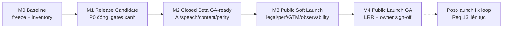
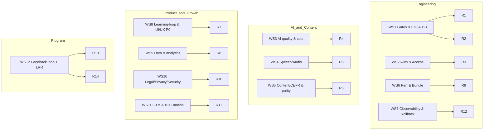
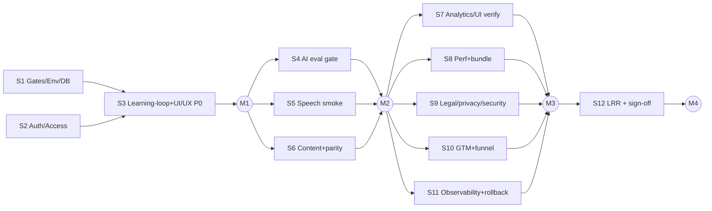

# Design Document

Vai chinh: Project Manager / Delivery Manager
Vai phoi hop: CTO / Tech Lead, Product Manager EdTech, CEO / General Manager

## Overview

Đây là thiết kế **chương trình ra mắt (launch program design)**, không phải thiết kế kỹ thuật của một feature. Nó trả lời ba câu hỏi:

1. **Cấu trúc mốc (milestones)** — chuỗi cổng M0→M4 để đi từ controlled beta tới Public_Launch, mỗi cổng owner ký duyệt.
2. **Workstreams** — gom Requirement 1–14 thành các luồng công việc có owner role rõ ràng (theo `task-role-router.md`).
3. **Slicing** — cách tách chương trình thành các Child_Slice, mỗi slice sau này thành một Kiro spec độc lập do Antigravity thực thi, Claude QC, Codex chỉ render asset khi thiếu.

Nguyên tắc xuyên suốt: **evidence-gated, không tự tin mù**. Không mốc nào được ký nếu thiếu Evidence (gate log / smoke / eval readout / diff review trong `qc-log.md`). Spec này điều phối; nó không sửa runtime code.

Out-of-scope: viết code production (Antigravity), render asset (Codex chỉ khi thiếu), và nội dung học chi tiết (German content roles). Spec này cũng không thay thế `risk-register.md` — nó *tiêu thụ* risk register và đóng từng risk qua các Requirement.

## Milestone Architecture

Mỗi mốc là một **owner-signed gate**. Quy tắc: không sang mốc sau khi còn P0_Risk mở thuộc mốc trước.

| Mốc | Định nghĩa "đạt" | Requirement gating | Owner ký |
| --- | --- | --- | --- |
| **M0 — Baseline** | Scope freeze; inventory mọi P0/P1 đang mở; gates xanh hiện hành; tree sạch/phân loại | R1, R2 (một phần) | CEO/GM |
| **M1 — Release Candidate** | Mọi P0_Risk runtime đóng; auth/env/db sạch; learning-loop P0 + UI/UX P0 hoàn tất | R1, R2, R3(1–2), R7 | CEO/GM + CTO |
| **M2 — Closed Beta GA-ready** | AI eval provider thật pass; speech smoke; content QA + parity sạch; role separation verified | R3(3–4), R4, R5, R6, R8(1) | CTO + PM EdTech |
| **M3 — Public Soft Launch** | Legal/privacy pack; perf+bundle gate; GTM funnel; observability + rollback; analytics UI verified | R8(2–3), R9, R10, R11, R12 | CEO/GM + CTO |
| **M4 — Public Launch (GA)** | LRR tổng hợp evidence; không P0 mở; owner go/no-go bằng văn bản | R13, R14 (toàn bộ) | CEO/GM (Owner) |

## Workstream → Requirement → Role mapping

| WS | Tên | Primary role | Support roles | Requirement |
| --- | --- | --- | --- | --- |
| WS1 | Release gates, env, DB hygiene | DevOps / Cloud Engineer | QA Automation, Backend, CTO | R1, R2 |
| WS2 | Auth & access control | Backend Engineer | Security/Privacy, QA Automation | R3 |
| WS3 | AI quality & cost evals | AI / LLM Engineer | German Academic Lead, Data/Analytics, Security | R4 |
| WS4 | Speech / audio readiness | Speech / Audio Engineer | AI/LLM, Audio Script & Voice Producer | R5 |
| WS5 | Content / CEFR & locale parity | German Academic Lead | Content QA, Vietnamese-German Localization | R6 |
| WS6 | Performance & bundle budget | CTO / Tech Lead | DevOps, Frontend | R9 |
| WS7 | Observability, scaling, rollback | DevOps / Cloud Engineer | Security, CTO | R12 |
| WS8 | Learning-loop & UI/UX P0 | Product Manager EdTech | Frontend, Product Designer, QA Automation | R7 |
| WS9 | Data, analytics & cache | Data / Analytics Engineer | Backend, PM EdTech | R8 |
| WS10 | Legal / privacy / security | Legal / Compliance Advisor | Security/Privacy, CEO/GM | R10 |
| WS11 | GTM & one B2C motion | Growth Lead | Data/Analytics, PM EdTech, CEO/GM | R11 |
| WS12 | Feedback loop + LRR | Project Manager / Delivery Manager | CEO/GM, Operations Manager | R13, R14 |

## Slicing strategy (chương trình → Child_Slice → Kiro spec)

Mỗi Child_Slice trong `tasks.md` tuân thủ ràng buộc của `three-agent-delivery-model.md`:

- **Claude** viết Kiro spec cho slice (requirements/design/tasks theo EARS) + handoff prompt → đặt dưới `.kiro/specs/<slice>/` (hoặc `docs/delivery/` cho slice nhỏ).
- **Antigravity** thực thi đúng spec, chạy gates (`pnpm check:quick`, `pnpm test:core`, `pnpm build`), báo cáo.
- **Codex** render asset **chỉ khi** Asset plan xác nhận registry thiếu key (reuse-first).
- **Claude** QC từng acceptance item (binary), review diff chống scope-creep, log vào `qc-log.md`.

Quy tắc kích thước slice: mỗi slice đóng **một** nhóm Requirement của một WS, kết thúc bằng gate xanh + QC pass. Slice nào đã có spec sẵn (vd `fuxie-ui-ux-p0-remediation`) thì **tái dùng**, không tạo trùng — chỉ drive nó tới done.

## Ordering & dependencies

Phụ thuộc cốt lõi: **auth + gates + env phải sạch trước** (S1, S2) vì mọi smoke/eval dựa vào môi trường tái lập (bài học từ phase 66–67: dev-auth blocker chặn toàn bộ). AI/speech/content (S4–S6) chạy song song được sau M1. Legal + observability (S9, S11) là cứng cho M3, không rút gọn.

## Reuse map (không tạo trùng)

- **UI/UX P0**: dùng `.kiro/specs/fuxie-ui-ux-p0-remediation/` (TICKET-01..04) — drive tới done, đừng viết spec mới.
- **Learning-loop P0**: dùng `docs/delivery/slice-A..E-*.md` + `qc-log.md`.
- **Risk**: `docs/intake/risk-register.md` là nguồn risk; mỗi Requirement ghi rõ "đóng R-0xx".
- **Gates**: dùng nguyên các script trong `package.json` (`check:quick`, `test:core`, `qa:content`, `security:secrets`, `smoke:full-local`, `bundle:budget`, `perf:local`, `eval:ai*`) — không phát minh gate mới.
- **Asset**: theo `docs/design/asset-reuse-map.md`; Codex chỉ render khi thiếu key.

## Non-goals

- Không xây production auth mới ngoài phạm vi cần cho public path (tránh lặp guardrail phase 66).
- Không mở rộng teacher/admin B2B trước khi B2C motion ổn (R-011).
- Không tạo CI job/script mới nếu gate hiện có đã phủ.

## QC checklist (Claude chạy ở mỗi slice trả về)

- Acceptance criteria của slice đạt từng mục (binary).
- Gates xanh: `pnpm check:quick`, `pnpm test:core`, `pnpm build` (và smoke/eval khi slice yêu cầu).
- Chỉ các file trong Tech Design của slice bị đổi (diff reviewed, no scope creep).
- Không fake/placeholder UI; lỗi là learner-facing nơi spec yêu cầu.
- Reuse asset/component sẵn có; render mới chỉ nơi Asset plan cho phép.
- Cập nhật trạng thái Requirement tương ứng + ghi `qc-log.md`.
