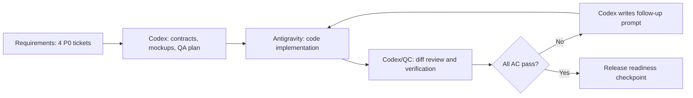

# Technical Design - Fuxie Learner P0 Remediation

Vai chinh: Project Manager / Delivery Manager
Vai phoi hop: CTO / Tech Lead, QA Automation Engineer, Product Designer / UX/UI Designer

## Overview

This design converts the P0 requirements into implementation contracts that Antigravity can code against and Codex can verify. The solution strategy is "reuse first":

- Reuse CEFR color pairs from `apps/web/src/lib/constants/cefr.ts`.
- Reuse existing reward containment semantics from dashboard backbone patterns.
- Centralize focus styling through `MeasuredLink` where possible.
- Use a shared confirm-exit dialog instead of three one-off modals.
- Treat AI/service failures as neutral retry states, not learner mistakes.
- Avoid broad rewrites, new infrastructure, or visual redesign beyond the P0 contracts.

The current worktree already contains an earlier Codex implementation pass. Antigravity should inspect that diff and either keep, correct, or replace it. Antigravity remains the code owner from this point forward.

## Locked Decisions

| Decision | Locked value |
| --- | --- |
| Active nav colors | Background `#2EC4B6`, foreground `var(--fuxie-blue-900)` |
| Header XP chip | `var(--fuxie-blue-500)` background, white text |
| Default focus token | `outline: 2px solid var(--fuxie-blue-700); outline-offset: 2px` |
| Dark chrome focus fallback | `var(--fuxie-blue-200)` when needed for visual clarity |
| Reward amber | Only inside reward subtree selectors |
| Confirm exit primary focus | Stay/cancel action receives initial focus |
| Grading unavailable tone | Neutral/system, never incorrect/error-red |
| German overflow approach | Scroll tables, wrap long text, preserve content |

## Architecture



## Components and Contracts

### Contract 1: CEFR badge color pair

Target file:

- `apps/web/src/components/dashboard/dashboard-client.tsx`

Expected implementation:

```tsx
const cefrTheme = getCefrTheme(level)

<span
  style={{
    backgroundColor: cefrTheme.bg,
    borderColor: cefrTheme.border,
    color: cefrTheme.text,
  }}
>
  {level}
</span>
```

Forbidden implementation:

- `text-white` on CEFR color fills.
- `getCefrTheme(level).css` as the badge background when paired with white text.

### Contract 2: Active nav state

Target files:

- `apps/web/src/components/shared/sidebar.tsx`
- `apps/web/src/components/shared/mobile-shell.tsx`
- `apps/web/src/app/globals.css` if CSS helper classes are involved.

Expected implementation:

- Sidebar active item and bottom-nav active item use the same foreground/background pair.
- Text color is navy, not white.
- Active label inherits current color instead of overriding to white.

Recommended Tailwind shape:

```tsx
"bg-[#2EC4B6] text-[var(--fuxie-blue-900)]"
```

### Contract 3: Reward amber containment

Target files:

- `apps/web/src/components/dashboard/dashboard-client.tsx`
- `apps/web/src/components/shared/mobile-shell.tsx`
- `apps/web/src/app/globals.css`

Allowed reward contexts:

```html
data-reward-state="preview"
data-reward-state="earned"
data-reward-state="receipt"
data-reward-context="true"
```

Design intent:

- Amber means "reward is happening or being previewed".
- Always-mounted navigation or status chrome should not be amber.
- Dashboard mission cards may mark reward states.
- Generic assignment metadata should be blue or neutral.

Implementation guidance:

- Add `data-reward-state` only at the smallest subtree that actually contains the reward moment.
- Prefer recoloring non-reward nodes over adding overly broad reward wrappers.
- Header XP chip should be brand blue, not a reward context exception.

### Contract 4: Focus-visible navigation

Target file:

- `apps/web/src/components/performance/measured-link.tsx`

Preferred implementation:

- Add a reusable focus-visible class at `MeasuredLink`, merging with caller classes.
- Preserve caller-provided `className`.
- Do not remove existing hover/active behavior.

Expected class shape:

```tsx
outline-none focus-visible:outline focus-visible:outline-2 focus-visible:outline-offset-2 focus-visible:outline-[var(--fuxie-blue-700)]
```

Dark chrome override:

- Sidebar and drawer call sites may add `focus-visible:outline-[var(--fuxie-blue-200)]`.

### Contract 5: German overflow behavior

Target files:

- `apps/web/src/components/grammar/grammar.module.css`
- `apps/web/src/components/vocabulary/vocabulary-client.tsx`
- `apps/web/src/components/vocabulary/exercises/exercise-ui.ts`
- Optional future primitive: `apps/web/src/components/ui/de.tsx` or equivalent.

Grammar table CSS:

```css
.tableWrap {
  overflow-x: auto;
  overflow-y: hidden;
  -webkit-overflow-scrolling: touch;
}

.grammarTable {
  min-width: max-content;
}

.grammarTable th,
.grammarTable td {
  min-width: 8rem;
  hyphens: auto;
  overflow-wrap: anywhere;
}
```

Vocabulary title:

- Replace one-line truncation with two-line clamp.
- Add `title={theme.title}` or equivalent full-text access.
- Use `overflow-wrap:anywhere`.

Exercise UI:

- Add safe wrapping classes to option, pair-card, and token class strings.
- Ensure flex/grid children can shrink with `min-w-0` where needed.

Optional semantic primitive:

```tsx
type DeProps = {
  children: React.ReactNode
  className?: string
}

export function De({ children, className }: DeProps) {
  return (
    <span lang="de" className={cn("hyphens-auto [overflow-wrap:anywhere]", className)}>
      {children}
    </span>
  )
}
```

Sprint 1 may ship high-risk call-site wrapping first, then migrate broader German content later.

### Contract 6: ConfirmExitDialog

Target files:

- `apps/web/src/components/ui/confirm-exit-dialog.tsx`
- `apps/web/src/components/session/SessionPlayer.tsx`
- `apps/web/src/components/grammar/LessonPlayer.tsx`
- `apps/web/src/components/writing/writing-player.tsx`
- `apps/web/messages/vi.json`
- `apps/web/messages/de.json`
- `apps/web/messages/en.json`

Dialog behavior:

- Render only when requested.
- Focus the stay/cancel action on open.
- `Escape` triggers stay/cancel, not destructive exit.
- Tab stays inside the dialog while open.
- Exit action calls the original navigation.
- Stay action closes the dialog and preserves local state.
- Copy comes from i18n.

Minimal prop contract:

```tsx
type ConfirmExitDialogProps = {
  open: boolean
  title: string
  description: string
  stayLabel: string
  exitLabel: string
  ariaLabel?: string
  onStay: () => void
  onExit: () => void
}
```

Flow-specific guards:

| Flow | Guard condition | Exit target |
| --- | --- | --- |
| Session | Active, not loading, not finished, elapsed time > 0 | `/dashboard` |
| Grammar lesson | Current step is not `hero` and not `results` | topic route |
| Writing | Phase is writing and draft/form has content | `/writing` |

### Contract 7: Fail-open grammar grading

Target file:

- `apps/web/src/components/grammar/ExerciseRenderer.tsx`

Expected state:

- Each AI-graded exercise type that calls `/api/v1/grade` has a `gradingError` or equivalent unavailable state.
- On non-success response, invalid payload, network error, or parse failure:
  - Do not set answered as incorrect.
  - Do not call `onAnswer(false)`.
  - Preserve the learner input.
  - Show neutral retry copy.
  - Allow retry.
- On input change:
  - Clear unavailable state.

Forbidden behavior:

```tsx
catch {
  onAnswer(false)
}
```

### Contract 8: Video-call feedback status

Target file:

- `apps/web/src/components/chat/VideoCallLayout.tsx`

Expected state machine:

```ts
type PronunciationFeedbackStatus = "pending" | "ready" | "unavailable"
```

Expected rendering:

- `ready` plus errors: show pronunciation error list.
- `ready` plus empty errors: show no-errors message.
- `unavailable`: show neutral unavailable copy.
- `pending`: no summary or loading state depending on current UX.

Forbidden behavior:

- Empty parse catch that leaves `pronunciationErrors=[]` and renders no-errors copy.

## Locale Design

Required namespaces/keys:

| Namespace | Keys |
| --- | --- |
| `UI` | confirm exit title, description, stay label, exit label, aria label |
| `WritingPlayer` | writing-specific exit title/description/labels if generic UI keys are not enough |
| `Grammar` | grading unavailable title/message/retry |
| `Chat.videoCall` | feedback unavailable |
| `SessionPlayer` or existing session namespace | quit-session title if referenced |

Locale rule:

- `vi`, `de`, and `en` must parse as JSON.
- `vi` and `de` must pass locale parity.
- New user-facing strings must not be hardcoded in TSX.

## Testing Strategy

### Static checks

Run from `apps/web` with bundled Node if `pnpm` is unavailable:

```powershell
& 'C:\Users\DMF Schule\.cache\codex-runtimes\codex-primary-runtime\dependencies\node\bin\node.exe' 'node_modules/next/dist/bin/next' typegen .
& 'C:\Users\DMF Schule\.cache\codex-runtimes\codex-primary-runtime\dependencies\node\bin\node.exe' 'node_modules/typescript/bin/tsc' --noEmit
```

Known blocker:

- `tsc --noEmit` currently fails on unrelated baseline error in `apps/web/src/components/listening/lesson-player.tsx` because `DEFAULT_SPEEDS[cefrLevel]` can be `undefined`.

### Repo checks

```powershell
& '<bundled-node>' 'node_modules/tsx/dist/cli.mjs' scripts/check-locale-parity.ts
& '<bundled-node>' 'node_modules/tsx/dist/cli.mjs' scripts/check-visual-audit-pack.ts
```

Expected:

- Locale parity passes for `vi` and `de`.
- Visual audit pack passes.

### Focused verification

| Requirement | Verification |
| --- | --- |
| Contrast | Inspect computed colors or run contrast detector on touched surfaces |
| Amber containment | Run reward-amber containment test or detector |
| Focus | Keyboard-tab sidebar and bottom nav, verify visible ring |
| German overflow | 360 px manual smoke with synthetic long German word |
| Confirm exit | E2E/manual smoke: exit active flow, stay, then exit |
| Fail-open grading | Mock `/api/v1/grade` failure, confirm retry and no wrong answer |
| Video feedback | Mock parse failure, confirm unavailable copy not no-errors |

### Vitest note

If direct Vitest execution fails because the local harness cannot resolve workspace dependencies such as `react-dom/server`, report it as environment/harness limitation and use static/manual focused verification until the workspace runner is available.

## Rollout Plan

Phase 0 - Codex plan lock:

- Requirements, tech design, and tasks are written.
- Antigravity prompt is prepared.
- Codex mockup tasks are queued.

Phase 1 - Antigravity review current diff:

- Inspect existing remediation changes in the worktree.
- Keep changes that satisfy this spec.
- Correct or replace changes that drift from locked contracts.

Phase 2 - Antigravity implementation hardening:

- Close remaining grey-text sweep, reward containment gaps, German `<De>` optional wrapper decision, and focused tests.
- Fix any regressions caused by current partial implementation.

Phase 3 - Codex/QC review:

- Review Antigravity diff against each acceptance criterion.
- Run available checks.
- Write follow-up prompt for any remaining blocker.

Phase 4 - Release readiness:

- Requirements 1 through 7 pass.
- Known unrelated baseline blockers are separately ticketed.
- Anh approves whether to stage/commit or continue with P1 polish.

## Risks and Mitigations

| Risk | Likelihood | Mitigation |
| --- | --- | --- |
| Current worktree contains partial code from Codex before role change | High | Antigravity starts by reviewing current diff, not assuming clean baseline |
| TypeScript global check blocked by unrelated listening error | High | Document blocker; do not hide it; optionally hand Antigravity a separate baseline-fix prompt |
| Reward wrappers become too broad and allow amber leakage | Medium | Prefer recolor for non-reward nodes; detector/QC verifies ancestry |
| Confirm dialog traps focus incorrectly | Medium | Keep simple prop contract, initial focus on stay, ESC cancels |
| Fail-open state accidentally marks answer wrong elsewhere | Medium | Static search for `onAnswer(false)` in AI error branches |
| German `<De>` migration grows too large | Medium | Sprint 1 limits to high-risk call sites; broader migration becomes follow-up |
