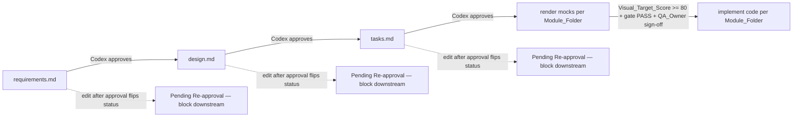

- Vai chinh: Product Designer
- Vai phoi hop: Product Manager EdTech, QA Automation Engineer, CTO/Tech Lead, Illustrator / 3D Mascot Artist

# Design Document — fuxie-visual-mocktest-pack

## Status

Status: Approved by Codex
Last Reviewed: 2026-05-17T00:00:00Z

Phase: Design. Gate state: requirements.md = Approved by Codex (2026-05-17T00:00:00Z); design.md = Approved by Codex (2026-05-17T00:00:00Z); tasks.md = Pending Codex Approval (in authoring).

## Overview

Spec `fuxie-visual-mocktest-pack` định nghĩa **bộ artifact thiết kế** (Visual Mocktest Pack) đặt tại `docs/design/fuxie-visual-mocktests/`. Pha design tạo ra **bản blueprint** mô tả kiến trúc pack, hợp đồng nội dung của artifact, rubric chấm Visual_Target_Score, Workflow_Gate, và Open Design Decisions đã được CHỐT (priority order, Style_Master inheritance). Pha design **không** tạo thư mục `docs/design/fuxie-visual-mocktests/`, **không** tạo file artifact (README, mock-*.png, qa-checklist.md, implementation-notes.md, generation-prompt.md), và **không** render bất kỳ ảnh nào.

design.md là blueprint thuần. tasks.md (giai đoạn kế tiếp, sẽ được soạn sau khi Codex duyệt design.md) sẽ sequence công việc tác giả các artifact thực tế. Trước khi tasks.md được Codex duyệt, cấm gen ảnh và cấm scaffolding artifact (Requirement 10, AC 1).

## 1. Pack Architecture

Root path của Mocktest_Pack: `docs/design/fuxie-visual-mocktests/` (Requirement 1, AC 1). Đường dẫn này là tham chiếu mô tả; **design.md không tạo thư mục này**.

```
docs/design/fuxie-visual-mocktests/
├── README.md
├── 00-style-master/
│   ├── mock-desktop.png
│   ├── mock-mobile.png
│   ├── mock-state.png
│   ├── qa-checklist.md
│   ├── implementation-notes.md
│   └── generation-prompt.md
├── 01-dashboard/        (cùng 6 file)
├── 02-course/           (cùng 6 file)
├── 03-session/          (cùng 6 file)
├── 04-review/           (cùng 6 file)
├── 05-vocabulary/       (cùng 6 file)
├── 06-grammar/          (cùng 6 file)
├── 07-listening/        (cùng 6 file)
├── 08-speaking/         (cùng 6 file)
├── 09-reading/          (cùng 6 file)
├── 10-writing/          (cùng 6 file)
├── 11-exam/             (cùng 6 file)
├── 12-rewards/          (cùng 6 file)
├── 13-missions/         (cùng 6 file)
├── 14-chat/             (cùng 6 file)
├── 15-profile/          (cùng 6 file)
├── 16-teacher/          (cùng 6 file)
└── 17-admin/            (cùng 6 file)
```

**Hợp đồng 6 file bắt buộc cho mỗi Module_Folder** (Requirement 1, AC 4; Requirement 12, AC 1):

| File | Mục đích | Reference |
| --- | --- | --- |
| `mock-desktop.png` | Render trạng thái mặc định, viewport 1440×900 | Requirement 5, AC 1 |
| `mock-mobile.png` | Render cùng module, viewport 390×844 | Requirement 5, AC 2 |
| `mock-state.png` | Đúng MỘT trạng thái phụ duy nhất (V0) | Requirement 5, AC 3; Glossary Mock_State |
| `qa-checklist.md` | Rubric chấm + Visual Target Score sign-off | Requirement 6 |
| `implementation-notes.md` | Token, layout, breakpoint, component reuse | Requirement 7 |
| `generation-prompt.md` | Provenance: prompt + forbidden IP + reviewer | Requirement 12 |

Mỗi file phải > 0 byte, viết thường, sai một ký tự là Workflow_Gate đánh BLOCKED (Requirement 1, AC 5).

**Trách nhiệm của README** (Requirement 1, AC 6, 7; Requirement 10, AC 5):

1. Liệt kê đầy đủ 18 Module_Folder theo đúng thứ tự `00-style-master` … `17-admin`, mỗi mục gồm liên kết tương đối tới folder + 1 dòng learning intent (1–200 ký tự).
2. Mục **Workflow_Gate** ghi rõ thứ tự cố định `requirements.md` → `design.md` → `tasks.md` → render mocks → implement code, kèm bảng trạng thái thủ công.
3. Mục **Originality_Guardrail** nêu phạm vi cấm copy Inspiration_Sources (Mykonos, Two Point Campus) và mọi IP bên thứ ba.
4. Mục **Roles** ghi tên 4 role (Pack_Owner, Style_Master_Owner, Priority_Owner, QA_Owner) cùng người đảm nhiệm và ngày hiệu lực (Requirement 11, AC 9).
5. Mục **Scope Change** placeholder cho mọi Module_Folder mới ngoài 18 folder gốc (Requirement 1, AC 8).
6. Bảng trạng thái Workflow_Gate thủ công cho 3 file spec.

**Ví dụ định dạng bảng trạng thái Workflow_Gate trong README** (Requirement 10, AC 5):

| File | Status | Last Status Change (ISO 8601) | Reviewer |
| --- | --- | --- | --- |
| `requirements.md` | Approved by Codex | 2026-05-17T00:00:00Z | Codex |
| `design.md` | Pending Codex Approval | 2026-05-17T00:00:00Z | Codex |
| `tasks.md` | Draft | — | — |

**Lưu ý quan trọng**: design.md **không** render bất kỳ ảnh nào. Quyền render ảnh chỉ được mở sau khi tasks.md được Codex duyệt (Requirement 10, AC 1).

## 2. Style Master Design System (`00-style-master`)

Style_Master là **nguồn ngôn ngữ visual gốc** của Fuxie và là canonical source cho 17 Module_Folder còn lại (Requirement 2, AC 1, 3). 17 module phía sau **không** được khai báo token mới mà không tham chiếu vào Style_Master (Requirement 2, AC 3, 4).

**Định hướng cho 10 yếu tố visual bắt buộc** (Requirement 2, AC 1) — design.md chỉ đặt direction, **không** chốt giá trị HEX cụ thể; giá trị token cuối cùng nằm trong `00-style-master/implementation-notes.md` (Requirement 7, AC 3) và sẽ được tác giả khi tasks.md mở:

(a) **Primary palette** — định hướng giữ nguyên brand Fuxie sky-blue + teal anchor (theo Illustrator / 3D Mascot Artist quality checklist: "Preserves Fuxie sky-blue and teal identity"). Tối thiểu 5 token: surface base, surface raised, primary brand, primary brand contrast, accent teal.
(b) **Secondary palette** — tối thiểu 3 token cho trạng thái học tập: success (đúng), warning (cần ôn), danger/error (sai/lỗi).
(c) **Typography tiers** — tối thiểu 5 cấp: heading (cho tiêu đề module), subheading (block title), body (đọc dài), caption (chú thích nhỏ), label (button/chip). Body tham chiếu ≥ 14 px hiệu dụng ở mobile, caption ≥ 12 px (Requirement 4, AC 5).
(d) **Spacing tiers** — tối thiểu 5 cấp (gợi ý thang 4/8/12/16/24/32 — chốt giá trị trong implementation-notes).
(e) **Radius tiers** — tối thiểu 3 cấp (small cho chip/icon-button, medium cho card, large cho hero/CTA).
(f) **Shadow tiers** — tối thiểu 2 cấp (resting elevation cho card, raised elevation cho dialog/CTA hover).
(g) **Icon style** — friendly geometric line/fill, ≥ 6 icon học tập (book, ear, mic, pen, calendar, target hoặc tương đương). Tránh skeuomorphic và tránh icon ẩn dụ tôn giáo/địa lý của Inspiration_Sources.
(h) **Mascot tone** — friendly, learner-supportive, palette sky-blue/teal khớp brand Fuxie (theo profile Illustrator / 3D Mascot Artist). Mascot không bắt chước nhân vật của Inspiration_Sources.
(i) **Illustration style** — flat-with-soft-depth, ≥ 2 mẫu minh hoạ trong Style_Master (ví dụ "learner at desk", "study companion scene"). Tránh photorealism, tránh pixel-art, tránh thẩm mỹ Greek-island và tránh thẩm mỹ campus parody.
(j) **Isometric / world staging convention** — quy ước tile grid (đường ranh có thể thấy hoặc landmark đại diện), depth ordering, camera framing cố định (Requirement 4, AC 7). Nguồn cảm hứng kỹ thuật là isometric staging trừu tượng; **không** dùng tỉ lệ tile, palette, hay silhouette nhân vật của Mykonos.

**Originality_Guardrail cho Style_Master** (Requirement 9, AC 2): cấm copy chủ đề Mykonos Greek-island (kiến trúc Cycladic, palette Aegean trắng-xanh, mái vòm), cấm copy nhân vật / place name / themed props của Two Point Campus, cấm copy bất kỳ IP bên thứ ba khác. Cảm hứng được giữ ở mức **trừu tượng** (chỉ ý tưởng kỹ thuật staging).

**Lưu ý phạm vi** (Requirement 2, AC 6): Style_Master KHÔNG chứa nội dung học của bất kỳ module nào (không có dashboard, không có vocabulary, không có grammar). Style_Master chỉ chứa ngôn ngữ visual nền.

**Token registry** thực sự (tên token + giá trị + module dự kiến dùng) được đặt trong `00-style-master/implementation-notes.md` mục "Token registry" (Requirement 7, AC 3) — viết khi tasks.md được duyệt, không phải bây giờ.

## 3. Module Identity Matrix

Bảng dưới khai báo Module_Identity định hướng cho 17 Module_Folder ngoài Style_Master, đảm bảo mỗi module khác biệt ở **≥ 2 trong 4 chiều**: palette phụ / biểu tượng chủ đạo / layout signature / learning intent prop (Requirement 3, AC 1). Mọi cue đều original cho Fuxie và **không** copy Inspiration_Sources.

| # | Module | Learning intent (1 câu) | Visual identity cues | Secondary palette idea | Primary icon / prop | Layout signature | Representative flow (desktop + mobile) | Selected mock-state |
| --- | --- | --- | --- | --- | --- | --- | --- | --- |
| 01 | dashboard | Tổng quan tiến trình học hôm nay và CTA tiếp theo | Hero "today" + 3 KPI tile | sky-blue + warm sand | progress ring | Hero card + 3-column tile row (desktop) / vertical stack (mobile) | "Today view" with streak + next session CTA | empty state (chưa có session hôm nay) |
| 02 | course | Khám phá lộ trình CEFR và chọn course | Course card grid với CEFR chip | indigo + neutral grey | CEFR badge | Filter rail trái + card grid 3-col (desktop) / 1-col card list (mobile) | "Course catalog" với filter A1–B2 | loading state (đang tải catalog) |
| 03 | session | Vào ngay phiên học hiện tại với hướng dẫn rõ | Stage center + step counter | teal + cool grey | play/start arrow | Single stage center + bottom action bar | "Start today's session" – step 1 of N | success state (hoàn thành phiên) |
| 04 | review | Ôn lại kiến thức yếu qua spaced review | Card flip stack | amber + soft mint | flip card | Card stack center + queue rail (desktop) / single card (mobile) | "Spaced review queue" với card hiện tại | empty state (không có item cần ôn) |
| 05 | vocabulary | Học và nhớ từ vựng mới | Word card lớn + flashcard motion hint | coral + warm cream | flashcard | Big card + meaning panel (desktop) / stacked card (mobile) | "Learn 10 new words" với card front | success state (đã thuộc 10 từ) |
| 06 | grammar | Nắm rule ngữ pháp với ví dụ minh hoạ | Rule banner + diagrammed example | violet + paper white | grammar diagram | Rule header + 2-col explain/example (desktop) / accordion (mobile) | "Lesson: Akkusativ" với rule + ví dụ | error state (sai pattern thường gặp) |
| 07 | listening | Nghe đoạn audio chuẩn và bắt key information | Waveform + transcript pane | deep navy + soft yellow | headphone + waveform | Player top + transcript left + question right (desktop) / player + collapsible transcript (mobile) | "Listen and answer" trong session | loading state (đang tải audio) |
| 08 | speaking | Luyện phát âm với phản hồi pronunciation | Mic-centric + waveform feedback | rose + cool teal | microphone | Center mic large + feedback panel (desktop) / mic full-bleed bottom (mobile) | "Speak the sentence" với scoring meter | error state (pronunciation lệch) |
| 09 | reading | Đọc đoạn văn và trả lời câu hỏi hiểu | Reading column rộng + side question | sage green + ivory | open book | Two-pane reading left + question right (desktop) / tabbed reading/question (mobile) | "Read and answer" với passage hiện tại | success state (đạt comprehension) |
| 10 | writing | Viết câu / đoạn văn với hint cấu trúc | Writing canvas + hint chips | plum + soft sand | pen / cursor | Editor center + hint rail (desktop) / editor + hint sheet (mobile) | "Write your answer" với editor active | error state (thiếu yêu cầu cấu trúc) |
| 11 | exam | Mô phỏng đề thi CEFR với timer | Timer banner + question paginator | crimson + neutral | timer / clock | Timer header + question center + pagination (desktop) / timer sticky + question + nav (mobile) | "Mock test A2 – Q3 of 30" | error state (hết giờ trước khi nộp) |
| 12 | rewards | Hiển thị Fucoin / streak / badge đã đạt | Badge wall + Fucoin counter | gold + cocoa | trophy / coin | Badge grid + counter hero (desktop) / counter top + grid below (mobile) | "Your rewards" sau khi vừa unlock | success state (vừa unlock badge mới) |
| 13 | missions | Theo dõi nhiệm vụ ngày/tuần và CTA hoàn thành | Mission list với progress bar | emerald + soft cream | mission flag | Mission list 1-col + progress bar (cả desktop + mobile) | "Daily missions" với 3 nhiệm vụ | empty state (đã hoàn thành tất cả) |
| 14 | chat | Hỏi đáp với AI tutor / community | Chat thread + composer | periwinkle + neutral grey | speech bubble | Thread center + composer bottom (desktop wide) / full-bleed thread + composer (mobile) | "Ask Fuxie tutor" với thread hiện tại | loading state (tutor đang trả lời) |
| 15 | profile | Quản lý hồ sơ học và mục tiêu cá nhân | Avatar + goals card | mauve + ivory | avatar + goal flag | Avatar header + tab row (overview/goals/settings) | "My profile – overview" | success state (vừa cập nhật mục tiêu) |
| 16 | teacher | Giáo viên theo dõi lớp và giao bài | Class roster table + assignment chip | slate + mustard | clipboard / roster | Roster table left + assignment panel right (desktop) / tabbed roster/assignment (mobile) | "Class A2 – roster + this week's assignment" | error state (assignment quá hạn submission) |
| 17 | admin | Vận hành nội bộ (user, content, billing) | Data table + filter rail | charcoal + cyan accent | gear / dashboard tile | Data table dày + filter rail trái + topbar (desktop) / filtered list view (mobile) | "Users management" với filter active | empty state (filter không trả kết quả) |

### Distinctness Audit

Yêu cầu: mọi cặp Module_Folder phải khác biệt ở ≥ 2 trong 4 chiều (palette phụ / biểu tượng chủ đạo / layout signature / learning intent prop) (Requirement 3, AC 1). Thay vì enumerate 136 cặp, dưới đây là **các nhóm có rủi ro trùng lặp cao** và bằng chứng phân biệt từng cặp.

**Nhóm 1: Skill modules dễ nhầm (vocabulary vs grammar vs reading vs writing)**
- 05 vocabulary vs 06 grammar: khác palette phụ (coral vs violet), khác icon (flashcard vs grammar diagram), khác layout signature (big card + meaning vs rule header + 2-col), khác prop (flashcard vs diagram). → khác 4/4.
- 09 reading vs 10 writing: khác palette (sage vs plum), khác icon (open book vs pen), khác layout (two-pane reading vs editor + hint rail), khác prop (book vs cursor/pen). → khác 4/4.
- 06 grammar vs 09 reading: khác palette (violet vs sage), khác icon (diagram vs book), khác layout (rule + 2-col vs reading + question), khác prop. → khác 4/4.

**Nhóm 2: Audio-centric (listening vs speaking)**
- 07 listening vs 08 speaking: khác palette (deep navy vs rose), khác icon chủ đạo (headphone vs microphone), khác layout (player + transcript + question vs mic center + feedback meter), khác prop (waveform passive vs waveform active feedback). → khác 4/4.

**Nhóm 3: Engagement / motivation (rewards vs missions vs profile)**
- 12 rewards vs 13 missions: khác palette (gold vs emerald), khác icon (trophy/coin vs flag), khác layout (badge wall vs mission list with progress bar), khác prop. → khác 4/4.
- 12 rewards vs 15 profile: khác palette (gold vs mauve), khác icon (trophy vs avatar), khác layout (badge wall vs tab row sau avatar header), khác prop. → khác 4/4.
- 13 missions vs 15 profile: khác palette (emerald vs mauve), khác icon (flag vs avatar), khác layout (mission list with progress bar vs tab row sau avatar). → khác 3/4.

**Nhóm 4: Operator surfaces (teacher vs admin)**
- 16 teacher vs 17 admin: khác palette (slate+mustard vs charcoal+cyan), khác icon (clipboard/roster vs gear/dashboard tile), khác layout (roster table + assignment panel vs data table + filter rail + topbar), khác prop (assignment chip vs filter chip). → khác 4/4.

**Nhóm 5: Catalog / queue (course vs review vs missions)**
- 02 course vs 04 review: khác palette (indigo vs amber), khác icon (CEFR badge vs flip card), khác layout (filter rail + card grid vs card stack + queue rail), khác prop. → khác 4/4.
- 02 course vs 13 missions: khác palette, khác icon, khác layout (card grid vs mission list with progress). → khác 3/4.
- 04 review vs 13 missions: khác palette (amber vs emerald), khác icon (flip card vs flag), khác layout (card stack vs mission list). → khác 3/4.

**Nhóm 6: Conversational / shell (chat vs dashboard vs session)**
- 14 chat vs 01 dashboard: khác palette (periwinkle vs sky+sand), khác icon (speech bubble vs progress ring), khác layout (thread + composer vs hero + 3 KPI tile), khác prop. → khác 4/4.
- 01 dashboard vs 03 session: khác palette (sky+sand vs teal+cool grey), khác icon (progress ring vs play arrow), khác layout (hero + tile row vs single stage center + bottom action). → khác 3/4.
- 03 session vs 14 chat: khác palette (teal vs periwinkle), khác icon (play arrow vs speech bubble), khác layout (single stage vs thread). → khác 3/4.
- 03 session vs 11 exam: khác palette (teal vs crimson), khác icon (play arrow vs timer), khác layout (single stage center vs timer header + paginator). → khác 3/4.

Mọi cặp trong nhóm rủi ro đều khác biệt ≥ 2 chiều. Mọi cặp ngoài các nhóm trên (ví dụ 01 dashboard vs 17 admin) khác palette + khác icon + khác layout signature + khác prop, mặc định ≥ 3 chiều, không cần liệt kê. Distinctness Audit pass cho 17 Module_Folder ngoài Style_Master (Requirement 3, AC 1, 4).

## 4. Artifact Templates

4 template dưới là **scaffold mô tả trong design.md**; không phải file thực tế. Tác giả Module_Folder sẽ copy template này khi tasks.md được duyệt.

### 4.1 `qa-checklist.md` template

```markdown
# QA Checklist — <module-folder>

## Learning intent (3s)
- Reviewer (chưa biết tên module) chọn đúng learning intent từ 18 lựa chọn trong ≤ 3000 ms?
- Score: __ / 20
- Lý do (current vs target):

## Module identity distinctness
- (Với 00-style-master: thay heading này bằng "Token coverage" để xác minh Style_Master mô tả đủ token cho 17 module downstream — Requirement 6, AC 5; trọng số 15 giữ nguyên.)
- Khác biệt ≥ 2/4 chiều (palette phụ / biểu tượng chủ đạo / layout signature / learning intent prop) so với 17 Module_Folder còn lại?
- Score: __ / 15
- Lý do:

## Style master compliance
- Mọi token được dùng đều tham chiếu Style_Master, không khai báo token mới?
- Score: __ / 15
- Lý do:

## Mobile readability (390×844, no horizontal overflow)
- CTA chính, tiêu đề module, learning intent chính, control state hiển thị đầy đủ ở 390×844?
- Body ≥ 14 px hiệu dụng, caption ≥ 12 px hiệu dụng?
- Không có hàng nội dung yêu cầu chiều rộng > 390 px (trừ padding)?
- Score: __ / 20
- Lý do:

## Contrast (text/chip/control)
- Text body / nền chính ≥ 4.5:1 (WCAG AA)?
- Text phụ / chip / control state ≥ 3:1?
- Đo trên ≥ 3 cặp text/nền đại diện cho mỗi mock?
- Score: __ / 15
- Lý do:

## State coverage (desktop/mobile/state)
- mock-desktop.png (1440×900) tồn tại, > 0 byte, mở được như ảnh hợp lệ?
- mock-mobile.png (390×844) tồn tại, > 0 byte, mở được như ảnh hợp lệ?
- mock-state.png tồn tại, > 0 byte, mở đúng MỘT trạng thái phụ duy nhất đã chỉ định trong implementation-notes.md?
- Result: PASS | FAIL  (pass/fail gate, KHÔNG có trọng số điểm — Requirement 6, AC 4)

## Originality (no Inspiration_Sources copy)
- Không sao chép asset / nhân vật / place name / theme của Mykonos hoặc Two Point Campus?
- Đối chiếu với generation-prompt.md mục "Originality guardrails (forbidden IP references)"?
- Score: __ / 15
- Lý do:

## Visual Target Score
- Per-dimension scores:
  - Learning intent (3s): __ / 20
  - Module identity distinctness (hoặc Token coverage cho 00-style-master): __ / 15
  - Style master compliance: __ / 15
  - Mobile readability (390×844, no horizontal overflow): __ / 20
  - Contrast (text/chip/control): __ / 15
  - Originality (no Inspiration_Sources copy): __ / 15
- State coverage gate result: PASS | FAIL
- Total Visual Target Score: __ / 100
- Pass/fail outcome: PASS | FAIL | BLOCKED
- (PASS yêu cầu: tổng ≥ 80, không chiều nào < 50% trọng số riêng, gate State coverage = PASS, QA_Owner đã ký.)
- QA_Owner: <name>
- Date (ISO 8601): YYYY-MM-DD
- Blocked? Nếu blocked, ghi rõ chiều/gate fail + remediation actions với current value/reference và target value/reference.
```

Rubric mapping (giữ nguyên cho mọi Module_Folder; với `00-style-master` heading 2 đổi tên "Module identity distinctness" → "Token coverage" nhưng trọng số 15 giữ nguyên — Requirement 6, AC 5; Requirement 8, AC 2):

```
Weighted dimensions (sum = 100):
  Learning intent in 3s                  20
  Module identity distinctness            15  (00-style-master: "Token coverage")
  Style master compliance                 15
  Mobile readability (390×844, no overflow) 20
  Contrast (text/chip/control)            15
  Originality (no Inspiration_Sources)    15
                                          ---
                                          100

Pass/fail gate (no weight):
  State coverage (desktop/mobile/state)   PASS | FAIL

Roll-up (no weight):
  Visual Target Score                     0..100 + gate + sign-off
```

### 4.2 `implementation-notes.md` template

```markdown
# Implementation Notes — <module-folder>

## Module learning intent
- Một câu mô tả learning intent (1–200 ký tự).

## Layout grid (desktop)
- Grid columns, gutter, content max-width tham chiếu Style_Master spacing tier.
- Vùng đặt CTA chính.

## Layout grid (mobile 390×844)
- Stack order, sticky top/bottom (nếu có), khu vực header (≤ 64 px theo Requirement 5, AC 2).

## Tokens used (color/typography/spacing/radius/shadow từ Style_Master)
- Tên token + tham chiếu chính xác sang 00-style-master.

## Component reuse (component nào đã có, component nào cần thêm)
- (Với 00-style-master, thay mục này bằng "Token registry" — Requirement 7, AC 3.)

## Responsive rules (breakpoint, reflow, ẩn/hiện)
- Quy tắc tại từng breakpoint.

## State chosen for mock-state.png + lý do
- Tên trạng thái phụ đã chọn (empty / loading / success / error / interaction chính).
- Lý do chọn.
- Sub-flow phụ khác được ghi nhận deferred sang V2 tại đây (Requirement 3, AC 6; Requirement 4, AC 6).

## Motion/interaction notes (nếu có)
- Mô tả tương tác chính (không phải animation production — chỉ note design intent).

## Accessibility notes (focus order, ARIA cần lưu ý, contrast cụ thể)
- Focus order, ARIA hint, contrast ratios đo được.

## Originality notes (xác nhận không trùng Inspiration_Sources)
- Xác nhận pack/module không sao chép Inspiration_Sources.
- Các điểm cảm hứng đã được trừu tượng hoá.
- Pack_Owner ký xác nhận.
- Tham chiếu chính thức sang `generation-prompt.md` của cùng Module_Folder làm canonical provenance cho danh sách forbidden IP references và prompt đã dùng (Requirement 9, AC 5).
```

Với `00-style-master`: thêm heading **"Token registry"** (thay cho "Component reuse") liệt kê toàn bộ token theo nhóm color / typography / spacing / radius / shadow + module dự kiến dùng (Requirement 7, AC 3).

### 4.3 `generation-prompt.md` template

```markdown
# Generation Prompt — <module-folder>

## Visual intent
- Một câu mô tả visual intent của mock (khác với learning intent — tập trung vào tone/atmosphere/staging).

## Module identity cues
- Palette phụ, biểu tượng chủ đạo, layout signature, learning intent prop (theo Requirement 3, AC 1).

## Positive prompt
- Prompt tích cực gửi cho công cụ render: mô tả khung cảnh, layout, mascot pose, độ rõ CTA.
- Nêu rõ viewport (desktop 1440×900 hoặc mobile 390×844) tương ứng với mock đang render.

## Negative prompt
- Prompt phủ định: photorealism, pixel-art (nếu không phải style mong muốn), violence, NSFW.
- Cấm thẩm mỹ Greek-island / Mediterranean / Cycladic.
- Cấm thẩm mỹ campus parody / themed-prop comedy.
- Cấm IP bên thứ ba khác đã trích dẫn trong prompt.

## Originality guardrails (forbidden IP references)
- **Mykonos asset names**: Greek-island visuals, Aegean palette, Cycladic architecture, white-blue domed buildings, Mediterranean village motifs.
- **Two Point Campus**: characters, place names, themed props (campus parody buildings, mascot caricatures, signature campus visual gags).
- **Any other third-party IP cited in the prompt**: liệt kê tên cụ thể từng IP nếu có nhắc đến trong positive prompt; nếu không có, ghi "None cited".
- (Danh sách này phải đủ chi tiết để Originality_Guardrail trở nên auditable ở mức từng mock — Requirement 12, AC 3.)

## Model / tool / seed (if available)
- Model name, tool name, seed (nếu deterministic).
- Nếu là render thủ công bằng Figma / illustrator artist, ghi rõ "manual render — <tool name>".

## Reviewer + date
- Reviewer: <Pack_Owner name>
- Date (ISO 8601): YYYY-MM-DD
```

### 4.4 README root template

```markdown
# Fuxie Visual Mocktest Pack

## Workflow_Gate
Thứ tự cố định: requirements.md → design.md → tasks.md → render mocks → implement code.

| File | Status | Last Status Change (ISO 8601) | Reviewer |
| --- | --- | --- | --- |
| `requirements.md` | Approved by Codex | 2026-05-17T00:00:00Z | Codex |
| `design.md`       | <Pending Codex Approval / Approved by Codex / Pending Re-approval> | <ISO 8601> | <name> |
| `tasks.md`        | <Draft / Pending Codex Approval / Approved by Codex / Pending Re-approval> | <ISO 8601 hoặc —> | <name hoặc —> |

(Bảng được Pack_Owner duy trì THỦ CÔNG. Bảng này phải khớp với dòng `Status:` ở đầu mỗi file spec; lệch là stale — Requirement 10, AC 5.)

## Originality_Guardrail
Mocktest_Pack KHÔNG copy asset, nhân vật, place name, UI string, theme, logo, hoặc IP của Mykonos, Two Point Campus, hoặc bất kỳ bên thứ ba nào. Chi tiết forbidden IP references theo từng mock được ghi tại `<module-folder>/generation-prompt.md` mục "Originality guardrails (forbidden IP references)".

## Module index
1. [`00-style-master/`](00-style-master/) — Style master design system tokens cho toàn pack.
2. [`01-dashboard/`](01-dashboard/) — Tổng quan tiến trình học hôm nay và CTA tiếp theo.
3. [`02-course/`](02-course/) — Khám phá lộ trình CEFR và chọn course.
4. [`03-session/`](03-session/) — Vào ngay phiên học hiện tại với hướng dẫn rõ.
5. [`04-review/`](04-review/) — Ôn lại kiến thức yếu qua spaced review.
6. [`05-vocabulary/`](05-vocabulary/) — Học và nhớ từ vựng mới.
7. [`06-grammar/`](06-grammar/) — Nắm rule ngữ pháp với ví dụ minh hoạ.
8. [`07-listening/`](07-listening/) — Nghe đoạn audio chuẩn và bắt key information.
9. [`08-speaking/`](08-speaking/) — Luyện phát âm với phản hồi pronunciation.
10. [`09-reading/`](09-reading/) — Đọc đoạn văn và trả lời câu hỏi hiểu.
11. [`10-writing/`](10-writing/) — Viết câu / đoạn văn với hint cấu trúc.
12. [`11-exam/`](11-exam/) — Mô phỏng đề thi CEFR với timer.
13. [`12-rewards/`](12-rewards/) — Hiển thị Fucoin / streak / badge đã đạt.
14. [`13-missions/`](13-missions/) — Theo dõi nhiệm vụ ngày/tuần và CTA hoàn thành.
15. [`14-chat/`](14-chat/) — Hỏi đáp với AI tutor / community.
16. [`15-profile/`](15-profile/) — Quản lý hồ sơ học và mục tiêu cá nhân.
17. [`16-teacher/`](16-teacher/) — Giáo viên theo dõi lớp và giao bài.
18. [`17-admin/`](17-admin/) — Vận hành nội bộ (user, content, billing).

## Roles
- Pack_Owner: Product Designer — <name>, hiệu lực <ISO 8601>.
- Style_Master_Owner: Design System Designer — <name>, hiệu lực <ISO 8601>.
- Priority_Owner: Product Manager EdTech — <name>, hiệu lực <ISO 8601>.
- QA_Owner: QA Automation Engineer — <name>, hiệu lực <ISO 8601>.

(Khi role thay đổi, cập nhật README trong cùng commit thay đổi — Requirement 11, AC 9.)

## Scope Change
(Placeholder. Bất kỳ Module_Folder nào ngoài 18 folder gốc phải ghi tại đây với tên folder mới, ngày phê duyệt YYYY-MM-DD, và chữ ký dạng văn bản của Pack_Owner và Priority_Owner — Requirement 1, AC 8.)
```

## 5. Visual Generation Approach

**Quy tắc tổng**: design.md không render bất kỳ ảnh nào. Render chỉ được phép sau khi tasks.md được Codex duyệt (Requirement 10, AC 1). Phần này mô tả **cách** prompt sẽ được dựng cho 3 loại mock khi tới lúc.

**Quy trình dựng prompt cho mỗi loại mock**:

1. **Mock_Desktop (1440×900)** — Positive prompt nêu: learning intent dễ hiểu trong 3 giây, đúng một CTA chính enabled với label rõ, vùng nội dung chính ≥ 60% chiều rộng viewport, ít nhất 1 dấu hiệu Module_Identity (logo/tên module/icon đặc trưng) trong vùng nhìn đầu (Requirement 5, AC 1; Requirement 4, AC 1).
2. **Mock_Mobile (390×844)** — Positive prompt nêu: header ≤ 64 px, không tràn ngang, body ≥ 14 px hiệu dụng, caption ≥ 12 px, đúng 1 CTA chính enabled, cùng flow đại diện như Mock_Desktop (Requirement 5, AC 2, 4; Requirement 4, AC 2, 3, 5).
3. **Mock_State** — Positive prompt nêu: đúng MỘT trạng thái phụ đã chọn (theo cột "Selected mock-state" trong Module Identity Matrix); với error state phải có thông điệp lỗi đầy đủ + ít nhất 1 lối thoát (retry/back/contact) + Module_Identity vẫn nhận diện được (Requirement 5, AC 5).

**Negative prompt principles** (chung cho cả 3 loại mock):

- Forbidden IP: Mykonos Greek-island theme (kiến trúc Cycladic, palette Aegean, mái vòm), Two Point Campus characters/place names/themed props, mọi IP bên thứ ba khác (Requirement 9, AC 1, 2; Requirement 12, AC 3).
- Forbidden aesthetics: photorealism, photorealistic violence, gore, NSFW, copyrighted character likenesses.
- Forbidden tone: marketing-y commercial atmosphere, parody campus comedy.

**Provenance capture (Generation_Prompt_Notes)** — Mỗi lần render phải ghi vào `generation-prompt.md` của Module_Folder: Visual intent, Module identity cues, Positive prompt, Negative prompt, Originality guardrails (forbidden IP references) liệt kê đủ Mykonos + Two Point Campus + IP bên thứ ba khác, Model/tool/seed nếu có, Reviewer + date ISO 8601 (Requirement 12, AC 2, 3, 4, 6). Trước khi mock được coi là "visual target", `generation-prompt.md` phải đầy đủ và Reviewer + date phải khớp ngày render gần nhất.

**Originality review** — Pack_Owner (Product Designer) phối hợp với Illustrator / 3D Mascot Artist (theo profile role: "Avoids external IP resemblance") chạy Originality_Guardrail check trên 100% mock và 100% Module_Folder trước khi pass Visual_Target_Score (Requirement 9, AC 1, 7). Bất kỳ mock nào bị nghi ngờ copy Inspiration_Sources sẽ bị fail mục "Originality" trong QA_Checklist và phải redesign trước khi tái thẩm định (Requirement 9, AC 4).

**Re-render rule** — Khi bất kỳ một trong 3 file mock của một Module_Folder bị render lại hoặc thay thế, `generation-prompt.md` của Module_Folder đó **phải** được cập nhật trong cùng change set với Reviewer + date mới. Provenance cũ bị coi là stale; stale provenance block cổng sign-off Visual_Target_Score cho tới khi Generation_Prompt_Notes được cập nhật (Requirement 12, AC 6).

**Lưu ý cuối**: Không có ảnh nào được render trước khi tasks.md được Codex duyệt. Mọi spike trước cổng phải gắn nhãn `spike/throwaway` và **không** được commit vào `docs/design/fuxie-visual-mocktests/` cũng như **không** được dùng làm visual target chính thức (Requirement 10, AC 4).

## 6. QA and Scoring Process

**Rubric — 6 weighted dimensions + 1 pass/fail gate + 1 roll-up** (Requirement 8, AC 1, 2; Requirement 6, AC 3, 4):

| Dimension | Weight | Notes |
| --- | --- | --- |
| Learning intent in 3s | 20 | Người chấm chưa biết tên module chọn đúng intent ≤ 3000 ms (Requirement 4, AC 1) |
| Module identity distinctness | 15 | Khác ≥ 2/4 chiều với mọi Module_Folder khác. **Với `00-style-master`**: thay bằng "Token coverage cho 17 module downstream" (15) — Requirement 8, AC 2 |
| Style master compliance | 15 | Token tham chiếu Style_Master, không khai báo token mới |
| Mobile readability (390×844, no horizontal overflow) | 20 | Body ≥ 14 px, caption ≥ 12 px, không tràn ngang |
| Contrast (text/chip/control) | 15 | Text body ≥ 4.5:1, text phụ/chip/control ≥ 3:1 (WCAG AA) |
| Originality (no Inspiration_Sources copy) | 15 | Đối chiếu với `generation-prompt.md` mục "Originality guardrails" |
| **Tổng trọng số** | **100** | 20 + 15 + 15 + 20 + 15 + 15 = 100 |
| State coverage (desktop/mobile/state) | gate | PASS / FAIL — KHÔNG có trọng số (Requirement 6, AC 4; Requirement 8, AC 1) |
| Visual Target Score | roll-up | Tổng 6 chiều + gate + sign-off |

**Pass conditions — phải thoả ĐỒNG THỜI cả 4** (Requirement 8, AC 3):

1. Visual_Target_Score ≥ 80/100.
2. Không chiều trọng số nào < 50% trọng số riêng (Learning intent ≥ 10, Module identity ≥ 7.5, Style master ≥ 7.5, Mobile readability ≥ 10, Contrast ≥ 7.5, Originality ≥ 7.5 — chấm số nguyên).
3. Pass/fail gate "State coverage (desktop/mobile/state)" = PASS.
4. QA_Owner đã ký (tên + ngày ISO 8601) trong mục "Visual Target Score" của QA_Checklist.

**Block conditions — bất kỳ điều kiện nào fail thì cổng sign-off implement bị block** (Requirement 8, AC 4; Requirement 6, AC 6):

- Visual_Target_Score < 80/100 → block, kể cả khi tổng 6 chiều ≥ 80 nhưng có chiều dưới 50%.
- Bất kỳ chiều nào < 50% trọng số → block (kể cả tổng ≥ 80).
- State coverage gate FAIL → block ngay lập tức bất kể tổng điểm.
- QA_Owner chưa ký → block bất kể giá trị điểm (Requirement 8, AC 6).

**Scoring procedure** (Requirement 8, AC 5):

1. QA_Owner đọc 3 mock files (`mock-desktop.png`, `mock-mobile.png`, `mock-state.png`) + `implementation-notes.md` + `generation-prompt.md` của Module_Folder.
2. Chấm từng chiều trọng số bằng số nguyên trong khoảng 0..weight.
3. Đánh kết quả PASS / FAIL cho gate "State coverage (desktop/mobile/state)".
4. Ghi lý do chấm cho mỗi chiều và lý do cho gate (đặc biệt khi FAIL).
5. Cộng tổng 6 chiều ra Visual_Target_Score.
6. Ký tên QA_Owner + ngày ISO 8601 trong mục "Visual Target Score" của QA_Checklist.

**Re-scoring SLA** (Requirement 8, AC 7): Khi mock của một Module_Folder thay đổi sau khi đã chấm, Visual_Target_Score phải được chấm lại trong **2 ngày làm việc**, mục "Visual Target Score" được cập nhật ngày chấm và tên QA_Owner mới, và pass/fail conditions ở trên được đánh giá lại.

**Remediation log** (Requirement 6, AC 7): Khi một heading có trọng số bị fail (< 50% trọng số riêng) hoặc gate State coverage = FAIL, QA_Checklist phải ghi:

- Current value/reference (ví dụ: "title contrast 3.2:1", "palette phụ trùng 06-grammar", "thiếu mock-state.png").
- Target value/reference (ví dụ: "≥ 4.5:1", "đổi sang palette phụ riêng", "bổ sung mock-state.png cho error state").
- Hành động khắc phục có thể quan sát được.

**Định dạng "blocked" trong QA_Checklist** (Requirement 6, AC 6, 7; Requirement 8, AC 4):

```
## Visual Target Score
- Total: 78 / 100
- State coverage gate: PASS
- Outcome: BLOCKED
- Failed dimensions / gates:
  - Mobile readability (390×844, no horizontal overflow): 9/20 (< 50% of 20). Current: card grid 3-col vẫn xuất hiện ở 390×844 gây tràn ngang. Target: card grid xuống 1-col ở viewport ≤ 480 px.
- Remediation actions:
  - Redesign mobile reflow theo Layout grid (mobile 390×844) trong implementation-notes.md.
- QA_Owner: <name>
- Date (ISO 8601): 2026-05-20
```

**Per-module gating** (Requirement 8, AC 8): Mỗi Module_Folder được chấm độc lập. Pack-level approval **không** cumulative — đạt 17/18 không có nghĩa cả pack đạt; chỉ có cổng sign-off implement riêng cho từng Module_Folder.

## 7. Workflow Gate

**Sequence diagram**:



**Manual status rule** (Requirement 10, AC 3, 5): Pack_Owner duy trì THỦ CÔNG dòng `Status:` ở đầu mỗi spec file, đồng thời duy trì bảng trạng thái Workflow_Gate trong README. Bảng trạng thái và dòng status phải khớp; lệch nhau là stale, Pack_Owner reconcile trước bất kỳ bước downstream nào. Mọi chỉnh sửa sau khi đã `Approved by Codex` invalidates duyệt trước đó và chuyển status thành `Pending Re-approval`; mọi bước downstream thực hiện khi status ≠ `Approved by Codex` được coi là vi phạm Workflow_Gate.

**Non-Goals automation (V0)** (Requirement 10, AC 3; Non-Goals): Spec V0 **không** xây dựng watcher, validation script, hay automation tự động chuyển trạng thái. Workflow_Gate là quy tắc văn bản thủ công quan sát được.

**Image-render gate** (Requirement 10, AC 1): Cấm render bất kỳ file `mock-desktop.png`, `mock-mobile.png`, `mock-state.png` nào trước khi cả 3 file (`requirements.md`, `design.md`, `tasks.md`) đều đạt `Approved by Codex`. Spike trước cổng phải gắn nhãn `spike/throwaway` và không commit vào `docs/design/fuxie-visual-mocktests/` (Requirement 10, AC 4).

**Per-module implement gate** (Requirement 10, AC 6): Khi một Module_Folder đạt Visual_Target_Score ≥ 80/100 với State coverage = PASS và QA_Owner đã ký, cổng implement code mở **chỉ cho Module_Folder đó**. Cổng **không** auto-open cho 17 Module_Folder còn lại; mỗi Module_Folder phải đạt ngưỡng độc lập.

**Concurrency** (Requirement 10, AC 7): Hai yêu cầu render hoặc implement gửi đồng thời cho cùng một Module_Folder được xử lý tuần tự theo thứ tự nhận; yêu cầu trùng lặp bị từ chối với thông báo chỉ rõ yêu cầu đang xử lý.

## 8. Open Design Decisions (CHỐT trong design.md)

Codex yêu cầu 2 Open Question dưới đây phải được CHỐT ngay tại design.md, không hoãn sang tasks.md.

### 8.1 Priority order across 18 Module_Folder (Priority_Owner: PM EdTech)

**Decision (V0 ordering)** — thứ tự ưu tiên rõ ràng để Module_Folder nào đạt Visual_Target_Score ≥ 80 trước:

1. `00-style-master`
2. `01-dashboard`
3. `03-session`
4. `02-course`
5. `05-vocabulary`
6. `06-grammar`
7. `07-listening`
8. `08-speaking`
9. `09-reading`
10. `10-writing`
11. `04-review`
12. `11-exam`
13. `12-rewards`
14. `13-missions`
15. `14-chat`
16. `15-profile`
17. `16-teacher`
18. `17-admin`

**Justification**: `00-style-master` phải về đích đầu tiên vì 17 module còn lại kế thừa toàn bộ token và quy ước (Requirement 2, AC 3). `01-dashboard` + `03-session` mở khoá vòng lặp học hằng ngày (learner mở app → thấy dashboard → vào session). `02-course` đứng sau session vì catalog ít chạm hằng ngày hơn. Bốn module skill (`05-vocabulary`, `06-grammar`, `07-listening`, `08-speaking`) là core learning surface, tiếp theo là `09-reading` + `10-writing` để phủ đủ 4 kỹ năng + 2 productive skill CEFR. `04-review` + `11-exam` đóng vòng đánh giá. `12-rewards` + `13-missions` + `14-chat` + `15-profile` là motivation + account layer. `16-teacher` + `17-admin` đứng cuối vì user base nhỏ nhất. Đây là V0 ordering; Priority_Owner có thể điều chỉnh sau qua Scope Change được tài liệu hoá (Requirement 1, AC 8; Requirement 11, AC 6).

### 8.2 Style Master inheritance — design system reuse vs greenfield

**Decision (CHỐT)**: Style_Master **kế thừa** từ design system Fuxie hiện hữu nơi token đã tồn tại (sky-blue, teal, mascot tone, typography hiện có trong codebase Fuxie). Style_Master chỉ **mở rộng** ở những chỗ mocktest pack thực sự cần (ví dụ quy ước isometric staging, illustration style, learning-icon family chưa có trong design system production).

**Rationale**: Greenfield tạo hai hệ token chạy song song, dẫn tới drift giữa pack và production code. Inheritance giữ engineer khỏi phải đối chiếu hai design system khi implement.

**Migration rule**: Khi token Fuxie hiện hữu mâu thuẫn với nhu cầu mocktest pack, Style_Master_Owner (Design System Designer) **cập nhật canonical Fuxie design system TRƯỚC**, sau đó Style_Master mirror lại update đó — **không phải ngược lại**. Token mới chỉ tồn tại cho pack (chưa được production cần) phải được flag rõ trong `00-style-master/implementation-notes.md` mục "Token registry" với nhãn **"pack-only"**.

**Open Question đóng**: Open Question "Style_Master kế thừa từ design system Fuxie hiện hữu hay khởi tạo mới hoàn toàn" trong requirements.md được đóng tại đây cho V0; không có ambiguity nào carry sang tasks.md.

## 9. Non-Goals (echo from requirements.md)

Echo lại từ requirements.md để giữ thấy rõ ranh giới phạm vi V0:

- **Không** implement code thực cho bất kỳ module nào trong 18 module.
- **Không** gen ảnh mock; render chỉ được phép sau khi `requirements.md`, `design.md`, `tasks.md` đều `Approved by Codex` (Requirement 10, AC 1).
- **Không** định nghĩa nội dung học (curriculum, ngữ pháp, từ vựng cụ thể) bên trong từng module; nội dung học do role học thuật khác phụ trách.
- **Không** sản xuất animation, video, hoặc prototype tương tác; sản phẩm V0 là PNG mock + tài liệu.
- **Không** copy tài sản, nhân vật, place name, UI, theme, hoặc IP của Mykonos hay Two Point Campus.
- **Multi-state mocks (`mock-state-*.png`)** OUT OF SCOPE V0, hoãn sang V2; V0 chỉ một file `mock-state.png` duy nhất cho mỗi Module_Folder.
- **Không** xây dựng watcher / validation script / automation cho Workflow_Gate; Workflow_Gate là quy tắc văn bản thủ công quan sát được trên dòng status + bảng README.
- **i18n readiness là 7th scored dimension** hoãn sang V2; V0 cố định 6 chiều trọng số (Learning intent, Module identity / Token coverage, Style master compliance, Mobile readability, Contrast, Originality) — **không** thêm chiều thứ 7.

## 10. Traceability Matrix

| Design section | Requirements covered |
| --- | --- |
| 1. Pack Architecture | R1, R10 |
| 2. Style Master Design System | R2, R9 |
| 3. Module Identity Matrix | R3 |
| 4. Artifact Templates | R5, R6, R7, R12 |
| 5. Visual Generation Approach | R9, R12 |
| 6. QA and Scoring Process | R6, R8 |
| 7. Workflow Gate | R10 |
| 8. Open Design Decisions | R11 |
| 9. Non-Goals | echoes Non-Goals |
| 10. Traceability Matrix | meta — covers all R1–R12 mappings |


---

## Architecture

(Spec-format compatibility section. Authoritative content lives above.)

Mocktest_Pack là tập artifact tài liệu, không phải runtime system. Kiến trúc được mô tả đầy đủ ở mục **1. Pack Architecture** (cấu trúc thư mục root + 18 Module_Folder × 6 file) và mục **2. Style Master Design System** (cách Style_Master làm canonical source cho 17 module còn lại).

- Root path tham chiếu: `docs/design/fuxie-visual-mocktests/` — xem mục 1.
- Phụ thuộc giữa các Module_Folder: 17 Module_Folder kế thừa Style_Master (`00-style-master`); xem mục 2 và mục 8.2.
- Workflow gating: requirements → design → tasks → render → implement; xem mục 7.

## Components and Interfaces

(Spec-format compatibility section. Authoritative content lives above.)

Các "component" của Mocktest_Pack là **các artifact tài liệu** chứ không phải module phần mềm. Hợp đồng nội dung của từng artifact được định nghĩa ở mục **4. Artifact Templates**:

| Component (artifact) | Hợp đồng nội dung định nghĩa tại |
| --- | --- |
| `README.md` (root) | Mục 1 + template 4.4 |
| `mock-desktop.png` / `mock-mobile.png` / `mock-state.png` | Mục 1 + mục 5 (visual generation) + Requirement 5 |
| `qa-checklist.md` | Mục 4.1 + mục 6 (rubric) |
| `implementation-notes.md` | Mục 4.2 + mục 2 (token reference cho `00-style-master`) |
| `generation-prompt.md` | Mục 4.3 + mục 5 (provenance + originality guardrails) |

Interface giữa các artifact (ví dụ Implementation_Notes tham chiếu sang Generation_Prompt_Notes làm canonical provenance — Requirement 9, AC 5) đã được mô tả ở mục 4.2 và mục 5.

## Data Models

(Spec-format compatibility section. Authoritative content lives above.)

Design này không định nghĩa data model runtime (không có DB schema, không có API payload). "Data model" duy nhất là **rubric Visual_Target_Score** và **bảng trạng thái Workflow_Gate**.

- **Visual_Target_Score** (per Module_Folder) — đầy đủ ở mục 6:
  - 6 weighted dimensions, sum = 100 (Learning intent 20, Module identity 15, Style master 15, Mobile readability 20, Contrast 15, Originality 15).
  - 1 pass/fail gate (State coverage).
  - 1 roll-up (Visual Target Score 0–100 + outcome PASS/FAIL/BLOCKED + QA_Owner + ISO 8601 date).
- **Workflow_Gate status table** (per spec file) — đầy đủ ở mục 1 và mục 7:
  - File name (`requirements.md` / `design.md` / `tasks.md`).
  - Status enum: `Draft` | `Pending Codex Approval` | `Approved by Codex` | `Pending Re-approval`.
  - Last status change (ISO 8601).
  - Reviewer.

## Error Handling

Vì không phải runtime system, "error" ở đây là **vi phạm hợp đồng nội dung** hoặc **vi phạm Workflow_Gate**. Cách xử lý đã được spec hoá ở các mục trên:

- Thiếu / sai / 0 byte file trong Module_Folder → BLOCKED + ghi vào README dạng `BLOCKED: <module-folder> – missing/invalid: <list>` (Requirement 1, AC 5; mục 1).
- Token khai báo ngoài Style_Master → fail "token-component reference validity" + giữ block đến khi tham chiếu hợp lệ hoặc Style_Master_Owner mở rộng Style_Master (Requirement 2, AC 4, 5; Requirement 7, AC 8).
- Module_Identity trùng → fail "Module Identity Distinctness", giữ asset cũ để đối chiếu redesign, không xoá (Requirement 3, AC 4; mục 3).
- Mock không đạt 3-second intent / mobile overflow / contrast → fail từng tiêu chí cụ thể, redesign trước khi chấm lại (Requirement 4, AC 8; mục 6).
- State coverage gate FAIL → block sign-off ngay lập tức bất kể tổng điểm (Requirement 6, AC 6; Requirement 8, AC 4; mục 6).
- Originality fail → block khỏi cổng Visual_Target_Score đến khi sửa và Pack_Owner xác nhận (Requirement 9, AC 4, 6; mục 5).
- Vi phạm Workflow_Gate (sửa file đã `Approved by Codex` mà chưa flip status) → mọi bước downstream coi là vi phạm; reconcile thủ công theo dòng status + bảng README (Requirement 10, AC 3, 5; mục 7).
- Stale provenance sau re-render → block sign-off đến khi `generation-prompt.md` được cập nhật trong cùng change set (Requirement 12, AC 6; mục 5).

## Testing Strategy

Vì deliverable là tài liệu + ảnh, "testing" áp dụng cho design này là **kiểm tra hợp đồng tĩnh thủ công** + **rubric chấm Visual_Target_Score**.

**Schema-style checks (manual review)**:

- Cấu trúc thư mục: 1 README root + 18 Module_Folder đúng tên + 6 file đúng tên trong mỗi Module_Folder (Requirement 1).
- Heading contract:
  - `qa-checklist.md` đúng 8 heading bắt buộc, đúng thứ tự (Requirement 6, AC 2; mục 4.1).
  - `implementation-notes.md` đúng 10 heading bắt buộc, đúng thứ tự; với `00-style-master` thay "Component reuse" bằng "Token registry" (Requirement 7, AC 2, 3; mục 4.2).
  - `generation-prompt.md` đúng 7 heading bắt buộc, đúng thứ tự (Requirement 12, AC 2; mục 4.3).
- Workflow_Gate: dòng `Status:` ở đầu mỗi spec file khớp bảng trạng thái trong README (Requirement 10, AC 5; mục 7).

**Rubric scoring (per Module_Folder)**:

- 6 weighted dimensions chấm bằng số nguyên 0..weight.
- 1 pass/fail gate "State coverage (desktop/mobile/state)".
- Pass: tổng ≥ 80, không chiều < 50% trọng số riêng, gate PASS, QA_Owner sign-off (mục 6).
- Re-scoring SLA 2 ngày làm việc khi mock thay đổi (Requirement 8, AC 7; mục 6).

**Originality review**:

- Pack_Owner + Illustrator / 3D Mascot Artist chạy Originality_Guardrail check trên 100% mock và 100% Module_Folder trước khi pass (Requirement 9, AC 1, 7; mục 5).
- Đối chiếu mỗi mock với mục "Originality guardrails (forbidden IP references)" trong `generation-prompt.md` của cùng Module_Folder (Requirement 12, AC 3; mục 4.3).

**Không có automation V0**: không watcher, không validation script, không CI gating; mọi check là manual observable rule (Requirement 10, AC 3; Non-Goals).

## Correctness Properties

Deliverable của spec này là **tài liệu + ảnh PNG**, không phải runtime system, do đó property-based testing kiểu generative (Hypothesis / fast-check) không áp dụng được. Tuy nhiên, vẫn có các **correctness properties tĩnh, kiểm tra được thủ công** mà bất kỳ Mocktest_Pack hợp lệ nào cũng phải thoả. Phần này liệt kê các property đó để QA_Owner và Pack_Owner đối chiếu khi review. Mỗi property là một bất biến (invariant) phải đúng cho mọi Mocktest_Pack pass cổng Visual_Target_Score.

### Property 1: File contract invariant
**Validates: Requirements 1.4, 12.1**
**Property**: Với mọi Module_Folder trong Mocktest_Pack, |files_in(Module_Folder)| = 6 và set(filenames) = {`mock-desktop.png`, `mock-mobile.png`, `mock-state.png`, `qa-checklist.md`, `implementation-notes.md`, `generation-prompt.md`}.
- Nguồn: Requirement 1, AC 4; Requirement 12, AC 1.
- Cách kiểm: liệt kê file trong Module_Folder và so khớp set tên + extension viết thường + size > 0 byte.
- Tham chiếu mục design: 1.

### Property 2: Pack folder count invariant
**Validates: Requirements 1.3, 1.8**
**Property**: |Module_Folder ở cấp con trực tiếp của `docs/design/fuxie-visual-mocktests/`| = 18, đúng theo thứ tự `00-style-master`..`17-admin`, trừ khi README có mục "Scope Change" hợp lệ với chữ ký Pack_Owner + Priority_Owner.
- Nguồn: Requirement 1, AC 3, 8.
- Cách kiểm: liệt kê thư mục cấp 1 + so khớp danh sách 18 tên cố định.
- Tham chiếu mục design: 1.

### Property 3: Heading-contract invariants
**Validates: Requirements 6.2, 7.2, 7.3, 12.2**
**Property**: Với mọi Module_Folder:
- `qa-checklist.md` chứa đúng 8 heading cấp 2 (`##`) đúng thứ tự (Requirement 6, AC 2).
- `implementation-notes.md` chứa đúng 10 heading cấp 2 đúng thứ tự (Requirement 7, AC 2); với `00-style-master` thay "Component reuse" bằng "Token registry" (Requirement 7, AC 3).
- `generation-prompt.md` chứa đúng 7 heading cấp 2 đúng thứ tự (Requirement 12, AC 2).
- Cách kiểm: parse heading cấp 2 + so khớp danh sách + thứ tự.
- Tham chiếu mục design: 4.1, 4.2, 4.3.

### Property 4: Rubric weight sum invariant
**Validates: Requirements 6.4, 8.1**
**Property**: Tổng trọng số 6 chiều có điểm = 100 (20 + 15 + 15 + 20 + 15 + 15 = 100). Pass/fail gate "State coverage (desktop/mobile/state)" có 0 trọng số. Roll-up "Visual Target Score" có 0 trọng số riêng.
- Nguồn: Requirement 6, AC 4; Requirement 8, AC 1.
- Cách kiểm: cộng trọng số 6 chiều trong QA_Checklist của bất kỳ Module_Folder nào; phải = 100.
- Tham chiếu mục design: 6.

### Property 5: Pass-condition conjunction invariant
**Validates: Requirements 8.3, 8.4, 8.6**
**Property**: Cổng sign-off implement của một Module_Folder mở khi và chỉ khi đồng thời:
1. Visual_Target_Score ≥ 80/100.
2. Mọi chiều trọng số ≥ 50% trọng số riêng của chiều đó (Learning intent ≥ 10, Module identity ≥ 7.5, Style master ≥ 7.5, Mobile readability ≥ 10, Contrast ≥ 7.5, Originality ≥ 7.5).
3. Pass/fail gate "State coverage (desktop/mobile/state)" = PASS.
4. QA_Owner đã ký (tên + ISO 8601 date) trong mục "Visual Target Score" của QA_Checklist.

Vi phạm bất kỳ một điều kiện nào trong 4 → cổng đóng (BLOCKED), bất kể tổng điểm ≥ 80.
- Nguồn: Requirement 8, AC 3, 4, 6.
- Cách kiểm: đọc mục "Visual Target Score" trong QA_Checklist và so khớp 4 điều kiện.
- Tham chiếu mục design: 6.

### Property 6: Per-module isolation invariant
**Validates: Requirements 8.8, 10.6**
**Property**: Cổng sign-off implement của một Module_Folder không kéo theo cổng cho 17 Module_Folder còn lại. Mỗi Module_Folder được chấm và sign-off độc lập.
- Nguồn: Requirement 8, AC 8; Requirement 10, AC 6.
- Cách kiểm: đối chiếu trạng thái cổng implement của mỗi Module_Folder; pack-level approval không cumulative.
- Tham chiếu mục design: 6, 7.

### Property 7: Style_Master inheritance invariant
**Validates: Requirements 2.3, 2.4, 2.5, 7.8**
**Property**: Với mọi Module_Folder ngoài `00-style-master`, mọi token được khai báo trong `implementation-notes.md` đều tham chiếu được tới một token trong Style_Master, hoặc được flag "pack-only" với yêu cầu mở rộng Style_Master_Owner đã xác nhận.
- Nguồn: Requirement 2, AC 3, 4, 5; Requirement 7, AC 8.
- Cách kiểm: liệt kê token trong `implementation-notes.md` của Module_Folder + đối chiếu với "Token registry" trong `00-style-master/implementation-notes.md`.
- Tham chiếu mục design: 2, 8.2.

### Property 8: Module identity distinctness invariant
**Validates: Requirements 3.1, 3.4**
**Property**: Với mọi cặp (Module_Folder_i, Module_Folder_j) trong 17 module ngoài `00-style-master` (i ≠ j), số chiều khác biệt giữa chúng ≥ 2 trên 4 chiều {palette phụ, biểu tượng chủ đạo, layout signature, learning intent prop}.
- Nguồn: Requirement 3, AC 1, 4.
- Cách kiểm: đọc Implementation_Notes (Module_Identity) của từng Module_Folder + so khớp pairwise; mục **3. Module Identity Matrix** + **Distinctness Audit** đã chứng minh tất cả các nhóm rủi ro đều khác ≥ 2/4.
- Tham chiếu mục design: 3.

### Property 9: Single mock-state file invariant (V0)
**Validates: Requirements 1.4, 1.5, 4.6**
**Property**: Với mọi Module_Folder, |files matching `mock-state*.png`| = 1, và file đó tên chính xác `mock-state.png`. Bất kỳ `mock-state-*.png` (multi-state) đều vi phạm V0 contract.
- Nguồn: Requirement 1, AC 4, 5; Requirement 4, AC 6; Glossary `Mock_State`; Non-Goals.
- Cách kiểm: file_search pattern `mock-state*.png` trong từng Module_Folder; phải trả đúng 1 kết quả khớp tên `mock-state.png`.
- Tham chiếu mục design: 1, 9 (Non-Goals).

### Property 10: Workflow_Gate consistency invariant
**Validates: Requirements 10.3, 10.5**
**Property**: Dòng `Status:` ở đầu mỗi spec file (`requirements.md`, `design.md`, `tasks.md`) khớp đúng giá trị tương ứng trong bảng trạng thái Workflow_Gate trong README. Lệch nhau → README stale → mọi bước downstream bị block đến khi reconcile.
- Nguồn: Requirement 10, AC 3, 5.
- Cách kiểm: đọc dòng `Status:` đầu mỗi file + đối chiếu cell tương ứng trong bảng README.
- Tham chiếu mục design: 1, 7.

### Property 11: Provenance freshness invariant
**Validates: Requirements 12.6**
**Property**: Với mọi Module_Folder, ngày trong mục "Reviewer + date" của `generation-prompt.md` ≥ ngày sửa gần nhất của bất kỳ file nào trong {`mock-desktop.png`, `mock-mobile.png`, `mock-state.png`} của cùng Module_Folder. Ngược lại → provenance stale → cổng sign-off Visual_Target_Score bị block.
- Nguồn: Requirement 12, AC 6.
- Cách kiểm: đọc ngày Reviewer trong `generation-prompt.md` + so với mtime của 3 mock file.
- Tham chiếu mục design: 5.

### Property 12: Originality auditability invariant
**Validates: Requirements 9.1, 9.5, 12.3**
**Property**: Với mọi Module_Folder, mục "Originality guardrails (forbidden IP references)" trong `generation-prompt.md` liệt kê tường minh tối thiểu: (a) Mykonos asset names, (b) Two Point Campus characters/place names/themed props, (c) "any other third-party IP cited in the prompt" hoặc "None cited" nếu không có IP nào khác.
- Nguồn: Requirement 9, AC 1, 5; Requirement 12, AC 3.
- Cách kiểm: parse mục "Originality guardrails (forbidden IP references)" + xác minh ít nhất 3 nhóm IP trên đều có entry rõ ràng.
- Tham chiếu mục design: 5.

## Correctness Properties — note on PBT applicability

Property-based testing kiểu generative (Hypothesis, fast-check, QuickCheck) phù hợp với code thuần / pure functions có miền input rộng. Mocktest_Pack là deliverable tài liệu + ảnh PNG, miền input của các property ở trên là **finite** (18 Module_Folder cố định, 8 heading cố định, 6 chiều rubric cố định). Do đó các property này được **kiểm tra bằng quan sát thủ công** trên artifact thực tế, không cần generator. Khi tasks.md mở, QA_Owner sẽ chạy Property 1..Property 12 ở dạng checklist trên mỗi Module_Folder.
