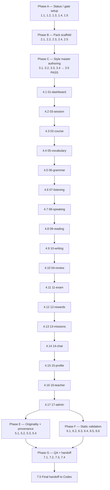

- Vai chinh: Product Designer
- Vai phoi hop: Product Manager EdTech, QA Automation Engineer, CTO/Tech Lead

# Implementation Plan: fuxie-visual-mocktest-pack

## Status

Status: Approved by Codex
Last Reviewed: 2026-05-17T00:00:00Z

Gate state: requirements.md = Approved by Codex (2026-05-17T00:00:00Z); design.md = Approved by Codex (2026-05-17T00:00:00Z); tasks.md = Approved by Codex (2026-05-17T00:00:00Z). Phase A may execute, Phase B–G may execute in order. Image-render tasks (Phase C and Phase D) require an external Codex image-generation pipeline; Kiro produces all markdown content + scaffolding + render command queue, then hands off to Codex/pipeline for actual PNG rendering. Until rendering completes and QA_Owner signs, modules remain BLOCKED at Visual_Target_Score.

## Roles

- Vai chinh: Product Designer (Pack_Owner)
- Vai phoi hop: Product Manager EdTech (Priority_Owner), QA Automation Engineer (QA_Owner), CTO/Tech Lead, Illustrator / 3D Mascot Artist (Originality co-reviewer; consulted, not full vai phoi hop for tasks-authoring)

## Overview

Tasks below are sequenced by Workflow_Gate phases:
- Phase A: Status / gate verification (no artifacts created).
- Phase B: Pack scaffold (root + 18 Module_Folder + 6 file mỗi folder).
- Phase C: Style master authoring (`00-style-master`) — gate-opener for the rest.
- Phase D: 17 module production in approved priority order.
- Phase E: Originality + provenance verification.
- Phase F: Static validation (file contract, heading contract, status table consistency).
- Phase G: QA scoring + final audit + handoff to Codex.

Tasks across Phase B onwards SHALL NOT begin until Codex flips tasks.md to `Approved by Codex`.

## Tasks

- [ ] 1. Status / gate setup (Phase A — must complete before any artifact creation)

  - [ ] 1.1 Verify `requirements.md` status line at top equals `Status: Approved by Codex`
    - Read first 10 lines of `c:\Users\DMF Schule\9-Fuxie\.kiro\specs\fuxie-visual-mocktest-pack\requirements.md`.
    - Confirm the second non-empty line is exactly `Status: Approved by Codex`.
    - Confirm a `Last Reviewed:` line follows with a non-empty ISO 8601 timestamp.
    - _Requirements: 10.1, 10.5_

  - [ ] 1.2 Verify `design.md` status line at top equals `Status: Approved by Codex`
    - Read first 10 lines of `c:\Users\DMF Schule\9-Fuxie\.kiro\specs\fuxie-visual-mocktest-pack\design.md`.
    - Confirm the `Status:` line under the `## Status` heading is exactly `Status: Approved by Codex`.
    - Confirm a `Last Reviewed:` line follows with a non-empty ISO 8601 timestamp.
    - _Requirements: 10.1, 10.5_

  - [ ] 1.3 Verify `tasks.md` status is lifecycle-correct
    - Read the top of `c:\Users\DMF Schule\9-Fuxie\.kiro\specs\fuxie-visual-mocktest-pack\tasks.md`.
    - During authoring / pre-approval QC, the `Status:` line MUST equal `Status: Pending Codex Approval`.
    - Before any Phase B or later task executes, the `Status:` line MUST equal `Status: Approved by Codex` with a non-empty `Last Reviewed:` ISO 8601 timestamp.
    - If status is `Pending Codex Approval`, halt before Phase B (no scaffolding, no rendering, no scoring).
    - If status is `Approved by Codex`, Phase B may proceed.
    - Confirm the explicit gate-state paragraph is present and names all three spec files plus their statuses.
    - _Requirements: 10.1, 10.5_

  - [ ] 1.4 Verify `docs/design/fuxie-visual-mocktests/` does NOT exist while tasks.md is being authored
    - List the workspace `docs/` folder; confirm there is no `fuxie-visual-mocktests/` subfolder.
    - If found, halt and surface the violation; the folder must not appear before tasks.md is approved.
    - _Requirements: 10.1, 10.4_

  - [ ] 1.5 Verify no Module_Folder, no `mock-*.png`, and no artifact markdown files exist anywhere in the repo
    - Search the workspace for filenames matching `mock-desktop.png`, `mock-mobile.png`, `mock-state.png`, `mock-state-*.png`, `qa-checklist.md`, `implementation-notes.md`, `generation-prompt.md` under any path containing `fuxie-visual-mocktests`.
    - Search for any folder name in the approved 18 Module_Folder list anchored under a path containing `fuxie-visual-mocktests`.
    - Confirm zero matches before tasks.md approval.
    - _Requirements: 10.1, 10.4_

- [ ] 2. Pack scaffold (Phase B — `[blocked: requires Codex approval of tasks.md]`)

  - [ ] 2.1 Create root folder `docs/design/fuxie-visual-mocktests/`
    - Path is case-sensitive; lowercase exactly as written.
    - Verify after creation: directory exists at the exact path with the exact casing.
    - _Requirements: 1.1_
    - [blocked: requires Codex approval of tasks.md]

  - [ ] 2.2 Create root `README.md` from the design 4.4 skeleton
    - Path: `docs/design/fuxie-visual-mocktests/README.md`.
    - Sections required: title, `## Workflow_Gate` (with manual status table for `requirements.md` / `design.md` / `tasks.md`), `## Originality_Guardrail`, `## Module index` (18 entries in approved order, each linking to its folder + 1-line learning intent 1–200 chars), `## Roles` (Pack_Owner, Style_Master_Owner, Priority_Owner, QA_Owner with names + ISO 8601 effective date), `## Scope Change` placeholder.
    - Verify by re-reading the file: every required section present, status table cells initially match the `Status:` lines on each spec.
    - _Requirements: 1.2, 1.6, 1.7, 10.5, 11.9_
    - [blocked: requires Codex approval of tasks.md]

  - [ ] 2.3 Create exactly 18 Module_Folder under root in approved order
    - Order: `00-style-master`, `01-dashboard`, `02-course`, `03-session`, `04-review`, `05-vocabulary`, `06-grammar`, `07-listening`, `08-speaking`, `09-reading`, `10-writing`, `11-exam`, `12-rewards`, `13-missions`, `14-chat`, `15-profile`, `16-teacher`, `17-admin`.
    - Names lowercase, exact spelling per Requirement 1 AC 3.
    - Verify by directory listing: 18 folders, no extras, no hidden `.foo` siblings.
    - _Requirements: 1.3_
    - [blocked: requires Codex approval of tasks.md]

  - [ ] 2.4 For each Module_Folder, create the 6 required files as placeholders
    - Files: `mock-desktop.png`, `mock-mobile.png`, `mock-state.png`, `qa-checklist.md`, `implementation-notes.md`, `generation-prompt.md`.
    - PNG placeholders: a transparent 1×1 PNG (or equivalent > 0 byte placeholder) until Phase D renders the real mock.
    - Markdown placeholders: heading skeletons exactly per design 4.1 (`qa-checklist.md`), 4.2 (`implementation-notes.md`; for `00-style-master` use the Token registry variant per design 4.2 / Requirement 7 AC 3), and 4.3 (`generation-prompt.md`).
    - No additional files; explicitly no `mock-state-*.png` of any kind.
    - Verify per Module_Folder: |files| = 6, set(filenames) matches the contract, each file > 0 byte.
    - _Requirements: 1.4, 1.5, 1.9_
    - [blocked: requires Codex approval of tasks.md]

  - [ ] 2.5 Update README Workflow_Gate status table after scaffold completes
    - Reconcile each row with the live `Status:` line at the top of `requirements.md`, `design.md`, `tasks.md`.
    - Verify by reading both sources; mismatches must be fixed before any later phase begins.
    - _Requirements: 10.5_
    - [blocked: requires Codex approval of tasks.md]

- [ ] 3. Style master authoring — `00-style-master` (Phase C; gate-opener for Phase D)

  - [ ] 3.1 Author `00-style-master/implementation-notes.md`
    - Fill the 10 mandatory `##` headings per design 4.2, replacing "Component reuse" with "Token registry" per Requirement 7 AC 3.
    - Token registry MUST list every color, typography, spacing, radius, and shadow token with: token name, value or canonical reference, and the downstream Module_Folder(s) expected to consume it (Token coverage for all 17 downstream modules).
    - Inheritance rule (per design 8.2): tokens reused from Fuxie's existing design system reference the canonical source; pack-only tokens are flagged with a `pack-only` tag and a written rationale.
    - Verify by re-reading: 10 headings present in correct order; every downstream module appears in at least one Token registry entry.
    - _Requirements: 2.2, 7.2, 7.3_
    - [blocked: requires Codex approval of tasks.md]

  - [ ] 3.2 Author `00-style-master/generation-prompt.md`
    - Fill the 7 mandatory `##` headings per design 4.3 in exact order.
    - "Originality guardrails (forbidden IP references)" MUST list: Mykonos asset names (Greek-island visuals, Aegean palette, Cycladic architecture, white-blue domed buildings, Mediterranean village motifs); Two Point Campus characters / place names / themed props; any other third-party IP cited (or "None cited").
    - Reviewer + ISO 8601 date filled by Pack_Owner before Style_Master mocks are accepted.
    - _Requirements: 12.1, 12.2, 12.3, 12.4_
    - [blocked: requires Codex approval of tasks.md]

  - [ ] 3.3 Render the 3 Style_Master mock files
    - `mock-desktop.png` 1440×900, `mock-mobile.png` 390×844, `mock-state.png` (single chosen sub-state).
    - Mocks must visualize the 10 visual elements from design 2: primary palette (≥ 5 tokens), secondary palette (≥ 3 tokens), typography tiers (≥ 5), spacing tiers (≥ 5), radius tiers (≥ 3), shadow tiers (≥ 2), icon style (≥ 6 learning icons), mascot tone (≥ 1), illustration style (≥ 2), isometric staging convention (≥ 1).
    - Originality check by Pack_Owner + Illustrator / 3D Mascot Artist before mocks are treated as the canonical visual target.
    - Update `generation-prompt.md` Reviewer + date in the SAME change set as the renders.
    - _Requirements: 2.1, 9.1, 9.7, 12.6_
    - [blocked: requires Codex approval of tasks.md]

  - [ ] 3.4 Author `00-style-master/qa-checklist.md`
    - 8 `##` headings in fixed order per Requirement 6 AC 2; for `00-style-master` heading 2 is "Token coverage" (replaces "Module identity distinctness") with weight 15 per Requirement 6 AC 5 and Requirement 8 AC 2.
    - State coverage gate row records PASS or FAIL only (no weight).
    - Visual Target Score roll-up section ready for QA_Owner sign-off (per-dim scores, gate result, total, sign-off line).
    - _Requirements: 6.2, 6.3, 6.4, 6.5_
    - [blocked: requires Codex approval of tasks.md]

  - [ ] 3.5 QA_Owner scores `00-style-master` Visual_Target_Score
    - Score the 6 weighted dimensions using integers within each dim's max; record per-dim reasoning.
    - PASS conditions (all four MUST hold): total ≥ 80, no weighted dim < 50% of its weight, State coverage gate = PASS, QA_Owner signed (name + ISO 8601 date).
    - If FAIL on any condition, write `Outcome: BLOCKED` with current vs target value plus remediation actions per Requirement 6 AC 7; loop back to fix; do NOT proceed to Phase D until `00-style-master` passes.
    - _Requirements: 6.7, 6.9, 8.3, 8.4, 8.5, 8.6_
    - [blocked: requires Codex approval of tasks.md AND completion of 3.1–3.4]

- [ ] 4. Module production in approved priority order (Phase D)

  Priority order (NOT alphabetical): 01-dashboard → 03-session → 02-course → 05-vocabulary → 06-grammar → 07-listening → 08-speaking → 09-reading → 10-writing → 04-review → 11-exam → 12-rewards → 13-missions → 14-chat → 15-profile → 16-teacher → 17-admin.

  - [ ] 4.1 Module 01-dashboard production

    - [ ] 4.1.1 Author `01-dashboard/implementation-notes.md`
      - Fill 10 mandatory headings per design 4.2; reference Style_Master tokens only (no new tokens unless flagged + extension requested).
      - Document the chosen sub-state for `mock-state.png` (empty state — no session today) and the rationale.
      - Document any deferred V2 sub-flows under "State chosen for mock-state.png + lý do".
      - Originality notes summarize and link to `01-dashboard/generation-prompt.md` as canonical provenance.
      - _Requirements: 7.2, 7.3, 7.6, 9.5_
      - [blocked: requires Codex approval of tasks.md AND `00-style-master` PASS]

    - [ ] 4.1.2 Author `01-dashboard/generation-prompt.md`
      - Fill the 7 mandatory headings per design 4.3 in exact order.
      - "Originality guardrails (forbidden IP references)" lists Mykonos / Two Point Campus / other third-party IP (or "None cited").
      - State the model / tool / seed (or "manual render — <tool>"); reviewer name + ISO 8601 date.
      - _Requirements: 12.1, 12.2, 12.3, 12.4_
      - [blocked: requires Codex approval of tasks.md AND `00-style-master` PASS]

    - [ ] 4.1.3 Render the 3 mock PNGs for `01-dashboard`
      - `mock-desktop.png` 1440×900, `mock-mobile.png` 390×844, `mock-state.png` (single sub-state per implementation-notes.md).
      - Acceptance: 3-second learning-intent test passes; no horizontal overflow at 390×844 (header ≤ 64 px, body ≥ 14 px effective, caption ≥ 12 px effective); WCAG AA contrast on text/chip/control across ≥ 3 representative pairs per mock.
      - Update `generation-prompt.md` Reviewer + ISO 8601 date in the SAME change set as the renders.
      - _Requirements: 4.1, 4.2, 4.3, 4.4, 4.5, 4.6, 5.1, 5.2, 5.3, 5.5, 12.6_
      - [blocked: requires Codex approval of tasks.md AND `00-style-master` PASS]

    - [ ] 4.1.4 Author `01-dashboard/qa-checklist.md`
      - 8 `##` headings in exact order per Requirement 6 AC 2; weighted dim mapping per Requirement 6 AC 3 (sum = 100); State coverage gate row PASS/FAIL only; Visual Target Score roll-up section ready.
      - _Requirements: 6.2, 6.3, 6.4_
      - [blocked: requires Codex approval of tasks.md AND `00-style-master` PASS]

    - [ ] 4.1.5 QA_Owner scores `01-dashboard` Visual_Target_Score
      - Score 6 weighted dims; record State coverage PASS/FAIL; sign name + ISO 8601 date.
      - If any pass condition fails (total < 80 OR any weighted dim < 50% OR gate = FAIL OR QA_Owner missing), mark BLOCKED with current vs target + remediation actions; re-loop on the failed dim before re-scoring.
      - _Requirements: 6.7, 6.9, 8.3, 8.4, 8.5, 8.6, 8.7_
      - [blocked: requires Codex approval of tasks.md AND `00-style-master` PASS]

  - [ ] 4.2 Module 03-session production

    - [ ] 4.2.1 Author `03-session/implementation-notes.md`
      - 10 mandatory headings per design 4.2; reference Style_Master tokens; chosen sub-state = success state (phiên hoàn thành) with rationale; deferred V2 sub-flows documented; Originality notes link to `03-session/generation-prompt.md`.
      - _Requirements: 7.2, 7.3, 7.6, 9.5_
      - [blocked: requires Codex approval of tasks.md AND `00-style-master` PASS]

    - [ ] 4.2.2 Author `03-session/generation-prompt.md`
      - 7 mandatory headings per design 4.3; explicit forbidden-IP list (Mykonos / Two Point Campus / other or "None cited"); model/tool/seed; reviewer + ISO 8601 date.
      - _Requirements: 12.1, 12.2, 12.3, 12.4_
      - [blocked: requires Codex approval of tasks.md AND `00-style-master` PASS]

    - [ ] 4.2.3 Render the 3 mock PNGs for `03-session`
      - `mock-desktop.png` 1440×900, `mock-mobile.png` 390×844, `mock-state.png` (success state).
      - Meet 3-second intent + no 390×844 horizontal overflow + WCAG AA contrast; update `generation-prompt.md` Reviewer + date in the same change set.
      - _Requirements: 4.1, 4.2, 4.3, 4.4, 4.5, 4.6, 5.1, 5.2, 5.3, 5.5, 12.6_
      - [blocked: requires Codex approval of tasks.md AND `00-style-master` PASS]

    - [ ] 4.2.4 Author `03-session/qa-checklist.md`
      - 8 headings in exact order; weighted dim mapping; State coverage gate; Visual Target Score section.
      - _Requirements: 6.2, 6.3, 6.4_
      - [blocked: requires Codex approval of tasks.md AND `00-style-master` PASS]

    - [ ] 4.2.5 QA_Owner scores `03-session` Visual_Target_Score
      - Score, sign, BLOCK on any pass-condition failure with remediation actions.
      - _Requirements: 6.7, 6.9, 8.3, 8.4, 8.5, 8.6, 8.7_
      - [blocked: requires Codex approval of tasks.md AND `00-style-master` PASS]

  - [ ] 4.3 Module 02-course production

    - [ ] 4.3.1 Author `02-course/implementation-notes.md`
      - 10 mandatory headings; chosen sub-state = loading state (đang tải catalog) with rationale; deferred V2 sub-flows; Originality notes link to `02-course/generation-prompt.md`.
      - _Requirements: 7.2, 7.3, 7.6, 9.5_
      - [blocked: requires Codex approval of tasks.md AND `00-style-master` PASS]

    - [ ] 4.3.2 Author `02-course/generation-prompt.md`
      - 7 mandatory headings; explicit forbidden-IP list; model/tool/seed; reviewer + ISO date.
      - _Requirements: 12.1, 12.2, 12.3, 12.4_
      - [blocked: requires Codex approval of tasks.md AND `00-style-master` PASS]

    - [ ] 4.3.3 Render the 3 mock PNGs for `02-course`
      - 1440×900, 390×844, mock-state = loading state. Meet readability + contrast bars; update prompt provenance in same change set.
      - _Requirements: 4.1, 4.2, 4.3, 4.4, 4.5, 4.6, 5.1, 5.2, 5.3, 5.5, 12.6_
      - [blocked: requires Codex approval of tasks.md AND `00-style-master` PASS]

    - [ ] 4.3.4 Author `02-course/qa-checklist.md`
      - 8 headings; weighted dims; gate; Visual Target Score section.
      - _Requirements: 6.2, 6.3, 6.4_
      - [blocked: requires Codex approval of tasks.md AND `00-style-master` PASS]

    - [ ] 4.3.5 QA_Owner scores `02-course` Visual_Target_Score
      - Score, sign, BLOCK on any pass-condition failure with remediation actions.
      - _Requirements: 6.7, 6.9, 8.3, 8.4, 8.5, 8.6, 8.7_
      - [blocked: requires Codex approval of tasks.md AND `00-style-master` PASS]

  - [ ] 4.4 Module 05-vocabulary production

    - [ ] 4.4.1 Author `05-vocabulary/implementation-notes.md`
      - 10 mandatory headings; chosen sub-state = success state (đã thuộc 10 từ); deferred V2 sub-flows; Originality notes link to `05-vocabulary/generation-prompt.md`.
      - _Requirements: 7.2, 7.3, 7.6, 9.5_
      - [blocked: requires Codex approval of tasks.md AND `00-style-master` PASS]

    - [ ] 4.4.2 Author `05-vocabulary/generation-prompt.md`
      - 7 mandatory headings; forbidden-IP list; model/tool/seed; reviewer + ISO date.
      - _Requirements: 12.1, 12.2, 12.3, 12.4_
      - [blocked: requires Codex approval of tasks.md AND `00-style-master` PASS]

    - [ ] 4.4.3 Render the 3 mock PNGs for `05-vocabulary`
      - 1440×900, 390×844, mock-state = success state. Meet readability + contrast bars; refresh provenance in same change set.
      - _Requirements: 4.1, 4.2, 4.3, 4.4, 4.5, 4.6, 5.1, 5.2, 5.3, 5.5, 12.6_
      - [blocked: requires Codex approval of tasks.md AND `00-style-master` PASS]

    - [ ] 4.4.4 Author `05-vocabulary/qa-checklist.md`
      - 8 headings; weighted dims; gate; Visual Target Score section.
      - _Requirements: 6.2, 6.3, 6.4_
      - [blocked: requires Codex approval of tasks.md AND `00-style-master` PASS]

    - [ ] 4.4.5 QA_Owner scores `05-vocabulary` Visual_Target_Score
      - Score, sign, BLOCK + remediation on any failure.
      - _Requirements: 6.7, 6.9, 8.3, 8.4, 8.5, 8.6, 8.7_
      - [blocked: requires Codex approval of tasks.md AND `00-style-master` PASS]

  - [ ] 4.5 Module 06-grammar production

    - [ ] 4.5.1 Author `06-grammar/implementation-notes.md`
      - 10 mandatory headings; chosen sub-state = error state (sai pattern thường gặp); deferred V2 sub-flows; Originality notes link.
      - _Requirements: 7.2, 7.3, 7.6, 9.5_
      - [blocked: requires Codex approval of tasks.md AND `00-style-master` PASS]

    - [ ] 4.5.2 Author `06-grammar/generation-prompt.md`
      - 7 mandatory headings; forbidden-IP list; model/tool/seed; reviewer + ISO date.
      - _Requirements: 12.1, 12.2, 12.3, 12.4_
      - [blocked: requires Codex approval of tasks.md AND `00-style-master` PASS]

    - [ ] 4.5.3 Render the 3 mock PNGs for `06-grammar`
      - 1440×900, 390×844, mock-state = error state with full error message + ≥ 1 escape (retry/back/contact) + Module_Identity intact (Requirement 5 AC 5). Refresh provenance in same change set.
      - _Requirements: 4.1, 4.2, 4.3, 4.4, 4.5, 4.6, 5.1, 5.2, 5.3, 5.5, 12.6_
      - [blocked: requires Codex approval of tasks.md AND `00-style-master` PASS]

    - [ ] 4.5.4 Author `06-grammar/qa-checklist.md`
      - 8 headings; weighted dims; gate; Visual Target Score section.
      - _Requirements: 6.2, 6.3, 6.4_
      - [blocked: requires Codex approval of tasks.md AND `00-style-master` PASS]

    - [ ] 4.5.5 QA_Owner scores `06-grammar` Visual_Target_Score
      - Score, sign, BLOCK + remediation on any failure.
      - _Requirements: 6.7, 6.9, 8.3, 8.4, 8.5, 8.6, 8.7_
      - [blocked: requires Codex approval of tasks.md AND `00-style-master` PASS]

  - [ ] 4.6 Module 07-listening production

    - [ ] 4.6.1 Author `07-listening/implementation-notes.md`
      - 10 mandatory headings; chosen sub-state = loading state (đang tải audio); deferred V2 sub-flows; Originality notes link.
      - _Requirements: 7.2, 7.3, 7.6, 9.5_
      - [blocked: requires Codex approval of tasks.md AND `00-style-master` PASS]

    - [ ] 4.6.2 Author `07-listening/generation-prompt.md`
      - 7 mandatory headings; forbidden-IP list; model/tool/seed; reviewer + ISO date.
      - _Requirements: 12.1, 12.2, 12.3, 12.4_
      - [blocked: requires Codex approval of tasks.md AND `00-style-master` PASS]

    - [ ] 4.6.3 Render the 3 mock PNGs for `07-listening`
      - 1440×900, 390×844, mock-state = loading state. Meet readability + contrast bars; refresh provenance.
      - _Requirements: 4.1, 4.2, 4.3, 4.4, 4.5, 4.6, 5.1, 5.2, 5.3, 5.5, 12.6_
      - [blocked: requires Codex approval of tasks.md AND `00-style-master` PASS]

    - [ ] 4.6.4 Author `07-listening/qa-checklist.md`
      - 8 headings; weighted dims; gate; Visual Target Score section.
      - _Requirements: 6.2, 6.3, 6.4_
      - [blocked: requires Codex approval of tasks.md AND `00-style-master` PASS]

    - [ ] 4.6.5 QA_Owner scores `07-listening` Visual_Target_Score
      - Score, sign, BLOCK + remediation on any failure.
      - _Requirements: 6.7, 6.9, 8.3, 8.4, 8.5, 8.6, 8.7_
      - [blocked: requires Codex approval of tasks.md AND `00-style-master` PASS]

  - [ ] 4.7 Module 08-speaking production

    - [ ] 4.7.1 Author `08-speaking/implementation-notes.md`
      - 10 mandatory headings; chosen sub-state = error state (pronunciation lệch); deferred V2 sub-flows; Originality notes link.
      - _Requirements: 7.2, 7.3, 7.6, 9.5_
      - [blocked: requires Codex approval of tasks.md AND `00-style-master` PASS]

    - [ ] 4.7.2 Author `08-speaking/generation-prompt.md`
      - 7 mandatory headings; forbidden-IP list; model/tool/seed; reviewer + ISO date.
      - _Requirements: 12.1, 12.2, 12.3, 12.4_
      - [blocked: requires Codex approval of tasks.md AND `00-style-master` PASS]

    - [ ] 4.7.3 Render the 3 mock PNGs for `08-speaking`
      - 1440×900, 390×844, mock-state = error state with full error message + ≥ 1 escape + Module_Identity intact. Refresh provenance.
      - _Requirements: 4.1, 4.2, 4.3, 4.4, 4.5, 4.6, 5.1, 5.2, 5.3, 5.5, 12.6_
      - [blocked: requires Codex approval of tasks.md AND `00-style-master` PASS]

    - [ ] 4.7.4 Author `08-speaking/qa-checklist.md`
      - 8 headings; weighted dims; gate; Visual Target Score section.
      - _Requirements: 6.2, 6.3, 6.4_
      - [blocked: requires Codex approval of tasks.md AND `00-style-master` PASS]

    - [ ] 4.7.5 QA_Owner scores `08-speaking` Visual_Target_Score
      - Score, sign, BLOCK + remediation on any failure.
      - _Requirements: 6.7, 6.9, 8.3, 8.4, 8.5, 8.6, 8.7_
      - [blocked: requires Codex approval of tasks.md AND `00-style-master` PASS]

  - [ ] 4.8 Module 09-reading production

    - [ ] 4.8.1 Author `09-reading/implementation-notes.md`
      - 10 mandatory headings; chosen sub-state = success state (đạt comprehension); deferred V2 sub-flows; Originality notes link.
      - _Requirements: 7.2, 7.3, 7.6, 9.5_
      - [blocked: requires Codex approval of tasks.md AND `00-style-master` PASS]

    - [ ] 4.8.2 Author `09-reading/generation-prompt.md`
      - 7 mandatory headings; forbidden-IP list; model/tool/seed; reviewer + ISO date.
      - _Requirements: 12.1, 12.2, 12.3, 12.4_
      - [blocked: requires Codex approval of tasks.md AND `00-style-master` PASS]

    - [ ] 4.8.3 Render the 3 mock PNGs for `09-reading`
      - 1440×900, 390×844, mock-state = success state. Meet readability + contrast bars; refresh provenance.
      - _Requirements: 4.1, 4.2, 4.3, 4.4, 4.5, 4.6, 5.1, 5.2, 5.3, 5.5, 12.6_
      - [blocked: requires Codex approval of tasks.md AND `00-style-master` PASS]

    - [ ] 4.8.4 Author `09-reading/qa-checklist.md`
      - 8 headings; weighted dims; gate; Visual Target Score section.
      - _Requirements: 6.2, 6.3, 6.4_
      - [blocked: requires Codex approval of tasks.md AND `00-style-master` PASS]

    - [ ] 4.8.5 QA_Owner scores `09-reading` Visual_Target_Score
      - Score, sign, BLOCK + remediation on any failure.
      - _Requirements: 6.7, 6.9, 8.3, 8.4, 8.5, 8.6, 8.7_
      - [blocked: requires Codex approval of tasks.md AND `00-style-master` PASS]

  - [ ] 4.9 Module 10-writing production

    - [ ] 4.9.1 Author `10-writing/implementation-notes.md`
      - 10 mandatory headings; chosen sub-state = error state (thiếu yêu cầu cấu trúc); deferred V2 sub-flows; Originality notes link.
      - _Requirements: 7.2, 7.3, 7.6, 9.5_
      - [blocked: requires Codex approval of tasks.md AND `00-style-master` PASS]

    - [ ] 4.9.2 Author `10-writing/generation-prompt.md`
      - 7 mandatory headings; forbidden-IP list; model/tool/seed; reviewer + ISO date.
      - _Requirements: 12.1, 12.2, 12.3, 12.4_
      - [blocked: requires Codex approval of tasks.md AND `00-style-master` PASS]

    - [ ] 4.9.3 Render the 3 mock PNGs for `10-writing`
      - 1440×900, 390×844, mock-state = error state with full error message + ≥ 1 escape + Module_Identity intact. Refresh provenance.
      - _Requirements: 4.1, 4.2, 4.3, 4.4, 4.5, 4.6, 5.1, 5.2, 5.3, 5.5, 12.6_
      - [blocked: requires Codex approval of tasks.md AND `00-style-master` PASS]

    - [ ] 4.9.4 Author `10-writing/qa-checklist.md`
      - 8 headings; weighted dims; gate; Visual Target Score section.
      - _Requirements: 6.2, 6.3, 6.4_
      - [blocked: requires Codex approval of tasks.md AND `00-style-master` PASS]

    - [ ] 4.9.5 QA_Owner scores `10-writing` Visual_Target_Score
      - Score, sign, BLOCK + remediation on any failure.
      - _Requirements: 6.7, 6.9, 8.3, 8.4, 8.5, 8.6, 8.7_
      - [blocked: requires Codex approval of tasks.md AND `00-style-master` PASS]

  - [ ] 4.10 Module 04-review production

    - [ ] 4.10.1 Author `04-review/implementation-notes.md`
      - 10 mandatory headings; chosen sub-state = empty state (không có item cần ôn); deferred V2 sub-flows; Originality notes link.
      - _Requirements: 7.2, 7.3, 7.6, 9.5_
      - [blocked: requires Codex approval of tasks.md AND `00-style-master` PASS]

    - [ ] 4.10.2 Author `04-review/generation-prompt.md`
      - 7 mandatory headings; forbidden-IP list; model/tool/seed; reviewer + ISO date.
      - _Requirements: 12.1, 12.2, 12.3, 12.4_
      - [blocked: requires Codex approval of tasks.md AND `00-style-master` PASS]

    - [ ] 4.10.3 Render the 3 mock PNGs for `04-review`
      - 1440×900, 390×844, mock-state = empty state. Meet readability + contrast bars; refresh provenance.
      - _Requirements: 4.1, 4.2, 4.3, 4.4, 4.5, 4.6, 5.1, 5.2, 5.3, 5.5, 12.6_
      - [blocked: requires Codex approval of tasks.md AND `00-style-master` PASS]

    - [ ] 4.10.4 Author `04-review/qa-checklist.md`
      - 8 headings; weighted dims; gate; Visual Target Score section.
      - _Requirements: 6.2, 6.3, 6.4_
      - [blocked: requires Codex approval of tasks.md AND `00-style-master` PASS]

    - [ ] 4.10.5 QA_Owner scores `04-review` Visual_Target_Score
      - Score, sign, BLOCK + remediation on any failure.
      - _Requirements: 6.7, 6.9, 8.3, 8.4, 8.5, 8.6, 8.7_
      - [blocked: requires Codex approval of tasks.md AND `00-style-master` PASS]

  - [ ] 4.11 Module 11-exam production

    - [ ] 4.11.1 Author `11-exam/implementation-notes.md`
      - 10 mandatory headings; chosen sub-state = error state (hết giờ trước khi nộp); deferred V2 sub-flows; Originality notes link.
      - _Requirements: 7.2, 7.3, 7.6, 9.5_
      - [blocked: requires Codex approval of tasks.md AND `00-style-master` PASS]

    - [ ] 4.11.2 Author `11-exam/generation-prompt.md`
      - 7 mandatory headings; forbidden-IP list; model/tool/seed; reviewer + ISO date.
      - _Requirements: 12.1, 12.2, 12.3, 12.4_
      - [blocked: requires Codex approval of tasks.md AND `00-style-master` PASS]

    - [ ] 4.11.3 Render the 3 mock PNGs for `11-exam`
      - 1440×900, 390×844, mock-state = error state with full error message + ≥ 1 escape + Module_Identity intact. Refresh provenance.
      - _Requirements: 4.1, 4.2, 4.3, 4.4, 4.5, 4.6, 5.1, 5.2, 5.3, 5.5, 12.6_
      - [blocked: requires Codex approval of tasks.md AND `00-style-master` PASS]

    - [ ] 4.11.4 Author `11-exam/qa-checklist.md`
      - 8 headings; weighted dims; gate; Visual Target Score section.
      - _Requirements: 6.2, 6.3, 6.4_
      - [blocked: requires Codex approval of tasks.md AND `00-style-master` PASS]

    - [ ] 4.11.5 QA_Owner scores `11-exam` Visual_Target_Score
      - Score, sign, BLOCK + remediation on any failure.
      - _Requirements: 6.7, 6.9, 8.3, 8.4, 8.5, 8.6, 8.7_
      - [blocked: requires Codex approval of tasks.md AND `00-style-master` PASS]

  - [ ] 4.12 Module 12-rewards production

    - [ ] 4.12.1 Author `12-rewards/implementation-notes.md`
      - 10 mandatory headings; chosen sub-state = success state (vừa unlock badge); deferred V2 sub-flows; Originality notes link.
      - _Requirements: 7.2, 7.3, 7.6, 9.5_
      - [blocked: requires Codex approval of tasks.md AND `00-style-master` PASS]

    - [ ] 4.12.2 Author `12-rewards/generation-prompt.md`
      - 7 mandatory headings; forbidden-IP list; model/tool/seed; reviewer + ISO date.
      - _Requirements: 12.1, 12.2, 12.3, 12.4_
      - [blocked: requires Codex approval of tasks.md AND `00-style-master` PASS]

    - [ ] 4.12.3 Render the 3 mock PNGs for `12-rewards`
      - 1440×900, 390×844, mock-state = success state. Meet readability + contrast bars; refresh provenance.
      - _Requirements: 4.1, 4.2, 4.3, 4.4, 4.5, 4.6, 5.1, 5.2, 5.3, 5.5, 12.6_
      - [blocked: requires Codex approval of tasks.md AND `00-style-master` PASS]

    - [ ] 4.12.4 Author `12-rewards/qa-checklist.md`
      - 8 headings; weighted dims; gate; Visual Target Score section.
      - _Requirements: 6.2, 6.3, 6.4_
      - [blocked: requires Codex approval of tasks.md AND `00-style-master` PASS]

    - [ ] 4.12.5 QA_Owner scores `12-rewards` Visual_Target_Score
      - Score, sign, BLOCK + remediation on any failure.
      - _Requirements: 6.7, 6.9, 8.3, 8.4, 8.5, 8.6, 8.7_
      - [blocked: requires Codex approval of tasks.md AND `00-style-master` PASS]

  - [ ] 4.13 Module 13-missions production

    - [ ] 4.13.1 Author `13-missions/implementation-notes.md`
      - 10 mandatory headings; chosen sub-state = empty state (đã hoàn thành tất cả); deferred V2 sub-flows; Originality notes link.
      - _Requirements: 7.2, 7.3, 7.6, 9.5_
      - [blocked: requires Codex approval of tasks.md AND `00-style-master` PASS]

    - [ ] 4.13.2 Author `13-missions/generation-prompt.md`
      - 7 mandatory headings; forbidden-IP list; model/tool/seed; reviewer + ISO date.
      - _Requirements: 12.1, 12.2, 12.3, 12.4_
      - [blocked: requires Codex approval of tasks.md AND `00-style-master` PASS]

    - [ ] 4.13.3 Render the 3 mock PNGs for `13-missions`
      - 1440×900, 390×844, mock-state = empty state. Meet readability + contrast bars; refresh provenance.
      - _Requirements: 4.1, 4.2, 4.3, 4.4, 4.5, 4.6, 5.1, 5.2, 5.3, 5.5, 12.6_
      - [blocked: requires Codex approval of tasks.md AND `00-style-master` PASS]

    - [ ] 4.13.4 Author `13-missions/qa-checklist.md`
      - 8 headings; weighted dims; gate; Visual Target Score section.
      - _Requirements: 6.2, 6.3, 6.4_
      - [blocked: requires Codex approval of tasks.md AND `00-style-master` PASS]

    - [ ] 4.13.5 QA_Owner scores `13-missions` Visual_Target_Score
      - Score, sign, BLOCK + remediation on any failure.
      - _Requirements: 6.7, 6.9, 8.3, 8.4, 8.5, 8.6, 8.7_
      - [blocked: requires Codex approval of tasks.md AND `00-style-master` PASS]

  - [ ] 4.14 Module 14-chat production

    - [ ] 4.14.1 Author `14-chat/implementation-notes.md`
      - 10 mandatory headings; chosen sub-state = loading state (tutor đang trả lời); deferred V2 sub-flows; Originality notes link.
      - _Requirements: 7.2, 7.3, 7.6, 9.5_
      - [blocked: requires Codex approval of tasks.md AND `00-style-master` PASS]

    - [ ] 4.14.2 Author `14-chat/generation-prompt.md`
      - 7 mandatory headings; forbidden-IP list; model/tool/seed; reviewer + ISO date.
      - _Requirements: 12.1, 12.2, 12.3, 12.4_
      - [blocked: requires Codex approval of tasks.md AND `00-style-master` PASS]

    - [ ] 4.14.3 Render the 3 mock PNGs for `14-chat`
      - 1440×900, 390×844, mock-state = loading state. Meet readability + contrast bars; refresh provenance.
      - _Requirements: 4.1, 4.2, 4.3, 4.4, 4.5, 4.6, 5.1, 5.2, 5.3, 5.5, 12.6_
      - [blocked: requires Codex approval of tasks.md AND `00-style-master` PASS]

    - [ ] 4.14.4 Author `14-chat/qa-checklist.md`
      - 8 headings; weighted dims; gate; Visual Target Score section.
      - _Requirements: 6.2, 6.3, 6.4_
      - [blocked: requires Codex approval of tasks.md AND `00-style-master` PASS]

    - [ ] 4.14.5 QA_Owner scores `14-chat` Visual_Target_Score
      - Score, sign, BLOCK + remediation on any failure.
      - _Requirements: 6.7, 6.9, 8.3, 8.4, 8.5, 8.6, 8.7_
      - [blocked: requires Codex approval of tasks.md AND `00-style-master` PASS]

  - [ ] 4.15 Module 15-profile production

    - [ ] 4.15.1 Author `15-profile/implementation-notes.md`
      - 10 mandatory headings; chosen sub-state = success state (vừa cập nhật mục tiêu); deferred V2 sub-flows; Originality notes link.
      - _Requirements: 7.2, 7.3, 7.6, 9.5_
      - [blocked: requires Codex approval of tasks.md AND `00-style-master` PASS]

    - [ ] 4.15.2 Author `15-profile/generation-prompt.md`
      - 7 mandatory headings; forbidden-IP list; model/tool/seed; reviewer + ISO date.
      - _Requirements: 12.1, 12.2, 12.3, 12.4_
      - [blocked: requires Codex approval of tasks.md AND `00-style-master` PASS]

    - [ ] 4.15.3 Render the 3 mock PNGs for `15-profile`
      - 1440×900, 390×844, mock-state = success state. Meet readability + contrast bars; refresh provenance.
      - _Requirements: 4.1, 4.2, 4.3, 4.4, 4.5, 4.6, 5.1, 5.2, 5.3, 5.5, 12.6_
      - [blocked: requires Codex approval of tasks.md AND `00-style-master` PASS]

    - [ ] 4.15.4 Author `15-profile/qa-checklist.md`
      - 8 headings; weighted dims; gate; Visual Target Score section.
      - _Requirements: 6.2, 6.3, 6.4_
      - [blocked: requires Codex approval of tasks.md AND `00-style-master` PASS]

    - [ ] 4.15.5 QA_Owner scores `15-profile` Visual_Target_Score
      - Score, sign, BLOCK + remediation on any failure.
      - _Requirements: 6.7, 6.9, 8.3, 8.4, 8.5, 8.6, 8.7_
      - [blocked: requires Codex approval of tasks.md AND `00-style-master` PASS]

  - [ ] 4.16 Module 16-teacher production

    - [ ] 4.16.1 Author `16-teacher/implementation-notes.md`
      - 10 mandatory headings; chosen sub-state = error state (assignment quá hạn submission); deferred V2 sub-flows; Originality notes link.
      - _Requirements: 7.2, 7.3, 7.6, 9.5_
      - [blocked: requires Codex approval of tasks.md AND `00-style-master` PASS]

    - [ ] 4.16.2 Author `16-teacher/generation-prompt.md`
      - 7 mandatory headings; forbidden-IP list; model/tool/seed; reviewer + ISO date.
      - _Requirements: 12.1, 12.2, 12.3, 12.4_
      - [blocked: requires Codex approval of tasks.md AND `00-style-master` PASS]

    - [ ] 4.16.3 Render the 3 mock PNGs for `16-teacher`
      - 1440×900, 390×844, mock-state = error state with full error message + ≥ 1 escape + Module_Identity intact. Refresh provenance.
      - _Requirements: 4.1, 4.2, 4.3, 4.4, 4.5, 4.6, 5.1, 5.2, 5.3, 5.5, 12.6_
      - [blocked: requires Codex approval of tasks.md AND `00-style-master` PASS]

    - [ ] 4.16.4 Author `16-teacher/qa-checklist.md`
      - 8 headings; weighted dims; gate; Visual Target Score section.
      - _Requirements: 6.2, 6.3, 6.4_
      - [blocked: requires Codex approval of tasks.md AND `00-style-master` PASS]

    - [ ] 4.16.5 QA_Owner scores `16-teacher` Visual_Target_Score
      - Score, sign, BLOCK + remediation on any failure.
      - _Requirements: 6.7, 6.9, 8.3, 8.4, 8.5, 8.6, 8.7_
      - [blocked: requires Codex approval of tasks.md AND `00-style-master` PASS]

  - [ ] 4.17 Module 17-admin production

    - [ ] 4.17.1 Author `17-admin/implementation-notes.md`
      - 10 mandatory headings; chosen sub-state = empty state (filter không trả kết quả); deferred V2 sub-flows; Originality notes link.
      - _Requirements: 7.2, 7.3, 7.6, 9.5_
      - [blocked: requires Codex approval of tasks.md AND `00-style-master` PASS]

    - [ ] 4.17.2 Author `17-admin/generation-prompt.md`
      - 7 mandatory headings; forbidden-IP list; model/tool/seed; reviewer + ISO date.
      - _Requirements: 12.1, 12.2, 12.3, 12.4_
      - [blocked: requires Codex approval of tasks.md AND `00-style-master` PASS]

    - [ ] 4.17.3 Render the 3 mock PNGs for `17-admin`
      - 1440×900, 390×844, mock-state = empty state. Meet readability + contrast bars; refresh provenance.
      - _Requirements: 4.1, 4.2, 4.3, 4.4, 4.5, 4.6, 5.1, 5.2, 5.3, 5.5, 12.6_
      - [blocked: requires Codex approval of tasks.md AND `00-style-master` PASS]

    - [ ] 4.17.4 Author `17-admin/qa-checklist.md`
      - 8 headings; weighted dims; gate; Visual Target Score section.
      - _Requirements: 6.2, 6.3, 6.4_
      - [blocked: requires Codex approval of tasks.md AND `00-style-master` PASS]

    - [ ] 4.17.5 QA_Owner scores `17-admin` Visual_Target_Score
      - Score, sign, BLOCK + remediation on any failure.
      - _Requirements: 6.7, 6.9, 8.3, 8.4, 8.5, 8.6, 8.7_
      - [blocked: requires Codex approval of tasks.md AND `00-style-master` PASS]

- [ ] 5. Originality and provenance verification (Phase E)

  - [ ] 5.1 Run Originality_Guardrail on every Module_Folder
    - For each of 18 Module_Folder, confirm no Mykonos asset name, Two Point Campus character / place name / themed prop, and no other third-party IP appears in any mock or any text string.
    - Pack_Owner co-reviews with Illustrator / 3D Mascot Artist.
    - _Requirements: 9.1, 9.2, 9.7_
    - [blocked: requires Codex approval of tasks.md AND completion of 4.x.3 for that module]

  - [ ] 5.2 Verify forbidden-IP list completeness in every `generation-prompt.md`
    - "Originality guardrails (forbidden IP references)" lists Mykonos + Two Point Campus + any cited third-party IP (or "None cited").
    - Reject and re-author any prompt missing the list.
    - _Requirements: 12.3_
    - [blocked: requires Codex approval of tasks.md AND completion of 4.x.2]

  - [ ] 5.3 Enforce same-change-set provenance refresh on any mock re-render
    - For any re-render of `mock-desktop.png`, `mock-mobile.png`, or `mock-state.png` in any Module_Folder, verify `generation-prompt.md` Reviewer + ISO 8601 date are updated in the SAME change set.
    - Stale provenance blocks Visual_Target_Score sign-off until refreshed.
    - _Requirements: 12.6_
    - [blocked: requires Codex approval of tasks.md]

  - [ ] 5.4 Record any originality fail per Requirement 9 AC 4
    - For each Module_Folder flagged for originality concerns, mark `Originality fail` in its `qa-checklist.md` with the explicit reason; redesign before re-thẩm định; do not score until cleared.
    - _Requirements: 9.4, 9.6_
    - [blocked: requires Codex approval of tasks.md]

- [ ] 6. Static validation (Phase F)

  - [ ] 6.1 Verify root contains exactly 1 README and 18 Module_Folder
    - Path: `docs/design/fuxie-visual-mocktests/`. Module_Folder names per Requirement 1 AC 3, in order, no extra folders/files (excluding VCS-required files explicitly listed in README).
    - _Requirements: 1.2, 1.3, 1.8, 1.9_
    - [blocked: requires Codex approval of tasks.md AND scaffold complete]

  - [ ] 6.2 Verify each Module_Folder contains exactly 6 contract files
    - Exact names (lowercase): `mock-desktop.png`, `mock-mobile.png`, `mock-state.png`, `qa-checklist.md`, `implementation-notes.md`, `generation-prompt.md`.
    - No `mock-state-*.png`. Each file > 0 byte.
    - _Requirements: 1.4, 1.5_
    - [blocked: requires Codex approval of tasks.md]

  - [ ] 6.3 Verify `qa-checklist.md` heading contract per Module_Folder
    - 8 `##` headings in exact order per Requirement 6 AC 2.
    - For `00-style-master`, heading 2 swapped to "Token coverage" per Requirement 6 AC 5.
    - _Requirements: 6.2, 6.5_
    - [blocked: requires Codex approval of tasks.md]

  - [ ] 6.4 Verify `implementation-notes.md` heading contract per Module_Folder
    - 10 `##` headings in exact order per Requirement 7 AC 2.
    - For `00-style-master`, "Component reuse" replaced by "Token registry" per Requirement 7 AC 3.
    - _Requirements: 7.2, 7.3_
    - [blocked: requires Codex approval of tasks.md]

  - [ ] 6.5 Verify `generation-prompt.md` heading contract per Module_Folder
    - 7 `##` headings in exact order per Requirement 12 AC 2.
    - _Requirements: 12.2_
    - [blocked: requires Codex approval of tasks.md]

  - [ ] 6.6 Verify README Workflow_Gate status table matches each spec's `Status:` line
    - Cross-check each row against the live `Status:` line at the top of `requirements.md`, `design.md`, `tasks.md`. Mismatch = README stale; reconcile before any further downstream action.
    - _Requirements: 10.5_
    - [blocked: requires Codex approval of tasks.md]

- [ ] 7. QA / final audit (Phase G — handoff to Codex)

  - [ ] 7.1 Compute Visual_Target_Score for every Module_Folder
    - Record per-dim scores (6 weighted dims), gate result (PASS/FAIL), total (0–100), QA_Owner sign-off (name + ISO 8601 date) inside each `qa-checklist.md`.
    - _Requirements: 8.1, 8.2, 8.3, 8.5_
    - [blocked: requires Codex approval of tasks.md AND completion of Phase D for that module]

  - [ ] 7.2 Produce a top-level audit table
    - In README "Workflow_Gate" section (or a sibling section), list per Module_Folder: total score, gate result, pass/fail outcome, blocked dims/gates if any, remediation actions.
    - _Requirements: 6.7, 8.4, 8.5, 8.8_
    - [blocked: requires Codex approval of tasks.md]

  - [ ] 7.3 Confirm zero unrelated code changes occurred in this spec
    - Capture a baseline `git status` snapshot (file list + line counts) BEFORE Phase B begins; persist it in `.kiro/specs/fuxie-visual-mocktest-pack/` notes or QA_Owner records.
    - At final audit, compare only the DELTA introduced by this spec execution against that baseline. The allowed new/modified paths from this spec are `.kiro/specs/fuxie-visual-mocktest-pack/` and `docs/design/fuxie-visual-mocktests/`.
    - Pre-existing unrelated dirty changes (e.g. unrelated open editor files in `apps/web/...`, `tests/...`, `.kiro/specs/<other-spec>/...`) are recorded in the audit table but IGNORED for this spec's scope check; they are not regressions caused by this spec.
    - Hard rule preserved: this spec MUST NOT modify `apps/web/...`, production routes, CI configs, or module implementation code. Any delta in those paths attributable to this spec's execution is a violation.
    - _Requirements: scope guard from requirements.md Non-Goals_
    - [blocked: requires Codex approval of tasks.md]

  - [ ] 7.4 Confirm no extra folders, files, or images outside the approved contract
    - Exactly 1 root README + 18 Module_Folder × 6 files. No hidden files (`.foo`) at root or in any Module_Folder except VCS-required entries explicitly listed in README.
    - _Requirements: 1.4, 1.8, 1.9_
    - [blocked: requires Codex approval of tasks.md]

  - [ ] 7.5 Produce final handoff summary for Codex
    - List per-module Visual_Target_Score, list any BLOCKED Module_Folder with remediation, link to README + 18 Module_Folder, confirm Originality_Guardrail PASS across pack, confirm Workflow_Gate status table matches spec status lines.
    - _Requirements: 8.5, 8.8, 9.7, 10.5, 10.6_
    - [blocked: requires Codex approval of tasks.md]

## Constraints

- No actual PNG generation while tasks.md is in `Pending Codex Approval`. Image-generation tasks (Phase B placeholders aside; rendered mocks in Phases C and D) run only after Codex approves tasks.md.
- No frontend code implementation in this spec's scope.
- No production route / UI changes.
- 6 weighted dimensions + 1 State coverage gate + 1 Visual Target Score roll-up; weights 20 + 15 + 15 + 20 + 15 + 15 = 100. PASS = score ≥ 80, no weighted dim < 50% of its weight, State coverage = PASS, QA_Owner signed.
- No multi-state mocks (`mock-state-*.png`) in V0; multi-state is V2.
- No watcher / automation / validation script; Workflow_Gate is a manual observable rule on the `Status:` line at the top of each spec file plus the README status table.
- Do NOT create `docs/design/fuxie-visual-mocktests/`, any Module_Folder, the README, or any artifact file (mock-*.png, qa-checklist.md, implementation-notes.md, generation-prompt.md) while tasks.md is in `Pending Codex Approval`. Authoring those is itself a task in this list and SHALL execute only after approval.
- Vietnamese narrative is preserved in this document; technical terms, file names, and EARS keywords are kept in English.

## Task Dependency Graph



```json
{
  "waves": [
    { "id": 0, "tasks": ["1.1", "1.2", "1.3", "1.4", "1.5"] },
    { "id": 1, "tasks": ["2.1"] },
    { "id": 2, "tasks": ["2.2", "2.3"] },
    { "id": 3, "tasks": ["2.4"] },
    { "id": 4, "tasks": ["2.5"] },
    { "id": 5, "tasks": ["3.1", "3.2"] },
    { "id": 6, "tasks": ["3.3"] },
    { "id": 7, "tasks": ["3.4"] },
    { "id": 8, "tasks": ["3.5"] },
    { "id": 9, "tasks": ["4.1.1", "4.1.2"] },
    { "id": 10, "tasks": ["4.1.3"] },
    { "id": 11, "tasks": ["4.1.4"] },
    { "id": 12, "tasks": ["4.1.5"] },
    { "id": 13, "tasks": ["4.2.1", "4.2.2"] },
    { "id": 14, "tasks": ["4.2.3"] },
    { "id": 15, "tasks": ["4.2.4"] },
    { "id": 16, "tasks": ["4.2.5"] },
    { "id": 17, "tasks": ["4.3.1", "4.3.2"] },
    { "id": 18, "tasks": ["4.3.3"] },
    { "id": 19, "tasks": ["4.3.4"] },
    { "id": 20, "tasks": ["4.3.5"] },
    { "id": 21, "tasks": ["4.4.1", "4.4.2"] },
    { "id": 22, "tasks": ["4.4.3"] },
    { "id": 23, "tasks": ["4.4.4"] },
    { "id": 24, "tasks": ["4.4.5"] },
    { "id": 25, "tasks": ["4.5.1", "4.5.2"] },
    { "id": 26, "tasks": ["4.5.3"] },
    { "id": 27, "tasks": ["4.5.4"] },
    { "id": 28, "tasks": ["4.5.5"] },
    { "id": 29, "tasks": ["4.6.1", "4.6.2"] },
    { "id": 30, "tasks": ["4.6.3"] },
    { "id": 31, "tasks": ["4.6.4"] },
    { "id": 32, "tasks": ["4.6.5"] },
    { "id": 33, "tasks": ["4.7.1", "4.7.2"] },
    { "id": 34, "tasks": ["4.7.3"] },
    { "id": 35, "tasks": ["4.7.4"] },
    { "id": 36, "tasks": ["4.7.5"] },
    { "id": 37, "tasks": ["4.8.1", "4.8.2"] },
    { "id": 38, "tasks": ["4.8.3"] },
    { "id": 39, "tasks": ["4.8.4"] },
    { "id": 40, "tasks": ["4.8.5"] },
    { "id": 41, "tasks": ["4.9.1", "4.9.2"] },
    { "id": 42, "tasks": ["4.9.3"] },
    { "id": 43, "tasks": ["4.9.4"] },
    { "id": 44, "tasks": ["4.9.5"] },
    { "id": 45, "tasks": ["4.10.1", "4.10.2"] },
    { "id": 46, "tasks": ["4.10.3"] },
    { "id": 47, "tasks": ["4.10.4"] },
    { "id": 48, "tasks": ["4.10.5"] },
    { "id": 49, "tasks": ["4.11.1", "4.11.2"] },
    { "id": 50, "tasks": ["4.11.3"] },
    { "id": 51, "tasks": ["4.11.4"] },
    { "id": 52, "tasks": ["4.11.5"] },
    { "id": 53, "tasks": ["4.12.1", "4.12.2"] },
    { "id": 54, "tasks": ["4.12.3"] },
    { "id": 55, "tasks": ["4.12.4"] },
    { "id": 56, "tasks": ["4.12.5"] },
    { "id": 57, "tasks": ["4.13.1", "4.13.2"] },
    { "id": 58, "tasks": ["4.13.3"] },
    { "id": 59, "tasks": ["4.13.4"] },
    { "id": 60, "tasks": ["4.13.5"] },
    { "id": 61, "tasks": ["4.14.1", "4.14.2"] },
    { "id": 62, "tasks": ["4.14.3"] },
    { "id": 63, "tasks": ["4.14.4"] },
    { "id": 64, "tasks": ["4.14.5"] },
    { "id": 65, "tasks": ["4.15.1", "4.15.2"] },
    { "id": 66, "tasks": ["4.15.3"] },
    { "id": 67, "tasks": ["4.15.4"] },
    { "id": 68, "tasks": ["4.15.5"] },
    { "id": 69, "tasks": ["4.16.1", "4.16.2"] },
    { "id": 70, "tasks": ["4.16.3"] },
    { "id": 71, "tasks": ["4.16.4"] },
    { "id": 72, "tasks": ["4.16.5"] },
    { "id": 73, "tasks": ["4.17.1", "4.17.2"] },
    { "id": 74, "tasks": ["4.17.3"] },
    { "id": 75, "tasks": ["4.17.4"] },
    { "id": 76, "tasks": ["4.17.5"] },
    { "id": 77, "tasks": ["5.1", "5.2", "5.3", "5.4", "6.1", "6.2", "6.3", "6.4", "6.5", "6.6"] },
    { "id": 78, "tasks": ["7.1"] },
    { "id": 79, "tasks": ["7.2", "7.3", "7.4"] },
    { "id": 80, "tasks": ["7.5"] }
  ]
}
```

## Traceability Matrix

| Task | Requirements covered |
| --- | --- |
| 1.1 | 10.1, 10.5 |
| 1.2 | 10.1, 10.5 |
| 1.3 | 10.1, 10.5 |
| 1.4 | 10.1, 10.4 |
| 1.5 | 10.1, 10.4 |
| 2.1 | 1.1 |
| 2.2 | 1.2, 1.6, 1.7, 10.5, 11.9 |
| 2.3 | 1.3 |
| 2.4 | 1.4, 1.5, 1.9 |
| 2.5 | 10.5 |
| 3.1 | 2.2, 7.2, 7.3 |
| 3.2 | 12.1, 12.2, 12.3, 12.4 |
| 3.3 | 2.1, 9.1, 9.7, 12.6 |
| 3.4 | 6.2, 6.3, 6.4, 6.5 |
| 3.5 | 6.7, 6.9, 8.3, 8.4, 8.5, 8.6 |
| 4.x.1 (x=1..17) | 7.2, 7.3, 7.6, 9.5 |
| 4.x.2 (x=1..17) | 12.1, 12.2, 12.3, 12.4 |
| 4.x.3 (x=1..17) | 4.1, 4.2, 4.3, 4.4, 4.5, 4.6, 5.1, 5.2, 5.3, 5.5, 12.6 |
| 4.x.4 (x=1..17) | 6.2, 6.3, 6.4 |
| 4.x.5 (x=1..17) | 6.7, 6.9, 8.3, 8.4, 8.5, 8.6, 8.7 |
| 5.1 | 9.1, 9.2, 9.7 |
| 5.2 | 12.3 |
| 5.3 | 12.6 |
| 5.4 | 9.4, 9.6 |
| 6.1 | 1.2, 1.3, 1.8, 1.9 |
| 6.2 | 1.4, 1.5 |
| 6.3 | 6.2, 6.5 |
| 6.4 | 7.2, 7.3 |
| 6.5 | 12.2 |
| 6.6 | 10.5 |
| 7.1 | 8.1, 8.2, 8.3, 8.5 |
| 7.2 | 6.7, 8.4, 8.5, 8.8 |
| 7.3 | scope guard from requirements.md Non-Goals |
| 7.4 | 1.4, 1.8, 1.9 |
| 7.5 | 8.5, 8.8, 9.7, 10.5, 10.6 |

## Notes

- All Phase B onward tasks are gated by `[blocked: requires Codex approval of tasks.md]`. Until Codex flips this file's status to `Approved by Codex`, none of those tasks shall execute.
- Phase D modules are scheduled sequentially in the Priority_Owner-approved order (`01-dashboard` → … → `17-admin`) to keep scope tight; parallelism may be reconsidered after the first 5 modules pass if QA_Owner has bandwidth (Scope Change required).
- Property-based testing in the generative sense (Hypothesis / fast-check) is N/A here — the artifact domain is finite. Static correctness properties (design.md §"Correctness Properties", Property 1..12) are exercised via the static validation tasks in Phase F and the audit table in Phase G.
- The dependency graph is rendered as Mermaid for human reviewers; the JSON wave schedule below it is included for Kiro sequencing and keeps Phase D sequential.
