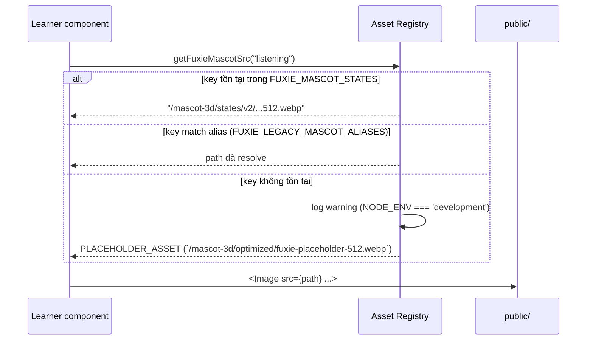
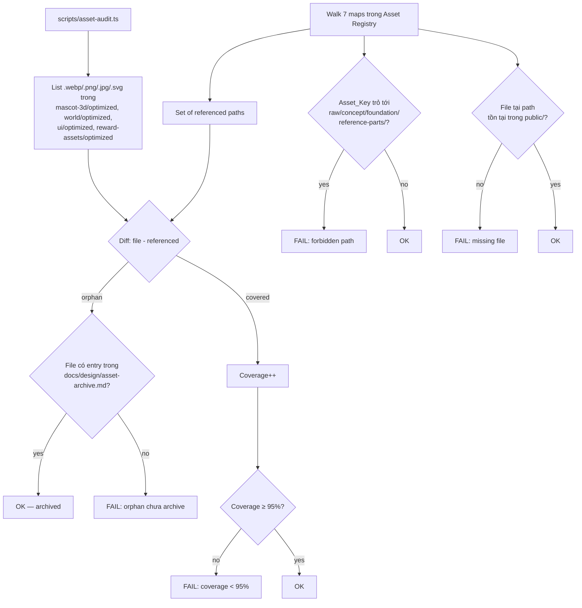
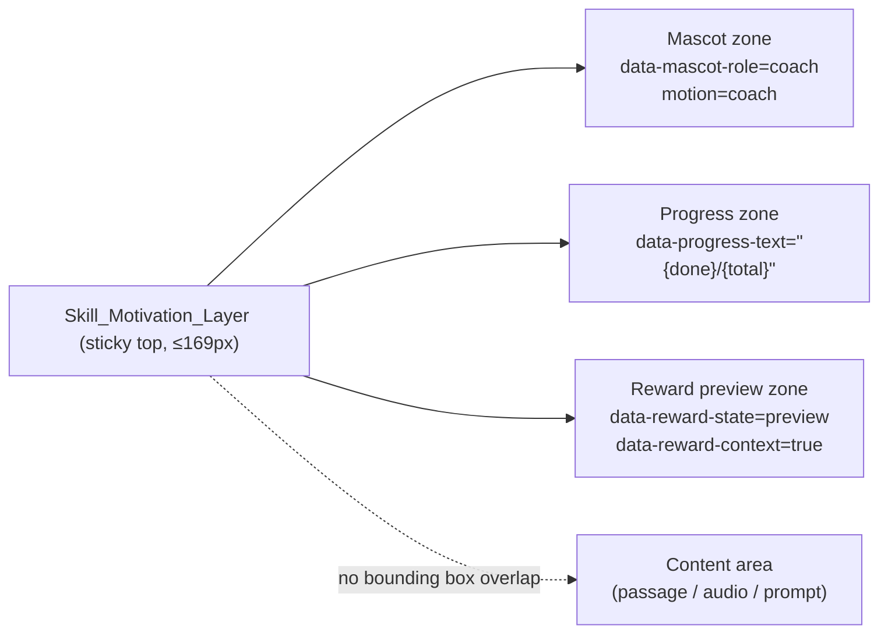
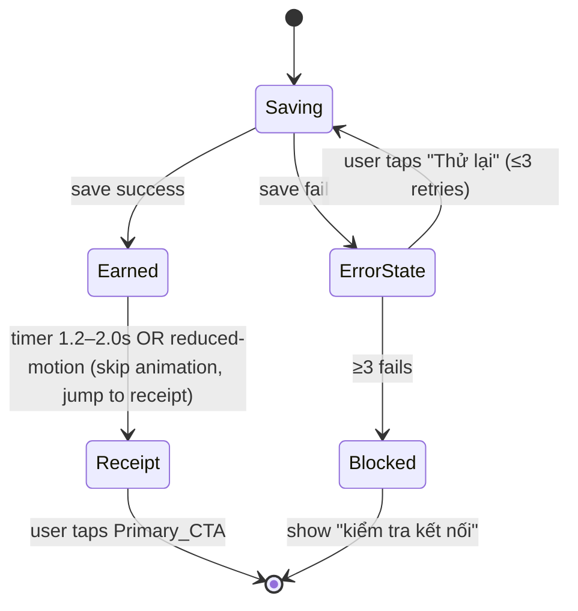
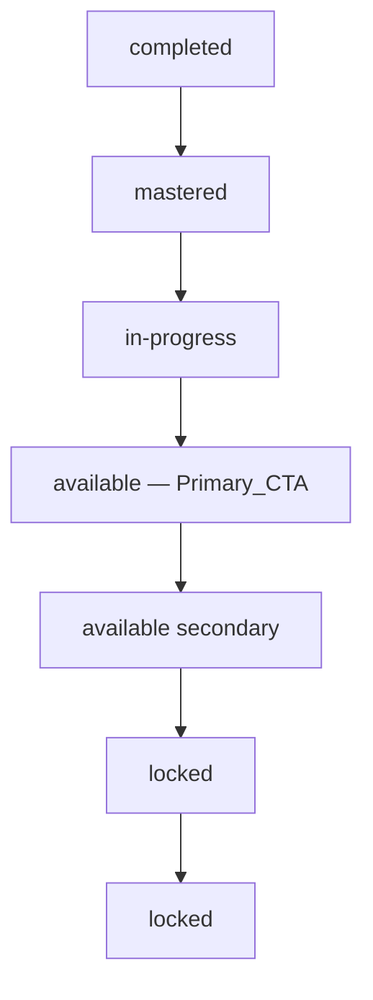

# Design Document

Vai chinh: Product Designer
Vai phoi hop: Frontend Engineer, Design System Designer, Gamification Designer

## Overview

Feature `gamified-ui-asset-rollout` không sinh asset mới — feature này tiếp nhận pipeline ảnh đã có (mascot 3D, world props, UI frames, reward props, module mascots, lesson illustrations) và biến chúng thành learner UI vận hành được dưới `apps/web/src/app/(learn)/`. Mục tiêu thiết kế là:

- Tập trung **mọi tham chiếu asset** qua một Asset Registry duy nhất (hai file: `apps/web/src/lib/mascot/fuxie-assets.ts` và `apps/web/src/components/gamification/reward-assets.ts`) để batch ảnh tương lai swap không cần đụng UI code.
- Thiết kế từng surface (Dashboard, Course, Vocabulary, Skill players, Result Reward Loop, Shop/Inventory, Review, Exam, Locked/Empty/Error) với **một game loop đọc được trong 3 giây ở first viewport mobile**, study-first, motion an toàn, palette Bright Sky kỷ luật.
- Đưa ra ba component "xương sống" tái sử dụng: `MascotRole`, `SkillMotivationLayer`, `ResultRewardLoop` (mở rộng) — để mọi surface dùng chung, không có visual treatment one-off.
- Đưa ra **CI checks** (lint chống hardcoded path, asset integrity, asset audit / orphan, locale parity, contrast snapshot) để invariant của design không bị phá khi thêm code mới.

Phạm vi thiết kế bám sát Requirement 1–20 trong `requirements.md`. Out-of-scope: sinh asset mới, backend economy logic, teacher/admin UI, dịch nội dung học.

### Nguyên tắc thiết kế chủ đạo

1. **Study-first, game-supportive**: game layer hiện ngay nhưng không che nội dung học. Skill_Motivation_Layer ≤ 20% chiều cao mobile viewport (Req 6.2). Exam không có game overlay (Req 10.1).
2. **Palette Bright Sky kỷ luật**: blue `#54A8E4`/`#60A8E4` là Primary_CTA mặc định; reward amber `#FFB703` chỉ dùng đúng `Reward_State ∈ {preview, earned, receipt}`; energy orange `#FF8A3D` ≤ 5% diện tích surface (Req 16).
3. **Một CTA chính/state**: mỗi state (`default`, `empty`, `locked`, `error`) có đúng một Primary_CTA (Req 11, Req 19.8–10).
4. **Mascot có vai trò**: Mascot_Role ∈ `{coach, companion, cheer, guard, silent}`, không bao giờ là decoration (Req 12).
5. **Asset Registry là single source of truth**: component không hardcode `/mascot-3d/...` hay `/reward-assets/...` — đi qua Asset_Key (Req 1).
6. **Reduced-motion an toàn**: animate chỉ `transform`/`opacity`, có frame cuối, có off-switch theo `prefers-reduced-motion` (Req 13).

---

## Architecture

### Sơ đồ luồng asset (high level)

```mermaid
graph LR
    A[apps/web/public/mascot-3d/optimized/<br/>apps/web/public/reward-assets/optimized/] --> B[Asset Registry<br/>fuxie-assets.ts<br/>reward-assets.ts]
    B -- "getFuxieMascotSrc(key)<br/>getFuxieWorldPropSrc(key)<br/>getRewardAssetSrc(key)<br/>..." --> C[Shared Components<br/>FuxieRoleMascot<br/>SkillMotivationLayer<br/>ResultRewardLoop<br/>MascotRoleHost]
    C --> D[Learner Surfaces<br/>(learn)/dashboard, course,<br/>vocabulary, reading, listening,<br/>speaking, writing, exam, review,<br/>rewards/shop, ...]
    A -. "audit /  archive .-> E[docs/design/asset-archive.md]
    F[CI: lint hardcoded paths<br/>integrity check<br/>asset audit] -. "fail on violation" .-> B
    G[CI: contrast snapshot<br/>reduced-motion test<br/>locale parity] -. "fail on violation" .-> D
```

### Phân lớp

| Lớp | File / Thư mục | Trách nhiệm | Không được làm |
| --- | --- | --- | --- |
| **Public assets** | `apps/web/public/mascot-3d/**`, `apps/web/public/reward-assets/**` | Lưu file ảnh thực tế (`.webp`/`.png`) | Component không được import path string trực tiếp |
| **Asset Registry** | `apps/web/src/lib/mascot/fuxie-assets.ts`, `apps/web/src/components/gamification/reward-assets.ts`, `apps/web/src/lib/mascot/fuxie-global-assets.ts` | Khai báo 7 typed maps + lookup helpers + placeholder | Lưu logic UI / state |
| **Shared gamification components** | `apps/web/src/components/gamification/quest-visuals.tsx`, `result-reward-loop.tsx`, `fuxie-live-3d.tsx`, ... | Render Mascot_Role, Skill_Motivation_Layer, Result_Reward_Loop, RewardPreview, RewardRevealMoment, FuxieCoach | Hardcode path; quyết định route business |
| **Learner surfaces** | `apps/web/src/app/(learn)/**`, `apps/web/src/components/{reading,listening,speaking,writing,vocabulary,...}/**` | Bố cục từng surface, gọi shared components qua Asset_Key | Hardcode `/mascot-3d/...` hoặc `/reward-assets/...` |
| **CI checks** | `scripts/lint-asset-registry-references.ts`, `scripts/asset-registry-integrity.ts`, `scripts/asset-audit.ts`, contrast snapshot test, locale parity test | Fail PR khi vi phạm Req 1, 2, 15, 16, 17 | — |

### Luồng tra cứu asset (Asset Registry contract)



Lookup helpers (đã có một phần, design này chuẩn hóa lại):

- `getFuxieMascotSrc(key: string): string` — luôn trả về path (không null), miss → placeholder + warning.
- `getFuxieWorldPropSrc(key: FuxieWorldProp): string`.
- `getFuxieUiFrameSrc(key: FuxieUiFrame): string`.
- `getFuxieModuleMascotSrc(key: FuxieModuleMascot): string`.
- `getFuxieGameMascotSrc(key: FuxieGamificationMascot): string`.
- `getFuxieFoundationAssetSrc(key: FuxieFoundationAsset): string`.
- `getFuxieLiving3dAsset(key: 'model' | 'poster' | 'frames'): string | string[]`.
- `getRewardAssetSrc(key: RewardAssetKey): string` (mới — wrap `REWARD_ASSETS`).
- `getShopItemAssetSrc(itemId, category)` (giữ).
- `getCefrBadgeAssetSrc(level)` (giữ).

Tất cả helper trả về `string` (không null). Khi key miss, helper trả `PLACEHOLDER_ASSET` đã khai báo trong `fuxie-assets.ts` (`/mascot-3d/optimized/fuxie-placeholder-512.webp`) và log warning ở dev mode (Req 1.6).

### Asset audit / orphan archive flow



`docs/design/asset-archive.md` có format cố định:

```markdown
| Path | Reason | Archived by | Date |
| ---- | ------ | ----------- | ---- |
| /mascot-3d/optimized/fuxie-3d-core-old-512.webp | superseded by happyWave v2 | <name> | 2026-05-20 |
```

File được archive thì có thể (a) giữ lại trong `public/` cho rollback nhưng phải có entry trong file trên, hoặc (b) xóa khỏi `public/`. Audit pass nếu một trong hai điều kiện thỏa.

---

## Components and Interfaces

### A. Asset Registry: 7 typed maps

Đã có sẵn trong codebase (đã verify). Design giữ nguyên tên và shape, bổ sung quy ước:

| Map | File khai báo | Dùng cho | Tag/conventions |
| --- | --- | --- | --- |
| `FUXIE_3D_ASSETS` | `apps/web/src/components/gamification/quest-visuals.tsx` (re-export từ `FUXIE_MASCOT_STATES`/`FUXIE_MODULE_MASCOTS`/`FUXIE_GAMIFICATION_MASCOTS`) | Mascot 3D đã optimized 512×512 webp, dùng trực tiếp trong UI | Key style: camelCase (`librarian`, `radioHost`, `speakingCoach`) |
| `FUXIE_MASCOT_STATES` | `fuxie-assets.ts` | Pose theo state (`wave`, `correct`, `wrong`, `try-again`, `empty`, `error`, `exam-focus`, `result-celebration`, ...) | Key style: kebab-case hoặc semantic camelCase. Có alias map `FUXIE_LEGACY_MASCOT_ALIASES` |
| `FUXIE_MODULE_MASCOTS` | `fuxie-assets.ts` | Mascot theo module (`reading`, `listening`, `writing`, `speaking`, `vocabulary`, `grammar`, `chat`, `exam`, `review`, `course`, `dashboard`, `shop`) | 1 mascot / module |
| `FUXIE_WORLD_PROPS` | `fuxie-assets.ts` | World identity props (`villageSquare`, `library`, `radioBooth`, `postOffice`, `marketStall`, `townHallExam`, `reviewGarden`, `chatCafe`, `collectionBook`, `phraseStamp`, `courseSignpost`, ...) | Mỗi key có `tags` ngầm dùng cho Req 6.4–6.8 (mapping ở §A.1 dưới) |
| `FUXIE_UI_FRAMES` | `fuxie-assets.ts` | Frame trang trí (`noticeBoard`, `courseCheckpointNode`, `collectionCardFrame`, `audioBroadcastPanel`, `letterReceiptFrame`, `resultRevealFrame`, `marketShelfFrame`, `emptyStateSignpost`) | Frame chỉ là decorative — luôn có `alt=""` |
| `FUXIE_LIVING_3D_ASSETS` | `quest-visuals.tsx` | Live mascot prototype (`model`, `poster`, `frames[]`) | Wrap trong `FuxieLive3DDynamic` |
| `REWARD_ASSETS` | `reward-assets.ts` | Reward props (`fucoin`, `xpStar`, `streakFreeze`, `cefrBadgeA1..B2`, `hintTicket`, `unlockKey`, `inventoryMarketProp`, ...) | Đã có lookup `getShopItemAssetSrc`, `getCefrBadgeAssetSrc` |

#### A.1 World Prop tags (cho Req 6.4–6.8)

Để truy vấn "world prop của Reading phải thuộc nhóm `library`", design thêm một mapping tag (compile-time const, không thêm runtime cost):

```ts
// apps/web/src/lib/mascot/fuxie-world-tags.ts
export const FUXIE_WORLD_PROP_TAGS: Record<FuxieWorldProp, ReadonlyArray<WorldTag>> = {
  villageSquare: ['village', 'plaza'],
  missionBoard: ['village', 'notice'],
  villageSquareMissionBoard: ['village', 'notice'],
  courseSignpost: ['signpost', 'path'],
  courseSignpostPath: ['signpost', 'path'],
  marketStall: ['market', 'shop'],
  marketBackpackStall: ['market', 'shop', 'inventory'],
  library: ['library', 'reading-room'],
  readingLibraryDesk: ['library', 'library-shelf'],
  radioBooth: ['studio', 'radio', 'broadcast-room'],
  radioBoothConsole: ['studio', 'radio'],
  postOffice: ['desk', 'workshop', 'study-room'],
  postOfficeCounter: ['desk', 'workshop'],
  townHallExam: ['exam-hall', 'town-hall'],
  examResultHall: ['exam-hall'],
  reviewGarden: ['garden', 'review'],
  chatCafe: ['cafe', 'plaza'],
  speakingStage: ['stage', 'cafe'],
  speakingStageCafe: ['cafe', 'plaza', 'town-square'],
  collectionBook: ['vocabulary', 'collection'],
  collectionBookTable: ['vocabulary', 'collection'],
  phraseStamp: ['vocabulary', 'collection'],
  postcardFragment: ['vocabulary', 'collection'],
  grammarScroll: ['grammar', 'workshop'],
  grammarWorkshopInterior: ['workshop', 'study-room'],
  badgeShelf: ['badge', 'shelf'],
  leaderboardGuildHall: ['guild', 'hall'],
  campaignFestivalBoard: ['festival', 'notice'],
  sessionFocusDojo: ['dojo', 'focus'],
  teacherAcademyExterior: ['teacher'],
  adminCommandCenter: ['admin'],
} as const

export type WorldTag =
  | 'library' | 'library-shelf' | 'reading-room'
  | 'studio' | 'radio' | 'broadcast-room'
  | 'cafe' | 'plaza' | 'town-square'
  | 'desk' | 'workshop' | 'study-room'
  | 'village' | 'plaza' | 'signpost' | 'path' | 'notice' | 'market' | 'shop'
  | 'inventory' | 'exam-hall' | 'town-hall' | 'garden' | 'review'
  | 'stage' | 'vocabulary' | 'collection' | 'grammar' | 'badge' | 'shelf'
  | 'guild' | 'hall' | 'festival' | 'dojo' | 'focus' | 'teacher' | 'admin'

export function pickWorldProp(tags: WorldTag[]): FuxieWorldProp {
  const candidates = (Object.keys(FUXIE_WORLD_PROP_TAGS) as FuxieWorldProp[])
    .filter(k => tags.some(t => FUXIE_WORLD_PROP_TAGS[k].includes(t)))
  return candidates[0] ?? 'villageSquare' // fallback
}
```

Component Reading gọi `pickWorldProp(['library'])`, Listening gọi `pickWorldProp(['studio', 'radio'])`, v.v., để đáp ứng Req 6.4–6.8 mà không hardcode key.

### B. Mascot_Role system

#### B.1 Enum và surface config

```ts
// apps/web/src/lib/mascot/mascot-role.ts
export const MASCOT_ROLES = ['coach', 'companion', 'cheer', 'guard', 'silent'] as const
export type MascotRole = (typeof MASCOT_ROLES)[number]

export type SurfaceState = 'default' | 'empty' | 'locked' | 'error' | 'success'

export interface SurfaceMascotConfig {
  surfaceId: string                  // e.g. "dashboard", "reading-player"
  states: Partial<Record<SurfaceState, MascotRole>>
  // missing state -> 'silent' (Req 12.3)
}

export const SURFACE_MASCOT_CONFIG: Record<string, SurfaceMascotConfig> = {
  dashboard:        { surfaceId: 'dashboard',        states: { default: 'coach',     empty: 'guard', error: 'guard' } },
  course:           { surfaceId: 'course',           states: { default: 'coach',     empty: 'guard', locked: 'guard', error: 'guard' } },
  vocabulary:       { surfaceId: 'vocabulary',       states: { default: 'companion', empty: 'guard', error: 'guard' } },
  'vocabulary-practice':   { surfaceId: 'vocabulary-practice',   states: { default: 'companion' } },
  'vocabulary-microgames': { surfaceId: 'vocabulary-microgames', states: { default: 'companion', success: 'cheer' } },
  reading:          { surfaceId: 'reading',          states: { default: 'coach',     empty: 'guard', error: 'guard' } },
  listening:        { surfaceId: 'listening',        states: { default: 'coach',     empty: 'guard', error: 'guard' } },
  speaking:         { surfaceId: 'speaking',         states: { default: 'coach',     empty: 'guard', error: 'guard' } },
  'speaking-roleplay': { surfaceId: 'speaking-roleplay', states: { default: 'companion', error: 'guard' } },
  writing:          { surfaceId: 'writing',          states: { default: 'coach',     empty: 'guard', error: 'guard' } },
  review:           { surfaceId: 'review',           states: { default: 'coach',     empty: 'cheer', error: 'guard' } },
  'rewards-shop':   { surfaceId: 'rewards-shop',     states: { default: 'companion', empty: 'guard', error: 'guard', success: 'cheer' } },
  'result-reward':  { surfaceId: 'result-reward',    states: { default: 'cheer',     error: 'guard' } },
  exam:             { surfaceId: 'exam',             states: { default: 'silent',    error: 'guard' } },
}
```

Rules (Req 12.5–12.9):

- `cheer` chỉ xuất hiện khi `Reward_State === 'earned'` HOẶC `state === 'empty' && learner-reached-goal`. Ngoài ra → fail render dev / fallback `silent` prod.
- `guard` chỉ xuất hiện khi `state ∈ {locked, empty, error}`.
- Exam `in-progress` → `silent`.
- Skill_Motivation_Layer luôn `coach`.

#### B.2 Component `MascotRoleHost`

```tsx
// apps/web/src/components/gamification/mascot-role-host.tsx
interface MascotRoleHostProps {
  surfaceId: keyof typeof SURFACE_MASCOT_CONFIG
  state: SurfaceState
  rewardState?: RewardState
  size?: number
  motion?: FuxieMascotMotion
  children?: ReactNode  // overlay content (greeting bubble, etc.)
}

// Internal:
// 1. Resolve role = SURFACE_MASCOT_CONFIG[surfaceId].states[state] ?? 'silent'
// 2. Validate role consistency (Req 12.5–12.7); dev: throw, prod: fallback 'silent'
// 3. Pick mascot Asset_Key from FUXIE_MASCOT_STATES based on role + surfaceId
// 4. Render <FuxieRoleMascot> with data-mascot-role={role} attribute
```

`data-mascot-role` attribute là test selector ổn định cho property tests Req 19.6.

### C. Skill_Motivation_Layer

```tsx
// apps/web/src/components/gamification/skill-motivation-layer.tsx
interface SkillMotivationLayerProps {
  skill: 'reading' | 'listening' | 'speaking' | 'writing'
  done: number               // số câu đã làm, integer ≥ 0
  total: number              // tổng số câu, integer ≥ done
  rewardPreview: RewardPreviewItem[]  // ≥ 1 item, all from REWARD_ASSETS
  worldPropTags: WorldTag[]  // forwarded from surface (Req 6.4–6.8)
  reducedMotion?: boolean    // forwarded from prefers-reduced-motion
}
```

Layout (mobile, ≤ 480px):

- Container: sticky-top, height ≤ `min(20vh, 169px)`, `data-role="skill-motivation-layer"`.
- 3 zones, horizontal flex:
  1. **Mascot zone** (`data-mascot-role="coach"`): 56–72 px, motion `coach` (transform/opacity only).
  2. **Progress zone** (`data-progress-text`): "{done}/{total}" + optional bar.
  3. **Reward preview zone** (`data-reward-state="preview"`): 1 reward item từ `REWARD_ASSETS`, có nhãn ("+10 Fucoin", v.v.).
- KHÔNG được giao bounding box với vùng nội dung học (verify bằng `getBoundingClientRect()` test, Req 6.2).

Diagram:



Reduced-motion: nhận prop `reducedMotion`; khi true, strip class `animate-coach`/`animate-idle` (Req 13.2).

### D. Result_Reward_Loop (mở rộng từ component đã có)

Hai giai đoạn rõ ràng, có FSM:



Props (mở rộng từ `ResultRewardLoopProps` đã có):

```ts
interface ResultRewardLoopProps {
  skill: 'vocabulary' | 'listening' | 'reading' | 'writing' | 'speaking' | 'exam'
  // earned phase
  earnedAsset: RewardAssetKey                // Reward_State='earned'
  earnedDurationMs: number                   // [1200, 2000], default 1500
  // receipt phase
  xpEarned: number                           // ≥ 0
  fucoinEarned: number                       // ≥ 0
  accuracy: number                           // 0..100, rounded int
  timeSpent: { mm: number; ss: number }      // mm ≤ 99, ss 0..59
  primaryAction: { label: string; href?: string; onClick?: () => void }
  // error
  onRetry: () => Promise<void>
  retryCount: number                         // ≤ 3
  saveError: boolean
  // a11y
  reducedMotion: boolean
}
```

Render contract:

- Earned phase: mascot `cheer`, asset từ `REWARD_ASSETS`, animation reveal `[1200, 2000]ms`. `data-reward-state="earned"` trên root.
- Receipt phase: hiển thị XP, Fucoin, accuracy %, time spent mm:ss, đúng 1 Primary_CTA. `data-reward-state="receipt"`.
- Error: `data-reward-state` không set, mascot `guard`, không reward amber, không animation.
- Reduced-motion: skip animation, render frame cuối earned + receipt content trong 200ms (Req 7.5, 13.3).

### E. Reward_State handling

`RewardState ∈ {preview, earned, receipt, locked, pending}`. Mỗi component reward-related (RewardPreview, RewardRevealMoment, ShopItemCard, ReviewRewardChip, ResultRewardLoop) chấp nhận prop `rewardState` và set DOM attribute:

```html
<div data-reward-state="preview" data-reward-context="true" ...>
```

Quy ước (Req 16, 19.4):

| `data-reward-state` | Cho phép `#FFB703`? | Mascot_Role |
| --- | --- | --- |
| `preview` | yes (ở subtree này) | thường `coach`/`companion` |
| `earned` | yes (ở subtree này) | `cheer` |
| `receipt` | yes (ở subtree này) | `cheer` hoặc `companion` |
| `locked` | no | `guard` |
| `pending` | no | `companion` (spinner) |

CI test (Req 19.4) scan toàn bộ DOM của P0 surface render: nếu computed `color`/`background-color` match `rgb(255,183,3) ± 5%`, node hoặc một ancestor PHẢI có `data-reward-context="true"` HOẶC `data-reward-state ∈ {preview, earned, receipt}`. Nếu không → fail.

Streak amber (Req 16.1) là exception duy nhất: streak indicator có `data-reward-context="true"` khi `streak_count ≥ 1` trong 24h.

### F. Bright Sky palette enforcement

Tokens (đã được khai báo trong `globals.css`, design này chỉ ghi lại quy ước sử dụng):

```
--fuxie-blue-50: #F3FBFF   (page bg, soft)
--fuxie-blue-100: #E4F0F0  (panel tint)
--fuxie-blue-200: #CCE4F0  (card tint)
--fuxie-blue-400: #60A8E4  (brand secondary)
--fuxie-blue-500: #54A8E4  (Primary_CTA, brand primary)
--fuxie-blue-600: #3C78A8  (text-on-light readable)
--fuxie-blue-700: #3078B4  (pressed)
--fuxie-blue-900: #173B56  (deep text / scrim)
--fuxie-action: #54A8E4
--fuxie-action-hover: #3C93D1
--fuxie-success: #2EC4B6   (CEFR-A1 green / progress success)
--fuxie-energy: #FF8A3D    (accent ≤5% area)
--fuxie-reward: #FFB703    (Reward_State only)
```

**Rules (Req 16)**:

- Primary_CTA trên learning surface dùng `--fuxie-action` (Req 16.4).
- `--fuxie-reward` chỉ trong subtree có `data-reward-state ∈ {preview, earned, receipt}` HOẶC streak indicator có `data-reward-context="true"`.
- `--fuxie-energy` ≤ 5% diện tích surface; không làm fill của Primary_CTA (Req 16.3).
- `locked|empty|error`: không dùng `--fuxie-reward` cho stroke/fill/icon/text trong subtree đó (Req 16.5).

CI snapshot test: render mỗi P0 surface với mock data (`default`, `empty`, `locked`, `error`, `in-progress`), scan computed style của mọi node, fail nếu vi phạm.

### G. Reduced-motion behavior

Hook chia sẻ:

```ts
// apps/web/src/hooks/use-reduced-motion.ts
export function useReducedMotion(): boolean {
  const [reduced, setReduced] = useState(false)
  useEffect(() => {
    const mql = window.matchMedia('(prefers-reduced-motion: reduce)')
    const update = () => setReduced(mql.matches)
    update()
    mql.addEventListener('change', update)
    return () => mql.removeEventListener('change', update)
  }, [])
  return reduced
}
```

Quy ước (Req 13):

- Mọi animation chỉ animate `transform` và `opacity`.
- Class CSS animation đặt trong tập đóng `{animate-idle, animate-coach, animate-reward, animate-speak}`. Khi `reduced=true`, component KHÔNG render các class này (Req 13.2 — strip trong 100ms qua re-render).
- `Result_Reward_Loop.earned` skip animation, jump receipt trong 200ms (Req 7.5, 13.3).
- Skill_Motivation_Layer: animation lặp đạt 6000ms tổng → snap về idle với transition 500ms (Req 13.4).
- Animation duration ∈ `[120ms, 2000ms]`; force-complete tại 2000ms (Req 13.5, 13.7).

### H. Accessibility (Req 15)

| Vấn đề | Quy ước thiết kế |
| --- | --- |
| Body text contrast | ≥ 4.5:1 với background. Khi background là world prop, áp `Scrim` component (background opacity ≥ 80%, color = `--fuxie-blue-900`/`#FFFFFF` tùy theme) phủ vùng text. |
| Large text (≥ 18.66 px regular hoặc ≥ 14 px bold) | ≥ 3:1 |
| Primary_CTA | Tap target ≥ 44×44 (Dashboard, Skill players); ≥ 48×48 dp (Review, Req 9.1). Text/button contrast ≥ 4.5:1; viền ≥ 3:1. |
| Focus order | DOM order match visual order. Course path: focus đầu tiên = node `available` đầu tiên trong path order (Req 4.2). |
| Visible focus | Outline ≥ 2px, contrast ≥ 3:1, bao quanh interactive area (Req 15.4). |
| Image alt | Meaningful: 1–250 ký tự, localized vi/de. Decorative (UI frames, world props phủ background): `alt=""`. |
| Runtime contrast fail | Component log violation, áp scrim mặc định trong 100ms (Req 15.6). |

`Scrim` component:

```tsx
// apps/web/src/components/ui/scrim.tsx
interface ScrimProps {
  children: ReactNode
  intensity?: 'soft' | 'strong'   // soft: rgba(255,255,255,0.8); strong: rgba(23,59,86,0.85)
}
```

### I. Learner surface designs

Thống nhất layout pattern: mỗi surface là một composition `<MascotRoleHost> + <PrimaryCta data-role="primary-cta">`+ thông tin chính (≤ 2 viewport scroll).

#### I.1 Dashboard — Village Square hierarchy (Req 3, 14)

First viewport (mobile 390×844), top→bottom:

```
┌─────────────────────────────────────┐
│ Fuxie greeting (mascot=coach)       │  ← MascotRoleHost surfaceId="dashboard"
│ "Chào An, hôm nay học A1.2.3"       │     greeting localized (Req 3.2)
├─────────────────────────────────────┤
│ Streak chip: 🔥 7 ngày              │  ← data-streak-count="7" data-reward-context
│ XP today: ★ 30/50                   │
├─────────────────────────────────────┤
│ Quest progress hero (current node)  │
├─────────────────────────────────────┤
│ ┌─────────────────────────────────┐ │
│ │ TIẾP TỤC HỌC  →                 │ │  ← Primary_CTA, data-role="primary-cta"
│ └─────────────────────────────────┘ │     ≥44×44, hoàn toàn trong y ≤ 844
└─────────────────────────────────────┘
```

Background: `pickWorldProp(['village', 'plaza'])` → `villageSquare`. Khi không tồn tại → fallback solid `--fuxie-blue-50` (Req 3.5). Áp `<Scrim intensity="soft">` lên vùng text khi cần.

States:

- `default` (có lộ trình): như trên. Mascot `coach`.
- `empty` (chưa có lộ trình, lần đầu): mascot `guard`, Primary_CTA = "Tạo lộ trình", KHÔNG render streak/XP/quest progress (Req 3.6).
- `error` (request lỗi >10s): mascot `guard`, Primary_CTA = "Thử lại", không reward amber, giữ streak từ cache (Req 3.7).

#### I.2 Course Path (Req 4)

Mobile vertical scroll, mỗi node có 5 state:



Visual treatment cho mỗi state:

| State | Visual | Asset |
| --- | --- | --- |
| `locked` | Greyscale node + lock icon | `FUXIE_WORLD_PROPS.courseSignpost` (icon) + `FUXIE_UI_FRAMES.courseCheckpointNode` |
| `available` (đầu tiên) | Filled `--fuxie-action` blue, `data-role="primary-cta"`, focus đầu tiên | `FUXIE_UI_FRAMES.courseCheckpointNode` |
| `available` (thứ cấp) | Outline blue, không filled | — |
| `in-progress` | Progress bar (0–100), color `--fuxie-success` | — |
| `completed` | Badge `receipt` từ `REWARD_ASSETS.cefrBadgeA1..B2` | `getCefrBadgeAssetSrc(level)` |
| `mastered` | Badge `receipt` + extra mastered ring | `REWARD_ASSETS.cefrBadgeNodeSet` |

Module mascot per cụm: `FUXIE_MODULE_MASCOTS[moduleKey]`, 1 mascot/cụm (Req 4.9). Asset miss/load fail trong 3s → placeholder neutral, không block render (Req 4.10).

Tooltip locked: hiện trong 200ms hover/focus, nội dung "Hoàn thành A1 module 2 lesson 3" (Req 4.4, ≤140 ký tự — Req 11.4).

Tên node ≤ 40 ký tự: 2 dòng max + ellipsis. > 40: ellipsis sau 2 dòng + tooltip full name (Req 4.8).

#### I.3 Vocabulary Collection Book (Req 5)

Card 3 visual state:

| State | Indicator hình ảnh | Indicator text |
| --- | --- | --- |
| `new` | Viền `--fuxie-blue-200`, icon ✦ | "Mới" |
| `learning` | Viền `--fuxie-action`, progress dot | "Đang học" |
| `mastered` | Frame `FUXIE_UI_FRAMES.collectionCardFrame`, viền `--fuxie-success`, stamp `REWARD_ASSETS.fucoinVillage` thumbnail | "Đã thuộc" |

Mastered transition: state chuyển → áp frame trong vòng 1s (Req 5.2). Frame load fail → viền `--fuxie-success` + toast non-blocking, không xóa state (Req 5.6).

`/vocabulary/practice`: mascot `companion` (`FUXIE_3D_ASSETS.vocabularyCoach`), Primary_CTA "Bắt đầu" trong first viewport (Req 5.3).

`/vocabulary/microgames` trước khi tap Primary_CTA: hiển thị `RewardPreview` từ `REWARD_ASSETS` với `data-reward-state="preview"` + nhãn "+10 Fucoin" (Req 5.4).

Empty (0 từ): mascot `guard`, Primary_CTA "Học từ đầu tiên" (Req 5.5).

#### I.4 Skill players (Reading, Listening, Speaking, Writing) — Req 6

Tất cả 4 skill players dùng pattern chung:

```
┌─────────────────────────────────────┐
│ Skill_Motivation_Layer (≤169px)     │  ← mascot=coach + progress + reward preview
│ [🦊 coach] [3/10] [+10 ⭐ preview]  │
├─────────────────────────────────────┤
│ World prop scrim (background)       │
│                                     │
│ ┌─────────────────────────────────┐ │
│ │ Content area                    │ │  ← passage / audio / prompt
│ │ - Reading: passage + question   │ │
│ │ - Listening: audio player + Q   │ │
│ │ - Speaking: mic + transcript    │ │
│ │ - Writing: editor               │ │
│ └─────────────────────────────────┘ │
├─────────────────────────────────────┤
│ Bottom action bar                   │
│ ┌─────────────────────────────────┐ │
│ │ TRẢ LỜI / TIẾP TỤC  →           │ │  ← Primary_CTA
│ └─────────────────────────────────┘ │
└─────────────────────────────────────┘
```

World prop per skill (Req 6.4–6.8):

| Skill | `worldPropTags` | Resolved key (default) |
| --- | --- | --- |
| Reading | `['library']` | `library` / `readingLibraryDesk` |
| Listening | `['studio', 'radio']` | `radioBooth` / `radioBoothConsole` |
| Speaking | `['cafe', 'plaza']` | `chatCafe` / `speakingStageCafe` |
| Writing | `['desk', 'workshop']` | `postOffice` / `postOfficeCounter` |

Speaking roleplay (Req 6.7): mascot `companion` đặt đối diện learner avatar trên trục ngang (`flex-direction: row-reverse` mobile, hoặc grid 2-col).

Reward amber containment (Req 6.9): trong state `in-progress`, không pixel `#FFB703 ± 5%` ngoài bounding box reward preview của Skill_Motivation_Layer.

Error (asset/audio/passage không load trong 10s): error state với 1 Primary_CTA "Thử lại"; preserve progress; không animation reward (Req 6.10). Sau 3 lần retry liên tiếp fail: fallback message localized + downgrade "Thử lại" thành secondary (Req 6.11).

#### I.5 Result Reward Loop surface (Req 7)

Component `<ResultRewardLoop>` (đã design ở §D). Triggered khi learner finish lesson/session thành công. Visual:

```
[earned phase, 1.2–2.0s]
┌─────────────────────────────────────┐
│  🦊 cheer animation                  │  data-reward-state="earned"
│  ✦ Reward asset reveal              │  data-reward-context="true"
│  Sparkle particles (transform/op)    │
└─────────────────────────────────────┘
       ↓ auto-transition (no tap)
[receipt phase]
┌─────────────────────────────────────┐
│  +30 XP    +15 Fucoin               │
│  Accuracy 92%   Time 04:23          │
│  ┌───────────────────────────────┐  │
│  │ HỌC BÀI KẾ TIẾP →             │  │  ← Primary_CTA
│  └───────────────────────────────┘  │
└─────────────────────────────────────┘
```

Save error → không vào earned, hiển thị error state, Primary_CTA "Thử lại" tối đa 3 lần (Req 7.6, 7.7).

#### I.6 Shop / Inventory (Req 8)

First viewport: wallet (Fucoin + XP) — không scroll. Range 0–9,999,999.

Tab bar: `Cửa hàng` | `Túi đồ`.

Item card states (5):

| State | Visual | CTA | Asset_Key (background frame) |
| --- | --- | --- | --- |
| `affordable` | item art, price chip | "Đổi" enabled, blue | `FUXIE_UI_FRAMES.marketShelfFrame` |
| `unaffordable` | item art dimmed, price chip + hint "còn thiếu N coin" | "Đổi" disabled | `FUXIE_UI_FRAMES.marketShelfFrame` |
| `owned` | item art + checkmark "Đã sở hữu" | "Trang bị" (không Primary blue trừ khi equipped) | `FUXIE_UI_FRAMES.marketShelfFrame` |
| `pending` | spinner overlay, `data-reward-state="pending"` | disabled, có spinner | — |
| `locked` | item art greyscale + lock icon + unlock condition copy | disabled, "Đáp ứng yêu cầu" link | — |

Pending timeout 10s: revert về `affordable`/`unaffordable` theo balance, toast non-blocking (Req 8.7).

Inventory: 200 item gần nhất, vertical scroll, dùng `getShopItemAssetSrc(itemId, category)` (Req 8.8). Equip: cập nhật mascot trong 1s (Req 8.9).

Error load: error state, Primary_CTA "Thử lại", wallet hiện cached, không reward animation (Req 8.10).

#### I.7 Review (Req 9)

```
┌─────────────────────────────────────┐
│ Mascot=coach + greeting             │
├─────────────────────────────────────┤
│ Due: 12 (blue)   Overdue: 3 (deep)  │  ← KHÔNG đỏ (Req 9.3)
│ Reward preview "chưa nhận":         │
│ +50 XP nếu hoàn thành batch hôm nay │  data-reward-state="preview"
├─────────────────────────────────────┤
│ ┌─────────────────────────────────┐ │
│ │ ÔN NGAY  →   (≥48×48 dp)        │ │  ← Primary_CTA
│ └─────────────────────────────────┘ │
└─────────────────────────────────────┘
```

Số > 9999 → "9999+" (Req 9.2).

Empty (`due=0 ∧ overdue=0`): mascot `cheer`, Primary_CTA "Học bài mới" (Req 9.4).

Error (load fail >5s): mascot `guard`, Primary_CTA "Thử lại"; KHÔNG hiện Primary_CTA "Ôn ngay" (Req 9.6).

#### I.8 Exam (Req 10)

`in-progress` chrome (formal, no game overlay):

```
┌─────────────────────────────────────┐
│ TIMER 23:45    3 / 25               │  ← fixed top, mm:ss + counter
├─────────────────────────────────────┤
│ Question content (deep blue + neutral palette)
│                                     │
├─────────────────────────────────────┤
│ ┌─────────────────────────────────┐ │
│ │ NỘP BÀI                         │ │  ← Primary_CTA, fixed bottom
│ └─────────────────────────────────┘ │
└─────────────────────────────────────┘
```

Quy ước:

- KHÔNG mascot animation, reward animation, streak, XP/coin badge, sound game (Req 10.1).
- Palette neutral + `--fuxie-blue-700/900` only; không `--fuxie-reward` (Req 10.4).
- Timer 00:00 → auto-submit trong 2s (Req 10.3).
- Disconnect: pause timer, lưu local progress mỗi 5s, "Tiếp tục" disabled cho tới reconnect (Req 10.6).
- Close/reload trong 60 phút: khôi phục answers + remaining time (Req 10.7).
- Sau confirm submit: kích hoạt `<ResultRewardLoop>` chuẩn trong 2s (Req 10.5).

Surface config: `MASCOT_ROLES.silent` cho `in-progress`; `guard` cho `error`.

#### I.9 Locked / Empty / Error patterns (Req 11)

Mọi P0 surface implement ≥ 3 state (`default`, `empty`, `error`). Surface có gating thêm `locked` (Req 11.2).

| State | Mascot | Copy | Primary_CTA |
| --- | --- | --- | --- |
| `empty` | `guard` | localized ≤ 140 ký tự, 1 câu giải thích | đúng 1 CTA → hành động khả thi |
| `locked` | `guard` | điều kiện unlock cụ thể ≤ 140 ký tự, ref đơn vị học xác định | đúng 1 CTA → hành động unlock |
| `error` | `guard` | thông báo lỗi ngắn | "Thử lại" + secondary "Về Dashboard"; preserve user input |

Retry rate-limit (Req 11.6): >3 lần "Thử lại" trong 60s → disable 30s + thông báo kiểm tra kết nối.

Không reward amber/celebration trong các state này (Req 11.7, 16.5).

### J. CI checks

#### J.1 Lint chống hardcoded paths (Req 1.3)

`scripts/lint-asset-registry-references.ts` (chạy như pnpm script `lint:asset-paths`):

- Walk `apps/web/src/**/*.{ts,tsx}` (exclude `fuxie-assets.ts`, `fuxie-global-assets.ts`, `reward-assets.ts`, và test files của chúng).
- Regex tập hợp prefixes: `/mascot-3d/`, `/reward-assets/`, `/mascot-3d/raw/`, `/mascot-3d/concept/`, `/mascot-3d/reference-parts/`, `/reward-assets/raw/`, `/mascot-3d/foundation/`.
- Tìm string literal match → fail với danh sách `<file>:<line>: <literal>`.
- Cho phép comment escape `// asset-registry-allow` cho test fixtures hoặc storybook example (hạn chế tối đa).

Tích hợp `pnpm check:quick` và CI workflow.

#### J.2 Asset integrity check (Req 1.5)

`scripts/asset-registry-integrity.ts` (script `check:asset-integrity`):

- Iterate 7 maps + alias map.
- Với mỗi value (path string), `fs.existsSync(path.join('apps/web/public', value))`.
- Nếu fail: in `<group>.<key>: <path>` và exit code 1.

#### J.3 Asset audit (Req 2.5)

`scripts/asset-audit.ts` (script `check:asset-audit`):

- Walk các thư mục optimized (Req 2.1).
- Build set referenced từ 7 maps.
- Coverage = `|files ∩ referenced| / |files|`. Fail nếu < 0.95.
- Orphan = `files - referenced`. Cross-check `docs/design/asset-archive.md`. Fail nếu có orphan chưa archive.
- Forbidden path check: `raw/`, `concept/`, `foundation/`, `reference-parts/` xuất hiện trong values của 7 maps → fail (Req 2.3).
- Output report tới `tmp/asset-audit.md`.

#### J.4 Locale parity check (Req 17)

`scripts/check-locale-parity.ts`:

- Compare keys của `apps/web/messages/vi.json` và `de.json`.
- Fail nếu chênh lệch.
- Fail nếu giá trị empty/whitespace-only (Req 17.3).
- Lint rule (eslint plugin custom hoặc grep) cho component có string literal learner-facing không qua `t()` (Req 17.4).

#### J.5 Visual / Behavior tests (Req 19)

Vitest + @testing-library/react + jsdom; jest-axe cho contrast; happy-dom cho DOM scan. Chi tiết ở §Testing Strategy.

---

## Data Models

Asset Registry là data layer của feature. Type model:

```ts
// apps/web/src/lib/mascot/fuxie-assets.ts (existing, design này chuẩn hóa thêm)

export const PLACEHOLDER_ASSET = '/mascot-3d/optimized/fuxie-placeholder-512.webp' as const

export type AssetGroup =
  | 'FUXIE_3D_ASSETS'
  | 'FUXIE_MASCOT_STATES'
  | 'FUXIE_MODULE_MASCOTS'
  | 'FUXIE_WORLD_PROPS'
  | 'FUXIE_UI_FRAMES'
  | 'FUXIE_LIVING_3D_ASSETS'
  | 'REWARD_ASSETS'

export type AssetKey<G extends AssetGroup> =
  G extends 'FUXIE_3D_ASSETS'         ? keyof typeof FUXIE_3D_ASSETS :
  G extends 'FUXIE_MASCOT_STATES'     ? keyof typeof FUXIE_MASCOT_STATES :
  G extends 'FUXIE_MODULE_MASCOTS'    ? keyof typeof FUXIE_MODULE_MASCOTS :
  G extends 'FUXIE_WORLD_PROPS'       ? keyof typeof FUXIE_WORLD_PROPS :
  G extends 'FUXIE_UI_FRAMES'         ? keyof typeof FUXIE_UI_FRAMES :
  G extends 'FUXIE_LIVING_3D_ASSETS'  ? keyof typeof FUXIE_LIVING_3D_ASSETS :
  G extends 'REWARD_ASSETS'           ? RewardAssetKey :
  never
```

Mascot_Role + Reward_State models:

```ts
export type MascotRole = 'coach' | 'companion' | 'cheer' | 'guard' | 'silent'
export type RewardState = 'preview' | 'earned' | 'receipt' | 'locked' | 'pending'
export type SurfaceState = 'default' | 'empty' | 'locked' | 'error' | 'success'
```

Surface config (purely declarative, không trong DB):

```ts
export interface LearnerSurfaceConfig {
  surfaceId: string
  route: string                      // e.g. '/dashboard'
  mascotByState: Partial<Record<SurfaceState, MascotRole>>
  worldPropTags?: WorldTag[]         // for skill players
  hasGating?: boolean                // implies 'locked' state required
}
```

Asset_Coverage / Audit report (tmp file, không persist):

```ts
interface AssetAuditReport {
  generatedAt: string
  coverage: { files: number; referenced: number; pct: number }    // ≥ 0.95
  orphans: Array<{ path: string; archived: boolean; reason?: string }>
  missing:  Array<{ group: AssetGroup; key: string; path: string }>
  forbidden: Array<{ group: AssetGroup; key: string; path: string }>
}
```

Local exam progress (Req 10.6, 10.7) — stored in `localStorage` key `exam:{examId}:progress`:

```ts
interface LocalExamProgress {
  examId: string
  startedAt: string                   // ISO
  remainingMs: number                 // updated every 5s
  answers: Record<string /*qid*/, string | string[]>
  lastSavedAt: string
}
// TTL: 60 phút sau startedAt (Req 10.7)
```


---

## Correctness Properties

*Một property là một đặc tính hoặc hành vi PHẢI đúng trên mọi execution hợp lệ của hệ thống — một phát biểu hình thức về điều mà phần mềm phải làm. Properties là cầu nối giữa specification cho người đọc và guarantee có thể verify bằng máy.*

PBT phù hợp cho feature này vì phần lớn invariant quan trọng (asset registry lookup, mascot role, reward amber containment, locked/empty/error CTA, reduced-motion discipline, locale parity, shop item state classification) là **logic thuần** hoặc có thể test với DOM render + mock. Một số acceptance criteria là performance / integration (CLS, transferred bytes, AWS-like external) — sẽ dùng integration test 1–3 examples thay vì PBT (xem Testing Strategy).

Sau prework + reflection, danh sách property được consolidated như sau (mỗi property tương ứng một property-based test trong CI):

### Property 1: Asset Registry Integrity

*For any* `(group, key)` thuộc 7 maps `{FUXIE_3D_ASSETS, FUXIE_MASCOT_STATES, FUXIE_MODULE_MASCOTS, FUXIE_WORLD_PROPS, FUXIE_UI_FRAMES, FUXIE_LIVING_3D_ASSETS, REWARD_ASSETS}`, file tại path `registry[group][key]` phải tồn tại trong `apps/web/public/`.

**Validates: Requirements 1.1, 1.4, 1.5, 19.1**

### Property 2: Asset Registry Reference Discipline

*For any* file `.ts`/`.tsx` dưới `apps/web/src/` (loại trừ `fuxie-assets.ts`, `fuxie-global-assets.ts`, `reward-assets.ts`, và test files của chúng), file đó KHÔNG chứa string literal khớp prefix forbidden `^/(mascot-3d|reward-assets)/(raw|concept|reference-parts|foundation|).*`. *Đồng thời, for any* Asset_Key được tham chiếu trong source code, key đó tồn tại trong Asset Registry.

**Validates: Requirements 1.2, 1.3, 19.2**

### Property 3: Lookup Totality with Placeholder

*For any* string `s ∈ String`, `getFuxieMascotSrc(s)` (và mọi lookup helper khác) trả về một string non-empty thuộc tập `valid_paths(registry) ∪ {PLACEHOLDER_ASSET}`. *For any* `s` không thuộc keys hoặc alias, `getFuxieMascotSrc(s) === PLACEHOLDER_ASSET`.

**Validates: Requirements 1.6**

### Property 4: Asset Audit Invariant (Coverage + Orphan + Forbidden + Optimized-Preference)

*For any* file ảnh `.webp`/`.png`/`.jpg`/`.jpeg`/`.svg` tồn tại trực tiếp trong các thư mục optimized (`mascot-3d/optimized/`, `mascot-3d/world/optimized/`, `mascot-3d/ui/optimized/`, `reward-assets/optimized/`):

- (a) file được Asset Registry tham chiếu, HOẶC
- (b) file có entry trong `docs/design/asset-archive.md`, HOẶC
- (c) file không tồn tại.

*Đồng thời, for any* `(group, key)` ∈ Asset Registry, `registry[group][key]` KHÔNG khớp prefix forbidden `raw/`, `concept/`, `foundation/`, `reference-parts/`. *Và* coverage = `|optimized files referenced by registry| / |optimized files|` ≥ `0.95`. *Và for any* asset có cả `optimized/<name>.webp` và một bản `.png`/`.jpg` ở thư mục khác, registry chọn path `optimized/<name>.webp`.

**Validates: Requirements 2.1, 2.2, 2.3, 2.4, 2.5, 18.1**

### Property 5: Mascot_Role Consistency

*For any* learner surface `s ∈ P0_SURFACES` và mọi `state ∈ {default, empty, locked, error, success}`, role được áp lên mascot khi render thuộc tập đóng `{coach, companion, cheer, guard, silent}`. *Đồng thời*:

- `role === 'cheer'` ⇒ `Reward_State === 'earned'` ∨ (`state === 'empty' ∧ reached_goal === true`).
- `role === 'guard'` ⇒ `state ∈ {locked, empty, error}`.
- `s === 'exam' ∧ exam_state === 'in-progress'` ⇒ `role === 'silent'` (mascot không render).
- `Skill_Motivation_Layer` của `(reading | listening | speaking | writing)` luôn `role === 'coach'`.
- Nếu `SURFACE_MASCOT_CONFIG[s].states[state]` không khai báo, role mặc định `silent` và mascot không render.

**Validates: Requirements 12.1, 12.2, 12.3, 12.4, 12.5, 12.6, 12.7, 12.8, 12.9, 19.6**

### Property 6: Reward State Enum Discipline

*For any* component runtime áp `RewardState`, giá trị thuộc tập đóng `{preview, earned, receipt, locked, pending}`.

**Validates: Requirements 19.7**

### Property 7: First-viewport Primary_CTA on every P0 surface

*For any* P0 surface `s ∈ {dashboard, course, vocabulary, vocabulary/practice, vocabulary/microgames, reading/[id], listening/[id], speaking/[id], speaking/[id]/roleplay, writing/[id], review, rewards/shop, exam/[id]}` và mọi mock data hợp lệ, khi render tại viewport `390×844` với `scrollY = 0`, có ít nhất một element với `data-role="primary-cta"` mà bounding box nằm hoàn toàn trong vùng `[x: 0, y: 0, width: 390, height: 844]` và có kích thước ≥ `44×44 px` (≥ `48×48 dp` riêng cho Review).

**Validates: Requirements 3.1, 5.3, 9.1, 14.1, 19.3**

### Property 8: Single Primary_CTA per non-default state

*For any* P0 surface `s` và mọi `state ∈ {locked, empty, error}`, render với mock state đó có đúng một element `data-role="primary-cta"`.

**Validates: Requirements 11.3, 11.4, 11.5, 19.8, 19.9, 19.10**

### Property 9: Reward Amber Containment

*For any* P0 surface `s` và mọi DOM node `n` trong cây render của `s`, nếu computed style của `n` có `color` hoặc `background-color` khớp `rgb(255, 183, 3) ± 5%` từng kênh RGB, thì `n` HOẶC một ancestor của `n` PHẢI có attribute `data-reward-context="true"` HOẶC `data-reward-state ∈ {preview, earned, receipt}`.

**Validates: Requirements 6.9, 10.1, 10.4, 11.7, 16.1, 16.2, 16.5, 19.4**

### Property 10: Reduced-motion Animation Discipline

*For any* CSS animation rule trong stylesheet feature, animated property thuộc `{transform, opacity}` và `animation-duration ∈ [120ms, 2000ms]`. *For any* P0 surface render với mock `window.matchMedia('(prefers-reduced-motion: reduce)').matches = true`, không có DOM node nào có classList chứa class trong `{animate-idle, animate-coach, animate-reward, animate-speak}`. *Đồng thời*, `Result_Reward_Loop` ở `reduced-motion` skip animation reveal và render frame cuối earned + receipt content trong ≤ 200ms.

**Validates: Requirements 7.5, 13.1, 13.2, 13.3, 13.5, 19.5**

### Property 11: Course Path Node State Discipline

*For any* course path render và mọi node, node có `data-node-state` thuộc đúng một giá trị `{locked, available, in-progress, completed, mastered}`. *Đồng thời*, nếu có ≥ 1 node `available` thì đúng một node — node `available` đầu tiên theo path order — có `data-role="primary-cta"`, các node `available` còn lại có `data-cta-variant="secondary"`. Node `in-progress` có `progress ∈ [0, 100]`.

**Validates: Requirements 4.1, 4.2, 4.3, 4.5, 4.6, 4.7**

### Property 12: Vocabulary Card Visual State Discipline

*For any* vocabulary card render, card có đúng một `data-card-state ∈ {new, learning, mastered}` và mỗi state có một image-indicator `data-state-image-indicator` khác biệt + một text-indicator `data-state-text-indicator` khác biệt. *Đồng thời*, card mastered có frame từ `FUXIE_UI_FRAMES` áp lên (hoặc fallback viền success nếu frame load fail).

**Validates: Requirements 5.1, 5.2, 5.6**

### Property 13: Skill_Motivation_Layer Composition + Bounds

*For any* skill player surface `s ∈ {reading, listening, speaking, writing}` render tại viewport `390×844`, layer `data-role="skill-motivation-layer"` có:

- Bounding box hoàn toàn trong first viewport (`y_bottom ≤ 844`).
- Chiều cao ≤ `min(0.20 × viewport_height, 169px)`.
- Bounding box KHÔNG giao với bounding box vùng nội dung học (`data-role="skill-content"`).
- Đúng 1 mascot với `data-mascot-role="coach"`, đúng 1 progress text khớp regex `^\d+/\d+$` với `done ≤ total`, đúng 1 reward preview với `data-reward-state="preview"` chứa Asset_Key từ `REWARD_ASSETS`.

**Validates: Requirements 6.1, 6.2, 6.3**

### Property 14: Skill World Prop Tag Match

*For any* skill player surface render, world prop background được resolve qua `pickWorldProp(tags)` với:

- `reading → tags ⊇ {library | library-shelf | reading-room}`.
- `listening → tags ⊇ {studio | radio | broadcast-room}`.
- `speaking → tags ⊇ {cafe | plaza | town-square}` (và `speaking/roleplay` cùng quy ước).
- `writing → tags ⊇ {desk | workshop | study-room}`.

Resolved Asset_Key thuộc `FUXIE_WORLD_PROPS` và `FUXIE_WORLD_PROP_TAGS[key]` giao khác rỗng với tag set yêu cầu.

**Validates: Requirements 6.4, 6.5, 6.6, 6.7, 6.8**

### Property 15: Result_Reward_Loop Earned + Receipt Contract

*For any* completion event hợp lệ, `Result_Reward_Loop` thực thi:

- Earned phase trong `[1200ms, 2000ms]` với mascot role `cheer`, asset từ `REWARD_ASSETS`, root `data-reward-state="earned"`.
- Sau đó tự động chuyển sang receipt phase (không cần user tap), root `data-reward-state="receipt"`.
- Receipt phase hiển thị: XP earned (integer ≥ 0), Fucoin earned (integer ≥ 0), accuracy (integer 0..100), time spent (mm:ss với mm ≤ 99 ∧ ss ∈ [0, 59]), và đúng 1 element `data-role="primary-cta"` với label ∈ `{"Tiếp tục", "Học bài kế tiếp"}`.

**Validates: Requirements 7.1, 7.2, 7.3, 7.4**

### Property 16: Shop Item State Classification

*For any* tuple `(item, wallet, inventory, unlocks, pendingRequests)`, `classifyShopItemState(item, wallet, inventory, unlocks, pendingRequests)` trả về đúng một state ∈ `{affordable, unaffordable, owned, pending, locked}` thỏa:

```
locked       ⇔ unlocks_unsatisfied(item)
owned        ⇔ ¬locked ∧ inventory.contains(item)
pending      ⇔ ¬locked ∧ ¬owned ∧ pendingRequests.contains(item)
affordable   ⇔ ¬locked ∧ ¬owned ∧ ¬pending ∧ wallet.fucoin ≥ item.price
unaffordable ⇔ ¬locked ∧ ¬owned ∧ ¬pending ∧ wallet.fucoin < item.price
```

*Đồng thời*, for any item ở mỗi state, CTA và visual treatment match table ở `Components and Interfaces §I.6`.

**Validates: Requirements 8.2, 8.3, 8.4, 8.5, 8.6**

### Property 17: Review Display Number Saturation

*For any* `(due, overdue) ∈ Integer × Integer`, Review_Surface render hiển thị số đã saturate: `display(N) = N` nếu `N ≤ 9999`, `display(N) = "9999+"` nếu `N > 9999`. Due dùng color trong tập `{Bright_Sky_Blue}`, overdue dùng `{Deep_Blue}`, không dùng red.

**Validates: Requirements 9.2, 9.3**

### Property 18: Locale Parity và t() Discipline

*For any* key `k` xuất hiện trong `apps/web/messages/vi.json` HOẶC `apps/web/messages/de.json`, `k` xuất hiện trong CẢ HAI file. *For any* key `k`, value `messages[locale][k]` thỏa `value.trim().length ≥ 1`. *For any* file `.tsx` dưới `apps/web/src/`, mọi string literal learner-facing đi qua `t(key)` API của next-intl. *For any* key alt-text meaningful, value length ∈ `[1, 125]`. *For any* key mascot greeting, value length ≤ `200`. Các key alt cho asset decorative có giá trị `""`.

**Validates: Requirements 17.1, 17.2, 17.3, 17.4, 17.5, 17.6, 17.7, 17.8**

### Property 19: Image Dimension Stability

*For any* `<Image>`/`` element trong source code feature, element có attribute `width` và `height` rõ ràng, HOẶC nằm trong container có CSS `aspect-ratio`. *Đồng thời, for any* skeleton/placeholder, dimension match asset cuối với `|Δw| ≤ 1px ∧ |Δh| ≤ 1px`.

**Validates: Requirements 14.2, 14.4**

### Property 20: Lazy Load Discipline

*For any* `<Image>` không thuộc first-viewport của P0 surface (xác định bằng analysis tree), element có attribute `loading="lazy"` HOẶC được render qua dynamic import wrapper. Threshold IntersectionObserver ≤ 200px.

**Validates: Requirements 18.4**

### Property 21: Live 3D Mascot Visibility Gate

*For any* render `FuxieLive3DDynamic`, model GLB hoặc sprite frames chỉ render khi `IntersectionObserver entry.intersectionRatio ≥ 0.10`.

**Validates: Requirements 18.5**

### Property 22: Bright Sky Palette Discipline cho Primary_CTA

*For any* learning surface render, Primary_CTA `data-role="primary-cta"` có computed `background-color` hoặc `border-color` thuộc tập `{rgb(84,168,228), rgb(96,168,228)}` (Bright Sky `#54A8E4`/`#60A8E4`). *Đồng thời*, energy orange `#FF8A3D` không xuất hiện làm fill của Primary_CTA hoặc secondary action button, và tổng pixel area của orange ≤ `0.05 × surface_area`.

**Validates: Requirements 16.3, 16.4**

### Property 23: Mastered Path Module Mascot Singleton

*For any* course path render, mỗi cụm module hiển thị đúng 1 mascot từ `FUXIE_MODULE_MASCOTS` (count `[data-mascot-role][data-cluster-id=X] === 1`).

**Validates: Requirements 4.9**

---

## Error Handling

| Lỗi | Hành vi | Reference |
| --- | --- | --- |
| Asset_Key miss tại runtime | Trả `PLACEHOLDER_ASSET`, log warning ở dev mode (`console.warn('[fuxie-assets] missing key', { key, group })`) | Req 1.6 |
| Asset file 404 / network error | Component giữ skeleton kích thước cuối, không trigger layout shift, retry tối đa 2 lần liên tiếp; sau đó hiển thị placeholder neutral cùng kích thước | Req 14.5, 18.6 |
| Build integrity check fail | CI exit code ≠ 0, in danh sách `<group>.<key>: <path>` | Req 1.5 |
| Asset audit fail | CI exit code ≠ 0; in coverage actual + danh sách orphan/forbidden chưa archive | Req 2.5 |
| Hardcoded path lint fail | CI exit code ≠ 0; in `<file>:<line>: <literal>` | Req 1.3 |
| Locale key mismatch | Build fail với danh sách missing keys per file | Req 17.2 |
| Locale value empty/whitespace | Build fail với danh sách violating keys | Req 17.3 |
| Module mascot/badge load fail trong 3s | Placeholder neutral (`circle-fallback`), KHÔNG block render node, log warning dev | Req 4.10 |
| Vocabulary mastered frame load fail | Card render với viền `--fuxie-success`, toast non-blocking, KHÔNG xóa state mastered | Req 5.6 |
| Skill player asset/audio/passage load fail >10s | Error state, đúng 1 Primary_CTA "Thử lại", preserve progress, KHÔNG reward animation | Req 6.10 |
| Skill player retry 3 lần fail | Fallback localized message + downgrade "Thử lại" → secondary; remove primary status | Req 6.11 |
| Result save fail | KHÔNG vào earned phase; error state với Primary_CTA "Thử lại"; max 3 retries | Req 7.6, 7.7 |
| Shop pending timeout 10s | Revert state về `affordable`/`unaffordable` theo balance hiện tại; toast non-blocking | Req 8.7 |
| Shop load fail | Error state, Primary_CTA "Thử lại", wallet hiển thị giá trị cached, KHÔNG reward animation | Req 8.10 |
| Review load fail >5s | Error state với mascot `guard` + Primary_CTA "Thử lại"; KHÔNG hiển thị "Ôn ngay" | Req 9.6 |
| Exam disconnect mid-session | Pause timer; lưu local progress mỗi 5s; "Tiếp tục" disabled cho tới reconnect | Req 10.6 |
| Exam tab close/reload trong 60 phút | Khôi phục answers + remaining time từ `localStorage` | Req 10.7 |
| Mascot role mismatch (vi phạm Req 12.5–12.8) | Dev mode: throw error rõ ràng; production: fallback `silent` + log | Req 12.9 |
| Retry rate-limit | >3 lần Primary_CTA "Thử lại" trong 60s → disable 30s + thông báo kiểm tra kết nối | Req 11.6 |
| Animation overflow >2000ms | Force-complete tại 2000ms, snap về frame cuối | Req 13.7 |
| Runtime contrast fail | Áp scrim mặc định trong 100ms; log violation | Req 15.6 |
| Mascot role validation throw | `MascotRoleHost` validate role trong dev `useEffect`; production fallback `silent`. Test selectors `data-mascot-role` set theo role thực render. | Req 12.9 |

---

## Testing Strategy

### Áp dụng PBT

Feature này có nhiều invariant phù hợp PBT (xem 23 properties ở trên). Một số acceptance criteria không phù hợp PBT (CLS, transferred bytes, AWS-like external) sẽ dùng integration test.

**Library**: `fast-check` (TypeScript) chạy trong Vitest. Cấu hình tối thiểu **100 iterations** mỗi property test (`fc.assert(prop, { numRuns: 100 })`).

**Tag format** mỗi property test:

```ts
// Feature: gamified-ui-asset-rollout, Property 1: Asset Registry Integrity
it('Property 1: Asset Registry Integrity', () => {
  fc.assert(
    fc.property(/* ... */),
    { numRuns: 100 }
  )
})
```

### Map Property → Test file

| Property | Test file | Tooling |
| --- | --- | --- |
| 1, 3, 4 | `tests/asset-registry.spec.ts` | fast-check + node:fs (integrity, coverage, audit) |
| 2 | `tests/asset-discipline.spec.ts` | fast-check + ts-morph hoặc plain regex AST scan |
| 5, 6, 23 | `tests/mascot-role.spec.tsx` | fast-check + @testing-library/react + jsdom |
| 7, 8, 11, 12, 13, 14, 15, 17 | `tests/p0-surface-render.spec.tsx` | fast-check + @testing-library/react + jsdom + happy-dom-server-render |
| 9, 22 | `tests/reward-amber-containment.spec.tsx` | fast-check + jsdom DOM walk |
| 10 | `tests/reduced-motion.spec.tsx` | fast-check + jsdom + matchMedia mock |
| 16 | `tests/shop-state.spec.ts` | fast-check (pure function) |
| 18 | `tests/locale-parity.spec.ts` | fast-check + JSON keyset diff + AST scan |
| 19, 20, 21 | `tests/image-perf.spec.tsx` | AST scan + IntersectionObserver mock |

### Generators

Shared arbitrary builders trong `tests/_arbitraries.ts`:

- `arbLocale`: `fc.oneof('vi', 'de')`.
- `arbStreakCount`: `fc.integer({ min: 0, max: 9999 })`.
- `arbXp`: `fc.integer({ min: 0, max: 9_999_999 })`.
- `arbAccuracy`: `fc.integer({ min: 0, max: 100 })`.
- `arbTimeSpent`: `fc.record({ mm: fc.integer({ min: 0, max: 99 }), ss: fc.integer({ min: 0, max: 59 }) })`.
- `arbCourseNode`: `fc.record({ id, name: fc.string({ minLength: 1, maxLength: 80 }), state: fc.constantFrom('locked','available','in-progress','completed','mastered'), progress: fc.option(fc.integer({ min: 0, max: 100 })) })`.
- `arbVocabCard`: `fc.record({ id, state: fc.constantFrom('new','learning','mastered') })`.
- `arbShopItem`: `fc.record({ id, price: fc.integer({ min: 0, max: 9_999_999 }), unlocks: arbUnlockSpec, category: fc.constantFrom('support','learning','cosmetic','real_gift') })`.
- `arbWallet`: `fc.record({ fucoin: arbXp, xp: arbXp })`.
- `arbReviewCounts`: `fc.record({ due: fc.integer({ min: 0, max: 20000 }), overdue: fc.integer({ min: 0, max: 20000 }) })`.
- `arbReducedMotion`: `fc.boolean()`.
- `arbResultPayload`: `fc.record({ xpEarned, fucoinEarned, accuracy, timeSpent, ... })`.

### Unit / Example tests (bổ trợ)

Một số acceptance criteria là EDGE_CASE hoặc EXAMPLE — viết unit test riêng:

- Animation 6000ms cap reset → idle (Req 13.4).
- Reduced-motion toggle mid-animation (Req 13.6).
- Animation force-complete >2000ms (Req 13.7).
- Locked node tooltip 200ms (Req 4.4).
- Mascot/badge 3s load fail placeholder (Req 4.10).
- Vocabulary frame load fail (Req 5.6).
- Skill player retry 3 fail downgrade (Req 6.11).
- Result save fail + retry 3 (Req 7.6, 7.7).
- Shop pending timeout 10s (Req 8.7).
- Shop equip update mascot 1s (Req 8.9).
- Exam timer 00:00 auto-submit 2s (Req 10.3).
- Exam after submit confirm → ResultRewardLoop trong 2s (Req 10.5).
- Exam disconnect/recovery (Req 10.6, 10.7).
- Retry rate-limit 30s disable (Req 11.6).
- Mascot role mismatch dev throw (Req 12.9).
- Mascot_Role enum exactly 5 values (Req 12.1) — type-only snapshot.
- Asset webp fallback to png (Req 18.2).
- Image error retry max 2 (Req 18.6).

### Integration tests (NOT PBT)

| Acceptance | Tool | Notes |
| --- | --- | --- |
| Req 14.3 CLS ≤ 0.05 | Playwright + Web Vitals API | 3 lần đo liên tiếp, network throttling Slow 4G, viewport 390×844 |
| Req 18.3 First-viewport bundle ≤ 350KB | Playwright network log | Đo `requested` chỉ cho mascot hero + world prop + UI frame |
| Req 19 (full property suite trong CI) | Vitest + fast-check trên mỗi PR | Đính kèm `pnpm check:asset-registry`, `pnpm check:asset-audit`, `pnpm check:locale-parity` |
| Req 20.4 Visual QA runbook checklist | Manual screenshots (Playwright capture) lưu `docs/design/visual-audit/qa-runs/<date>/<surface>.md` | Mỗi P0 surface, manual pass/fail + evidence |

### CI workflow tổng thể

```
pnpm check:quick
  ├─ pnpm lint:asset-paths           # Property 2 (lint regex)
  ├─ pnpm check:asset-integrity      # Property 1
  ├─ pnpm check:asset-audit          # Property 4
  ├─ pnpm check:locale-parity        # Property 18
  └─ pnpm test:property              # Properties 1, 3, 5–23 (fast-check, vitest)

pnpm test:integration   # Playwright CLS + transferred bytes (Req 14.3, 18.3)

pnpm qa:text-visual     # Manual visual QA runbook  (Req 20.4)
```

CI gate: PR merge bị block nếu bất kỳ bước nào fail.

### Definition of Done linkage

Property suite + integration test + visual QA runbook + asset audit + locale parity = đủ điều kiện kỹ thuật để feature chuyển sang Done (Req 20.5). DoD process gating ở Req 20.1–20.6 thuộc trách nhiệm Project Manager / Delivery Manager khi vào tasks phase.

