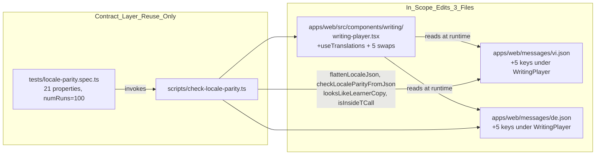
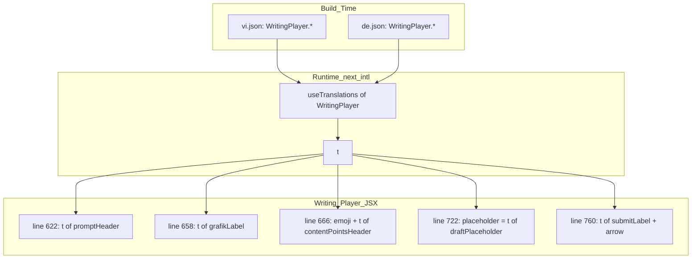

# Design Document

Vai chinh: Vietnamese-German Localization Specialist
Vai phoi hop: German Content Writer, Frontend Engineer, Project Manager / Delivery Manager

## Overview

Spec `learner-copy-localization-backfill` là follow-up risk **R-locale parity** từ parent spec `gamified-ui-asset-rollout` (đã đóng). Goal hẹp: đóng đúng 5 vi phạm `t()` discipline còn sót lại trong `apps/web/src/components/writing/writing-player.tsx` để `pnpm check:locale-parity` exit 0 cả hai half (locale parity + t() discipline) và 21 property test trong `tests/locale-parity.spec.ts` (numRuns=100) tiếp tục pass.

Scope deliverable:

- Thêm đúng 5 Key_Path mới vào namespace `WritingPlayer` ở cả `apps/web/messages/vi.json` và `apps/web/messages/de.json`.
- Wrap đúng 5 string literal Việt trong `writing-player.tsx` qua `useTranslations('WritingPlayer')` của next-intl.
- Translation_Review trên 5 giá trị tiếng Đức mới do Vietnamese-German Localization Specialist (chính) hoặc German Content Writer (phối hợp) sign-off trong PR description.

Out of scope (xác nhận lại theo Req 7):

- Không sửa `scripts/check-locale-parity.ts` (Req 5.4).
- Không sửa `tests/locale-parity.spec.ts` (Req 5.5).
- Không thêm property test mới.
- Không rephrase tiếng Việt nguồn; không thêm locale thứ ba; không thêm key learner-facing nào khác ngoài 5 key đã liệt kê.

Goal đo được:

- `pnpm check:locale-parity` exit 0 (Req 1.8, Req 3.5, Req 5.1).
- 21/21 property test passing với `numRuns=100` (Req 5.2).
- `pnpm check:quick` exit 0 sau khi spec này, `asset-registry-cleanup`, và `visual-qa-screenshot-capture` cùng merge (Req 5.3).
- Total Key_Path count = 185 ở mỗi Locale_File (Req 7.6).

## Architecture

Thiết kế là **additive backfill**, không phải refactor. Toàn bộ contract layer (script + property suite) được tái sử dụng nguyên trạng:



Nguyên tắc kiến trúc:

- **Reuse contract, không re-implement.** Mọi helper trong `scripts/check-locale-parity.ts` (`flattenLocaleJson`, `checkLocaleParityFromJson`, `looksLikeLearnerCopy`, `isInsideTCall`, `classifyLocaleKey`, `validateLocaleValueLength`, hằng số `KEY_KIND_MIN_LENGTH`, `KEY_KIND_MAX_LENGTH`, `LEARNER_ATTRS`, `ALLOW_COMMENT='// locale-allow'`) được giữ nguyên (Req 5.4).
- **Reuse property suite, không thêm test.** 21 property test phải chỉ ra spec không tạo regression — không cần property mới vì contract không thay đổi (Req 5.5).
- **Blast radius = 3 file.** PR chạm đúng 3 file: 1 component `.tsx` + 2 message JSON (Req 7.1).
- **Không thêm `// locale-allow`.** 5 vi phạm đều là Learner_Copy thật, phải đi qua Locale_File (Req 1.7).
- **Không sửa key cũ.** 180 Key_Path hiện có giữ nguyên cả tên lẫn giá trị (Req 7.2, Req 7.3).

## Components and Interfaces

### Component 1: `apps/web/messages/vi.json` (Source_Locale)

Existing top-level namespace pattern (`Dashboard`, `SkillPlayer`, ...) được mở rộng thêm namespace `WritingPlayer` chứa 5 leaf camelCase. Giá trị verbatim từ literal đang hardcode, đã strip glyph trang trí inline ("📋 ", " →") theo Req 3.6.

Interface (JSON shape):

```json
{
  "WritingPlayer": {
    "promptHeader": "Đề bài",
    "grafikLabel": "Biểu đồ",
    "contentPointsHeader": "Ý cần viết:",
    "draftPlaceholder": "Viết bài của em tại đây...",
    "submitLabel": "Nộp bài"
  }
}
```

### Component 2: `apps/web/messages/de.json` (Target_Locale)

Mirror namespace `WritingPlayer` với cùng 5 leaf camelCase. Giá trị tiếng Đức là **proposal** — final wording do Translation_Review chốt (Req 4.2 đến 4.6).

Interface (JSON shape, proposal values):

```json
{
  "WritingPlayer": {
    "promptHeader": "Aufgabenstellung",
    "grafikLabel": "Grafik",
    "contentPointsHeader": "Inhaltspunkte:",
    "draftPlaceholder": "Schreibe deinen Text hier...",
    "submitLabel": "Einreichen"
  }
}
```

### Component 3: `apps/web/src/components/writing/writing-player.tsx`

Component nhận thêm hook `useTranslations('WritingPlayer')` ở scope cao nhất, gán vào `const t`. Năm call-site được swap theo bảng dưới.

Interface contract sau khi swap:

| Line | Loại vi phạm | Trước | Sau | Validates |
| --- | --- | --- | --- | --- |
| 622 | jsx-text | `Đề bài` | `{t('promptHeader')}` | Req 1.1, 2.5 |
| 658 | jsx-text | `Biểu đồ` | `{t('grafikLabel')}` | Req 1.2, 2.5 |
| 666 | jsx-text | `📋 Ý cần viết:` | `📋 {t('contentPointsHeader')}` | Req 1.3, 2.5, 6.1, 6.3 |
| 722 | jsx-attr | `placeholder="Viết bài của em tại đây..."` | `placeholder={t('draftPlaceholder')}` | Req 1.4, 2.5 |
| 760 | jsx-text | `Nộp bài →` | `{t('submitLabel')} →` | Req 1.5, 2.5, 6.2, 6.4 |

### Design Decisions

#### Decision 1: Namespace selection — `WritingPlayer`

Chọn `WritingPlayer` (PascalCase) là namespace mới ở top-level trong cả `vi.json` và `de.json`. Justification:

- File-level grouping cho phép translator scan toàn bộ key của một surface cùng lúc khi review — match với pattern hiện có (`Dashboard.greetingDefault`, `SkillPlayer.continueLabel`).
- PascalCase namespace + camelCase leaf khớp shape các 180 key cũ, không tạo style mới.
- 5 key mới đều thuộc đúng một component file (`writing-player.tsx`) → namespace 1-1 với component giúp ownership rõ.

**Validates: Req 2.1, Req 2.3**

#### Decision 2: Leaf naming — camelCase, mô tả role UI thay vì copy

Năm leaf: `promptHeader`, `grafikLabel`, `contentPointsHeader`, `draftPlaceholder`, `submitLabel`. Justification:

- camelCase, ASCII `[A-Za-z0-9]`, bắt đầu chữ thường — pass `classifyLocaleKey` và quy tắc reviewer reject ở Req 2.6.
- Tên mô tả **role UI** (header, label, placeholder, submit) thay vì copy nguồn ("dau-de", "viet-bai") để khi Translation_Review đổi wording, key không bị lệch nghĩa.
- Không trùng key cũ trong 180 entry hiện có (Req 2.4) — `WritingPlayer` là namespace mới hoàn toàn.

**Validates: Req 2.2, Req 2.4, Req 2.6**

#### Decision 3: Inline glyph treatment — emoji "📋" và arrow "→" giữ inline trong JSX

Emoji `📋` (line 666) và arrow `→` (line 760) **không được đưa vào giá trị `t`**. Chúng giữ inline trong JSX của Writing_Player. Justification:

- Translator chỉ phải lo text content; visual decoration (emoji, glyph) là concern của FE/Designer, không phải Localization Specialist.
- Khi tone Đức đổi (ví dụ "Inhaltspunkte" → "Inhalt") emoji không bị nhân đôi hoặc lệch vị trí.
- Khớp Req 3.6 (vi.json không chứa "📋 " hay " →" trong giá trị) và Req 4.4, 4.6 (de.json cùng vậy).
- JSX render giữ visual parity giữa `vi` và `de` (Req 6.1 đến 6.4): glyph nằm cùng JSX node, locale chỉ thay text qua `t`.

**Validates: Req 1.3, Req 1.5, Req 3.6, Req 4.4, Req 4.6, Req 6.1, Req 6.2, Req 6.3, Req 6.4, Req 6.5**

#### Decision 4: Translation_Review workflow — Specialist chính, Writer phối hợp

Vietnamese-German Localization Specialist là vai chính review 5 giá trị Đức. Nếu specialist không khả dụng, German Content Writer thay (vai phối hợp). Sign-off ghi rõ tên/role trong PR description. Proposal Đức ghi ở Component 2 chỉ là **đề xuất khởi điểm**; final wording do Translation_Review chốt.

CEFR-appropriate constraint: A2-B1 (target level của Writing surface) — không từ chuyên biệt hiếm, không câu ≥ 2 mệnh đề phụ. Tone "du" (informal) cho `draftPlaceholder` để khớp learner-friendly tone đang dùng.

Reviewer-block rule: PR không merge cho tới khi 5 giá trị Đức được Translation_Review sign-off (Req 4.8) và Allow_Comment mới không xuất hiện (Req 1.7).

**Validates: Req 4.1, Req 4.2, Req 4.3, Req 4.4, Req 4.5, Req 4.6, Req 4.7, Req 4.8**

#### Decision 5: useTranslations placement — top of component function

`useTranslations('WritingPlayer')` được gọi đúng một lần ở scope cao nhất của component function (sau các hook React khác như `useState`, `useEffect`), gán vào `const t`. Năm call-site dùng chung biến `t`. Justification:

- React rules-of-hooks: gọi ở top, không trong loop/condition.
- next-intl pattern thông dụng (đã dùng ở các component khác trong repo) — không tạo style mới.
- Gọi với scoped namespace (`'WritingPlayer'`) cho phép call-site dùng leaf ngắn (`t('promptHeader')`) thay vì dotted path đầy đủ — giảm verbosity và khớp `isInsideTCall` heuristic.
- Một hook call thay vì 5 → giảm overhead runtime; cùng `t` reference dễ debug.

**Validates: Req 1.6, Req 2.5**

## Data Models

### Locale_File schema (sau spec merge)

Cả `vi.json` và `de.json` là JSON tree lồng theo namespace, leaf là string. Spec này thêm đúng một subtree mới:

```json
{
  "Dashboard": { "...": "..." },
  "SkillPlayer": { "...": "..." },
  "WritingPlayer": {
    "promptHeader": "string",
    "grafikLabel": "string",
    "contentPointsHeader": "string",
    "draftPlaceholder": "string",
    "submitLabel": "string"
  }
}
```

Invariants sau merge:

- `flattenLocaleJson(vi.json).keys === flattenLocaleJson(de.json).keys` (set equality, Req 3.3).
- `Object.keys(flattenLocaleJson(vi.json)).length === 185` (180 cũ + 5 mới, Req 7.6).
- Mỗi giá trị 5 leaf mới ở cả hai locale: `value.trim().length > 0` (Req 3.4).
- Không key cũ nào bị xóa hoặc đổi giá trị (Req 7.2, Req 7.3).

### Source_Locale value contract (verbatim)

Năm giá trị `vi.json` SHALL bằng đúng (Req 2.5, Req 3.6):

| Key_Path | Source_Locale value (verbatim) |
| --- | --- |
| `WritingPlayer.promptHeader` | `Đề bài` |
| `WritingPlayer.grafikLabel` | `Biểu đồ` |
| `WritingPlayer.contentPointsHeader` | `Ý cần viết:` |
| `WritingPlayer.draftPlaceholder` | `Viết bài của em tại đây...` |
| `WritingPlayer.submitLabel` | `Nộp bài` |

Lưu ý: dấu `:` cuối của `contentPointsHeader` và dấu `...` cuối của `draftPlaceholder` được giữ nguyên; emoji `📋 ` và `→` đã strip per Decision 3.

### Target_Locale value contract (proposal — final by Translation_Review)

| Key_Path | Proposal value | Constraint |
| --- | --- | --- |
| `WritingPlayer.promptHeader` | `Aufgabenstellung` | Danh từ/cụm danh từ header (Req 4.2) |
| `WritingPlayer.grafikLabel` | `Grafik` | Từ "Grafik" hoặc biến thể được Translation_Review chấp thuận (Req 4.3) |
| `WritingPlayer.contentPointsHeader` | `Inhaltspunkte:` | Header tự nhiên, không emoji "📋" (Req 4.4) |
| `WritingPlayer.draftPlaceholder` | `Schreibe deinen Text hier...` | Câu placeholder tone "du", informal (Req 4.5) |
| `WritingPlayer.submitLabel` | `Einreichen` | Verb/cụm verb ngắn ≤ 20 ký tự, không "→" (Req 4.6) |

CEFR-appropriateness A2-B1, không từ hiếm, không ≥ 2 mệnh đề phụ (Req 4.7).

### Component data flow



## Correctness Properties

*A property is a characteristic or behavior that should hold true across all valid executions of a system — essentially, a formal statement about what the system should do. Properties serve as the bridge between human-readable specifications and machine-verifiable correctness guarantees.*

**No new testable properties from this spec.**

Justification (xem chi tiết ở Testing Strategy → PBT applicability assessment):

- Spec này thêm dữ liệu (5 entry JSON) + 3 swap call-site, không thêm logic mới có universal property.
- Toàn bộ universal property của parity contract đã được Property_Suite hiện có (`tests/locale-parity.spec.ts`, 21 test, numRuns=100) cover. Spec này SHALL không sửa Property_Suite (Req 5.5).
- Tham chiếu Test Type Classification cho từng acceptance criterion của requirements:
  - Req 1.1 đến 1.5 (5 vi phạm cụ thể): EXAMPLE — kiểm dòng cụ thể không còn literal cụ thể.
  - Req 1.6, Req 1.7, Req 1.8, Req 3.5, Req 5.1: INTEGRATION — chạy `pnpm check:locale-parity` end-to-end, behavior không vary với input.
  - Req 2.1 đến 2.6, Req 3.1, Req 3.2, Req 3.4, Req 3.6: EXAMPLE — kiểm 5 leaf cụ thể tồn tại với value cụ thể.
  - Req 3.3 (set equality vi keys = de keys): đã được Property_Suite hiện có cover (universal property).
  - Req 4.1 đến 4.8: SMOKE / process check — Translation_Review sign-off, không phải code logic.
  - Req 5.2: INTEGRATION — chạy `pnpm test:property` thực tế (chính là Property_Suite cũ).
  - Req 5.3, Req 5.4, Req 5.5: SMOKE — single execution check.
  - Req 6.1 đến 6.5: EXAMPLE — visual smoke giữa hai locale.
  - Req 7.1 đến 7.6: SMOKE — PR diff review, single check.
- Theo Property Reflection: nếu thêm "WritingPlayer namespace phải có đúng 5 leaf", property này sẽ redundant với property hiện có "set keys vi = set keys de" + "value non-empty" trong Property_Suite cũ.

Spec này dựa hoàn toàn vào Property_Suite hiện có (21 test, numRuns=100) làm regression guard (Req 5.2).

**Validates: Req 5.2, Req 5.4, Req 5.5**

## Error Handling

Spec này có blast radius nhỏ; error path tập trung ở review/CI gate:

| Error condition | Detection | Mitigation |
| --- | --- | --- |
| Translator chưa review giá trị Đức | PR review, sign-off block trong description | Reviewer block merge (Req 4.8); reroute đến German Content Writer nếu Specialist không khả dụng (Req 4.1). |
| Locale parity fail (vi keys ≠ de keys) | `pnpm check:locale-parity` half locale parity exit non-zero | Fix key mismatch trong JSON file gây lỗi; chạy lại Parity_Gate cho tới khi exit 0 (Req 3.5, Req 5.1). |
| t() discipline fail (literal Việt còn sót) | `pnpm check:locale-parity` half t() discipline exit non-zero, hoặc property test fail | Đối chiếu output script với 5 line target; wrap đúng line bị flag; không thêm `// locale-allow` (Req 1.7, Req 1.8). |
| Property test fail (numRuns=100) | `pnpm test:property` exit non-zero, fast-check counterexample in stderr | Đọc counterexample, fix theo hướng minimal — thường là JSON shape lệch (key thừa/thiếu, value rỗng); không sửa file test (Req 5.5). |
| File ngoài 3 file in scope bị thay đổi | PR diff review | Reviewer block merge cho tới khi loại khỏi PR hoặc chuyển sang sibling spec phù hợp (Req 7.5). |
| Key mới trùng key cũ | `flattenLocaleJson` flag duplicate | Đổi leaf name (vẫn camelCase); namespace `WritingPlayer` là fresh nên rủi ro thấp (Req 2.4). |
| Glyph emoji/arrow chui vào giá trị `t` | Code review (Req 3.6, Req 4.4, Req 4.6) | Strip glyph khỏi JSON, đẩy ra inline JSX theo Decision 3. |
| Visual regression giữa vi và de (glyph lệch vị trí) | Component smoke (xem Testing Strategy) | Verify JSX node order: emoji/arrow nằm cùng JSX expression với `t`, locale chỉ thay text (Req 6.1 đến 6.5). |

## Testing Strategy

### PBT applicability assessment

Spec này **KHÔNG triggers thêm property test mới**. Lý do:

- Contract layer (`scripts/check-locale-parity.ts`) đã có Property_Suite 21 test (numRuns=100) đang green. 21 test này validate **toàn bộ universal property** của parity contract (set equality, value non-empty, t() discipline, classifyLocaleKey).
- Thay đổi của spec này là **dữ liệu** (5 entry JSON) + **3 swap call-site** trong 1 component — không phải logic mới có universal property cần phủ.
- Property mới ở layer này (e.g., "namespace WritingPlayer phải có đúng 5 key") sẽ là **example check**, không phải universal — không cost-effective ở 100 iterations.
- Tham chiếu Test Type Classification: 5 thay đổi đều là **EXAMPLE** (specific scenario) hoặc **INTEGRATION** (Parity_Gate end-to-end). Không entry nào ở dạng PROPERTY.

Quyết định: giữ Correctness Properties section **rỗng có chủ đích** trong design này; spec dựa hoàn toàn vào Property_Suite hiện có để bảo vệ regression (Req 5.2).

### Test plan

| Test type | Tool | Scope | Pass criteria | Validates |
| --- | --- | --- | --- | --- |
| Parity gate (locale parity half) | `pnpm check:locale-parity` | `apps/web/messages/{vi,de}.json` | Exit 0; vi key count = de key count = 185 | Req 3.5, Req 5.1, Req 7.6 |
| Parity gate (t() discipline half) | `pnpm check:locale-parity` | `apps/web/src/**/*.tsx` | Exit 0; zero hardcoded learner-string violation; không có `// locale-allow` mới | Req 1.7, Req 1.8, Req 5.1 |
| Property suite | `pnpm test:property` (vitest, fast-check) | `tests/locale-parity.spec.ts` | 21/21 pass với numRuns=100 | Req 5.2 |
| Quick check end-to-end | `pnpm check:quick` | Toàn bộ chain CI gate | Exit 0 sau khi 3 sibling spec cùng merge | Req 5.3 |
| Component smoke (vi) | Manual render local | Writing_Player với locale=vi | 5 string render đúng verbatim; emoji "📋" trái text contentPointsHeader; arrow "→" phải text submitLabel | Req 6.1, Req 6.2 |
| Component smoke (de) | Manual render local | Writing_Player với locale=de | 5 string render Translation_Review-approved value; emoji/arrow ở cùng vị trí thị giác như vi | Req 6.3, Req 6.4, Req 6.5 |
| Diff review | PR review | PR diff | Đúng 3 file thay đổi; không xóa/sửa key cũ; không sửa next-intl config hay CI workflow | Req 7.1, Req 7.2, Req 7.3, Req 7.4, Req 7.5 |
| Translation sign-off | PR description block | 5 giá trị Đức | Tên/role của Translation_Review reviewer ghi rõ trong PR description | Req 4.1, Req 4.8 |

### Manual verification commands

Run từ workspace root (Vietnamese-German Localization Specialist hoặc Frontend Engineer thực hiện):

```bash
# 1. Parity gate (cả hai half)
pnpm check:locale-parity

# 2. Property suite
pnpm test:property

# 3. End-to-end (giả định 3 sibling spec merge)
pnpm check:quick
```

Kỳ vọng: cả 3 lệnh exit 0 sau khi spec này merge.

### Why no new property tests

Five new entries are concrete examples, không phải universal property. Theo Test Type Classification:

- Mỗi entry mới là EXAMPLE — kiểm cụ thể "namespace `WritingPlayer` chứa 5 leaf đã định trước".
- Universal property "vi keys = de keys" và "no hardcoded learner string" đã được Property_Suite hiện có cover ở numRuns=100 — tăng test mới là **redundant**.
- Theo Property Reflection: nếu thêm "WritingPlayer namespace phải có 5 leaf", property này sẽ subsumed bởi property hiện có "set keys vi = set keys de" + "value non-empty" — eliminate redundancy theo guidance.

## Rollout Plan

### Ownership matrix

| Stream | Owner | Deliverable |
| --- | --- | --- |
| Translation_Review (5 giá trị Đức) | Vietnamese-German Localization Specialist (chính) / German Content Writer (phối hợp) | Final wording cho 5 leaf; sign-off block trong PR description (Req 4.1, Req 4.8) |
| Code wiring | Frontend Engineer | useTranslations import + hook call + 5 swap trong `writing-player.tsx`; thêm 5 entry vào `vi.json` và `de.json` (Req 1.6, Req 2.5) |
| Delivery checklist | Project Manager / Delivery Manager | Đảm bảo 3 sibling spec (`asset-registry-cleanup`, `visual-qa-screenshot-capture`, spec này) merge cùng đợt để `pnpm check:quick` exit 0 (Req 5.3); blast radius giữ ở 3 file (Req 7.1) |

### PR scope

- **In scope**: 3 file (`apps/web/src/components/writing/writing-player.tsx`, `apps/web/messages/vi.json`, `apps/web/messages/de.json`).
- **Out of scope** (block merge nếu xuất hiện trong diff): mọi file khác, bao gồm `scripts/check-locale-parity.ts`, `tests/locale-parity.spec.ts`, next-intl config, `.github/workflows/ci.yml` (Req 5.4, Req 5.5, Req 7.4).
- **PR description SHALL include**:
  - Translation_Review sign-off (tên + role) cho 5 giá trị Đức.
  - Output `pnpm check:locale-parity` exit 0.
  - Output `pnpm test:property` 21/21 pass.

### Sequencing

1. Frontend Engineer chuẩn bị draft PR với 3 file thay đổi + proposal value Đức ở Component 2.
2. Vietnamese-German Localization Specialist review 5 giá trị Đức, đề xuất chỉnh nếu cần (e.g., "Aufgabenstellung" có thể thành "Aufgabe" tùy CEFR fit). Specialist sign-off PR description.
3. Nếu Specialist không khả dụng trong window, German Content Writer thay (Req 4.1).
4. CI chạy `pnpm check:quick`. Kỳ vọng exit 0 nếu spec siblings cũng merge xong; nếu không, CI sẽ flag cụ thể half nào fail và Frontend Engineer fix theo Error Handling matrix.
5. Reviewer (Project Manager / Delivery Manager hoặc CTO/Tech Lead) verify PR diff = 3 file (Req 7.1, Req 7.5), merge.

### Rollback

Rollback sạch: revert PR. Vì blast radius = 3 file và không động chạm contract layer, revert chỉ xóa 5 entry JSON + 5 call-site swap; component trở lại trạng thái có 5 vi phạm cũ — Parity_Gate fail như baseline pre-spec, nhưng không có hệ quả lan ra component khác.
