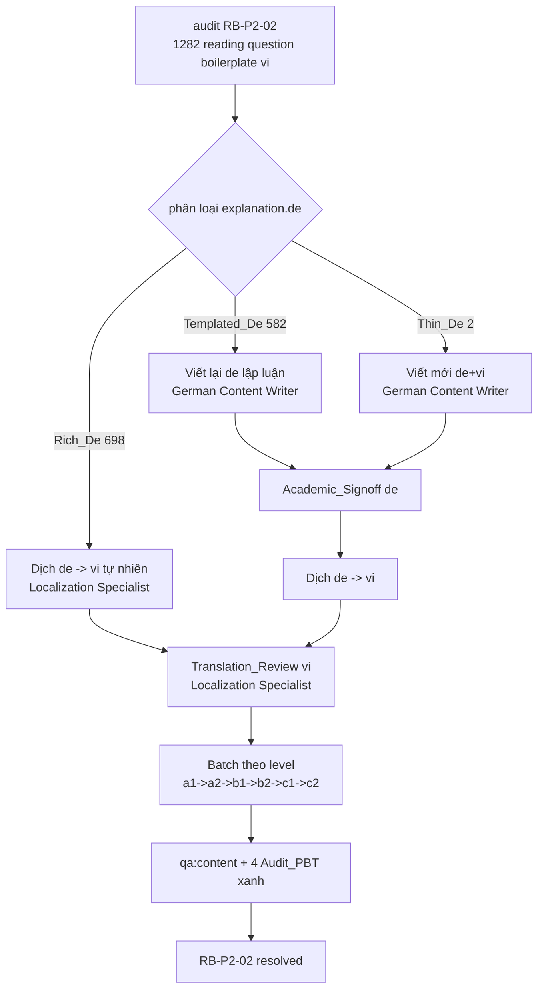

# Design Document

Vai chinh: German Content Writer
Vai phoi hop: Vietnamese-German Localization Specialist, German Academic Lead

## Overview

Spec `reading-explanation-regeneration` đóng backlog `RB-P2-02` từ audit `audit-2026-06`. Thay **1,282 `explanation.vi` boilerplate** của reading questions (6 level) bằng giải thích tiếng Việt cụ thể nêu bằng chứng + lý do. Đáp án và mọi nội dung khác giữ nguyên (answer integrity audit đã xác nhận sạch).

Phân tích dữ liệu chia công việc thành 3 luồng theo chất lượng `explanation.de` (đo tại baseline):

| Nhóm | Số question | `explanation.de` | Công việc | Owner chính |
| --- | --- | --- | --- | --- |
| Rich_De | 698 | Lập luận cụ thể + key_evidence | **Dịch de → vi** tự nhiên | Localization Specialist |
| Templated_De | 582 | "Die richtige Antwort ist X: …" (chỉ lặp đáp án) | **Viết lại de** thật rồi dịch | German Content Writer |
| Thin_De | 2 | Rỗng/quá ngắn | Viết mới de + vi | German Content Writer |

Khối lượng lớn → batch theo level (a1→c2), mỗi level một review gate. Ưu tiên level thấp (learner đông, rủi ro hiểu sai cao).

## Architecture



Nguyên tắc:

- **Tận dụng de giàu sẵn có.** 698/1282 (54%) chỉ cần dịch — không viết lại tiếng Đức. Giảm rủi ro sai ngữ pháp.
- **de trước, vi sau.** Với Templated/Thin, viết lập luận Đức (Academic_Signoff) trước khi dịch — vi dựa trên de đã đúng.
- **Chỉ chạm explanation.** Đáp án, options, text bài đọc, listening — bất khả xâm phạm (Req 3).
- **Batch + review gate theo level.** Kiểm soát chất lượng + truy vết.
- **Read-only audit deliverables.** Spec này sửa `content/` (remediation) nhưng KHÔNG sửa script audit/PBT; cập nhật baseline hash có chủ đích.

## Components and Interfaces

### Component 1: `content/<level>/reading/*.json` (target)

Chỉ trường `explanation` của mỗi question thay đổi:

```jsonc
// Trước (boilerplate)
"explanation": {
  "de": "Im Text steht: '...'. ...",          // Rich: giữ | Templated: viết lại
  "vi": "Đáp án đúng là richtig. Hãy đối chiếu với thông tin then chốt trong bài đọc.",  // -> Specific_Vi
  "key_evidence": "ich gehe heute in den Supermarkt",  // giữ/bổ sung
  "key_vocabulary": [ ... ]                    // giữ nguyên
}

// Sau (specific)
"explanation": {
  "de": "...",                                 // Rich giữ nguyên; Templated/Thin viết lại + Academic_Signoff
  "vi": "Trong email, Lisa viết 'ich gehe heute in den Supermarkt' — tức là hôm nay cô ấy đi siêu thị, nên 'Lisa đi mua sắm hôm nay' là đúng.",
  "key_evidence": "ich gehe heute in den Supermarkt",
  "key_vocabulary": [ ... ]
}
```

Bất biến: `answer`, `options`, `statement`, `stem`, `question`, `texts`, `scoring` KHÔNG đổi (Req 3.1, 3.2).

### Component 2: Batch update script (có dry-run)

Script remediation hỗ trợ (gợi ý: `scripts/regenerate-reading-explanations.ts`) chỉ ghi vào `explanation.vi` (+ `explanation.de`/`key_evidence` cho Templated/Thin). Bắt buộc:

- `--dry-run` in diff trước khi áp dụng (Req 5.3).
- `--level <a1|...>` để batch từng level (Req 4.1).
- Chỉ touch trường explanation; assert không đổi `answer`/`options` (so sánh trước-sau).
- KHÔNG sửa generator gốc của reading content (Req 5.2).

### Component 3: Reference (không sửa)

| Nguồn | Vai trò |
| --- | --- |
| `docs/content-quality/bilingual-style-guide.md` | Chuẩn dịch VI (Req 1.4) |
| `docs/content-quality/cefr-audit-checklist.md` | Reading: answer supported by text evidence (Req 2.5) |
| `scripts/content-qa.ts` | Gate, không sửa (Req 5.2) |
| `tests/content-audit/*.spec.ts` | 4 PBT, giữ xanh (Req 3.6) |

### Design Decisions

#### Decision 1: 3-luồng theo chất lượng `explanation.de`

Phân loại Rich/Templated/Thin để không viết lại tiếng Đức không cần thiết (698 chỉ dịch). Justification: giảm khối lượng viết DaF + giảm rủi ro sai ngữ pháp; Localization Specialist xử lý phần lớn.

**Validates: Req 2.1, Req 2.4, Req 1.1**

#### Decision 2: de-trước-vi-sau cho Templated/Thin

Với 584 question (582 templated + 2 thin), viết/sửa `explanation.de` (Academic_Signoff) TRƯỚC khi dịch vi. Justification: vi chất lượng cần nguồn de đúng; tránh dịch từ template rỗng nghĩa.

**Validates: Req 2.1, Req 2.2, Req 2.3**

#### Decision 3: Batch theo level, ưu tiên thấp→cao

a1→a2→b1→b2→c1→c2, mỗi level một review gate. Justification: learner đông nhất ở level đầu; mỗi batch nhỏ dễ review; lỗi phát hiện sớm không lan.

**Validates: Req 4.1, Req 4.5**

#### Decision 4: Script có dry-run + chỉ chạm explanation

Mọi batch-update qua script có `--dry-run` + diff review, assert đáp án/options bất biến. Justification: 1,282 item quá nhiều để sửa tay an toàn; dry-run + assert bảo vệ answer integrity.

**Validates: Req 3.1, Req 3.4, Req 5.3**

## Data Models

### Phân loại baseline (đo tại audit)

```
reading questions total (answer-bearing) = 1282 (boilerplate vi, 100%)
  Rich_De      = 698  (dịch de->vi)
  Templated_De = 582  (viết lại de + dịch)
  Thin_De      = 2    (viết mới de+vi)
per level: a1=150, a2=200, b1=250, b2=250, c1=168, c2=264
```

### Invariants sau spec

- 0 Reading_Question còn Boilerplate_Vi (Req 1.6).
- 1,282 question có Specific_Vi (Req 1.5).
- `answer`/`correctIndex` mọi question KHÔNG đổi (Req 3.1).
- `pnpm qa:content` exit 0 (Req 3.5); 4 Audit_PBT xanh (Req 3.6).
- Listening explanations KHÔNG đổi (Req 5.5).

## Correctness Properties

*A property is a characteristic or behavior that should hold true across all valid executions of a system.*

Property 1: No Boilerplate Remains — mọi reading explanation.vi cụ thể

_For any_ Reading_Question trong `content/<level>/reading/*.json`, `explanation.vi` SHALL KHÔNG khớp mẫu Boilerplate_Vi (không kết thúc "Hãy đối chiếu với thông tin then chốt trong bài đọc" như toàn bộ nội dung) và SHALL non-empty.

**Validates: Requirements 1.1, 1.2, 1.6**

Property 2: Answer Integrity Preserved — đáp án bất biến

_For any_ Reading_Question, giá trị `answer`/`correctIndex`/`correct`/`solution` sau spec SHALL bằng đúng giá trị trước spec. Chỉ trường `explanation` thay đổi.

**Validates: Requirements 3.1, 3.4**

Property 3: Scope Containment — chỉ reading explanation đổi

_For any_ file ngoài `content/<level>/reading/*.json`, nội dung SHALL byte-identical trước/sau spec. Trong file reading, mọi trường ngoài `explanation` SHALL byte-identical.

**Validates: Requirements 3.2, 3.3, 5.5**

## Error Handling

| Tình huống | Phát hiện | Xử lý |
| --- | --- | --- |
| Script vô tình đổi answer/options | Assert trước-sau trong script + Property 2 | Abort batch, revert, sửa script (Req 3.1) |
| vi mới vẫn template | Property 1 scan + audit D3 chạy lại | Viết lại cụ thể (Req 1.6, 5.4) |
| de viết lại sai ngữ pháp | Academic_Signoff | Block batch tới khi Academic Lead duyệt (Req 2.3) |
| Dịch sai nghĩa de→vi | Translation_Review | Localization Specialist sửa (Req 4.2) |
| Đụng file ngoài reading | Property 3 + diff review | Revert; chỉ reading explanation (Req 3.2, 3.3) |
| qa:content/PBT regress | Gate chạy mỗi batch | Fix trước khi merge batch (Req 3.5, 3.6) |
| Mojibake trong vi mới | qa:copy-style-style/scan | Ghi UTF-8 hợp lệ (Req 1.4) |

## Testing Strategy

### PBT applicability assessment

Thay đổi là **nội dung** (1,282 trường explanation) — chủ yếu EXAMPLE/review. Nhưng 3 property là universal đáng kiểm tự động:

- **Property 1 (No Boilerplate):** universal trên mọi reading question — verifier scan regex Boilerplate_Vi = 0. Cao giá trị.
- **Property 2 (Answer Integrity):** universal — so `answer` trước/sau toàn bộ reading. Bảo vệ rủi ro lớn nhất.
- **Property 3 (Scope Containment):** universal — hash mọi file ngoài reading + non-explanation field trong reading.

Có thể thêm vào `tests/content-audit/` một spec `reading-explanation.spec.ts` cho Property 1 + 2 (chạy cùng `test:property`). Property 3 verify bằng hash diff trong CI batch.

### Test plan

| Test | Tool | Scope | Pass criteria | Validates |
| --- | --- | --- | --- | --- |
| No boilerplate | verifier/PBT | tất cả reading question | 0 Boilerplate_Vi, vi non-empty | Property 1, Req 1.1, 1.6 |
| Answer integrity | PBT (snapshot answers trước/sau) | tất cả reading question | answer bất biến | Property 2, Req 3.1 |
| Scope containment | hash diff | non-reading + non-explanation field | byte-identical | Property 3, Req 3.2, 3.3, 5.5 |
| Content gate | `pnpm qa:content` (tsx) | content/** | exit 0 | Req 3.5 |
| Audit PBT | `tests/content-audit/*.spec.ts` | deliverables + content | 13/13 pass | Req 3.6 |
| Translation review | Localization Specialist | vi mỗi batch | nghĩa + tự nhiên OK | Req 4.2 |
| Academic signoff | German Academic Lead | de viết lại | ngữ pháp + level OK | Req 2.3 |

### Manual verification commands

```bash
node_modules/.bin/tsx scripts/content-qa.ts                 # exit 0
node_modules/.bin/vitest run --config vitest.property.config.ts tests/content-audit  # 13+ pass
# verifier: 0 boilerplate reading explanation.vi (regex scan)
```

## Rollout Plan

### Ownership matrix

| Stream | Owner | Deliverable |
| --- | --- | --- |
| Viết lại `de` (Templated 582 + Thin 2) | German Content Writer | Lập luận Đức cụ thể + key_evidence |
| Academic sign-off `de` | German Academic Lead | Duyệt ngữ pháp + level |
| Dịch `de → vi` (toàn bộ 1,282) + Translation_Review | Vietnamese-German Localization Specialist | Specific_Vi tự nhiên |
| Batch script + gate | Content QA / Linguistic Reviewer | dry-run, diff, qa:content + PBT |
| Lịch batch + truy vết | Project Manager / Delivery Manager | 6 batch level, đóng RB-P2-02 |

### Sequencing (batch theo level)

1. a1 (150) → 2. a2 (200) → 3. b1 (250) → 4. b2 (250) → 5. c1 (168) → 6. c2 (264).
- Mỗi batch: phân loại Rich/Templated/Thin → viết lại de (nếu cần) + Academic_Signoff → dịch vi + Translation_Review → chạy qa:content + PBT → merge.
- Sau cả 6 batch: đóng `RB-P2-02` trong backlog, cập nhật baseline hash audit.

### Rollback

Revert theo batch level (mỗi level một commit). Vì chỉ trường explanation đổi và answer bất biến, revert đưa explanation.vi về boilerplate cũ — không ảnh hưởng đáp án hay nội dung khác.
