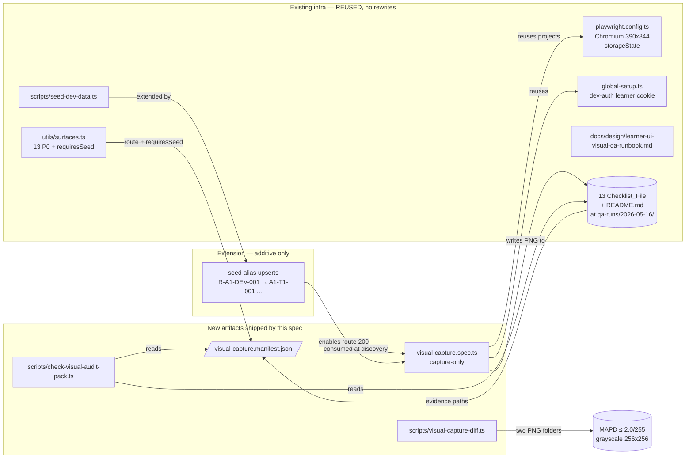

# Design Document — Visual QA Screenshot Capture

**Vai chinh:** QA Automation Engineer
**Vai phoi hop:** Frontend Engineer, Design System Designer, Project Manager / Delivery Manager

> Role-gate ref: `.agents/personnel/qa-automation-engineer.md` (test plan, regression risk, acceptance gates), `.agents/personnel/frontend-engineer.md` (review of captured PNGs against UI), `.agents/personnel/design-system-designer.md` (visual baseline interpretation), `.agents/personnel/project-manager-delivery-manager.md` (DoD pack flip ownership).

## Overview

This spec **closes Risk R3** of the `gamified-ui-asset-rollout` DoD pack ("Visual QA screenshots are PENDING") by automating the capture pass that the visual QA runbook prescribes.

**Goal:** turn 13 `(PENDING capture)` checklist files at `docs/design/visual-audit/qa-runs/2026-05-16/` into `(PASS — captured 2026-05-16)` with one PNG committed at every `evidencePath`, and update `docs/design/release/gamified-ui-asset-rollout-dod.md` so R3 reads `🟢 RESOLVED`.

**Scope is intentionally narrow** (driven by the requirements doc):

- Add a Playwright **capture-only** spec (`tests/integration/visual-capture.spec.ts`) that drives every `<surface, state, viewport>` triple and writes each PNG to its declared `evidencePath`.
- Materialize a single source of truth — `tests/integration/visual-capture.manifest.json` — that the capture spec, the marker-flip step, and the acceptance script all consume (Req 1).
- Extend `scripts/seed-dev-data.ts` with idempotent alias upserts so the 5 `requiresSeed` surfaces (`reading`, `listening`, `speaking`, `writing`, `exam`) resolve to the IDs declared in `tests/integration/utils/surfaces.ts` (Req 2).
- Wire `pnpm test:integration:capture`, disable Slow 4G + `screenshot: only-on-failure` for the capture spec only (Req 5).
- Ship `scripts/check-visual-audit-pack.ts` (4 invariants — Req 6, Req 12) and `scripts/visual-capture-diff.ts` (MAPD reproducibility — Req 9).
- Flip 13 checklist files + DoD pack atomically with the same PR (Req 7, Req 8).

**Reproducibility contract:** two capture runs on the same git commit + same seeded DB MUST produce PNGs whose Mean Absolute Pixel Difference (MAPD) on grayscale, 256×256-resized images is **≤ 2.0 / 255 (≈ 0.78 %)**. This budget tolerates font hinting and anti-aliasing drift across OS/browser builds while still detecting any real UI change (Req 9.1).

**Out of scope:** pixel-diff regression assertions, hardcoded asset cleanup (sibling spec R1), desktop viewport as a hard requirement (runbook treats desktop as OPTIONAL), and capture for any date folder other than `2026-05-16`.

**Why this spec is QA-led, not FE-led:** the deliverable is a *test artifact pack* (capture spec + acceptance scripts + idempotent seed extension + reproducibility check). Frontend Engineer reviews the PNGs after capture; Design System Designer interprets visual fidelity; PM flips the DoD entry. Authority for test scope, acceptance gates, and release-blocking quality concerns sits with QA Automation per the personnel charter.

---

## Architecture



**Key architectural choices:**

- **Reuse-first.** No new Playwright config; `visual-capture.spec.ts` is added to the existing `testMatch` and the existing learner cookie + viewport are inherited. The capture run uses the same `chromium-mobile` project but **opts out** of Slow 4G (Req 5.4) and `screenshot: only-on-failure` (Req 5.3) because the screenshot IS the deliverable, not a debug artifact.
- **Manifest is the contract.** Capture spec, marker-flip script, and acceptance script all read the same JSON. This collapses the three-way agreement (Markdown ↔ filesystem ↔ test runner) into pairwise checks (Req 1.7, Req 6.4, Req 6.5).
- **Seed extension is additive.** No row in the seed script is renamed or removed — only alias rows are upserted so both the legacy IDs (`R-A1-DEV-001`, etc.) and the surface-table IDs (`A1-T1-001`, `L-A1-GOETHE-001-T1`, …) resolve. This keeps existing dev workflows green (Req 10.3 implication).
- **Acceptance script gates merge.** `pnpm check:visual-audit` is wired into `pnpm check:quick` (Req 12.5), so a PR that drops a PNG, leaves a `(PENDING capture)` marker, or adds an orphan path cannot land.

---

## Components and Interfaces

This section defines seven explicit design decisions. Each cites the requirements it satisfies.

### Decision 1 — Capture_Manifest schema (Req 1)

A single JSON file at `tests/integration/visual-capture.manifest.json` holds every `<surface, state, viewport>` the capture pass will produce.

**Schema (TypeScript shape, serialized as JSON array):**

```ts
interface ManifestEntry {
  surface: 'dashboard' | 'course' | 'vocabulary' | 'vocabulary-practice'
         | 'vocabulary-microgames' | 'reading' | 'listening' | 'speaking'
         | 'speaking-roleplay' | 'writing' | 'review' | 'rewards-shop' | 'exam'
  state: 'default' | 'empty' | 'locked' | 'error' | 'success'
  viewport: 'mobile' | 'desktop'
  route: string                  // begins with '/'
  evidencePath: string           // 'screenshots/<surface>/<surface>-<state>-<viewport>.png'
  requiresSeed: boolean          // mirrors P0_SURFACES[*].requiresSeed
  stateDriver?: StateDriver      // optional, see Decision 2
}

type StateDriver =
  | { kind: 'queryParam'; param: string; value: string }
  | { kind: 'mockFetch'; url: string; status: number; body?: unknown }
  | { kind: 'routeIntercept'; pattern: string; fulfill: { status: number; body?: unknown } }
  | { kind: 'seedReset'; resetEndpoint: string } // dev-only
  | { kind: 'none' }                              // 'default' state
```

**Why JSON array (not YAML / TS module):**

- Reads in 3 lines from any tool (the marker-flip script, the acceptance script, the diff script, the capture spec). No parser dependency.
- `git diff` of the manifest is the audit record of what the capture pass committed to produce.
- TypeScript imports are avoided so `scripts/check-visual-audit-pack.ts` can be a plain Node script that runs without `tsx` if needed.

**Single-source-of-truth invariants:**

- One entry per `<surface, state, viewport>` triple (Req 1.6).
- Every `(PENDING capture)` marker in `qa-runs/2026-05-16/` at the commit just before merge MUST have a matching manifest entry (Req 1.7) — checked by the acceptance script (Decision 6).
- `requiresSeed` is mirrored from `tests/integration/utils/surfaces.ts` `P0_SURFACES` (Req 1.5). The manifest does NOT redefine which surfaces need seed; it only mirrors so the capture spec can read in one pass.

**Validates: Requirements 1.1, 1.2, 1.3, 1.4, 1.5, 1.6, 1.7.**

### Decision 2 — State driver mechanism (Req 3.6, Req 3.10)

Each manifest entry whose `state ≠ 'default'` declares an optional `stateDriver` field telling the capture spec how to coerce the surface into that state before screenshot.

**Four supported drivers (rule-of-thumb):**

| Driver | When to use | Notes |
|---|---|---|
| `queryParam` | Surface honours a `?state=` or `?empty=1` toggle in dev | Cheapest. No mocks. Used for surfaces that already have a dev-only state knob. |
| `routeIntercept` | Surface state depends on a single API response | `page.route(pattern, route => route.fulfill(...))` — preferred for `error` and `empty` states. |
| `mockFetch` | Surface state depends on multiple API responses | Same primitive as `routeIntercept` but the entry can declare a list. |
| `seedReset` | State requires a dev-only DB reset (e.g. fresh user with 0 XP for `empty` dashboard) | Calls a dev-only endpoint; only allowed when `FUXIE_DEV_AUTH_ENABLED=true`. |

**Per-surface state driver mapping** (drafted now, finalized when manifest is authored in Phase 1):

| Surface | State | Driver |
|---|---|---|
| dashboard | empty | `seedReset` (fresh learner, 0 streak) — fall back to `routeIntercept` on `/api/learner/dashboard` returning empty payload if seed reset is not available |
| dashboard | error | `routeIntercept` on `/api/learner/dashboard` → 500 |
| course | locked | `routeIntercept` on `/api/courses/A1` returning a payload with all units `locked: true` |
| course | error | `routeIntercept` on `/api/courses/A1` → 500 |
| vocabulary / -practice / -microgames | empty | `routeIntercept` on the vocabulary list endpoint → `{ items: [] }` |
| reading / listening / speaking / writing | error | `routeIntercept` on the lesson endpoint → 500 |
| reading / listening / speaking / writing | success | `queryParam` `?completed=1` if surface honours it; otherwise `routeIntercept` returning a "completed" payload |
| review | empty | `routeIntercept` on `/api/review/next` → `{ next: null }` |
| rewards-shop | locked | `routeIntercept` returning items with `unlocked: false` |
| exam | error | `routeIntercept` on `/api/exam/...` → 500 |

The capture spec MUST fail with a message identifying `(surface, state, viewport, reason)` if the state cannot be driven within 60 s (Req 3.10).

**Why query param + intercept over `data-testid` clicks:** state should be deterministic and not depend on the surface implementing a particular DOM affordance. Route intercepts are a Playwright primitive, isolated per-test, and survive UI refactors.

**Validates: Requirements 3.6, 3.10.**

### Decision 3 — Seed alias upserts (Req 2)

`scripts/seed-dev-data.ts` is extended (additive — no rewrite) with idempotent alias upserts so the 5 `requiresSeed` surfaces resolve at the IDs declared in `surfaces.ts`.

**Mapping (legacy → surface-table ID):**

| Legacy seed ID | Surface-table ID (target) | Table |
|---|---|---|
| `R-A1-DEV-001` | `A1-T1-001` | `ReadingExercise` |
| `L-A1-DEV-001` | `L-A1-GOETHE-001-T1` | `ListeningLesson` (+ at least one `ListeningQuestion`) |
| `dev-a1-begruessung-01` (already matches) | `dev-a1-begruessung-01` | `SpeakingLesson` |
| `W-A1-DEV-001` | `W-A1-T1-001` | `WritingExercise` |
| `dev-a1-goethe-mini` (already matches) | `dev-a1-goethe-mini` | `ExamTemplate` (+ ≥1 `ExamSection` + ≥1 `ExamTask`) |

**Idempotency contract (Req 2.6):** every upsert uses the table's natural unique key (`exerciseId`, `lessonId`, `slug`, `id`) so a second run on the same DB results in zero new rows. Where the legacy fixture file is the source-of-truth (e.g. `content/a1/reading/A1-T1-001.json`), the seed script reads from that file and upserts under both the legacy ID and the surface-table ID — preferring read-once, write-twice over duplicating fixture content.

**Verification (Req 2.7):** Phase 5 acceptance is "every P0 route returns HTTP 200 with a non-empty `<title>` after seed". This is a hard gate before running the capture spec.

**Why upsert vs rename:** renaming the legacy ID would break any developer whose local DB is already seeded and any sibling spec relying on the old IDs. Adding aliases is the lowest-risk additive change.

**Validates: Requirements 2.1, 2.2, 2.3, 2.4, 2.5, 2.6, 2.7.**

### Decision 4 — `pnpm test:integration:capture` script + Playwright config opt-outs (Req 5)

A new pnpm script wraps the capture run; the Playwright config receives **two surgical opt-outs** that apply only to `visual-capture.spec.ts`.

**`package.json` (workspace root) addition:**

```json
{
  "scripts": {
    "test:integration:capture": "playwright test --config tests/integration/playwright.config.ts --project chromium-mobile-capture tests/integration/visual-capture.spec.ts"
  }
}
```

**Two Playwright config opt-outs:**

1. The `chromium-mobile-capture` project (new, sibling of `chromium-mobile-slow4g`) does NOT register Slow 4G throttling in `tests/integration/utils/throttle.ts` — capture uses default network speed (Req 5.4). Slow 4G would risk capturing a partial-render frame.
2. The capture project sets `screenshot: 'off'` in `use` (Req 5.3) — Playwright must not auto-write a debug screenshot to `tmp/playwright/output/...` for capture tests, because the test ITSELF is calling `page.screenshot({ path: <evidencePath> })`. Auto-screenshots would litter `outputDir` and confuse the acceptance script.

**`testMatch` extension:** `'**/visual-capture.spec.ts'` is added to the existing `testMatch` array. The capture spec is excluded from the perf project (`chromium-mobile-slow4g`) by project filtering, not by file pattern (Req 10.5 — perf spec is untouched).

**Documentation update:** `tests/integration/README.md` documents the script, prerequisites (`pnpm db:seed:dev`, `FUXIE_DEV_AUTH_ENABLED=true`), and output path (Req 5.5).

**Validates: Requirements 5.1, 5.2, 5.3, 5.4, 5.5.**

### Decision 5 — Marker flip mechanism (Req 7)

The `(PENDING capture)` → `(PASS — captured 2026-05-16)` flip is performed by an **explicit post-capture script invoked from `pnpm test:integration:capture` after Playwright exits with code 0**, NOT by the Playwright spec itself.

**Why a post-capture script, not an in-spec hook:**

- Playwright `afterAll` hooks fire per-worker; we need a single global pass over the 13 Markdown files.
- A failed capture run must NOT flip markers — the script gate is `playwright exit 0` AND `<every evidencePath has a PNG>` (the second check is the acceptance script from Decision 6).
- The script is also runnable standalone for forensic re-flip (e.g. when capture succeeded but CI killed the process before the chained step ran).

**Algorithm (per checklist file):**

1. Read the file.
2. For each line containing both an `evidencePath` AND `(PENDING capture)`:
   - If a PNG exists at `<qa-runs/2026-05-16>/<evidencePath>`, replace `(PENDING capture)` with `(PASS — captured 2026-05-16)`.
   - Otherwise, leave the marker and exit non-zero (the acceptance script will catch this).
3. Lines with the `n/a (...)` marker are NOT modified (Req 7.3).
4. Update `qa-runs/2026-05-16/README.md` "Owner sign-off → FE — capture pass" row from `_pending_` to `2026-05-16` with note `via spec visual-qa-screenshot-capture` (Req 7.4).

**The `evidencePath` text is preserved byte-for-byte** (Req 7.2) — only the trailing marker is replaced.

**Validates: Requirements 7.1, 7.2, 7.3, 7.4.**

### Decision 6 — `scripts/check-visual-audit-pack.ts` — 4 invariants (Req 6.3, Req 12)

A standalone Node + TypeScript script wired into `package.json` as `check:visual-audit` and chained into `pnpm check:quick` (Req 12.5).

**Four invariants checked, each fails the script with a non-zero exit code and a precise error list:**

| # | Invariant | Source of truth | Req |
|---|---|---|---|
| I1 | Zero `(PENDING capture)` markers anywhere under `docs/design/visual-audit/qa-runs/2026-05-16/` | grep `\(PENDING capture\)` | Req 12.2 |
| I2 | Every `evidencePath` referenced in any Checklist_File OR in the manifest has a corresponding PNG file at `qa-runs/2026-05-16/<evidencePath>` | filesystem | Req 12.3, Req 6.4 |
| I3 | Every PNG file under `qa-runs/2026-05-16/screenshots/**/*.png` is referenced by at least one Checklist_File AND the manifest (no orphan PNG) | filesystem + manifest + Markdown grep | Req 12.4, Req 6.5 |
| I4 | Every PNG has valid PNG magic bytes (`89 50 4E 47 0D 0A 1A 0A` at offset 0) | filesystem (read first 8 bytes) | Req 6.3 |

**Invariant I3 is symmetric to I2** — together they enforce a bijection between `<evidencePath in checklist + manifest>` and `<PNG on disk>`.

**Output format on failure:**

```
[check:visual-audit] I1 FAILED — found N PENDING markers:
  - docs/design/visual-audit/qa-runs/2026-05-16/dashboard.md:42
  ...
[check:visual-audit] I3 FAILED — found N orphan PNG files (no checklist reference):
  - docs/design/visual-audit/qa-runs/2026-05-16/screenshots/dashboard/foo.png
```

**Wiring into `check:quick`:** the script is appended after the existing `test:property` step. The DoD pack assertion that `pnpm check:quick` stays green (Req 10.3) is preserved by ordering — `check:visual-audit` runs last, so existing checks fail-fast as before.

**Validates: Requirements 6.3, 6.4, 6.5, 12.1, 12.2, 12.3, 12.4, 12.5.**

### Decision 7 — `scripts/visual-capture-diff.ts` — MAPD reproducibility (Req 9)

A standalone Node + TypeScript script that takes two folders and computes Mean Absolute Pixel Difference per matched PNG.

**Algorithm (per PNG pair):**

1. Decode both PNGs (use `pngjs` — already a transitive dep via Playwright; if not, declare it explicitly).
2. Convert each pixel to grayscale via the standard luma weighting (`0.299 R + 0.587 G + 0.114 B`).
3. Resize the grayscale buffer to **256 × 256** using nearest-neighbour or bilinear (deterministic — must be the same kernel both ways; bilinear preferred to suppress aliasing-driven false negatives).
4. Compute MAPD = `mean(|a[i] − b[i]|)` over all 256·256 = 65 536 cells.
5. Print `<evidencePath>: MAPD=<value>` for every pair. Exit 0 iff every MAPD ≤ 2.0 / 255 ≈ 0.00784.

**`prefers-reduced-motion` emulation:** the capture spec (not the diff script) calls `page.emulateMedia({ reducedMotion: 'reduce' })` for all entries (Req 9.4 spells this out only for `loading` / `success` states with confetti seeds, but applying globally cheaply removes a class of drift sources at zero cost).

**Why grayscale + 256×256 + 2.0/255:**

- Grayscale strips chroma noise from sub-pixel-rendering disagreements.
- Resizing to 256×256 normalises image dimensions across viewport differences (mobile 390×844 vs desktop 1440×1100) before averaging — the absolute count of mismatched pixels is meaningless without normalization.
- 2.0/255 ≈ 0.78 % is loose enough for font hinting drift on the same OS+browser build between two `pnpm dev:web` runs, but tight enough to detect any UI element moving by ≥1 logical pixel after resize.

**Documentation update:** `tests/integration/README.md` documents how to run `tsx scripts/visual-capture-diff.ts <folderA> <folderB>` (Req 9.3).

**Validates: Requirements 9.1, 9.2, 9.3, 9.4.**

---

## Data Models

### `Capture_Manifest` JSON schema

```jsonc
[
  {
    "surface": "dashboard",
    "state": "default",
    "viewport": "mobile",
    "route": "/dashboard",
    "evidencePath": "screenshots/dashboard/dashboard-default-mobile.png",
    "requiresSeed": false
  },
  {
    "surface": "dashboard",
    "state": "error",
    "viewport": "mobile",
    "route": "/dashboard",
    "evidencePath": "screenshots/dashboard/dashboard-error-mobile.png",
    "requiresSeed": false,
    "stateDriver": {
      "kind": "routeIntercept",
      "pattern": "**/api/learner/dashboard",
      "fulfill": { "status": 500 }
    }
  }
  // ... ~45–60 entries total (13 surfaces × ≥3 states each, ≤5 states for surfaces with locked/success)
]
```

**Field types:**

| Field | Type | Required | Constraint |
|---|---|---|---|
| `surface` | `string` | yes | ∈ `P0_SURFACES.id` (13 values) |
| `state` | `string` | yes | ∈ `{default, empty, locked, error, success}` |
| `viewport` | `string` | yes | ∈ `{mobile, desktop}` |
| `route` | `string` | yes | starts with `/` |
| `evidencePath` | `string` | yes | matches `^screenshots/<surface>/<surface>-<state>-<viewport>\.png$` |
| `requiresSeed` | `boolean` | yes | mirrors `P0_SURFACES[surface].requiresSeed`, falsy when absent |
| `stateDriver` | `StateDriver` (Decision 2) | optional | omitted when `state == "default"` |

### `P0_Surface_Set` — required states per surface

(Authoritative when manifest is authored in Phase 1; values reflect the existing 13 Checklist_File contents.)

| Surface | requiresSeed | Required mobile states | Optional desktop |
|---|---|---|---|
| dashboard | no | default, empty, error | — |
| course | no | default, locked, error | — |
| vocabulary | no | default, empty, error | — |
| vocabulary-practice | no | default, empty, error | — |
| vocabulary-microgames | no | default, empty, error | — |
| reading | yes | default, error, success | — |
| listening | yes | default, error, success | — |
| speaking | yes | default, error, success | — |
| speaking-roleplay | no | default, empty, error | — |
| writing | yes | default, error, success | — |
| review | no | default, empty, error | — |
| rewards-shop | no | default, locked, error | — |
| exam | yes | default, error, success | — |

> The exact state set per surface is **not redeclared by this design** — it is derived from the 13 existing Checklist_File contents at Phase 0 baseline (Req 1.3, Req 1.4). The table above is a planning best-estimate, to be reconciled when the manifest is authored.

### `Visual_Audit_Folder` structure (target post-capture)

```
docs/design/visual-audit/qa-runs/2026-05-16/
├── README.md                  ← FE sign-off row updated (Req 7.4)
├── dashboard.md               ← markers flipped
├── course.md
├── vocabulary.md
├── vocabulary-practice.md
├── vocabulary-microgames.md
├── reading.md
├── listening.md
├── speaking.md
├── speaking-roleplay.md
├── writing.md
├── review.md
├── rewards-shop.md
├── exam.md
└── screenshots/
    ├── dashboard/
    │   ├── dashboard-default-mobile.png
    │   ├── dashboard-empty-mobile.png
    │   └── dashboard-error-mobile.png
    ├── course/
    │   ├── course-default-mobile.png
    │   ├── course-locked-mobile.png
    │   └── course-error-mobile.png
    ... (13 subfolders, one per surface)
    └── exam/
        ├── exam-default-mobile.png
        ├── exam-error-mobile.png
        └── exam-success-mobile.png
```


---

## Correctness Properties

*A property is a characteristic or behavior that should hold true across all valid executions of a system — essentially, a formal statement about what the system should do. Properties serve as the bridge between human-readable specifications and machine-verifiable correctness guarantees.*

PBT is appropriate here even though most of this spec is "QA artifacts". The four properties below cover **pure logic** — manifest schema validation, spec generation from a manifest, marker-flip text rewriting, MAPD computation. None of these need a real Playwright run; all four can run as Vitest property tests with synthesised inputs (see Testing Strategy below). The end-to-end Playwright capture is verified by integration test, not PBT.

The 12 requirements collapse to **4 unique properties** after reflection (see prework). Properties cited from individual ACs are listed under each property.

### Property 1: Capture_Manifest is a well-formed bijection with the baseline

*For any* set of Checklist_File contents at the merge baseline, any Capture_Manifest, and any P0_SURFACES table:

1. Every manifest entry passes the schema validator — `surface ∈ P0_SURFACES.id`, `state ∈ {default, empty, locked, error, success}`, `viewport ∈ {mobile, desktop}`, `route` starts with `/`, `evidencePath` matches `^screenshots/<surface>/<surface>-<state>-<viewport>\.png$`, `requiresSeed` equals the value declared in `P0_SURFACES` for that surface (default `false`).
2. The set of `<surface, state, viewport>` triples extracted from the manifest is unique (no duplicates).
3. There is a one-to-one correspondence between manifest entries and Pending_Marker lines in the baseline checklist set, matched by `(surface, state, viewport)` → `evidencePath`.

**Validates: Requirements 1.2, 1.3, 1.4, 1.5, 1.6, 1.7, 4.1.**

### Property 2: Capture_Spec generator is a pure function over the manifest

*For any* Capture_Manifest `M`:

1. The Capture_Spec produces exactly `|M|` Playwright `test(...)` invocations, with test names `"<surface> / <state> / <viewport>"` matching the entries in `M`.
2. For every entry `e ∈ M`, the resolved screenshot output path equals `<workspace_root>/docs/design/visual-audit/qa-runs/2026-05-16/<e.evidencePath>`.
3. For every entry `e ∈ M` with a non-`none` `stateDriver`, the spec installs the declared driver (Playwright `page.route(...)`, `page.goto(... + ?queryParam=...)`, or dev-only seed reset call) before the screenshot.
4. For every entry `e ∈ M` with `state ∈ {loading, success}`, the spec calls `page.emulateMedia({ reducedMotion: 'reduce' })` before the screenshot.
5. Every error path of the spec emits a message containing all four tokens: `e.surface`, `e.state`, `e.viewport`, and a reason string.
6. The exit-code derivation function from `(totalEntries, succeededEntries)` is `0` iff `totalEntries === succeededEntries`, and the summary JSON written on non-zero exit groups entries by status correctly.
7. The `FUXIE_CAPTURE_ONLY` filter, when set, narrows the executed entry set to `{ e ∈ M | e.surface ∈ split(env, ',') }`.

**Validates: Requirements 3.2, 3.3, 3.6, 3.10, 4.3, 5.2, 9.4, 11.2, 11.3, 11.4.**

### Property 3: Post-capture filesystem matches manifest exactly, with valid PNGs and flipped markers

*For any* Capture_Run that exits with code 0 and any baseline Capture_Manifest:

1. For every entry `e` in the manifest, the file at `<qa-runs/2026-05-16>/<e.evidencePath>` exists, has valid PNG magic bytes (`89 50 4E 47 0D 0A 1A 0A` at offset 0), and has logical width matching `e.viewport` (390 for mobile, 1440 for desktop; full-page captures may have larger height but width is preserved).
2. For every PNG file at any path under `<qa-runs/2026-05-16>/screenshots/**/*.png`, there exists exactly one manifest entry whose `evidencePath` resolves to that file.
3. For every Checklist_File, the count of `(PENDING capture)` markers is `0`; for every line that contained both an `evidencePath` and a `(PENDING capture)` marker in the baseline, the post-flip line contains the same `evidencePath` (byte-for-byte) followed by `(PASS — captured 2026-05-16)`.
4. For every line whose marker was `n/a (...)` in the baseline, the post-flip line is byte-identical.

**Validates: Requirements 3.7, 3.8, 6.1, 6.2, 6.3, 6.4, 6.5, 7.1, 7.2, 7.3, 12.2, 12.3, 12.4.**

### Property 4: Reproducibility — same-commit runs are pixel-equivalent within tolerance

*For any* two Capture_Run outputs `A` and `B` produced from the same git commit, the same `pnpm db:seed:dev` execution, and the same dev-server env vars:

1. For every paired PNG `(A[evidencePath], B[evidencePath])`, the Mean Absolute Pixel Difference computed on grayscale buffers (luma = `0.299·R + 0.587·G + 0.114·B`) resized to `256 × 256` is `≤ 2.0 / 255 ≈ 0.00784`.
2. The `scripts/visual-capture-diff.ts` exit code is `0` iff every paired MAPD satisfies the bound.
3. For any two byte-identical PNG inputs, MAPD `= 0`.

**Validates: Requirements 9.1, 9.2.**

---

## Error Handling

| # | Error condition | Detection | Mitigation / fail mode | Req |
|---|---|---|---|---|
| E1 | Dev server unreachable at `BASE_URL` within 30 s of first test | `fetch(BASE_URL)` from a `beforeAll` hook with 30 s timeout | Capture run fails fast (no per-surface retries) with the exact message: `Dev server not reachable at <BASE_URL>. Start \`pnpm dev:web\` with FUXIE_DEV_AUTH_ENABLED=true before \`pnpm test:integration:capture\`.` | 11.4 |
| E2 | Seeded surface route returns HTTP ≥ 400 OR redirects to `/login` | Inspect `response.status()` and `page.url()` after navigation | Per-test fail with `surface=<id> status=<code> url=<final>`; isolation preserves other tests; total run exits non-zero | 4.3 |
| E3 | State driver cannot reach declared state within 60 s | Playwright `actionTimeout` 60 s on the driver step (route handler, query param, mock fetch) | Per-test fail with `(surface, state, viewport, reason)` 4-tuple; reason describes the driver kind that timed out | 3.10 |
| E4 | `FUXIE_PLAYWRIGHT_SKIP_SEEDED=1` set when capture run starts | Read env in `beforeAll` | Fail with: `Capture run requires seeded surfaces; FUXIE_PLAYWRIGHT_SKIP_SEEDED is incompatible with \`pnpm test:integration:capture\`.` Exit non-zero. | 4.2 |
| E5 | Manifest ↔ checklist mismatch (orphan checklist evidencePath OR unused manifest entry) | `scripts/check-visual-audit-pack.ts` invariants I2 + I3 | Acceptance script exits non-zero with full lists of orphans / unused entries; gate is wired into `pnpm check:quick` so PR cannot merge | 6.4, 6.5 |
| E6 | PNG file missing PNG magic bytes | Acceptance script invariant I4 reads first 8 bytes of every PNG | Acceptance script exits non-zero with file path; manual investigation (likely a partial-write or wrong file extension) | 6.3 |
| E7 | A `(PENDING capture)` marker remains after marker-flip step | Acceptance script invariant I1 grep | Acceptance script exits non-zero with file:line list; either re-run capture or restore the marker explicitly if intentional | 7.1, 12.2 |
| E8 | One Capture_Spec test case fails — the rest must continue | Playwright default test isolation; `--workers=1` (inherited) | Other test cases run to completion; summary JSON written to `tmp/playwright/visual-capture-summary.json` listing pass/fail/reason; total run exits non-zero | 11.1, 11.2 |
| E9 | Reproducibility tolerance exceeded between two same-commit runs | `scripts/visual-capture-diff.ts` MAPD > 2.0/255 | Diff script exits non-zero with offending pair list and MAPD values; investigation determines whether drift is environmental (acceptable) or a UI regression (not acceptable) | 9.1, 9.2 |

**Recovery model:** every error path is *fail-loud, fail-precise*. The two scripts (`check-visual-audit-pack.ts`, `visual-capture-diff.ts`) are idempotent and can be re-run any number of times during PR review without state mutation.

---

## Testing Strategy

This spec ships **four kinds of tests**, mapped to the property and integration classes from the prework. The dual approach (PBT for pure logic, integration for the runtime capture pass) is chosen because the capture spec itself is unit-test-hostile (it requires a live dev server) but its supporting logic is unit-test-friendly.

### 1. Capture_Spec — Playwright capture-only

- File: `tests/integration/visual-capture.spec.ts`.
- Project: `chromium-mobile-capture` (new), inheriting global `globalSetup` + storage state.
- Behaviour: navigate, install state driver, screenshot. **No `expect(...)` calls** except a single navigation guard `expect(page).toHaveURL(<entry.route>)` per test (Req 3.9).
- Output: PNG at `<workspace_root>/docs/design/visual-audit/qa-runs/2026-05-16/<evidencePath>`.
- The capture spec is **excluded** from `vitest.property.config.ts` testMatch (Req 10.4) and from the perf project's `testMatch` filter.

### 2. `scripts/check-visual-audit-pack.ts` — 4 acceptance invariants

- Wired as `pnpm check:visual-audit` (Req 12.1) and chained at the end of `pnpm check:quick` (Req 12.5).
- I1 — zero `(PENDING capture)` markers.
- I2 — every checklist `evidencePath` has a PNG.
- I3 — every PNG has at least one checklist + manifest reference.
- I4 — every PNG has valid PNG magic bytes.

### 3. `scripts/visual-capture-diff.ts` — reproducibility

- Standalone CLI: `tsx scripts/visual-capture-diff.ts <folderA> <folderB>`.
- Computes MAPD per matched PNG; exits 0 iff every MAPD ≤ 2.0/255.
- Documented in `tests/integration/README.md` (Req 9.3).

### 4. Property tests for the pure logic — Vitest + fast-check

The four correctness properties (P1–P4) are implemented as **fast-check** properties under `tests/property/visual-capture/` (the same harness already used by `pnpm test:property` — Req 10.1 to remain green).

**Library + minimum iterations:**

- Library: `fast-check` (already a dep — used by `pnpm test:property`).
- Each property test runs **minimum 100 iterations** (`numRuns: 100` in `fc.assert` configuration).
- Each test is tagged with a comment: `// Feature: visual-qa-screenshot-capture, Property <N>: <text>`.

**One property test per design property:**

| Design property | Vitest file | Generators |
|---|---|---|
| P1 (manifest well-formedness + bijection) | `tests/property/visual-capture/manifest-bijection.property.test.ts` | Synthesise random `(checklistSet, manifest, surfacesTable)` triples from a constrained alphabet (P0 surface IDs + valid states + valid viewports). |
| P2 (spec generator is pure) | `tests/property/visual-capture/spec-generator.property.test.ts` | Mock Playwright `test()` and `page` primitives; assert call counts + names + emulateMedia + state-driver wiring per entry. |
| P3 (filesystem ↔ manifest bijection + flip correctness) | `tests/property/visual-capture/marker-flip.property.test.ts` + `tests/property/visual-capture/png-bijection.property.test.ts` | Synthesise random checklist line variants (PENDING / n/a / PASS) and random PNG byte streams (valid + invalid headers). |
| P4 (MAPD reproducibility) | `tests/property/visual-capture/mapd.property.test.ts` | Synthesise PNG buffer pairs at varying perturbation levels; assert MAPD monotonicity and round-trip-zero. |

**Why PBT for these and not for the capture spec itself:** the capture spec's behaviour (drive a real browser, write a real file) is dominated by integration cost. The supporting logic (manifest validation, marker flip, MAPD math) is pure and hugely benefits from random input coverage — for example, P3 with 100 random line variants will catch corner cases like trailing whitespace, embedded URLs containing `(PENDING capture)`-shaped substrings, etc., that example-based tests would miss.

### 5. Existing suites — must remain green

- `pnpm test:property` (Req 10.1)
- `pnpm test:integration:perf` (Req 10.2) — Slow 4G + CLS budgets unchanged
- `pnpm test:integration:a11y` — covered by `pnpm check:quick`
- `pnpm check:quick` (Req 10.3) — chained pipeline including the new `check:visual-audit`

The capture spec is wired into `chromium-mobile-capture` project, NOT `chromium-mobile-slow4g`, so the perf suite picks up zero new tests (Req 10.5).

### 6. PBT applicability assessment — recap

PBT applies because:

- Manifest validation is a pure function over a JSON array — universal "for all entries" properties make sense.
- Marker flip is a pure string transformation — random input lines reveal regex / boundary bugs.
- MAPD computation is a pure function on byte buffers — round-trip and tolerance laws are universal.
- Capture-spec generator is a pure function over the manifest — generator-correctness is universal.

PBT does NOT apply to:

- The actual Playwright capture run (Slow 4G replacement, dev-auth cookie, real DOM) — covered by integration test (one full run in Phase 5).
- The seed extension behaviour against a real Postgres — covered by example-based integration tests (Req 2.1–2.5).
- The DoD pack flip (Req 8) and README sign-off update (Req 7.4) — covered by example-based grep assertions in `check:visual-audit`.

---

## Rollout Plan — 8 phases

The plan **gracefully degrades** when the local environment cannot run Playwright. Phases 0–4 and 6–8 are deterministic file-edit work. **Phase 5 (the actual Playwright run) requires a developer or CI machine with a live dev server + seeded DB** — if the spec is being executed in a sandbox without those prerequisites, Phase 5 is flagged as a blocker and downstream phases (6 marker flip, 7 acceptance, 8 DoD update) are deferred to a human-environment run. All non-Phase-5 artifacts (manifest, capture spec source, two scripts, package.json wiring, README updates) ship regardless.

### Phase 0 — Baseline (read-only)

- Count `(PENDING capture)` markers across the 13 Checklist_File at `qa-runs/2026-05-16/`. Record the baseline count for Property P1 verification later.
- Read `tests/integration/utils/surfaces.ts` to confirm the 13 surface IDs + 5 `requiresSeed` values match the manifest the next phase will author.
- Read each Checklist_File to derive the per-surface state set (which states does each checklist already declare?).
- Identify the state-driver mapping (Decision 2 table) by inspecting the `apps/web/src/app/.../route.ts` and `apps/web/src/app/.../page.tsx` for each surface — annotate each `<surface, state>` pair with which driver kind (`queryParam`, `routeIntercept`, `mockFetch`, `seedReset`) is best.
- Output: Phase-0 report (notes only — no file changes).

### Phase 1 — Manifest authoring

- Generate `tests/integration/visual-capture.manifest.json` from the Phase 0 baseline.
- Validate Property P1 invariants offline: the manifest entry count equals the baseline `(PENDING capture)` count; every entry has well-formed fields; no duplicate triples.
- Output: `tests/integration/visual-capture.manifest.json`.

### Phase 2 — Seed extension

- Edit `scripts/seed-dev-data.ts` with the 4 alias upserts (Decision 3 table). Use natural unique keys; idempotent.
- Add a unit test to verify Req 2.6 (idempotence) on an in-memory or sqlite test DB.
- Output: edited `scripts/seed-dev-data.ts` + new idempotence test.

### Phase 3 — Capture_Spec implementation

- Create `tests/integration/visual-capture.spec.ts` that loads the manifest at discovery time and emits one `test(...)` per entry.
- Wire state drivers per entry's `stateDriver` field.
- Apply `page.emulateMedia({ reducedMotion: 'reduce' })` for `state ∈ {loading, success}`.
- Output: `tests/integration/visual-capture.spec.ts`.

### Phase 4 — Playwright config + package.json wiring

- Add `chromium-mobile-capture` project to `tests/integration/playwright.config.ts` (no Slow 4G, `screenshot: 'off'`).
- Add `'**/visual-capture.spec.ts'` to `testMatch`.
- Add `test:integration:capture` script to root `package.json` (Decision 4).
- Add `check:visual-audit` script to root `package.json`; chain it at the end of `check:quick`.
- Update `tests/integration/README.md` (Req 5.5, Req 9.3).
- Output: edited `playwright.config.ts`, `package.json`, `tests/integration/README.md`.

### Phase 5 — Capture run (PREREQUISITES — human/CI environment)

> **🔴 ENVIRONMENT BLOCKER FLAG.** This phase requires:
>
> 1. `pnpm db:seed:dev` running successfully against a local Postgres (Phase 2 alias upserts present).
> 2. `pnpm dev:web` running with `FUXIE_DEV_AUTH_ENABLED=true` at `http://localhost:3005`.
>
> If executed in a sandbox without those prerequisites, this phase is **deferred** and Phases 6–8 cannot proceed. The spec degrades gracefully: all artifacts from Phases 0–4 ship and the capture itself is run by a human operator on a workstation, after which they re-run Phases 6–8 (which are deterministic file edits).

- Operator runs: `pnpm db:seed:dev` → start dev server → `pnpm test:integration:capture`.
- Output: PNG files committed under `docs/design/visual-audit/qa-runs/2026-05-16/screenshots/<surface>/...`.

### Phase 6 — Marker flip (post-capture)

- Run the marker-flip script (or the chained step from Decision 5) over the 13 Checklist_File.
- Update `qa-runs/2026-05-16/README.md` "FE — capture pass" sign-off row.
- Output: edited 13 `.md` files + `README.md`.

### Phase 7 — Acceptance + reproducibility

- Run `pnpm check:visual-audit` — must exit 0 (all 4 invariants).
- Run `pnpm test:integration:capture` a second time on the same commit.
- Run `tsx scripts/visual-capture-diff.ts <run1-folder> <run2-folder>` — must exit 0 (every MAPD ≤ 2.0/255).
- Output: clean acceptance + reproducibility report.

### Phase 8 — DoD update — flip R3 to 🟢 RESOLVED

- Edit `docs/design/release/gamified-ui-asset-rollout-dod.md` per Req 8:
  - R3 entry: `🟠 MEDIUM` → `🟢 RESOLVED` with cross-links to screenshots folder + this spec folder + note (≤200 chars) listing PNG count + capture date.
  - Sign-off table: `FE` row → `✅ Approved` dated `2026-05-16`.
  - "Final decision → Out of scope for this Done tag": drop R3 bullet (3 → 2).
- Output: edited DoD pack.

### Graceful-degradation summary

| Phase | Environment-independent? | Sandbox can run? | Deferred to human if not? |
|---|---|---|---|
| 0 | ✅ read-only | ✅ | n/a |
| 1 | ✅ pure file gen | ✅ | n/a |
| 2 | ⚠️ needs DB for idempotence test (test only — script edit is offline) | partial | idempotence test deferred if no DB |
| 3 | ✅ pure file gen | ✅ | n/a |
| 4 | ✅ pure file edits | ✅ | n/a |
| 5 | ❌ needs dev server + seeded DB | ❌ | YES — flagged |
| 6 | ⚠️ needs PNG outputs from Phase 5 | only if 5 done | YES if 5 deferred |
| 7 | ❌ needs two completed Phase-5 runs | ❌ | YES if 5 deferred |
| 8 | ⚠️ needs Phase 5+6 done (uses screenshot folder URL in note) | only if 5 done | YES if 5 deferred |

If Phase 5 cannot run during this spec execution, the deliverable is "everything except the PNG capture", and the spec cleanly hands off to a human run with a clear runbook (`tests/integration/README.md` updated in Phase 4 carries the exact commands).

---

## Iteration & feedback

This design is open for review. Common iteration points:

- **State-driver kind for one or more `<surface, state>` pairs.** Some surfaces may need a dev-only seed-reset endpoint that does not yet exist; if so, a sibling sub-task adds it before Phase 1.
- **MAPD tolerance value.** 2.0/255 is a starting estimate from the runbook; if reproducibility runs show systematic noise above that bound on the same commit, the tolerance is raised (with a note in the DoD pack explaining the new value) before Phase 8.
- **Manifest scope.** If Phase 0 reveals that some Checklist_File declares `screenshots/<surface>/...` paths that the surface cannot currently render (e.g. a `success` state that requires a longer fixture chain), the conservative path is to **remove that line from the checklist** rather than ship a soft-skip — Req 4 explicitly forbids soft-skips.

If any of the above changes the data model or invariants, the affected Correctness Properties are updated and the prework is re-run.
