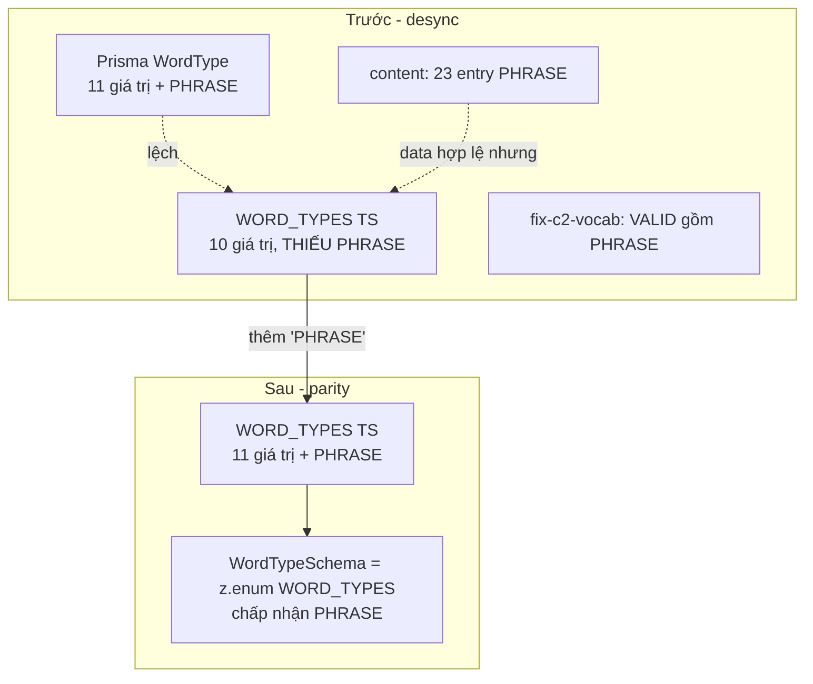

# Design Document

Vai chinh: CTO / Tech Lead
Vai phoi hop: German Academic Lead, Content QA / Linguistic Reviewer

## Overview

Spec `vocab-wordtype-enum-reconcile` đóng backlog `RB-P1-01` từ audit `audit-2026-06`. Đây là **type-layer reconciliation** thuần: thêm `'PHRASE'` vào TS enum `WORD_TYPES` (`packages/shared/src/types/index.ts`) để khớp với Prisma DB enum `WordType` (đã có `PHRASE`) và content data thật (23 entry dùng `PHRASE`).

Root cause (đã điều tra): ba nguồn enum desync — DB enum và content + script đều coi `PHRASE` hợp lệ, chỉ TS enum lạc hậu. Hệ quả tiềm ẩn: `WordTypeSchema = z.enum(WORD_TYPES)` reject dữ liệu hợp lệ tại API boundary. Fix là một dòng (thêm `'PHRASE'`), không đổi data, không migration.

Blast radius tối thiểu: 1 file type (validator + schema kế thừa tự động qua `z.enum(WORD_TYPES)`).

## Architecture



Nguyên tắc kiến trúc (CTO):

- **Một nguồn sự thật.** TS_Enum phải khớp DB_Enum. DB là constraint cứng nhất (đã có `PHRASE`) → TS căn theo DB, không ngược lại.
- **Fix type, không fix data.** Data + DB đã đúng; chỉ type lạc hậu. KHÔNG đổi 23 entry (Req 2.1).
- **Schema kế thừa.** `WordTypeSchema = z.enum(WORD_TYPES)` tự động chấp nhận `PHRASE` khi mảng mở rộng — không sửa validator (Req 3.2).
- **An toàn + rollback rõ.** Thay đổi 1 dòng, reversible; có gate typecheck + qa:content + consumer check.

## Components and Interfaces

### Component 1: `packages/shared/src/types/index.ts` (TS_Enum — file sửa duy nhất)

```ts
// Trước (10 giá trị)
export const WORD_TYPES = [
  'NOMEN', 'VERB', 'ADJEKTIV', 'ADVERB', 'PRAEPOSITION',
  'KONJUNKTION', 'PRONOMEN', 'ARTIKEL', 'PARTIKEL', 'NUMERALE',
] as const

// Sau (11 giá trị — thêm PHRASE, khớp Prisma DB_Enum)
export const WORD_TYPES = [
  'NOMEN', 'VERB', 'ADJEKTIV', 'ADVERB', 'PRAEPOSITION',
  'KONJUNKTION', 'PRONOMEN', 'ARTIKEL', 'PARTIKEL', 'NUMERALE', 'PHRASE',
] as const
```

`type WordType = (typeof WORD_TYPES)[number]` tự mở rộng để gồm `'PHRASE'`.

### Component 2: `packages/shared/src/validators/index.ts` (kế thừa — không sửa)

`WordTypeSchema = z.enum(WORD_TYPES)` tự động chấp nhận `'PHRASE'` sau khi Component 1 mở rộng. Không thay đổi file này (Req 3.2).

### Component 3: Reference (không sửa)

| Nguồn | Trạng thái `PHRASE` | Hành động |
| --- | --- | --- |
| `packages/database/prisma/schema.prisma` `enum WordType` | Đã có (line 75) | Reference, không sửa (Req 1.5) |
| `scripts/fix-c2-vocab-quality.ts` `VALID_WORD_TYPES` | Đã có | Reference, không sửa |
| `scripts/fix-c1-vocab-quality.ts` | remap `PRÄPOSITIONALPHRASE → PHRASE` | Reference, không sửa |
| `content/**` 23 Phrase_Entry | Dùng `PHRASE` | Giữ nguyên (Req 2.1, 2.2) |

### Design Decisions

#### Decision 1: Căn TS theo DB (thêm PHRASE), không loại bỏ PHRASE khỏi data

Hai hướng khả dĩ: (a) thêm `PHRASE` vào TS_Enum, hoặc (b) remap 23 entry `PHRASE` sang một wordType có sẵn. Chọn (a) vì:

- DB_Enum đã có `PHRASE` → loại khỏi data sẽ làm data nghèo hơn DB cho phép, vô lý.
- `PHRASE` đúng về ngôn ngữ cho cụm cố định/thành ngữ C1/C2 (Academic Lead xác nhận) — remap sang `NOMEN`/`ADVERB` sẽ sai phân loại.
- Hướng (a) là 1 dòng, reversible; hướng (b) đụng 17 file content + rủi ro sai phân loại.

**Validates: Req 1.1, 1.2, 2.1, 2.4**

#### Decision 2: Không sửa validator, để schema kế thừa

`WordTypeSchema` build từ `z.enum(WORD_TYPES)` nên mở rộng mảng là đủ. Tránh đổi hai nơi (DRY) và giảm blast radius.

**Validates: Req 1.4, 3.2**

#### Decision 3: Không migration DB

Prisma enum đã có `PHRASE` → không cần `prisma migrate`. Spec hoàn toàn ở type layer.

**Validates: Req 1.5**

## Data Models

### Enum parity (đích)

```
DB_Enum  (schema.prisma, không đổi): {NOMEN,VERB,ADJEKTIV,ADVERB,PRAEPOSITION,KONJUNKTION,PRONOMEN,ARTIKEL,PARTIKEL,NUMERALE,PHRASE}
TS_Enum  (index.ts, sau spec):       {NOMEN,VERB,ADJEKTIV,ADVERB,PRAEPOSITION,KONJUNKTION,PRONOMEN,ARTIKEL,PARTIKEL,NUMERALE,PHRASE}
→ Enum_Parity = true
```

### Invariants sau spec

- `WORD_TYPES.includes('PHRASE') === true` (Req 1.1).
- `new Set(WORD_TYPES)` ⟷ `new Set(DB_Enum values)` bằng nhau (Req 1.2 — Enum_Parity).
- `WordTypeSchema.safeParse('PHRASE').success === true` (Req 1.4).
- 23 Phrase_Entry trong content giữ nguyên `PHRASE` (Req 2.2).
- `pnpm typecheck` + `pnpm qa:content` xanh (Req 2.3, 3.1).

## Correctness Properties

*A property is a characteristic or behavior that should hold true across all valid executions of a system.*

Property 1: Enum Parity — TS enum ⟷ DB enum

_For any_ giá trị `v` thuộc DB_Enum (`WordType` trong Prisma), `WORD_TYPES.includes(v)` SHALL là true, và ngược lại; tức `new Set(WORD_TYPES)` bằng `new Set(dbWordTypeValues)`. Đặc biệt `PHRASE` thuộc cả hai.

**Validates: Requirements 1.1, 1.2**

Property 2: Schema accepts all content wordTypes

_For any_ giá trị `wordType` xuất hiện trong `content/**/vocabulary/*.json`, `WordTypeSchema.safeParse(wordType).success` SHALL là true. Cụ thể, không còn giá trị content nào (gồm `PHRASE`) bị validator reject.

**Validates: Requirements 1.4, 2.2, 2.3**

## Error Handling

| Tình huống | Phát hiện | Xử lý |
| --- | --- | --- |
| Consumer `switch(wordType)` exhaustive vỡ khi thêm case | `pnpm typecheck` fail | Thêm `case 'PHRASE'` tối thiểu ở consumer; liệt kê trong PR (Req 3.4) |
| Sửa nhầm thứ tự/xóa giá trị enum cũ | Diff review + typecheck | Chỉ append `'PHRASE'`, giữ thứ tự (Req 1.3) |
| Vô tình đổi data content | Diff review + Property 2 | Revert; data không thuộc scope (Req 2.1) |
| Vô tình sửa Prisma/migration | Diff review | Revert; DB đã đúng (Req 1.5) |
| Validator vẫn reject PHRASE sau sửa | `safeParse('PHRASE')` check | Xác nhận `WordTypeSchema` build từ `WORD_TYPES` đã mở rộng (Req 1.4) |

## Testing Strategy

### PBT applicability assessment

Thay đổi là mở rộng 1 enum value — chủ yếu EXAMPLE/SMOKE. Tuy nhiên hai property là universal đáng kiểm:

- **Property 1 (Enum Parity TS⟷DB):** universal trên tập giá trị enum — đáng một test so 2 tập (`WORD_TYPES` vs Prisma enum values). PROPERTY/INTEGRATION.
- **Property 2 (Schema accepts all content wordTypes):** universal trên mọi giá trị wordType thật trong content — đáng một test quét content và `safeParse`. PROPERTY/INTEGRATION.

Nếu repo đã có test enum/validator (`test:property`), thêm 2 assertion trên; nếu không, một integration test nhỏ là đủ. Không cần PBT fuzz phức tạp.

### Test plan

| Test | Tool | Scope | Pass criteria | Validates |
| --- | --- | --- | --- | --- |
| Enum parity | unit/integration | `WORD_TYPES` vs Prisma `WordType` | 2 tập bằng nhau, gồm PHRASE | Property 1, Req 1.1, 1.2 |
| Schema accepts content | integration | quét `content/**` wordType qua `WordTypeSchema` | mọi giá trị parse OK | Property 2, Req 1.4, 2.2 |
| Typecheck | `pnpm typecheck` | toàn repo | xanh | Req 3.1 |
| Content gate | `pnpm qa:content` (tsx) | content/** | exit 0, 0 lỗi | Req 2.3 |
| Property suite (nếu có) | `pnpm test:property` | tests/** | không regress | Req 3.5 |
| Diff review | PR | PR diff | đúng file type, không đổi data/DB | Req 1.3, 1.5, 2.1, 3.2 |
| Academic sign-off | German Academic Lead | PHRASE hợp lệ ngôn ngữ | xác nhận trong PR | Req 2.4 |

### Manual verification commands

```bash
# môi trường không có pnpm -> dùng node_modules/.bin/tsx
node_modules/.bin/tsx scripts/content-qa.ts        # exit 0
# typecheck qua turbo/tsc theo cấu hình repo
```

## Rollout Plan

### Ownership matrix

| Stream | Owner | Deliverable |
| --- | --- | --- |
| Enum reconcile (thêm PHRASE) | CTO / Tech Lead | Sửa `WORD_TYPES` trong `packages/shared/src/types/index.ts` |
| Linguistic sign-off | German Academic Lead | Xác nhận `PHRASE` hợp lệ cho cụm cố định C1/C2 |
| Finding closure | Content QA | Đóng `RB-P1-01` trong backlog |

### Sequencing

1. CTO thêm `'PHRASE'` vào `WORD_TYPES`.
2. Chạy `typecheck` + `qa:content` + (nếu có) test enum/validator → xanh.
3. Nếu consumer exhaustive vỡ → thêm case tối thiểu (Req 3.4).
4. German Academic Lead sign-off `PHRASE`.
5. Cập nhật `RB-P1-01` resolved trong `remediation-backlog.md`.
6. Reviewer verify PR (file type, không data/DB), merge.

### Rollback

Revert PR: bỏ `'PHRASE'` khỏi `WORD_TYPES`. Vì DB và data không đổi, revert chỉ đưa TS enum về trạng thái desync cũ — không hệ quả runtime lan rộng.
