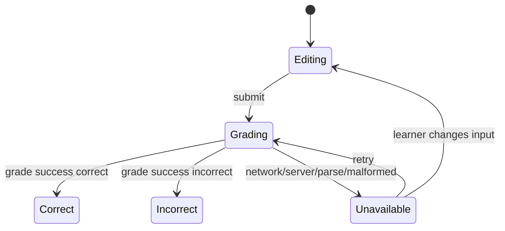

# Fuxie P0 Mockup - Grading Unavailable State

Owner: Codex  
Implementation owner: Antigravity  
Spec: `.kiro/specs/fuxie-ui-ux-p0-remediation/`

## Purpose

When AI grading cannot complete because of network, server, parse, or malformed-response errors, the learner must see a retryable system state instead of being marked wrong.

This state protects trust: "the system is unavailable" is different from "your answer is incorrect".

## Visual Direction

- Tone: neutral/system, not failure-red.
- Do not use reward amber.
- Keep learner input visible and editable.
- Retry action should be obvious but not celebratory.

## Mobile Wireframe

```text
+--------------------------------------+
| Your answer                           |
| [ ... learner input still here ... ]  |
|                                      |
| +----------------------------------+ |
| | Could not grade this answer      | |
| | The connection or AI response    | |
| | was unavailable. Your answer     | |
| | has not been marked wrong.       | |
| |                                  | |
| | [Try again]                      | |
| +----------------------------------+ |
+--------------------------------------+
```

## Anatomy

| Part | Requirement |
| --- | --- |
| Container | Neutral blue-tinted surface, not red and not amber |
| Icon slot | Optional retry/refresh icon in brand blue |
| Title | "Could not grade this answer" intent |
| Body | Explain neutral failure and reassure no wrong mark |
| Retry button | Brand blue or neutral outline depending on surrounding form |
| Input | Preserved, editable, and not disabled after failure |

## Token Guidance

| Element | Token |
| --- | --- |
| Surface | `var(--fuxie-blue-50)` or `#EFF6FF` |
| Border | `var(--fuxie-blue-200)` |
| Title text | `var(--fuxie-blue-900)` |
| Body text | `var(--color-text-muted)` or `#64748B` |
| Icon/action | `var(--fuxie-blue-600)` |

## State Machine



## Behavior Contract

- On unavailable state, do not call `onAnswer(false)`.
- Do not set the exercise as answered.
- Preserve the current learner input.
- Allow retry using the same current input.
- Clear the unavailable message when the learner edits the answer.
- If the retry succeeds, proceed to correct/incorrect as normal.

## Copy Slots

Use i18n. Copy below is semantic guidance.

| Key intent | Suggested English |
| --- | --- |
| title | Could not grade this answer |
| description | The AI response was unavailable. Your answer has not been marked wrong. |
| retry | Try again |

## QA Notes

- Mock `/api/v1/grade` non-200 response.
- Mock malformed JSON or missing expected field.
- Mock network rejection.
- Confirm no unavailable branch calls `onAnswer(false)`.
- Confirm input remains editable.
- Confirm retry calls grading again.
- Confirm visual treatment is not red/incorrect and not reward amber.
