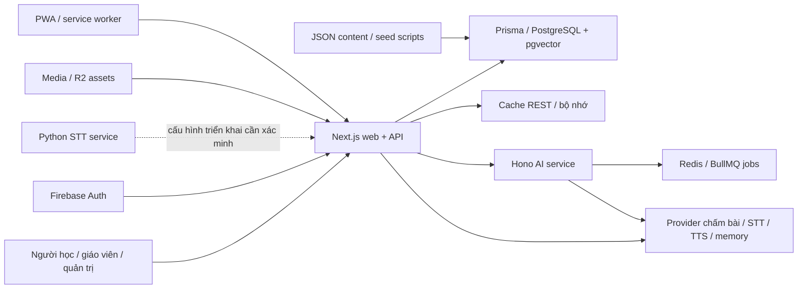

Vai chinh: CTO / Tech Lead  
Vai phoi hop: Product Manager EdTech, German Academic Lead, Security / Privacy Consultant

# Kỹ thuật, chức năng, AI và độ tin cậy

Ngày 2026-09-11. Phạm vi D04–D06, D08; đối chiếu [khung 40 tiêu chí](../comprehensive-assessment-framework-2026-09-11.md). Đánh giá working tree tại HEAD `3217ea052aec5606602cb7f9ec62f159ae9a750e`, gồm thay đổi chưa commit. Source/content không được sửa để làm test đạt. Mọi ghi DB bên dưới chỉ vào PostgreSQL audit mới tại loopback:55432, tên `fuxie_audit`; không dùng dữ liệu người học thật.

## Môi trường và khả năng tái lập

Root dùng Node 22.23.2 theo major Node 22 của CI, pnpm 9.15.4, Next 15.5.12, Prisma 6.19.2. Node mặc định máy là 25.9.0; các probe security chuyên biệt chạy bản này và được ghi riêng. PostgreSQL pgvector:pg16 và Redis 7 được tạo riêng, schema push và dev seed đạt. Web dev bind 127.0.0.1:3040; hostname cookie thống nhất `localhost`. AI/STT service không được khởi động; khóa provider được thay bằng placeholder trong tiến trình audit. Redis REST/Upstash được vô hiệu hóa bằng placeholder nên code cache ghi cảnh báo và đi xuống DB, không đại diện cache production.

Baseline chứa hash 5.814 file hiện hữu, loại `.env` và thư mục báo cáo này; aggregate SHA256 `c4b1b90c2d54fa824138f32c61e1006585784263bdf53487e8fa60b5ff68f63a`. [Baseline](../../../tmp/comprehensive-assessment-2026-09-11/baseline.json) chứa cả trạng thái dirty đầu đợt. Build có thể viết `public/sw.js`; có backup trước chạy và biên bản kiểm tra bảo toàn khi đóng audit.

Các lệnh chạy bằng [run-check.ps1](../../../tmp/comprehensive-assessment-2026-09-11/run-check.ps1), mỗi kiểm tra có `.log` và `.json` thời điểm/exit code/runtime trong [technical](../../../tmp/comprehensive-assessment-2026-09-11/technical). `audit-env.ps1` chỉ có thông số fixture; không chứa secret thật.

## Kết quả thực thi

| Kiểm tra | Kết quả hiện tại | Phạm vi chứng minh và giới hạn |
|---|---|---|
| Typecheck | PASS, 6 tasks | Node22; không thay thế runtime/provider contracts |
| Core tests | PASS, 970 tests | Web907/112files, AI58/18files, SRS5/1file; mock/unit assertions, không phải970luồng production |
| Property theo CI, loại exploration | FAIL:886pass,5skip,1timeout/892tests | Hash read-only invariant vượt5s khi build/Docker đang hoạt động; không có invariant mutation được chứng minh |
| Read-only invariant chạy riêng | PASS:4tests | Hash1.16s; giữ nguyên lần full suite fail, phân loại nhạy tài nguyên; chưa có lần toàn suite xanh mới |
| Production build | PASS,2tasks | Next bỏ lint/type trong build bằng cấu hình; typecheck riêng đạt, lint riêng thất bại |
| Lint | FAIL:11errors,375warnings | `react/jsx-no-comment-textnodes`, unescaped entities, no-require-imports cùng warnings; chưa sửa source |
| Bundle budget production | FAIL:17routes >115KB gzip | `/dashboard`117.9KB, `/course`143.1KB, `/review`141.8KB, `/rewards/shop`149KB; budget code nội bộ, không phải chỉ số người dùng thật |
| AI evaluation fixture | PASS:5/5 | Fixture có sẵn observed/signal; latency1.8s và cost$0.0143 trong output là số fixture, không phải phép đo provider |
| Asset paths/integrity/audit | PASS |278registry entries/10maps;50/50coverage; không chứng minh giá trị sư phạm hay bản quyền |
| Locale parity | PASS |1.070keys mỗi vi/de; không chứng minh dịch đúng nghĩa |
| State-shell declaration | PASS |13P0states được khai báo; khác kiểm tra hành vi actual route |
| Visual artifact pack | PASS |72PNG/4invariants về artifact; ảnh cũ không tự trở thành UX hiện hành |
| Hardening smoke | PASS:5tests | Dev-auth trên DB audit: role negatives/staff API/wallet mission; không xác nhận Firebase production lifecycle |
| Learning interaction suite chọn10ca | FAIL:4;6NOT_RUN do max-failures4 | Reading/listening desktop/mobile lệch locator và chuỗi tương tác hiện hành; [triage](learning-interaction-triage.md) xác nhận4/4UI tới kết quả với submitmock. Transcript chưa xác minh; không gọi đây là4luồng học hỏng |
| Submit/reload/invalid-input API probe | Có kết quả thực cho reading/listening | Mỗi bài seed1câu:200/100%,attempt lưu DB,reload200,negative time400; anonymous401. Không thay bài thực nhiều dạng câu hỏi |
| Session reward probe | Xác nhận lỗi TECH-01 | Empty results vẫn+12.345XP và+1lesson |
| Local HTTP perf | FAIL5/21budget;21/21HTTP200 |3warm runs/target, devserver/seed/cache bị vô hiệu hóa; không đo browser interaction/LCP/INP/CLS production |

Log gốc quan trọng: [core](../../../tmp/comprehensive-assessment-2026-09-11/technical/core-tests.log), [property](../../../tmp/comprehensive-assessment-2026-09-11/technical/property-ci.log), [isolated](../../../tmp/comprehensive-assessment-2026-09-11/technical/property-invariant-isolated.log), [build](../../../tmp/comprehensive-assessment-2026-09-11/technical/production-build.log), [lint](../../../tmp/comprehensive-assessment-2026-09-11/technical/lint.log), [bundle](../../../tmp/comprehensive-assessment-2026-09-11/technical/bundle-budget.log), [smoke](../../../tmp/comprehensive-assessment-2026-09-11/technical/hardening-smoke.log), [learning interaction](../../../tmp/comprehensive-assessment-2026-09-11/technical/learning-interaction-smoke.log), [API data](../../../tmp/comprehensive-assessment-2026-09-11/technical/api-data-probe.json), [perf](../../../tmp/comprehensive-assessment-2026-09-11/technical/perf-local-dev.log).

Probe API lần đầu dùng nhầm `/api/dev-auth` thay vì `/api/dev-auth/login`, trả401 và không ghi dữ liệu; đã giữ artifact `api-data-probe-harness-login-error.json`, sửa harness và thêm kiểm tra `/auth/me`200 trước chạy lại. Đây là lỗi harness, không phải auth regression. Lần chạy cuối không che lần đầu.

## Phát hiện và tác động

**TECH-01 — Server tin XP và kết quả hoàn tất do client gửi (P2, tin cậy cao).** [Session complete](../../../apps/web/src/app/api/v1/session/complete/route.ts:21) không có schema/đối soát kết quả với phiên do server cấp; [recordLearningActivity](../../../apps/web/src/app/api/v1/session/complete/route.ts:73) nhận `totalXp` và tăng lesson. Probe learner audit gửi `{results:[],totalXp:12345,level:'A1'}` được HTTP200, DB xác nhận+12.345XP/+1lesson. Có thể làm sai tiến độ, reward/league và event; chưa kiểm tra tác động mọi hệ phụ thuộc hoặc lạm dụng production. Owner Backend + QA: tính reward ở server theo validated result, reject empty/invalid session, idempotency theo completion ID; test XP âm/cực lớn/giả mạo/replay và session hợp lệ.

**TECH-02 — Submit chưa phân biệt replay mạng với một lần làm lại có chủ đích (P2, tin cậy cao về hành vi).** Hai request giống hệt nhau đến reading tạo2attempt,+40XP,+10Fucoin; listening tạo2attempt,+40XP,+14Fucoin. [Reading transaction](../../../apps/web/src/app/api/v1/reading/[exerciseId]/submit/route.ts:82) và [listening transaction](../../../apps/web/src/app/api/v1/listening/[lessonId]/submit/route.ts:100) tạo attempt ID mới mỗi lần, reward source dùng ID đó. Transaction bảo vệ tính nguyên tử một request nhưng chưa dedup logical completion. Thực hành lại có thể được phép; cần attempt token để replay cùng lần không nhân tiến độ/phần thưởng, lần mới được xử lý theo chính sách. Không tuyên bố đã tái hiện concurrency/double-click UI hoặc nền kinh tế có thiệt hại tiền thật.

**TECH-03 — Gate hiện hành chưa bảo đảm chất lượng release (P2).** Type/core/build tốt nhưng lint11errors, bundle17routes vượt budget, property còn timeout và interaction tests lệch UI. Test pack declaration/PNG/locale không bao semantic/active route. CI details và lịch sử ở [operations](operations.md); cần kết nối gate được cam kết với artifact đúng revision, phân biệt skipped với pass. Sửa testcase theo hành vi kiểm chứng được, tránh chỉ đổi selector để chạy qua mà mất assertion.

**TECH-04 — Hàng đợi offline xóa pending khi server từ chối (P2 trước khi bật tính năng).** [Service worker](../../../apps/web/src/app/sw.ts) fetch rồi xóa hàng đợi mà không kiểm `response.ok`. [Harness](../../../tmp/comprehensive-assessment-2026-09-11/technical/offline-sync-reproduction.cjs) thực thi source TS hiện tại với IndexedDB/fetch giả:200,401,500 đều resolve và còn0pending. Hiện chưa tìm thấy UI caller cho `queuePendingReview`; đây là nợ kỹ thuật tiềm ẩn, chưa có bằng chứng người học đã mất kết quả. Cần giữ pending khi401/5xx, retry có backoff, idempotency và ownership/session handling trước kích hoạt. Cache dữ liệu cá nhân là findingSEC-05 riêng.

**TECH-05 — AI eval chưa xác nhận chất lượng chấm và speech thật (khoảng trống bằng chứng).**5fixture kiểm contract đã viết sẵn; một output tiếng Đức vẫn mang requiredSignal `vietnamese_support`, speaking fixture tự ghi không phải audio thật. Speaking route dùng prompt thang điểm tổng quát thay vì rubric4chiều từ content; chưa có corpus đối chiếu giám khảo, false correction rate, STT tiếng Đức, TTS nghe thật hoặc noisy-mic/error replay. D05.1/.2 có phần triển khai nên1; chất lượng provider/acousticU. Owner AI + Academic + QA cần bộ gold references được người có chuyên môn duyệt, case đúng/sai/giáp ranh, model/prompt version và repeated runs trên môi trường thử có usage cap.

## Hiệu năng và độ tin cậy: điều đã đo

Local HTTP warm median:dashboard235ms,course613ms;5target vượt budget là vocabulary659/600ms,review902/600ms,today API571/450ms,SRS due585/450ms,adminops634/450ms. Những số này đo nhận HTTP body, không đo thời gian hoàn tất nhiệm vụ. Runtime dev/cache vô hiệu hóa và dữ liệu seed nhỏ giới hạn suy rộng; ưu tiên benchmark production build có cache đúng trước quyết định tối ưu DB. Không dùng số dev này tuyên bố production chậm hoặc đạt SLO.

Bundle đo từ build production trước khi dev ghi lại `.next`, nên17route vượt115KB có bằng chứng ổn định hơn phép đo dev. Browser perf Slow4G/CLS ba lượt chưa chạy toàn matrix; Core Web Vitals fieldU. Khi triển khai phép đo, phân biệt budget nội bộ CLS0.05/asset350KB với [Core Web Vitals field](https://web.dev/articles/vitals):p75 LCP≤2.5s,INP≤200ms,CLS≤0.1. Chưa có traffic/log production để định lượng API/AI error rate hoặc p95.

## Kiến trúc và hệ thống đã kiểm kê

Web/AI/shared/SRS/database được phân package, tests và contracts đã có; tránh rewrite. Đường STT local và STT provider tại web cùng tồn tại, sơ đồ không khẳng định local service đang phục vụ production. DB Neon có nhánh adapter theo URL; audit dùng TCP PostgreSQL, chưa kiểm Neon adapter/migration drift production. Schema push chứng minh tạo schema mới, không chứng minh migration nâng cấp có dữ liệu hoặc restore thành công. DB package sinh client vào `apps/web/generated` là coupling cần quản lý khi thay runtime, chưa đủ để gọi là lỗi.

Progress/rewards có transaction và test ledger hữu ích, nhưng đúng từng helper không bù việc API tin client hoặc logical replay chưa có khóa. Source security/analytics và dữ liệu thử đã chỉ ra nơi tập trung remediation. Không dùng số file/test làm điểm kiến trúc hoặc tuyên bố có owner vận hành thật chỉ vì role có trong tài liệu.

## Điểm 16 tiêu chí và giới hạn

| Trục | .1 | .2 | .3 | .4 | Diễn giải |
|---|---:|---:|---:|---:|---|
| D04 |2|1|2|2| Luồng mẫu/negative checks đạt; reward/replay và broad E2E còn khoảng trống |
| D05 |1|1|1|U| Có triển khai/eval fixture; thiếu hiệu chuẩn, usage thật và acoustic/provider evidence |
| D06 |2|2|2|1| Ranh giới và build/type/transactions hữu ích; integrity đầu vào/completion còn lỗi |
| D08 |1|U|1|1| Bundle fail, dev HTTP chỉ tham khảo, error/queue/cache kiểm soát chưa đầy đủ |

Chi tiết từng tiêu chí và confidence nằm trong ma trận tổng. Đã áp dụng CTO checklist: ưu tiên pattern đang có, kiểm thử/rollback rõ, không đưa hạ tầng mới vào sản phẩm, phân owner chuyên môn, giữ bí mật/dữ liệu người học. Bước tiếp theo: sửa TECH-01/02 bằng server-validated completion + idempotency trong task riêng, kiểm chứng trên DB fixture, đồng thời QA nối lại interaction tests với active UI; giữ báo cáo này làm baseline trước sửa.
