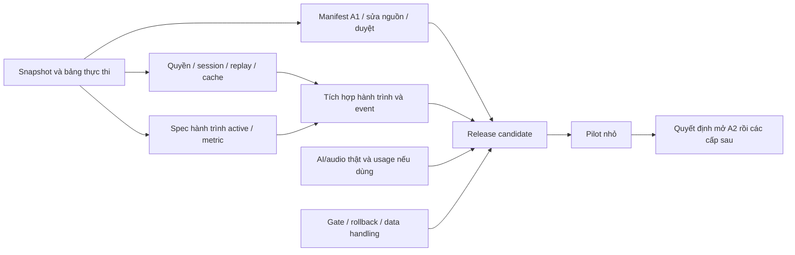

Vai chinh: Project Manager / Delivery Manager  
Vai phoi hop: CTO / Tech Lead, German Academic Lead, Security / Privacy Consultant

# Chiến lược triển khai Fuxie sau đánh giá 11/09/2026

**Đích triển khai:** một người mới học A1 có thể chọn mục tiêu, nhận đúng bài, hoàn thành bài, hiểu feedback, làm lại, lưu đúng tiến độ và quay lại ôn tập; dữ liệu được bảo vệ và kết quả đo được. Nền kỹ thuật dùng chung phải được sửa cho toàn ứng dụng. Nội dung được nghiệm thu từng tập, bắt đầu A1 rồi mở rộng A2–C2 bằng cùng quy trình.

Chiến lược này chuyển [đánh giá hiện trạng](assessment-2026-09-11/README.md) và [backlog A01–A17](assessment-2026-09-11/prioritized-backlog.md) thành thứ tự thực thi. Đây là kế hoạch mới trên working tree tại HEAD `3217ea052aec5606602cb7f9ec62f159ae9a750e`; không ghi đè kết quả audit hoặc coi các QC tháng 6 là nghiệm thu hiện tại. Task này chỉ lập chiến lược, bảng công việc và lệnh bàn giao đầu tiên; chưa thực thi các bản sửa hay phát hành.

## 1. Các quyết định triển khai

1. **Giữ kiến trúc và tái sử dụng phần đã có.** Dùng role guards, transaction, SRS engine, result receipt, today-plan, event pipeline và asset registry hiện hữu. Thay đổi nằm ở ranh giới còn sai, không mở một dự án viết lại ứng dụng.
2. **Ba hướng cùng tiến:** kỹ thuật/bảo mật; học liệu; hành trình học/đo lường. Các hướng có thể chuẩn bị, review và chọn mẫu song song. Nếu chỉ có một executor code, triển khai code vẫn theo hàng đợi và giới hạn một người ghi trên mỗi nhóm file.
3. **Sửa quyền và dữ liệu dùng chung trước pilot.** Không đợi hoàn tất A1 mới đóng lỗi API có thể ảnh hưởng các cấp khác. Xác minh AI ingress chạy song song, không cản sửa các lỗi web đã rõ.
4. **Nghiệm thu A1 theo danh mục cụ thể.** Mỗi bài được đưa vào pilot phải có ID, phiên bản nguồn, câu hỏi/đáp án/rubric, trạng thái audio và phiên bản DB được đối soát. “Có đủ sáu kỹ năng” là một tập phục vụ hành trình thí điểm, không phải tuyên bố hoàn thành khóa A1.
5. **Tách bản sửa nhỏ khỏi thay đổi hợp đồng.** Bản sửa ownership được làm trước. Session/XP cần thiết kế đối soát câu trả lời ở server; retry cần ID lần làm bài và tính nguyên tử. Giới hạn số XP hoặc tính lại từ `correct` do client gửi không đủ đóng lỗi.
6. **Nghiệm thu theo điều kiện, thời gian dùng để điều phối.** Chỉ chuyển chặng khi evidence đúng revision đạt. Nếu chậm vì nội dung hoặc provider, giảm phạm vi thử nghiệm được công bố; không gắn nhãn hoàn tất cho phần chưa kiểm chứng.

## 2. Tổ chức người và tác tử

| Đầu mối | Trách nhiệm | Ai kiểm kết quả |
|---|---|---|
| Delivery/PM — em tổng hợp theo yêu cầu của anh | Duy trì thứ tự, spec, dependency, trạng thái, rủi ro và gói bàn giao | Chủ dự án chốt thay đổi phạm vi/nguồn lực; PM sản phẩm chốt policy học/metric |
| CTO + Backend/Frontend | Thiết kế hợp đồng dữ liệu, phân quyền, transaction, tích hợp UI | QA độc lập đối chiếu acceptance; Security xem trust boundary |
| Antigravity — executor theo quy trình repo | Thực thi từng spec đã đủ rõ, chạy kiểm tra, gửi diff và evidence | Delivery điều phối QC; không tự lấy báo cáo executor làm signoff |
| German Academic Lead + người duyệt tiếng Đức | Chọn mục tiêu học, duyệt ngôn ngữ/đáp án/rubric, nghe audio | Người có chuyên môn xác nhận từng revision; tác tử AI hỗ trợ chuẩn bị và tìm lỗi |
| QA + Analytics + DevOps | Kiểm luồng thật, đối soát sự kiện, gate release, rollback/restore | CTO/PM/Academic/Security kết luận theo phần mình sở hữu |

Đây là **vai trò trách nhiệm, không phải danh sách nhân sự đã có**. Một người có thể giữ nhiều vai, nhưng executor không tự xác nhận toàn bộ kết quả của mình. Không tạo task ngoài ứng dụng, gửi tin cho người khác hoặc giao việc tự động trong bước lập kế hoạch này.

Quy trình [three-agent delivery model](../../.agents/workflows/three-agent-delivery-model.md) được dùng cho cấu trúc spec → executor → QC và tái sử dụng asset. Yêu cầu trực tiếp của anh cho phép em lập kế hoạch trong task này; không cần chuyển sang tác tử khác chỉ vì tên công cụ trong tài liệu. Một số slice cũ đã ghi Codex làm spec/QC. Mọi gói giao Anti đều có prompt hoàn chỉnh; không gọi tác tử AI là người ký duyệt học thuật.

## 3. Bốn chặng và điều kiện chuyển tiếp

| Chặng | Công việc chủ đạo | Điều kiện ra khỏi chặng | Sản phẩm bàn giao |
|---|---|---|---|
| **0 — Chuẩn bị thực thi** | Chọn snapshot tích hợp; kiểm file đang đổi; lập owner; xác nhận môi trường thử và artifact deployed nếu truy cập được; chọn manifest A1 ứng viên | Mỗi việc có scope/owner; không thiếu thay đổi chưa commit; DB thử tách biệt; gói đầu có acceptance và đường retest | Bảng thực thi, release manifest, spec đầu |
| **1 — Dữ liệu và quyền đúng** | Ownership web/AI, sync/cron, session server validation, replay/idempotency, dependency và cache cá nhân | Không cross-user mutation/read trong phạm vi kiểm; session giả không cộng tiến độ; replay cùng attempt không cộng lần hai; version đã vá được kiểm; PWA đổi tài khoản không trả dữ liệu cũ | Các PR nhỏ đã QC, contract session/completion, regression và DB evidence |
| **2 — Hành trình A1 dùng được** | Nội dung được duyệt và đối soát audio/DB; dashboard active; lỗi/retry giữ bài; accessibility; analytics/usage; provider eval cho chức năng có trong pilot | Toàn tập A1 pilot được ký duyệt đúng revision; hành trình mới/quay lại chạy trọn; sự kiện khớp DB; AI thật hoặc luồng thay thế đã được kiểm; gates/rollback tối thiểu đạt | Release candidate có manifest code + content + audio + prompt + metrics |
| **3 — Pilot có kiểm soát** | Mời một nhóm nhỏ theo kế hoạch riêng; quan sát task completion, feedback→sửa bài, quay lại, chi phí và lỗi | Không còn blocker dữ liệu/học thuật trong tập dùng; có bản đọc dữ liệu với mẫu số/cohort đủ tuổi; quyết định sửa tiếp hay mở rộng dựa trên evidence | Báo cáo pilot, quyết định giữ/sửa/mở scope |

Các luồng kiểm tra và chuẩn bị nội dung của chặng 2 bắt đầu ngay trong chặng 1. Gate ngăn đưa bản chưa đạt vào pilot, không ngăn team làm việc độc lập.

## 4. Thứ tự kỹ thuật để không sửa hời hợt

**Bản sửa đầu tiên:** khóa ownership SRS card tại session completion bằng ID người dùng từ server và bảo đảm batch bị từ chối không ghi một phần. Scope chỉ hai file route/test; không migration. [Gói W01 sẵn bàn giao](../delivery/remediation-W01-session-ownership.md). Việc này đóng SEC-03; **TECH-01/02 còn mở** đến khi hợp đồng session/completion mới được nghiệm thu.

**Sau đó, chia kiểm soát còn lại thành PR riêng:** sync-ai không cho learner thay nội dung; cron thiếu secret phải từ chối; AI HTTP/job/dead-letter có identity và owner phù hợp; cache cá nhân có chính sách account rõ. Không gom chúng thành một PR “security fixes” lớn. Người triển khai phải đọc caller và deployment boundary trước khi đổi HTTP method/credentials.

**Session/XP là một thay đổi hợp đồng có chủ đích:** start hiện trả items/level; complete nhận data/correct/totalXp. Trước viết code, CTO/Backend phải chốt server-issued attempt/session ID, user sở hữu, tập câu hỏi và phiên bản, cách gửi câu trả lời thật theo từng dạng bài, quy tắc chấm, expiry, retry và feedback khi từ chối. Đề xuất lưu trạng thái lần làm bài ở DB cùng nơi quyết toán; không mặc định dùng bộ nhớ tiến trình cho invariant cần bền vững. Thiết kế chi tiết phải kiểm khả năng tái sử dụng model hiện hữu trước thêm bảng.

Receipt và reward/event chỉ được ghi một lần cho logical attempt. Một request replay trả kết quả đã ghi; cùng ID nhưng payload không tương thích bị từ chối rõ ràng. Người học bấm “làm lại” tạo lần làm bài mới theo policy, không bị nhầm với retry mạng. Có test đồng thời, transaction thất bại và response bị mất sau commit. Thay đổi lỗi API phải đi cùng UI kiểm `response.ok`, giữ kết quả chưa đồng bộ và cho retry; không tự chuyển dashboard như đã lưu thành công.

**Hành trình:** cập nhật spec F/G theo `WorldMapDashboardClient` đang được render, giữ yêu cầu một hành động chính, cùng href với thẻ, lý do và thời lượng. PRD cũ ưu tiên SRS rồi từ vựng; `today-plan` có ranking thêm assignment/exam. PM + CTO phải ghi rõ quyết định hòa giải trong spec W07 trước implementation. Mặc định chiến lược là tái sử dụng dịch vụ hiện hữu, không thêm recommender; chỉ bài thuộc manifest đã duyệt được đề xuất trong phạm vi pilot.

**Analytics:** định nghĩa completion ID ngay với session/replay, viết mapping metric song song để tránh thay dữ liệu hai lần. Readout chỉ dùng sau đối soát. D7/D30 theo event map đang có là “có hành động trong ngày 1–7/1–30”, không phải đúng ngày 7/30; tên và công thức phải được version hóa nếu đổi. Dữ liệu cũ chỉ backfill khi có căn cứ, không dựng lại một lịch sử completion không tồn tại.

## 5. Chiến lược học liệu

Chọn một tập nhỏ có ít nhất một hành trình trọn vẹn cho mỗi kỹ năng và có bài làm lại/ôn. PM/Academic chốt chủ đề A1 gắn nhau, rồi chọn ID thực từ inventory; không cố lấy đều mọi chủ đề hoặc coi số bài là chất lượng. [Kế hoạch học liệu chi tiết](assessment-2026-09-11/academic-rollout-plan.md) quy định selection, trạng thái review và đối soát.

Thứ tự xử lý: template gây sai hàng loạt → bài A1 thuộc manifest → nhóm cùng nguồn sinh ở các cấp khác. Writing cần bài mẫu thực sự trả lời đúng đề, rubric có mức điểm cụ thể; reading/listening cần evidence nằm trong nguồn và distractor loại trừ nhau; speaking cần notes/IPA/audio nhất quán. Quét cấu trúc toàn kho hỗ trợ mở rộng danh sách ảnh hưởng; chỉ người duyệt xác nhận tính đúng học thuật.

Mỗi revision đã duyệt gắn hash và trạng thái riêng cho text, key/rubric, audio, DB/UI parity. Sửa text sau duyệt làm hết hiệu lực signoff liên quan. Không sửa hàng loạt metadata `aligned` để đóng ticket. Content sync phải có dry-run, diff ID/question và kiểm phụ thuộc attempt; không xóa rồi tạo lại hàng loạt khi có lịch sử người học mà chưa có chiến lược version/migration.

Nếu chưa có chuyên gia Đức, team tiếp tục sửa pipeline, tạo draft, chạy test và demo nội bộ. Tập nội dung giữ `AWAITING_HUMAN_REVIEW`; mốc pilot học thuật chưa được xem là sẵn sàng. Không đổi thành “AI đã duyệt nên đủ”. Nếu AI/speech thật chưa đạt, chỉ demo chức năng bằng trạng thái rõ ràng hoặc chuẩn bị một phạm vi pilot thay thế do PM/Academic xác nhận; không báo mục tiêu sáu kỹ năng đã đạt nếu thực tế bỏ một kỹ năng.

## 6. Nhịp làm việc và timeline có điều kiện

**Giả định để lập lịch:** một executor code chính, một đầu mối spec/QC, chuyên gia Đức tham gia theo đợt. Không giả định có ba kỹ sư vì có ba tác tử cùng lập kế hoạch. Nhịp ban đầu là hai tuần để đóng các rủi ro đầu và đo tốc độ thực; sau hai gói được QC mới cập nhật dự báo release. Khung 4–6 tuần đến candidate A1 chỉ là mục tiêu lập lịch để kiểm chứng, chưa là ước lượng đã cam kết.

| Timebox từ khi bắt đầu implementation | Trọng tâm | Kết quả kỳ vọng có thể kiểm |
|---|---|---|
|48giờ đầu|W00;W01;spec các kiểm soát web;contract session;chọn manifest A1|Một bản sửa ownership nhỏ đã review hoặc blocker tái lập rõ;đủ đầu vào thiết kế;danh sách người duyệt/capacity còn thiếu|
|Tuần1|Quyền web,dependency và session contract;content template/manifest|Các PR nhỏ độc lập;không gắn trạng thái session integrity DONE khi chỉ sửa ownership|
|Tuần2|Session/completion và retry;content batch đầu;dashboard/metric spec|Demo luồng ghi DB đúng trên môi trường thử;ảnh/diff/records đối soát;reforecast bằng throughput/QC thực tế|
|Tuần3–4 dự kiến|Hành trình active,content/audio parity,analytics,AI/usage nếu dùng,gates và restore|Release candidate theo manifest;gap chưa đạt vẫn có owner và mốc kiểm lại|
|Tuần5–6 dự kiến|Đóng gap và pilot nhỏ nếu gate đủ|Readout có số mẫu,blocking issues và quyết định tiếp tục;không hứa D30 khi cohort chưa đủ30ngày|

Có thêm executor độc lập thì tách frontend và backend ở những file không giao nhau; không rút thời gian người duyệt hoặc cohort bằng cách tăng tác tử. Khi thiếu chuyên gia/credentials/môi trường, tiếp tục những việc không phụ thuộc, nhưng giữ mốc nghiệm thu tương ứng ở trạng thái blocked với lý do.

Hằng ngày, board ghi kết quả đã chứng minh, việc tiếp theo, blocker và người xử lý. Sau mỗi PR có QC theo acceptance; mỗi cuối tuần chốt release candidate nội bộ hoặc danh sách gap. Đây là nhịp vận hành đề xuất, chưa tạo automation/reminder.

## 7. Gate và cách quyết định pilot

| Gate | Điều kiện đạt | Bằng chứng bắt buộc |
|---|---|---|
|G0 Source và môi trường|Revision + dirty-state có thể tái lập;owner và testDB rõ|Commit/tree hash,manifest phạm vi,environment record|
|G1 Quyền và dữ liệu|Không ghi/đọc cross-user trong matrix;empty/forged completion không nhận thưởng;replay đúng một lần|Negative API tests và DB before/after,concurrency/rollback,UI lỗi/retry|
|G2 Học liệu|Mọi ID trong pilot manifest có text/key/rubric được duyệt;audio vàDB/UI đúng bản|Reviewer thực,hash,case lỗi được đóng;0known critical/major academic defects trong tập phát hành|
|G3 Hành trình|Người mới/quay lại làm được vòng học;next-action hợp lệ;keyboard/fallback/reflow có thể dùng|Browser thật desktop/mobile,submit/reload/expired-session/networkfailure;mock ghi riêng|
|G4 Đo lường/AI|Events khớp logical attempt;test accounts bị loại;cohort đúng tuổi;AI/audio có eval và usage nếu nằm trong pilot|Fixture→API→DB→readout reconciliation;model/prompt/version;provider evidence hoặc giới hạn scope đã ghi|
|G5 Release/ops|Required tests và gate đạt đúngrevision;dependency applicability đóng;rollback/restore và xử lý dữ liệu tối thiểu dùng được|CI/log mới;production-build perf;release/content manifest;drill và owner xử lý sự cố|

G0–G5 là đề xuất gate của chiến lược, không phải kết quả đã đạt. Không dùng một `pnpm check` xanh để thay lint/bundle/content semantic/provider. Test bị skip, provider blocked hoặc bằng chứng khác revision không được ghi PASS. Nợ cũ ngoài phạm vi có thể ghi ngoại lệ cụ thể với owner/thời hạn ở bước review; lỗi quyền dữ liệu hoặc học thuật của nội dung pilot không được bù bằng ngoại lệ tổng quát.

Pilot đầu ưu tiên quan sát định tính một nhóm nhỏ có chủ đích, chẳng hạn5–10người A1, rồi quyết định quy mô tiếp theo. Đây là đề xuất vận hành để tìm blocker, không phải cỡ mẫu đủ chứng minh tăng CEFR/retention. Đo completion có trợ giúp/không trợ giúp, feedback hiểu được và sửa được, delayed recall trên bài đã học, quay lại theo cohort, và cost theo task/người hoạt động. Ghi missing/numerator/denominator; 25% weekly progress trong spec cũ chỉ là giả thuyết cần hiệu chỉnh, không phải điều kiện tự động mở rộng.

Nếu gặp cross-account data, mất kết quả, chấm/key sai nghiêm trọng hoặc nội dung/audio khác manifest: giữ hoặc thu hẹp nhóm/chức năng bị ảnh hưởng, lưu evidence tối thiểu, sửa và retest trước mở lại. Nếu chỉ một vấn đề nhỏ có cách đi vòng: PM/QA ghi impact và owner, tiếp tục trong phạm vi đã đánh giá. Backup/rollback không chỉ là revert Git: schema và content cần phương án tương thích để tránh mất lịch sử bài làm.

## 8. Kỷ luật tích hợp và những việc để sau

Một work order → một nhánh `codex/…` nếu tạo nhánh mới → một PR theo concern → QC → cập nhật board. Khi bắt đầu từ cây đang có nhiều thay đổi, phải tạo snapshot chứa cả tracked và untracked cần thiết; worktree từ HEAD sạch không đại diện phiên bản audit. Không tự reset/stash/commit toàn bộ cây để tạo sự “sạch” giả tạo. Mỗi executor chỉ sửa file được giao; `session/complete`, schema/ledger/events, lockfile, service worker và design tokens phải có một writer tại một thời điểm.

W01 có thể review/đưa vào nhánh tích hợp khi kiểm chứng ownership đạt; release tổng vẫn chờ các gate liên quan. Các gói làm thay đổi schema cần migration additive, compatibility rollout, backup/restore và diễn tập trước production. Việc cập nhật dependency, CI và sinh `sw.js` do một đầu mối điều phối để tránh ghi đè artifact.

Hoãn mở rộng cấp độ hàng loạt, artwork mới, shop mechanics, acquisition diện rộng và refactor không gắn finding. Sau pilot, mở từng nhóm A2 rồi B1–C2 theo evidence và nhu cầu; các template lỗi dùng chung vẫn được sửa sớm trên toàn kho khi đã có quy tắc được duyệt. Teacher/admin được bảo vệ và smoke xuyên suốt, còn tính năng lớp học mới không thuộc lát cắt B2C A1 đầu.

## 9. Bàn giao và bước kế tiếp

- [Bảng công việc W00–W12](../delivery/remediation-execution-board-2026-09-11.md): kết quả,owner,phụ thuộc,trạng thái và mapping A01–A17.
- [Gói W01 + prompt cho Antigravity](../delivery/remediation-W01-session-ownership.md): đủ8phần theo delivery model, giới hạn scope và không tuyên bố đóng lỗi XP.
- [Kế hoạch học liệu](assessment-2026-09-11/academic-rollout-plan.md): chiến lược phục hồi nguồn và nghiệm thu.

Checklist Delivery Manager đã áp dụng: mỗi gói có owner/outcome;dependency hiện rõ;risks có mitigation;timeline có giả định và reforecast;release criteria có evidence. **Bước tiếp theo cụ thể:** khởi động W00 và W01; đồng thời chuẩn bị W03 session contract và W06 manifest học liệu. Prompt W01 nằm trong tài liệu liên kết, sẵn đưa cho Anti; chưa gửi hay chạy thay anh trong task lập chiến lược này.
